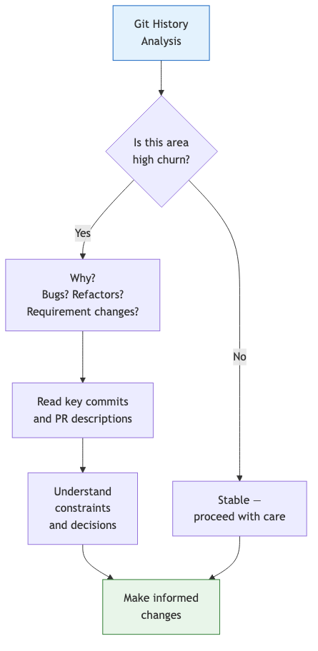
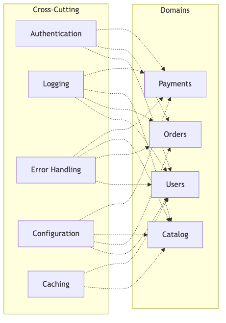
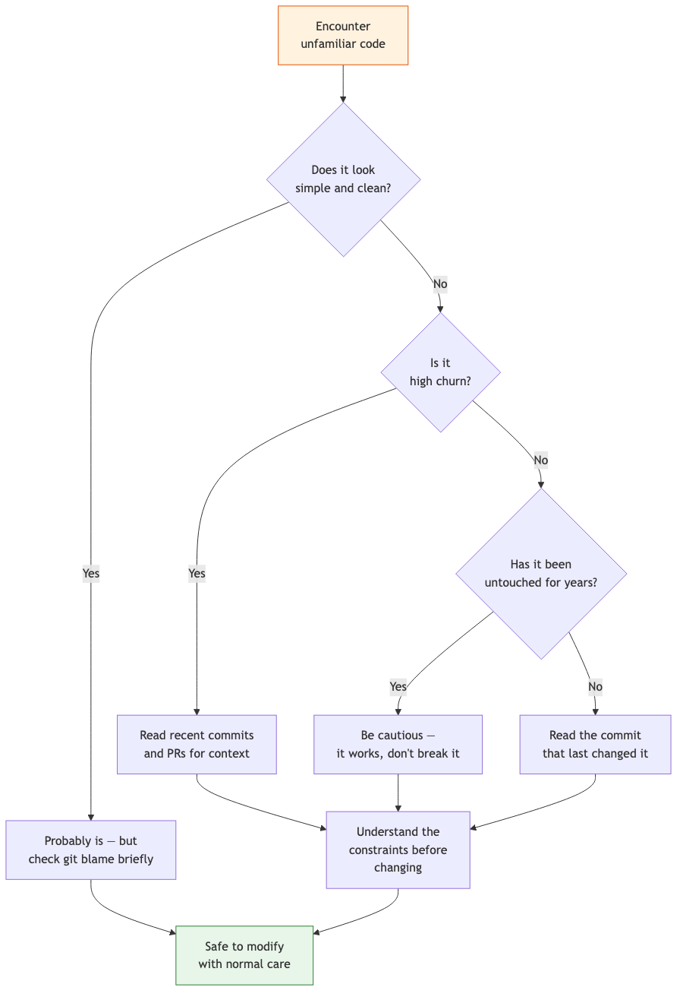

# 05 — Codebase Archaeology

Dig into the history of the codebase to understand why code looks the way it does — not just what it does.

---

## What You'll Learn

- How to use git history to find actively changing areas
- Detecting pain points, tech debt, and high-churn files
- Mapping cross-cutting concerns (auth, logging, error handling)
- Identifying metaprogramming and "magical" patterns
- Reading the scars — understanding code decisions from history
- Finding tribal knowledge that only the original authors knew

**Prerequisites**: [04 — Architecture & Dependencies](04-architecture-and-dependencies.md)

---

## Why Archaeology?

Understanding the current code tells you *what* the system does. Understanding its history tells you *why* — and "why" prevents you from repeating past mistakes or breaking things that look unnecessary but exist for a reason.



---

## Git History Analysis

The git log tells you what's actively changing and who's working on what.

### The Prompt

```
Look at the recent git history and tell me:
- What areas of the codebase have the most recent activity?
- Are there any large or risky recent changes?
- Who are the most active contributors and what areas do they own?
- What's the general commit style and branch strategy?
```

### What to Look For

**Hot spots** — files that change frequently are either:
- Actively being developed (new feature)
- Problematic (bugs keep getting found and fixed)
- Poorly designed (every feature touches them because of tight coupling)

**Recent large changes** — a recent refactor or migration means:
- The code may be in a transitional state
- The old pattern and new pattern may coexist
- Tests may not fully cover the new code yet

**Contributor patterns** — understanding who knows what:
- If one person wrote most of a module, they're the domain expert
- If a module has many contributors, it's either well-understood or everyone's confused

---

## Finding Pain Points

Every codebase has them. Finding them early saves you from stepping on landmines.

### The Prompt

```
Identify potential pain points in this codebase:
- Large files with high git churn (these are usually trouble spots)
- Overly complex functions or classes
- Circular dependencies
- Inconsistent patterns (e.g., error handling done three different ways)
- TODO/FIXME/HACK comments that indicate known problems
```

### What "High Churn" Looks Like

A high-churn file has characteristics like:

- **50+ commits in 6 months** — constantly being modified
- **Multiple different authors** — everyone has to touch it
- **Bug fix commits mixed with feature commits** — it's both fragile and central
- **Growing line count over time** — it's a dumping ground

When you find these, ask:

```
This file has very high churn. Explain why — is it a central
coordination point, a poorly designed module, or just an area
of active development? What would it take to stabilize it?
```

### TODO/FIXME Archaeology

```
Find all TODO, FIXME, HACK, and XXX comments in the codebase.
Group them by severity and area. Which ones represent real
risks if left unaddressed?
```

---

## Cross-Cutting Concerns

These are the patterns that show up everywhere. You need to understand them before changing anything, because getting them wrong affects the entire application.

### The Prompt

```
Explain the cross-cutting concerns in this codebase:
- Authentication and authorization — how does it work?
- Logging and observability
- Error handling — is there a consistent pattern?
- Configuration management
- Shared utilities and middleware
```

### Cross-Cutting Concerns Map

Ask Claude to generate a diagram showing how these concerns intersect with the main modules:



### Inconsistency Detection

Inconsistent cross-cutting patterns are a major source of bugs:

```
Is error handling consistent across the codebase, or are there
multiple patterns? Show me examples of each pattern you find.
Same question for logging — is it consistent?
```

---

## Metaprogramming and Magic Detection

Some codebases use patterns that make code behave differently than it reads. Identifying these early prevents confusion.

### The Prompt

```
Are there any "magical" patterns in this codebase?
- Code generation (from schemas, protobuf, GraphQL, etc.)
- Custom decorators, annotations, or macros
- Dependency injection containers
- Dynamic imports or plugin systems
- Anything that makes "find references" unreliable
```

### Common Magic Patterns

| Pattern | What It Looks Like | Why It's Confusing |
|---------|-------------------|-------------------|
| Code generation | Files in `generated/` or `__generated__` | You can't edit them directly |
| Decorators | `@Route`, `@Inject`, `@Column` | Behavior is defined elsewhere |
| Dependency injection | Classes without explicit instantiation | Hard to trace construction |
| Dynamic imports | `require(variable)` | Static analysis can't follow |
| Metaprogramming | `define_method`, `__getattr__` | Methods exist without definitions |
| Convention routing | File-based routes (Next.js, Rails) | No explicit route registration |

When you find these, ask:

```
Explain the [decorator/code generation/DI] system in detail.
Where is the "magic" defined? How do I trace what actually
happens when [specific decorator] is used?
```

---

## Reading the Scars

Code carries the marks of past decisions. Understanding them prevents you from "fixing" things that are intentionally that way.

### Git Blame for Context

When you encounter code that seems odd:

```
Run git blame on [file] and tell me:
- When was this [specific section] last changed?
- What was the commit message?
- Was it part of a larger PR? What was the context?
```

### PR History

If the project uses pull requests:

```
Find the pull request that introduced [feature/pattern].
What was the discussion? Were alternatives considered?
Are there any comments that explain the "why"?
```

### Patterns to Investigate

- **Commented-out code** — was it left as a reference? Is it a failed experiment?
- **Overly defensive code** — is it handling a real edge case from production?
- **Unusual workarounds** — is there a framework bug being worked around?
- **Configuration that seems wrong** — was it intentional?

```
This code seems unnecessarily complex. Check the git history
for this section — was there a reason it was written this way?
Is there a bug report or PR that explains the decision?
```

---

## Identifying Tribal Knowledge

Tribal knowledge is information that only the original authors know — it's not written down anywhere but is essential for working safely in the codebase.

### Where to Look

```
Identify areas of this codebase that seem to have "tribal
knowledge" requirements — things a new developer would get
wrong without being told:
- Implicit ordering dependencies
- Files that must be kept in sync manually
- Configuration that only works with specific values
- Processes that aren't automated or documented
```

### Capture What You Find

This is some of the most valuable content for your CLAUDE.md:

```
Take the tribal knowledge we just identified and add it
to CLAUDE.md under a "Gotchas" or "Things to Know" section.
```

---

## The Archaeology Decision Tree

When you encounter unfamiliar code, use this process:



---

## Key Takeaways

1. Git history tells you *why* code exists — understand intent before making changes
2. High-churn files deserve extra attention; they're either important or problematic
3. Cross-cutting concerns (auth, logging, errors) must be consistent — check for inconsistencies before adding more code
4. "Magic" patterns (code gen, DI, decorators) require understanding the mechanism, not just the usage
5. Tribal knowledge is the highest-value content for your CLAUDE.md — capture it when you find it
6. When code looks odd, check the history before "fixing" it — it may be odd for a good reason

---

**Next**: [06 — Task Execution](06-task-execution.md) — Plan and execute changes methodically.
