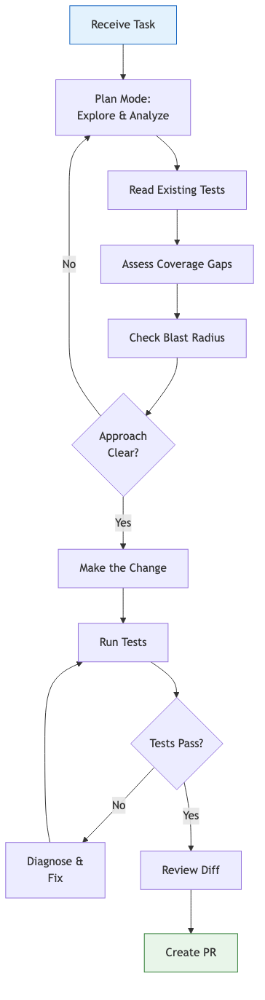
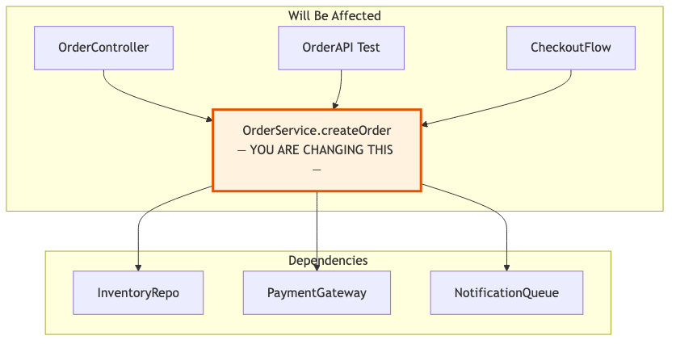

# 06 — Task Execution

Plan, implement, and verify changes methodically — from understanding the task to landing a clean pull request.

---

## What You'll Learn

- When and how to use plan mode for non-trivial changes
- The tests-first workflow: read tests, assess coverage, add tests, then change code
- Blast radius analysis — understanding what your change affects
- Writing goal-oriented prompts vs. implementation-oriented prompts
- Verification workflow after making changes
- Handling failures when tests break or the approach is wrong
- Working with pull requests using Claude

**Prerequisites**: [03 — Codebase Orientation](03-codebase-orientation.md) (at minimum — you should have a mental model of the codebase)

---

## The Task Execution Flow



---

## Step 1: Use Plan Mode

For any non-trivial change, start in plan mode. This forces Claude to explore and think before writing code.

### How to Enter Plan Mode

Press `Shift+Tab` to toggle plan mode, then describe your task. Or be explicit:

```
Before making any changes, analyze what needs to happen for this task:
[describe the task]

What files would need to change? What's the blast radius?
What could go wrong?
```

### What a Good Plan Looks Like

A good plan from Claude should include:

1. **Understanding** — restates the task to confirm alignment
2. **Files involved** — lists specific files that need to change
3. **Approach** — describes the strategy, not just "edit these files"
4. **Risks** — identifies what could go wrong
5. **Testing strategy** — how to verify the change works
6. **Order of operations** — which changes to make first

### When to Skip Plan Mode

Plan mode is overkill for:
- Single-line fixes (typos, obvious bugs)
- Adding a single function with clear requirements
- Tasks where you've given very specific instructions

Use it for everything else.

---

## Step 2: Read the Tests First

Tests reveal intended behavior more reliably than implementation code. They're the closest thing to a specification.

```
Show me all the tests related to [feature/module]. What behaviors
do they verify? What edge cases do they cover? What's NOT tested?
```

### What the Tests Tell You

- **Happy path tests** — the expected behavior
- **Edge case tests** — the boundary conditions someone thought of
- **Missing tests** — the gaps that represent risk
- **Test structure** — how the project expects tests to be organized

### Assess Test Coverage

Before making changes, understand the safety net:

```
Analyze the test coverage for [area you're about to change]:
- What's covered by unit tests?
- What's covered by integration tests?
- What's covered by e2e tests?
- Where are the gaps?
- What tests should I add before making my change?
```

### Add Tests First

If coverage is thin in the area you're changing:

```
Before we change anything, write tests that capture the current
behavior of [function/module]. I want a safety net that will
tell me if we break something.
```

This is a powerful pattern: writing tests for existing behavior *before* modifying it gives you a regression safety net for free.

---

## Step 3: Check the Blast Radius

Before changing anything, understand what depends on it:

```
I'm going to modify [function/class/module]. Show me:
- Everything that calls or imports this
- Everything that this depends on
- What tests exercise this code path
- Are there feature flags or config that affect this behavior?
```

### Blast Radius Diagram

Ask Claude to visualize the dependencies:

```
Generate a Mermaid diagram showing what depends on
[module/function] and what it depends on. I want to
understand the blast radius of my change.
```



---

## Step 4: Make the Change

Now you're ready. The key principle: **describe what you want to accomplish, not how to do it**.

### Goal-Oriented Prompts (Preferred)

```
Add rate limiting to the /api/upload endpoint.
Limit to 10 requests per minute per authenticated user.
Return 429 with a Retry-After header when exceeded.
```

### Implementation-Oriented Prompts (Less Preferred)

```
Add a middleware function that checks a Redis counter
keyed by user ID, increments it with a 60-second TTL,
and returns 429 if it exceeds 10.
```

The first prompt lets Claude choose the best implementation for the project's existing patterns. The second constrains Claude to a specific approach that may not fit.

**When to be implementation-specific**: When you know the codebase's conventions and want consistency, or when there's a specific technical constraint Claude wouldn't know about.

---

## Step 5: Verify the Change

After Claude makes changes, verify them systematically:

### Run the Tests

```
Run the tests related to what we just changed.
Did we break anything? Are there new tests we should add?
```

### Review the Diff

```
Show me a summary of every file we changed and what changed
in each one. Are there any changes that seem unnecessary
or risky?
```

### Check for Side Effects

```
Are there any side effects of our change that we haven't
tested? Any edge cases we should verify?
```

---

## Handling Failures

Things don't always go smoothly. Here's how to handle common problems.

### Tests Break After Your Change

Don't panic. Don't ask Claude to "make the tests pass" — that can lead to tests being weakened rather than code being fixed.

Instead:

```
The tests are failing. Before fixing anything, explain:
1. Which tests are failing and why?
2. Is the test expectation wrong, or is our code wrong?
3. Are we breaking intended behavior or just updating
   tests for new behavior?
```

### The Approach Is Wrong

Sometimes you discover mid-implementation that the approach won't work:

```
This approach isn't going to work because [reason]. Let's
step back. What are alternative approaches that avoid
this problem? Don't write code yet — let's discuss.
```

### You're in Too Deep

If the context is getting cluttered:

```
/compact
```

Then re-state your goal clearly:

```
We've been working on [task]. Here's where we are:
[brief status]. The remaining issue is [problem].
What's the cleanest path forward?
```

---

## Working with Pull Requests

### Writing PR Descriptions

After completing a change:

```
Write a pull request description for the changes we made.
Include:
- What changed and why
- How to test it
- Any risks or things reviewers should pay attention to
```

### Responding to Review Comments

If you receive review feedback:

```
Here are the review comments on our PR: [paste comments]

Address each one. For comments that suggest code changes,
make the change. For questions, draft a response I can
post.
```

### Sample Conversation: Full Task Execution

Here's how a complete task might flow:

> **You** (plan mode): I need to add email verification to the signup flow. Users should receive an email with a verification link after registering, and their account should be marked as unverified until they click it.
>
> **Claude**: Let me explore the current signup flow first...
> *reads auth controller, user model, email service, tests*
>
> Here's my analysis:
> 1. **Files to change**: `UserModel`, `AuthController.register`, `AuthRoutes`, email templates
> 2. **New files**: verification token migration, verification endpoint
> 3. **Approach**: Add `email_verified` column, generate token on signup, send verification email, add `GET /verify-email/:token` endpoint
> 4. **Risks**: existing users won't have the column — need a migration strategy
> 5. **Testing**: need tests for token generation, verification endpoint, and the "unverified" login restriction
>
> **You**: Good plan. Existing users should be treated as verified. Go ahead.
>
> **Claude**: *creates migration, updates model, modifies controller, adds endpoint, writes tests, runs tests*
>
> All changes made and tests pass. Here's a summary...
>
> **You**: Write a PR description for this.

---

## Key Takeaways

1. Use plan mode for any non-trivial change — the 2 minutes of planning saves 20 minutes of rework
2. Read tests before code; add tests before changes — this is your safety net
3. Understand the blast radius before making changes — know what you might break
4. Describe goals, not implementations — let Claude match the project's patterns
5. When tests fail, diagnose before fixing — understand *why* before making the test pass
6. Use `/compact` when the context gets cluttered, then re-state your goal clearly

---

**Next**: [07 — Diagrams & Documentation](07-diagrams-and-documentation.md) — Generate visual documentation and keep it in sync.
