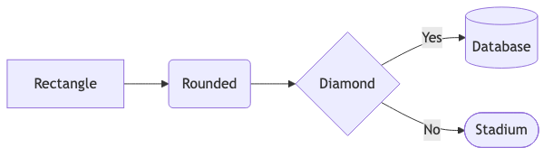
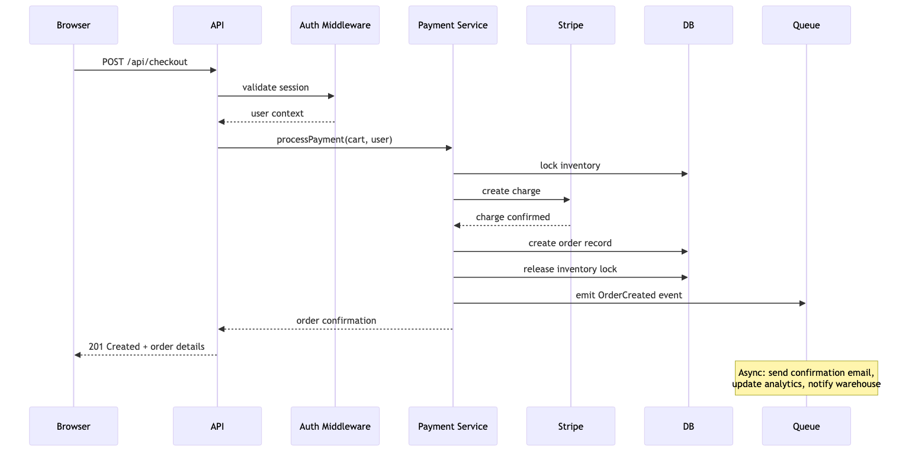
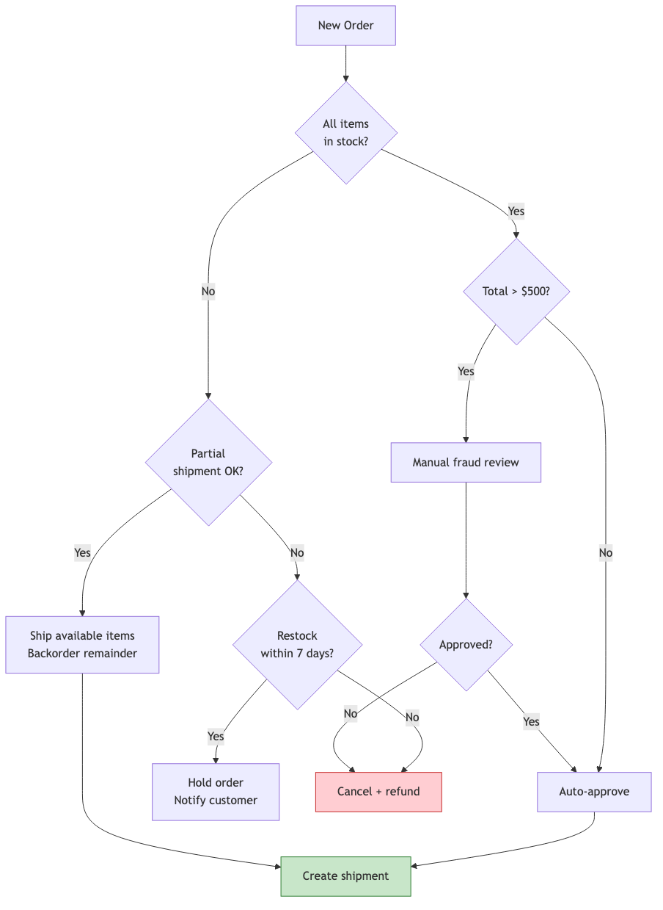
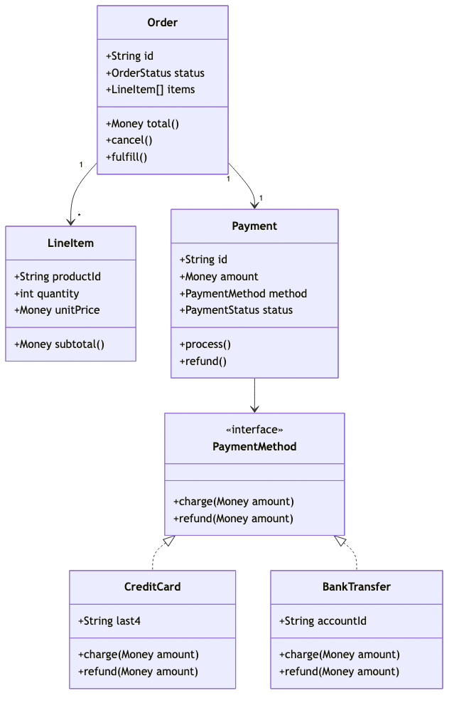
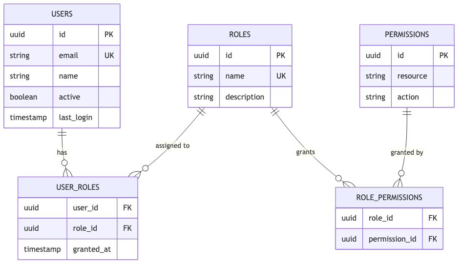
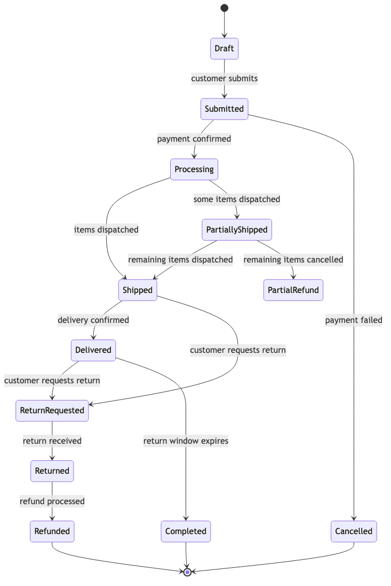
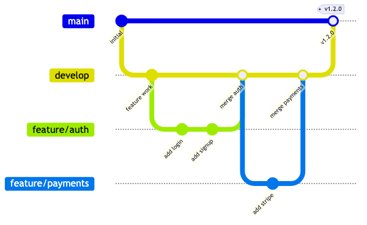

# 07 — Diagrams & Documentation

Generate Mermaid diagrams, API docs, onboarding materials, and keep them in sync with your code.

---

## What You'll Learn

- When and why to generate diagrams
- Mermaid syntax quick reference — just enough to read and edit Claude's output
- A catalog of diagram types with examples and when to use each one
- Generating documentation for modules, APIs, and onboarding
- Keeping generated docs in sync with code changes

**Prerequisites**: None — this guide is a reference you can use alongside any other guide.

---

## When to Generate Diagrams

Diagrams are most valuable when:

- **Onboarding** — you're learning a new codebase (or helping someone else learn)
- **Planning changes** — you need to see the blast radius visually
- **Code review** — a diagram explains a complex flow faster than prose
- **Documentation** — you're creating or updating project docs

Don't generate diagrams for their own sake. They should serve a specific purpose in the moment.

### The Prompt Pattern

```
Generate a Mermaid [diagram type] showing [what you want to see].
Include [specific details]. Keep it focused on [scope].
```

---

## Mermaid Syntax Quick Reference

You don't need to write Mermaid — Claude does that. But knowing enough to read and tweak its output is useful.

### Basic Shapes



```
flowchart LR
    A[Rectangle] --> B(Rounded)
    B --> C{Diamond}
    C -->|Yes| D[(Database)]
    C -->|No| E([Stadium])
```

### Arrow Types

```
A --> B       Solid arrow
A -.-> B      Dotted arrow
A ==> B       Thick arrow
A -->|label| B  Arrow with label
```

### Subgraphs

```
subgraph Title
    A --> B
end
```

That's enough to read and edit 90% of what Claude generates.

---

## Diagram Type Catalog

### Sequence Diagrams — Request Flows

Best for: tracing how a request moves through the system, showing interactions between components.

**When to use**: understanding API flows, debugging, PR descriptions for complex features.

```
Generate a Mermaid sequence diagram showing what happens
when a user submits a payment on the checkout page.
```



### Flowcharts — Business Logic

Best for: decision trees, business rules, conditional logic, process flows.

**When to use**: understanding complex conditional code, documenting business rules, planning implementation.

```
Generate a Mermaid flowchart showing the order fulfillment
decision logic — how the system decides whether to ship,
backorder, or cancel.
```



### Class Diagrams — Object Relationships

Best for: understanding object models, inheritance hierarchies, interface contracts.

**When to use**: exploring a domain model, understanding design patterns in the code.

```
Generate a Mermaid class diagram showing the payment
processing domain model — classes, their relationships,
and key methods.
```



### ER Diagrams — Data Models

Best for: database schema visualization, understanding table relationships.

**When to use**: before writing migrations, understanding the data layer, onboarding.

```
Generate a Mermaid ER diagram showing the core data model
for the user and permissions system.
```



### Architecture Diagrams — System Overview

Best for: showing services, data stores, and how they connect at a high level.

**When to use**: onboarding, system design discussions, understanding deployment.

See [Guide 04](04-architecture-and-dependencies.md) for detailed architecture diagram examples.

### State Diagrams — Workflows and State Machines

Best for: entities with lifecycle states, workflow processes, protocol states.

**When to use**: understanding order states, ticket lifecycles, document workflows.

```
Generate a Mermaid state diagram showing the lifecycle
of an order from creation to completion.
```



### Gitgraph Diagrams — Branch Strategies

Best for: explaining branching strategies, visualizing release flows.

**When to use**: onboarding docs, release process documentation.

```
Generate a Mermaid gitgraph diagram showing this project's
branching strategy based on the git history.
```



---

## Generating Documentation

### Module Documentation

```
Generate documentation for the [module/feature] including:
- Purpose and responsibilities
- Key interfaces and data structures
- Sequence diagram of the main flow (in Mermaid)
- Known limitations or gotchas
- Examples of how to use it
```

### API Documentation

```
Generate API documentation for the endpoints in [file/directory]:
- Method, path, description
- Request body schema with examples
- Response format with examples
- Error responses
- Authentication requirements
```

### Onboarding Documentation

Turn your exploration sessions into onboarding materials:

```
Based on everything we've explored in this session, create
an onboarding document for new developers. Include:
- Project overview and architecture
- How to set up the development environment
- Key concepts a new developer needs to understand
- Common tasks and how to do them
- Links to important files and directories
- Gotchas and tribal knowledge
```

---

## Keeping Docs in Sync

Generated documentation drifts from reality as code changes. Here are strategies to keep them aligned.

### Periodic Auditing

```
Compare what's documented in [README/docs/wiki] against what
the code actually does. Are there discrepancies? What's
outdated? What's missing?
```

### Post-Change Updates

After making significant code changes:

```
We just changed [what you changed]. Check if any existing
documentation needs to be updated to reflect these changes.
Check README.md, any docs/ files, and CLAUDE.md.
```

### Documentation as Code

The most maintainable diagrams are the ones that live close to the code they describe:

- Keep Mermaid diagrams in markdown files next to the code
- Reference them from the main README
- Update them as part of the PR when the code changes

---

## Key Takeaways

1. Generate diagrams to serve a purpose (onboarding, planning, review) — not for their own sake
2. Sequence diagrams and flowcharts are the most universally useful types
3. You don't need to memorize Mermaid syntax — just know enough to read and tweak Claude's output
4. Turn exploration sessions into onboarding docs — the work is already done
5. Keep docs close to code, and update them when the code changes

---

**Next**: [08 — Ongoing Practices](08-ongoing-practices.md) — Build sustainable habits for long-term productivity.
