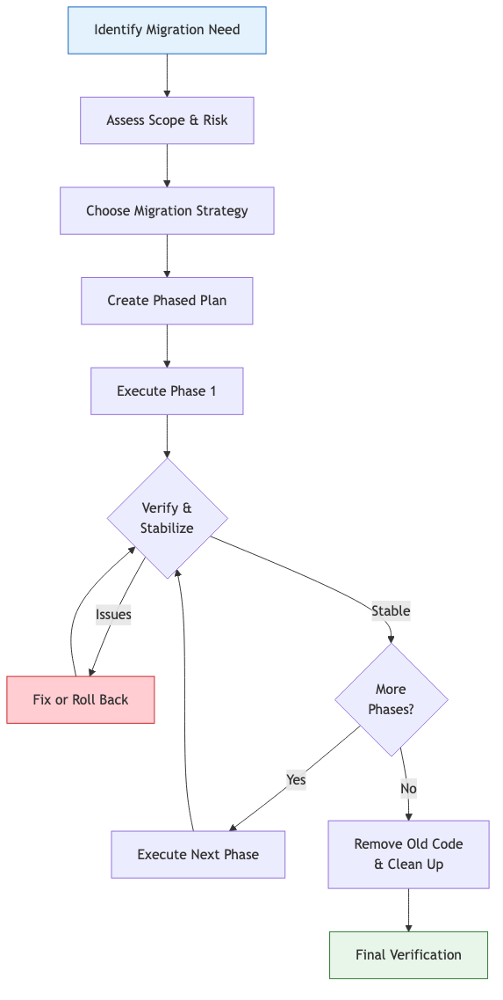
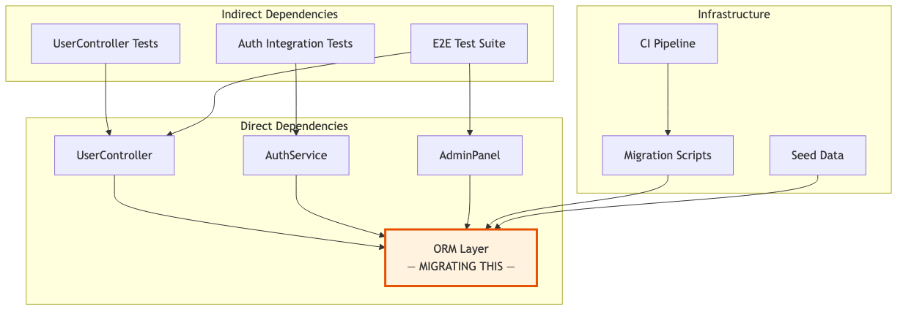
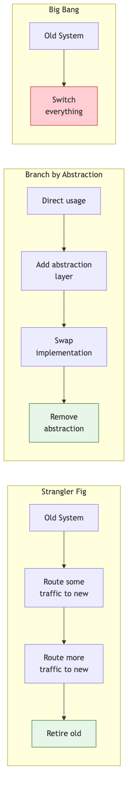
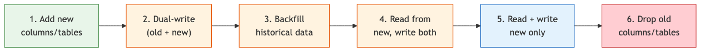
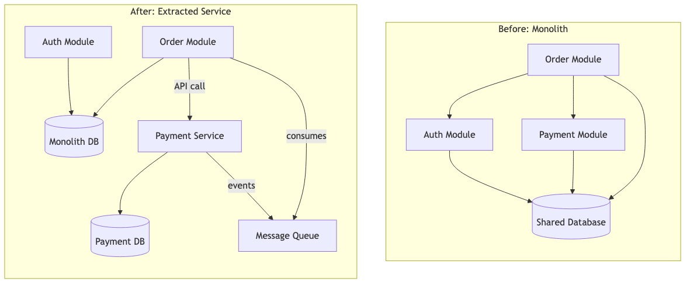
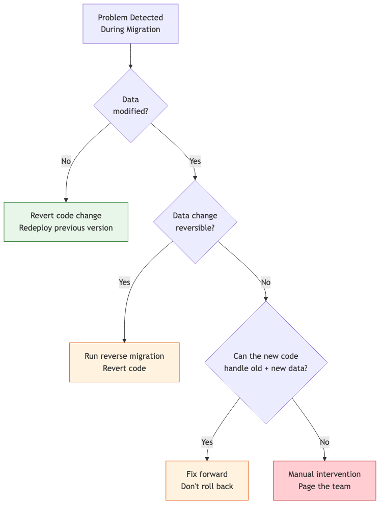

# 10 — Migration Planning

Use Claude Code to plan, execute, and verify large-scale migrations — framework upgrades, language transitions, database restructuring, and architectural shifts.

---

## What You'll Learn

- How to assess a migration's scope, risk, and effort before writing any code
- Strategies for incremental migration (strangler fig, parallel run, feature flags)
- Planning dependency and framework upgrades with impact analysis
- Database migration planning — schema changes, data backfilling, zero-downtime strategies
- Monolith-to-services and other architectural migrations
- Tracking progress across a multi-phase migration
- Rollback planning and verification at every stage

**Prerequisites**: [03 — Codebase Orientation](03-codebase-orientation.md) and [06 — Task Execution](06-task-execution.md) — you should know the codebase and be comfortable with plan mode.

---

## Why Migrations Need Their Own Guide

A migration isn't just a big task — it's a different *kind* of task. Regular task execution (Guide 06) assumes you're making a focused change within a stable system. Migrations change the system itself:

- They touch many files, often across the entire codebase
- They run over days or weeks, not hours
- They require coexistence of old and new during the transition
- A failed migration is much harder to undo than a failed feature
- They need a plan before the first line of code changes



---

## Step 1: Assess the Migration

Before planning anything, understand what you're dealing with.

### Scope Analysis

```
I need to migrate [describe the migration — e.g., "from Express
to Fastify," "from JavaScript to TypeScript," "from MongoDB to
PostgreSQL"]. Before we plan anything:

1. What is the full blast radius? How many files, modules, and
   tests are affected?
2. What are the hard dependencies on the current system?
3. Are there external consumers (APIs, SDKs, integrations) that
   depend on current behavior?
4. What's the risk level — can we do this incrementally, or is
   it all-or-nothing?
```

### Dependency Mapping

Ask Claude to map everything that depends on what you're changing:

```
Map all the dependencies on [thing being migrated]:
- Direct imports and usages
- Indirect dependencies (things that depend on things that depend on it)
- Test dependencies
- Configuration and build system dependencies
- External integrations
- Documentation references

Generate a Mermaid diagram showing the dependency graph.
```



### Risk Assessment

```
Assess the risks for this migration:
- What could go wrong at each stage?
- What's the worst-case scenario?
- What would a rollback look like at each stage?
- Are there any irreversible steps?
- What's the blast radius if something fails in production?

Rate each risk as high/medium/low impact and likelihood.
```

---

## Step 2: Choose a Migration Strategy

Different migrations call for different strategies. Ask Claude to recommend one:

```
Given what we know about the scope and risks, which migration
strategy makes the most sense? Consider:
- Strangler fig (gradually replace old with new)
- Parallel run (run both, compare results)
- Big bang (switch everything at once)
- Branch by abstraction (introduce abstraction layer, swap implementation)

Explain the tradeoffs for our specific situation.
```

### Strategy Comparison



| Strategy | Best For | Risk Level | Duration |
|----------|----------|------------|----------|
| Strangler fig | API migrations, service extraction | Low | Longer |
| Branch by abstraction | Library/ORM swaps, internal refactors | Low–Medium | Medium |
| Parallel run | Database migrations, critical path changes | Low (but expensive) | Medium |
| Big bang | Small scope, tightly coupled systems, major version upgrades | High | Short |

### When to Avoid Big Bang

Big bang migrations are tempting because they're simpler to plan. But they should be a last resort:

```
Is there any way to do this incrementally instead of all at
once? What would we need to introduce (adapters, feature flags,
abstraction layers) to enable incremental migration?
```

---

## Step 3: Create a Phased Plan

Break the migration into phases that each deliver a stable, shippable state.

### The Prompt

```
Create a phased migration plan for [the migration]. Each phase should:
1. Be independently deployable and rollback-safe
2. Have clear entry and exit criteria
3. Include specific verification steps
4. List the files that change in that phase

Keep each phase small enough to review in a single PR.
```

### Example: JavaScript to TypeScript Migration

```
Create a phased plan to migrate this Express app from
JavaScript to TypeScript. I want each phase to be a
single PR that doesn't break anything.
```

Claude might produce:

> **Phase 1: Infrastructure Setup** (1 PR)
> - Add `tsconfig.json`, TypeScript dependencies, build scripts
> - Configure ESLint for TypeScript
> - Update CI to build TypeScript
> - Verify: existing JS code still runs unmodified
>
> **Phase 2: Shared Types** (1 PR)
> - Create `src/types/` with interfaces for core domain objects
> - Add type definitions for external APIs
> - No code changes — just type definitions
> - Verify: build passes, no runtime changes
>
> **Phase 3: Utility Layer** (1 PR)
> - Rename `src/utils/*.js` → `*.ts`
> - Add type annotations to all utility functions
> - Verify: all tests pass, no behavior changes
>
> **Phase 4: Data Layer** (1–2 PRs)
> - Convert repository files to TypeScript
> - Type database query results
> - Verify: integration tests pass
>
> **Phase 5: Service Layer** (2–3 PRs)
> - Convert service files, one domain at a time
> - Verify after each domain: tests pass
>
> **Phase 6: API Layer** (2–3 PRs)
> - Convert controllers and middleware
> - Type request/response objects
> - Verify: API contract unchanged (test with existing API tests)
>
> **Phase 7: Strict Mode & Cleanup** (1 PR)
> - Enable `strict: true` in tsconfig
> - Fix all remaining `any` types
> - Remove `allowJs` configuration
> - Verify: full test suite, no `any` in codebase

### Tracking Progress

For multi-phase migrations, ask Claude to generate a progress tracker:

```
Create a migration progress checklist I can use to track
our JS-to-TS migration. Include file counts and status
for each module.
```

| Module | Files | Converted | Tests Updated | Verified |
|--------|-------|-----------|---------------|----------|
| `src/utils/` | 12 | 0/12 | 0/8 | - |
| `src/db/repos/` | 8 | 0/8 | 0/6 | - |
| `src/services/` | 15 | 0/15 | 0/12 | - |
| `src/api/controllers/` | 10 | 0/10 | 0/10 | - |
| `src/middleware/` | 6 | 0/6 | 0/4 | - |

---

## Common Migration Types

### Framework Upgrade (e.g., React 17 → 18, Django 4 → 5)

```
I need to upgrade [framework] from [current version] to
[target version]. Analyze:
1. What breaking changes exist between these versions?
2. Which of those breaking changes affect our codebase?
3. Are there automated codemods or migration scripts available?
4. What's the recommended upgrade path — can we go direct
   or do we need intermediate versions?
5. What deprecated APIs are we using that need to change?
```

After the analysis:

```
Create a phased plan for this upgrade. Start with changes
that are backwards-compatible with the current version, so
we can merge those first and reduce the blast radius of the
final version bump.
```

### Database Schema Migration

```
I need to restructure the database to [describe the change —
e.g., "split the users table into users and profiles,"
"add multi-tenancy," "normalize the orders schema"]. Plan
a zero-downtime migration:

1. What's the current schema and what queries depend on it?
2. What's the target schema?
3. How do we get from current to target without downtime?
4. What data needs to be backfilled?
5. How do we handle the transition period when old and new
   schemas coexist?
```

#### Zero-Downtime Database Migration Pattern



Each step should be a separate deployment. Only step 6 is hard to reverse — delay it until you're confident.

### API Versioning / Breaking Changes

```
I need to introduce breaking changes to our API:
[describe the changes]

Plan an API migration that:
1. Introduces the new version alongside the old
2. Gives consumers time to migrate
3. Provides clear deprecation warnings
4. Includes a timeline for removing the old version
```

### Monolith to Services

```
We want to extract [domain/module] from the monolith into
its own service. Analyze:
1. What are the boundaries of this module? What does it
   own exclusively vs. share with other modules?
2. What database tables does it use? Are any shared?
3. What synchronous calls cross the module boundary?
4. What would the API contract look like for the new service?
5. How do we handle the transition period?

Generate a diagram showing the current coupling and the
target architecture.
```



---

## Rollback Planning

Every phase of a migration needs a rollback plan. Ask Claude to define one:

```
For each phase of this migration, define:
1. How do we know something is wrong? (signals, metrics, alerts)
2. What's the rollback procedure?
3. How long does the rollback take?
4. Is there any data loss or state inconsistency on rollback?
5. Is there a point of no return? If so, what safeguards do
   we need before crossing it?
```

### The Rollback Decision Tree



---

## Verification During Migration

Migrations need more rigorous verification than normal changes because they affect so much at once.

### After Each Phase

```
Verify this migration phase:
1. Do all existing tests still pass?
2. Does the application start and serve requests?
3. Are there any runtime warnings or deprecation notices?
4. Does the behavior match the pre-migration behavior exactly?
5. Are there any performance regressions?
```

### Comparison Testing

For critical migrations, run old and new side by side:

```
Help me set up a comparison test that runs the same
requests against both the old and new implementations
and flags any differences in the responses.
```

### Smoke Test Checklist

Ask Claude to generate a migration-specific smoke test:

```
Generate a smoke test checklist for this migration — the
critical paths I should manually verify after each phase
to confirm nothing is broken.
```

---

## Sample Conversation: Planning a Real Migration

> **You** (plan mode): We need to migrate our ORM from Sequelize to Prisma. The app has about 40 models and 200+ queries. How should we approach this?
>
> **Claude**: *reads models directory, key query files, test suite*
>
> This is a significant migration. Here's what I found:
> - 42 Sequelize models in `src/models/`
> - ~230 queries spread across 18 repository files
> - 15 migrations in `src/db/migrations/`
> - Test coverage: good on repositories (85%), thin on model validations
>
> **Recommended strategy: Branch by Abstraction**
>
> 1. Introduce a repository interface layer between services and the ORM
> 2. Implement Prisma behind the same interface
> 3. Swap implementations module by module
> 4. Remove Sequelize after all modules are migrated
>
> This lets us:
> - Merge intermediate work without breaking anything
> - Run both ORMs simultaneously during transition
> - Roll back any individual module
> - Validate behavior parity module by module
>
> **You**: Good approach. How many phases and PRs are we looking at?
>
> **Claude**: I'd break it into 8 phases, roughly 12–15 PRs...
>
> *[detailed phase breakdown follows]*
>
> **You**: Start with Phase 1 — the repository interface layer. Which modules should we abstract first?
>
> **Claude**: The `users` and `auth` modules are the simplest (6 models, 20 queries) and have the best test coverage. Let's start there to validate the approach before tackling the more complex `orders` module (12 models, 80+ queries, transactions)...

---

## Migration Anti-Patterns

### "We'll Fix It After the Migration"

Bundling feature work, bug fixes, or refactors into a migration makes it impossible to isolate problems. **A migration should change the implementation, not the behavior.** Fix bugs before or after — not during.

### "Let's Migrate Everything at Once"

Even if the migration is conceptually simple (like a find-and-replace), doing it all in one PR makes review impossible and rollback painful. **Break it into reviewable chunks.** Each PR should be independently mergeable.

### "The Tests Will Catch It"

Tests verify behavior you thought to test. Migrations often surface behavior nobody thought to test — implicit ordering, undocumented side effects, timing dependencies. **Add comparison testing and manual smoke tests on top of the existing suite.**

### "We Don't Need the Old Code Anymore"

Don't delete the old implementation until the new one has been in production for a comfortable period. **Keep the old code behind a feature flag or in a clearly marked directory** until you're confident in the new system.

---

## Key Takeaways

1. Assess scope and risk before writing any migration code — surprises during migration are expensive
2. Prefer incremental strategies (strangler fig, branch by abstraction) over big bang
3. Every phase should be independently deployable, verifiable, and rollback-safe
4. A migration changes implementation, not behavior — don't bundle feature work
5. Define rollback procedures before you start, not when things go wrong
6. Track progress explicitly — migrations are long-running and need visibility
7. Verify more than usual — comparison tests and smoke tests supplement your test suite

---

**Next**: [11 — Local Environment Setup](11-local-environment-setup.md) — Get from `git clone` to a fully running local environment.
