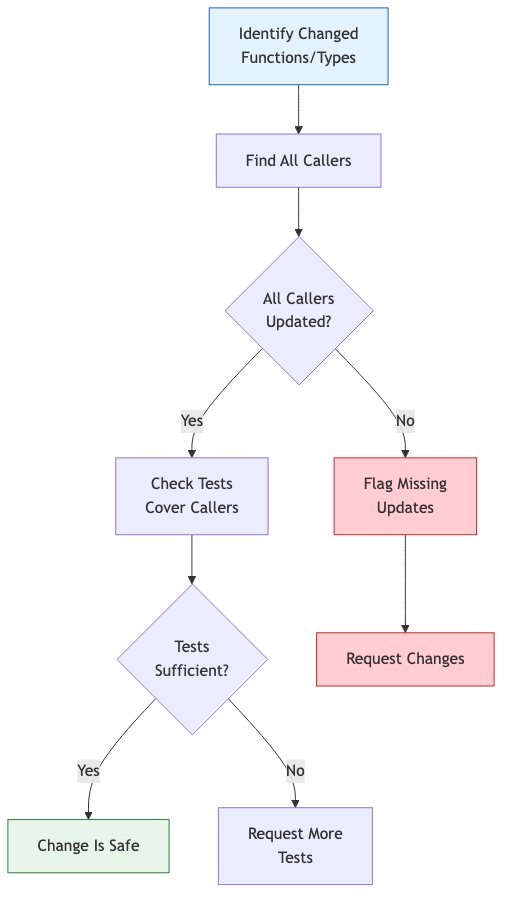
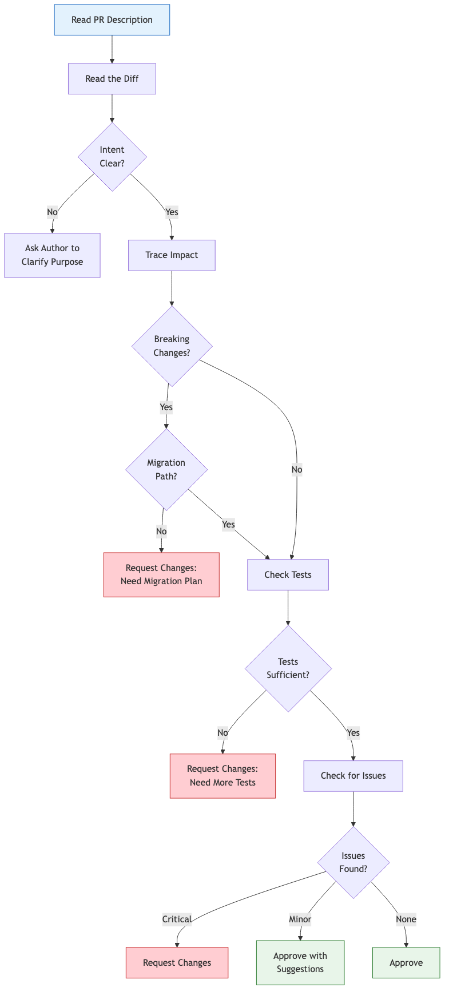
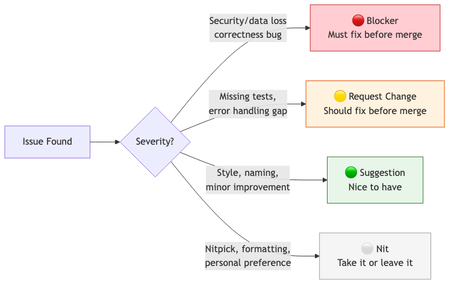

# 13 — Code Review

Reviewing PRs with Claude — understanding diffs, spotting issues, and writing constructive review comments.

---

## What You'll Learn

- The reviewer's mindset: what Claude helps with vs. what you still own
- Mapping diff changes to intent — understanding what a PR is really doing
- Tracing the impact of changes across the codebase
- Evaluating whether test coverage is sufficient
- Spotting common issues: error handling gaps, race conditions, security risks, performance red flags
- Writing effective review comments that are actionable and specific

**Prerequisites**: [03 — Codebase Orientation](03-codebase-orientation.md) (you should understand the project structure) and [06 — Task Execution](06-task-execution.md) (you should understand the change workflow)

---

## Why Code Review with Claude

Code review is a different skill from writing code. When you're reviewing, you need to:

1. **Understand intent** — what is this PR trying to do?
2. **Evaluate correctness** — does it actually do that?
3. **Assess impact** — what else could it affect?
4. **Check quality** — does it follow project conventions?
5. **Verify safety** — are there security, performance, or reliability risks?

Claude excels at the analytical parts — tracing call paths, spotting error handling gaps, checking edge cases. But the judgment calls — is this the right approach? does this match team conventions? is the trade-off worth it? — remain yours.

### What Claude Helps With

- Reading large diffs quickly and summarizing what changed
- Tracing callers of modified functions to assess blast radius
- Spotting missing error handling, null checks, or edge cases
- Identifying potential security issues (injection, auth bypasses)
- Checking if tests cover the new behavior
- Identifying breaking API changes

### What You Still Own

- Whether the approach is right for the project
- Whether the change aligns with team direction
- Tone and constructiveness of feedback
- Deciding what's a blocker vs. a suggestion vs. a nit
- Final approve/request-changes decision

---

## Understanding the Diff

### Mapping Changes to Intent

Start by understanding what the PR is supposed to do, then check if the diff matches:

```
Here's a PR description and the diff. Help me understand:

1. What is this PR trying to accomplish?
2. Does the diff match the stated intent?
3. Are there changes that seem unrelated to the goal (scope creep)?
4. Are there changes I'd expect to see that are missing?

PR description: [paste]
Diff: [paste or point to files]
```

### Reading PR Descriptions Critically

```
Read this PR description and tell me:
- Is the "why" clear, or does it only describe the "what"?
- Are there assumptions that aren't stated?
- Is the testing plan sufficient?
- What questions would you ask the author?

[paste PR description]
```

### Spotting Scope Creep

Watch for PRs that do more than one thing:

```
This PR is supposed to [stated goal]. Look at the diff
and identify any changes that aren't directly related to
that goal. Should those changes be in a separate PR?
```

### Large PRs

Large diffs need to be broken down:

```
This PR has [N] files changed. Group the changes by
purpose — what's the logical structure? Which files are
the core change vs. supporting changes (tests, types,
config)?
```

---

## Tracing Impact

When a function signature changes, a type is modified, or a behavior is altered, you need to know what else is affected.

```
This PR modifies [function/class/type]. Show me:
1. All callers of this function in the codebase
2. Are any callers not updated in this PR?
3. Could this change break anything not covered by tests?
```

### Blast Radius for Review



### Cross-Boundary Impact

```
Does this change affect any public APIs, shared types,
or interfaces used by other services/packages? Could
downstream consumers break?
```

---

## Evaluating Test Coverage

Good tests are the backbone of safe changes. Evaluate whether the PR's tests actually verify the new behavior:

```
Look at the tests added/modified in this PR:
1. Do they test the happy path?
2. Do they test error conditions?
3. What edge cases are missing?
4. Are the assertions specific enough, or would they
   pass even if the code was wrong?
5. Do the tests actually exercise the new code path?
```

### Common Test Gaps

| Gap | Why It Matters |
|-----|---------------|
| No error path tests | You don't know what happens when things fail |
| Only happy path | Edge cases are where bugs live |
| Mocked too much | The test might pass but the real integration could fail |
| Assertions too loose | `expect(result).toBeTruthy()` passes for almost anything |
| No boundary testing | Off-by-one errors, empty inputs, max values |
| Tests duplicate existing ones | Coverage looks higher but doesn't test anything new |

### Verifying Test Quality

```
For each test in this PR, tell me:
- What behavior does it verify?
- Could the code be wrong and the test still pass?
- Is there a simpler test that would catch the same bug?
```

---

## Spotting Common Issues

### Error Handling Gaps

```
Check the error handling in this PR:
- Are all async operations wrapped in try/catch or .catch()?
- What happens if [database/API/service] is unavailable?
- Are errors logged with enough context to debug later?
- Are error responses consistent with the rest of the API?
- Could any error leak internal details to the client?
```

### Race Conditions

```
Look for potential race conditions:
- Are there read-then-write patterns without locking?
- Could concurrent requests corrupt shared state?
- Are database operations that need to be atomic actually
  in a transaction?
- Is there a TOCTOU (time-of-check-to-time-of-use) issue?
```

### Security Implications

```
Review this change for security issues:
- Is user input validated and sanitized?
- Could this enable injection (SQL, command, XSS)?
- Are authorization checks in place (not just authentication)?
- Is sensitive data handled properly (not logged, encrypted)?
- Are there new endpoints that need rate limiting?
```

### Performance Red Flags

```
Check for performance issues:
- Are there N+1 query patterns?
- Is there unbounded data fetching (no pagination/limits)?
- Are there expensive operations inside loops?
- Will this scale with the current data volume?
- Are there missing indexes for new query patterns?
```

### Breaking API Changes

```
Does this change the public API? Check for:
- Changed response shapes (renamed/removed fields)
- Changed request parameters (required fields added)
- Changed status codes
- Changed error formats
- Removed endpoints

If so, is there a migration path for existing consumers?
```

---

## The Review Decision Tree



---

## Writing Effective Review Comments

### Comment Priority Triage

Not all issues are equal. Categorize your feedback:



### Writing Good Comments

Good review comments are:

1. **Specific** — point to the exact line and explain the issue
2. **Actionable** — suggest a fix or direction, don't just say "this is wrong"
3. **Labeled** — prefix with `blocker:`, `suggestion:`, or `nit:` so the author knows priority
4. **Respectful** — ask questions before assuming mistakes

```
Help me draft review comments for these issues I found.
For each one:
- Make it specific (reference the line/function)
- Suggest a fix or ask a question
- Label it as blocker, suggestion, or nit
- Keep the tone constructive

Issues:
1. [describe issue 1]
2. [describe issue 2]
3. [describe issue 3]
```

### Questions vs. Demands

Prefer questions when you're not sure something is wrong:

| Instead of... | Try... |
|--------------|--------|
| "This is wrong" | "I think this might have an issue — what happens when X is null?" |
| "Use a transaction here" | "Could concurrent requests cause a race condition here? Would a transaction help?" |
| "This needs tests" | "How would we catch a regression here? I don't see a test covering the error path." |
| "Don't do it this way" | "I see you went with approach X. Did you consider Y? I'm curious about the trade-off." |

---

## Sample Conversation

> **You**: Review this PR that adds a new file upload API endpoint. Here's the diff: [paste diff]
>
> **Claude**: Let me analyze this PR...
>
> *reads the diff, traces callers, checks test coverage*
>
> **Summary**: This PR adds `POST /api/files/upload` with file type validation, S3 storage, and a database record. Here's what I found:
>
> **Looks good:**
> - File type validation using allowlist (not blocklist)
> - Proper error handling for S3 upload failures
> - Database transaction wrapping the metadata insert
>
> **Issues to raise:**
>
> 1. **Blocker — No rate limiting.** This endpoint accepts file uploads with no per-user rate limit. An attacker could exhaust storage or rack up S3 costs. The other upload endpoints in this project use the `rateLimiter` middleware from `src/middleware/rateLimit.ts`.
>
> 2. **Blocker — Path traversal in filename.** The original filename from the multipart form is used to construct the S3 key: `uploads/${userId}/${filename}`. If `filename` contains `../../`, it could write to unintended S3 paths. The filename should be sanitized or replaced with a generated UUID.
>
> 3. **Request change — No file size limit.** The multer config doesn't set `limits.fileSize`. The default is unlimited. Other upload endpoints in this project set a 10MB limit.
>
> 4. **Suggestion — Missing content-type validation.** The code checks the file extension but not the actual content type. A file named `photo.jpg` could contain executable content. Consider using a library like `file-type` to verify the magic bytes match the extension.
>
> 5. **Nit — Test file name.** The test file is `upload.test.ts` but other API tests follow the pattern `[resource].api.test.ts`. Consider renaming to `files.api.test.ts` for consistency.
>
> **You**: Good catches. Draft the blocker comments for me.
>
> **Claude**: Here are the comments ready to post:
>
> **On the route handler line:**
> > `blocker:` This endpoint needs rate limiting. An unauthenticated or malicious user could exhaust S3 storage or run up costs. The other upload endpoints use `rateLimiter({ windowMs: 15 * 60 * 1000, max: 20 })` from `src/middleware/rateLimit.ts` — same pattern should apply here.
>
> **On the S3 key construction line:**
> > `blocker:` The original filename is used directly in the S3 key path. If the filename contains path traversal characters (`../../`), files could be written outside the intended prefix. Suggest replacing the filename with a generated UUID and storing the original name only in the database metadata.

---

## Key Takeaways

1. Understand the intent before reading the diff — know what the PR is *supposed* to do, then check if it actually does
2. Trace the blast radius of every change — find all callers and check if they're updated
3. Evaluate tests for quality, not just presence — a test that can't fail is worse than no test
4. Categorize feedback by severity — distinguish blockers from nits so the author knows what matters
5. Write comments that are specific, actionable, and respectful — ask questions when you're unsure
6. Security, error handling, and performance are the highest-value things to check — they're easy to miss during authoring

---

**Next**: [14 — Testing Strategies](14-testing-strategies.md) — Write effective tests with Claude — unit, integration, e2e, and edge cases.
