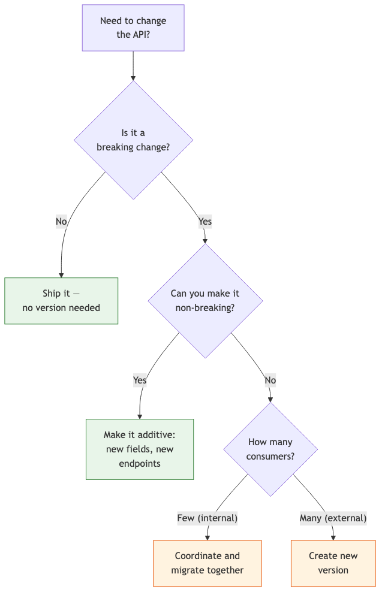
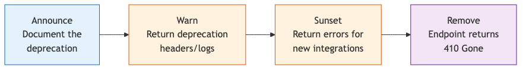

# 18 — API Design & Evolution

Designing APIs with Claude — REST/GraphQL conventions, versioning, backward compatibility, and deprecation strategies.

---

## What You'll Learn

- Designing APIs for consumers, not implementation details
- REST API conventions — resource naming, HTTP methods, status codes, pagination
- GraphQL schema design and when to choose it over REST
- Versioning strategies and deciding when to version
- Auditing for backward compatibility and handling breaking changes
- Deprecation lifecycle and communicating changes to consumers
- Generating and maintaining API documentation

**Prerequisites**: [03 — Codebase Orientation](03-codebase-orientation.md) (you should be able to navigate the codebase) and [06 — Task Execution](06-task-execution.md) (you should understand how to plan and execute changes)

---

## The API Design Mindset

APIs are contracts between systems. The key mental shift: **design for consumers, not your implementation**.

```
I'm designing an API for [feature]. Before we look at our
database schema or internal models, let's think about this
from the consumer's perspective:

1. Who will call this API? (frontend, mobile, third-party)
2. What do they need to accomplish?
3. What's the simplest request/response that serves them?
4. What would a developer expect this API to look like
   without reading any documentation?
```

Good APIs follow the **principle of least surprise** — a developer should be able to guess the endpoint, method, and response shape correctly most of the time.

### Common API Design Mistakes

| Mistake | Example | Better |
|---------|---------|--------|
| Exposing internal structure | `POST /db/users_table/insert` | `POST /users` |
| Verb-based endpoints | `POST /getUsers` | `GET /users` |
| Inconsistent naming | `/users`, `/get-orders`, `/product_list` | `/users`, `/orders`, `/products` |
| Returning everything always | 50-field response for a list endpoint | Return summaries for lists, details for individual |
| Ignoring error consistency | Different error shapes per endpoint | Standard error envelope everywhere |

---

## REST API Design

### Resource Naming

Resources are nouns, not verbs. Use plural forms consistently:

```
Review our API routes and check for consistency:

1. Are all resources plural nouns? (users, orders, products)
2. Are nested resources expressed through URL hierarchy?
   (e.g., /users/123/orders)
3. Do we avoid verbs in URLs? (exception: non-CRUD
   actions like /orders/123/cancel)
4. Is the casing consistent? (kebab-case recommended)
5. Are URLs max 2-3 levels deep?
```

**Good resource hierarchy:**
```
GET    /users                    # List users
POST   /users                    # Create user
GET    /users/123                # Get user
PATCH  /users/123                # Update user
DELETE /users/123                # Delete user
GET    /users/123/orders         # List user's orders
POST   /users/123/orders         # Create order for user
POST   /orders/456/cancel        # Non-CRUD action
```

### HTTP Methods and Status Codes

```
Audit our API endpoints for correct HTTP method and status
code usage:

Methods:
- GET: read-only, cacheable, no body
- POST: create resource, non-idempotent
- PUT: full replacement, idempotent
- PATCH: partial update, idempotent
- DELETE: remove resource, idempotent

Common status codes:
- 200: success (GET, PATCH, DELETE)
- 201: created (POST) — include Location header
- 204: no content (DELETE with no response body)
- 400: client error (validation, bad input)
- 401: not authenticated
- 403: not authorized (authenticated but no permission)
- 404: not found
- 409: conflict (duplicate, state conflict)
- 422: unprocessable entity (valid JSON, invalid semantics)
- 429: rate limited
- 500: server error

Flag any endpoints using the wrong method or returning
incorrect status codes.
```

### Pagination, Filtering, and Sorting

```
Review our list endpoints for consistent pagination,
filtering, and sorting:

Pagination (cursor-based preferred for large datasets):
  GET /users?cursor=abc123&limit=20
  Response: { data: [...], next_cursor: "def456", has_more: true }

Offset-based (simpler, fine for small datasets):
  GET /users?page=2&per_page=20
  Response: { data: [...], total: 150, page: 2, per_page: 20 }

Filtering:
  GET /users?status=active&role=admin
  GET /orders?created_after=2024-01-01&total_gte=100

Sorting:
  GET /users?sort=created_at&order=desc
  GET /users?sort=-created_at  (prefix minus = descending)
```

### Response Envelopes

A consistent response structure helps consumers write generic client code:

```json
// Success
{
  "data": { "id": 123, "name": "Alice" },
  "meta": { "request_id": "req_abc123" }
}

// Success (list)
{
  "data": [{ "id": 123 }, { "id": 124 }],
  "meta": { "total": 50, "page": 1, "per_page": 20 }
}

// Error
{
  "error": {
    "code": "VALIDATION_ERROR",
    "message": "Email is required",
    "details": [
      { "field": "email", "message": "is required" }
    ]
  }
}
```

---

## GraphQL Schema Design

### When GraphQL vs REST

```
We're deciding between REST and GraphQL for [feature].
Help me evaluate:

1. How many different clients consume this API?
2. Do different clients need very different data shapes?
3. How deeply nested are the relationships?
4. Do we already have REST infrastructure (auth, caching,
   monitoring)?
5. Is this a CRUD-heavy API or a query-heavy API?
```

| Factor | Favors REST | Favors GraphQL |
|--------|------------|---------------|
| Client diversity | One or two clients | Many clients with different needs |
| Data shape | Consistent, predictable | Varies widely per client |
| Relationships | Shallow (1-2 levels) | Deeply nested |
| Caching | Simple, HTTP-based | Complex, needs custom approach |
| Team experience | REST familiarity | GraphQL familiarity |
| API surface | CRUD-dominant | Query-dominant |
| File uploads | Straightforward | Requires multipart spec workaround |

### Types, Relationships, and N+1 Risks

```
Review our GraphQL schema for:

1. N+1 query risks — are we using dataloaders for
   relationships?
2. Unbounded lists — do all list fields require pagination?
3. Circular references — can a query create infinite depth?
4. Query complexity — do we limit depth or cost?
5. Nullable vs non-nullable — are we intentional about
   which fields can be null?
```

**N+1 problem example:**
```graphql
# This query could trigger N+1 database calls:
query {
  users {         # 1 query for users
    orders {      # N queries (one per user)
      items {     # N*M queries (one per order)
        product { # N*M*K queries (one per item)
          name
        }
      }
    }
  }
}
```

**Solution**: Use DataLoader to batch and cache database lookups within a single request.

---

## API Versioning

### Decision Tree



### Versioning Strategies

| Strategy | Example | Pros | Cons |
|----------|---------|------|------|
| URL path | `/v1/users`, `/v2/users` | Simple, visible, cacheable | Duplicates routes, harder to share code |
| Header | `Accept: application/vnd.api.v2+json` | Clean URLs, flexible | Invisible, harder to test |
| Query param | `/users?version=2` | Easy to switch in development | Pollutes query string, cache key issues |

**Recommendation**: URL path versioning for external APIs (clearest for consumers), header versioning for internal APIs (cleanest URLs).

```
We need to version our API. Analyze our current endpoints
and recommend:

1. Which versioning strategy fits our consumer base?
2. What's our current effective "v1"?
3. Which endpoints are candidates for v2 changes?
4. How do we structure the code to share logic between
   versions?
```

---

## Backward Compatibility

### Safe vs Breaking Changes

**Safe changes (non-breaking):**
- Adding new optional fields to responses
- Adding new endpoints
- Adding optional query parameters
- Adding new enum values (if clients handle unknowns)
- Relaxing validation (accepting more input)

**Breaking changes:**
- Removing or renaming fields
- Changing field types
- Adding required fields to requests
- Changing URL paths
- Tightening validation (rejecting previously valid input)
- Changing response status codes for same scenarios
- Changing authentication requirements

### Auditing PRs for Breaking Changes

```
Review this PR for API breaking changes:

For each endpoint modified, check:
1. Are any response fields removed or renamed?
2. Are any response field types changed?
3. Are new required request fields added?
4. Are any previously optional fields now required?
5. Are status codes changed for existing scenarios?
6. Are error response shapes changed?
7. Would a client written against the old API break?

Flag each breaking change with severity:
- CRITICAL: Will immediately break clients
- WARNING: May break some clients depending on usage
- INFO: Technically breaking but unlikely to affect anyone
```

---

## Deprecation Strategies

### The Deprecation Lifecycle



Each stage has a minimum duration — typically:
- **Announce**: At least 1 release cycle before warnings begin
- **Warn**: 2-3 months (return `Deprecation` and `Sunset` headers)
- **Sunset**: 1-3 months (block new consumers, existing ones still work)
- **Remove**: After sunset date, return `410 Gone` with migration guide URL

### Deprecation Communication

```
Help me write a deprecation notice for [endpoint/feature]:

Include:
1. What's being deprecated and why
2. What replaces it (with migration examples)
3. Timeline (warn date, sunset date, removal date)
4. How to migrate (before/after code examples)
5. Who to contact with questions

Keep it concise and actionable — developers should know
exactly what to do after reading it.
```

### Deprecation Headers

```http
HTTP/1.1 200 OK
Deprecation: Sun, 01 Sep 2024 00:00:00 GMT
Sunset: Mon, 01 Dec 2024 00:00:00 GMT
Link: <https://docs.example.com/migration/v2>; rel="successor-version"
```

---

## Generating API Documentation

### Keeping Docs in Sync

```
Scan our API endpoints and compare them against our
OpenAPI/Swagger spec:

1. Are there endpoints in code not in the spec?
2. Are there endpoints in the spec not in code?
3. Do request/response schemas match the actual types?
4. Are status codes documented correctly?
5. Are examples provided and accurate?

Generate the missing documentation or flag discrepancies.
```

### Documentation from Code

```
Generate an OpenAPI 3.0 spec for our [service] API by
reading the route definitions, request validation, and
response types. Include:

- Endpoint paths and methods
- Request body schemas (from validation rules)
- Response schemas (from TypeScript types/serializers)
- Authentication requirements
- Example requests and responses
- Error response schemas
```

---

## Sample Conversation

> **You**: We currently have a `PUT /users/:id` endpoint that expects the full user object. I want to add `PATCH /users/:id` for partial updates. Help me do this without breaking existing clients.
>
> **Claude**: Let me read the current PUT endpoint implementation first...
>
> *reads the route handler, validation, and user model*
>
> Here's the current `PUT /users/:id`:
> - Expects all fields: `name`, `email`, `role`, `preferences`
> - Validates all fields are present (400 if missing)
> - Replaces the entire user record
> - 14 callers in the frontend, 3 in the mobile app
>
> Here's my plan for adding PATCH safely:
>
> **1. Add the PATCH endpoint alongside PUT (no changes to PUT):**
> - `PATCH /users/:id` accepts any subset of fields
> - Only validates fields that are present in the request
> - Merges with existing data rather than replacing
> - Returns the full updated user (same response shape as PUT)
>
> **2. Backward compatibility:**
> - PUT continues to work exactly as before
> - Same response envelope for both PUT and PATCH
> - Same authentication and authorization checks
> - No changes to existing callers needed
>
> **3. Future deprecation path (optional):**
> - Eventually mark PUT as deprecated in favor of PATCH
> - PUT internally becomes "PATCH with all fields required"
> - No rush — PUT can live alongside PATCH indefinitely
>
> Want me to implement the PATCH endpoint? I'll share the code and validation logic before writing it.
>
> **You**: Yes, implement it. Make sure the validation handles partial updates correctly.
>
> **Claude**: *implements the PATCH endpoint with partial validation, adds tests for partial updates, edge cases (empty body, unknown fields), and verifies PUT still works unchanged*

---

## Key Takeaways

1. Design APIs for consumers, not your database schema — what would a developer expect without reading docs?
2. Use consistent conventions everywhere — resource naming, status codes, error shapes, pagination
3. Most breaking changes can be avoided by making changes additive — add new fields and endpoints instead of changing existing ones
4. Version only when you must — try to make changes backward-compatible first
5. Deprecation is a lifecycle, not an event — announce, warn, sunset, then remove
6. Keep API documentation in sync with code — automate generation where possible
7. Audit every PR that touches API endpoints for breaking changes before merging

---

**Next**: [19 — Data Modeling & Database Design](19-data-modeling-and-database-design.md) — Designing schemas, normalization, indexing strategies, and query optimization.
