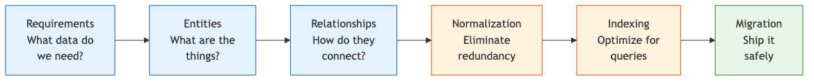
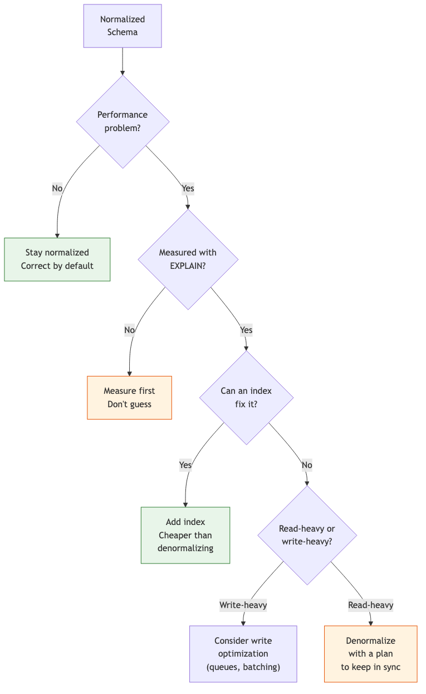
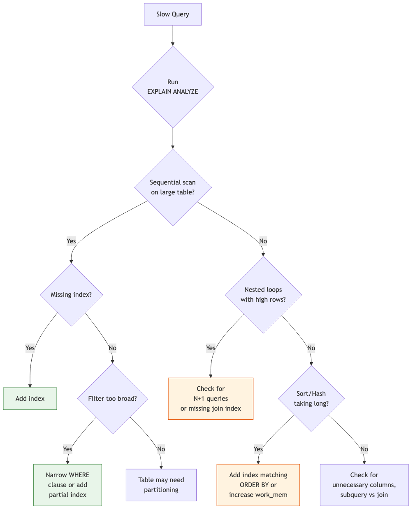

# 19 — Data Modeling & Database Design

Designing database schemas with Claude — normalization, relationships, indexing, query optimization, and ER modeling.

---

## What You'll Learn

- The data modeling process from requirements to migration
- Identifying entities and relationships from business requirements
- Normalization and when to denormalize
- Primary key strategies for different scenarios
- Relationship patterns and common pitfalls
- Indexing strategies that match your query patterns
- Reading EXPLAIN plans and optimizing queries
- Designing safe, reversible database migrations

**Prerequisites**: [04 — Architecture & Dependencies](04-architecture-and-dependencies.md) (you should understand the project's data layer and existing schemas)

---

## The Data Modeling Process



Don't jump to tables and columns. Start with what the business needs, then work through each step.

---

## Domain Modeling

### Identifying Entities and Relationships

```
I'm designing a data model for [feature/system]. Here are
the business requirements:

[paste requirements]

Help me identify:
1. The core entities (nouns in the requirements)
2. The relationships between them (verbs connecting nouns)
3. The attributes of each entity
4. Which fields are required vs optional
5. Any implicit entities I might be missing (join tables,
   audit records, status histories)
```

### From Requirements to Entities

**Example — E-commerce order system:**

Requirements say: "Customers place orders containing products. Each order has a shipping address and payment method. Products have categories and can be on sale."

```
Entities:
- Customer (name, email, phone)
- Order (status, total, placed_at)
- OrderItem (quantity, unit_price, subtotal)
- Product (name, description, base_price, sale_price)
- Category (name, slug)
- Address (street, city, state, zip, country)
- PaymentMethod (type, last_four, expiry)

Relationships:
- Customer has many Orders
- Order has many OrderItems
- OrderItem belongs to Product
- Product has many Categories (many-to-many)
- Order has one shipping Address
- Order has one PaymentMethod
- Customer has many Addresses
- Customer has many PaymentMethods
```

Notice `OrderItem` — it's not mentioned explicitly in the requirements, but you need it to store per-order pricing (products change price over time).

---

## Normalization and Denormalization

### The Normal Forms

| Form | Rule | Violation Example |
|------|------|-------------------|
| **1NF** | No repeating groups, atomic values | `tags: "ruby,python,go"` in a single column |
| **2NF** | No partial dependencies on composite keys | `order_items` table storing `product_name` alongside `product_id` |
| **3NF** | No transitive dependencies | `orders` table storing `customer_email` alongside `customer_id` |

### When to Denormalize



**Common denormalization patterns:**
- **Cached counts**: `comments_count` on a post (avoid `COUNT(*)` on every page load)
- **Snapshot values**: `unit_price` on `order_items` (preserve price at time of purchase)
- **Materialized paths**: `path: "/root/parent/child"` for tree structures (fast ancestor queries)
- **Precomputed aggregates**: `daily_revenue` table updated by background job

```
Review our schema for denormalization opportunities:

1. Which queries join 3+ tables frequently?
2. Are we computing aggregates repeatedly on read?
3. Are there counts we fetch on every page load?
4. Which data is read 100x more than it's written?

For each candidate, assess:
- How stale can the denormalized data be?
- What keeps it in sync? (trigger, callback, job)
- What's the failure mode if sync breaks?
```

---

## Primary Key Strategies

| Strategy | Pros | Cons | Good For |
|----------|------|------|----------|
| **Auto-increment** (SERIAL/BIGSERIAL) | Simple, compact, sortable | Reveals count, conflicts in distributed systems | Single-database apps, internal IDs |
| **UUID v4** | Globally unique, no coordination | Large (16 bytes), random (bad for B-tree locality) | Distributed systems, external-facing IDs |
| **ULID** | Globally unique, time-sortable, compact encoding | Less widely supported | Distributed systems needing time ordering |
| **Natural key** | Meaningful, no lookup needed | Can change, may be composite | ISO codes, email (if immutable) |

```
Review our primary key strategy:

1. Are we using auto-increment IDs in URLs?
   (security concern — reveals record count, enumerable)
2. Do we need globally unique IDs?
   (multiple databases, microservices, offline-first)
3. Are any tables using UUIDs where auto-increment
   would be simpler?
4. Do we have a consistent strategy across all tables?
```

**Common pattern**: Auto-increment `id` as internal PK, UUID `public_id` as external identifier.

---

## Relationship Design

### One-to-Many

The most common relationship. The "many" side holds the foreign key:

```sql
-- A customer has many orders
CREATE TABLE orders (
    id BIGSERIAL PRIMARY KEY,
    customer_id BIGINT NOT NULL REFERENCES customers(id),
    -- always index foreign keys
    -- (PostgreSQL doesn't auto-index them)
    CONSTRAINT fk_customer FOREIGN KEY (customer_id)
        REFERENCES customers(id)
);
CREATE INDEX idx_orders_customer_id ON orders(customer_id);
```

### Many-to-Many

Requires a join table. Always think about what attributes the *relationship itself* carries:

```sql
-- A product belongs to many categories, a category has many products
CREATE TABLE product_categories (
    product_id BIGINT NOT NULL REFERENCES products(id),
    category_id BIGINT NOT NULL REFERENCES categories(id),
    position INTEGER DEFAULT 0,  -- ordering within category
    PRIMARY KEY (product_id, category_id)
);
CREATE INDEX idx_product_categories_category
    ON product_categories(category_id);
```

### Polymorphic Associations

When multiple tables can be the "parent":

```
Review our polymorphic relationships for correctness:

Pattern 1 — Separate FKs (preferred):
  comments.order_id, comments.product_id, comments.user_id
  (only one is non-null, enforced by CHECK constraint)

Pattern 2 — Type + ID:
  comments.commentable_type, comments.commentable_id
  (no FK enforcement possible, but flexible)

For each polymorphic relationship, check:
1. Can we use pattern 1? (finite, known set of parents)
2. If using pattern 2, how do we ensure data integrity?
3. Are queries efficient? (partial indexes help)
```

### Self-Referential

For trees and hierarchies (categories, org charts, comments):

```sql
-- Category tree
CREATE TABLE categories (
    id BIGSERIAL PRIMARY KEY,
    parent_id BIGINT REFERENCES categories(id),
    name TEXT NOT NULL,
    -- Materialized path for fast ancestor/descendant queries
    path TEXT NOT NULL DEFAULT '/'
);
CREATE INDEX idx_categories_parent ON categories(parent_id);
CREATE INDEX idx_categories_path ON categories(path text_pattern_ops);
```

---

## Indexing Strategies

### What to Index

```
Analyze our queries and recommend indexes:

1. Read every query in [directory/file] that hits the database
2. For each query, note which columns appear in:
   - WHERE clauses
   - JOIN conditions
   - ORDER BY clauses
   - GROUP BY clauses
3. Recommend indexes based on query patterns
4. Flag any existing indexes that are unused
5. Flag queries doing sequential scans on large tables
```

### Index Types

| Index Type | Use When | Example |
|-----------|----------|---------|
| **B-tree** (default) | Equality, range, sorting | `WHERE status = 'active'`, `ORDER BY created_at` |
| **Hash** | Equality only, large values | `WHERE email = '...'` (PostgreSQL 10+) |
| **GIN** | Array contains, full-text, JSONB | `WHERE tags @> '{ruby}'`, `WHERE doc @> '{"key": "val"}'` |
| **GiST** | Geometric, range types, proximity | `WHERE location <@ circle`, `WHERE range && '[1,10]'` |
| **Partial** | Subset of rows | `WHERE status = 'active'` (index only active rows) |
| **Composite** | Multi-column queries | `WHERE user_id = 1 AND status = 'active'` |

### Composite Index Ordering

The order of columns in a composite index matters. **Put equality columns first, then range/sort columns**:

```sql
-- Query: WHERE user_id = 1 AND status = 'active' ORDER BY created_at DESC
-- Good: equality columns first, then sort column
CREATE INDEX idx_orders_user_status_created
    ON orders(user_id, status, created_at DESC);

-- Bad: sort column first (can't use index efficiently)
CREATE INDEX idx_orders_created_user_status
    ON orders(created_at DESC, user_id, status);
```

### Over-Indexing

More indexes means slower writes and more storage. Check for waste:

```
Audit our indexes for waste:

1. Which indexes are never used? (pg_stat_user_indexes
   where idx_scan = 0)
2. Which indexes are redundant? (index on (a) is redundant
   if index on (a, b) exists)
3. Which indexes are on tiny tables? (not worth the
   write overhead)
4. What's our index-to-table size ratio?
   (over 50% suggests over-indexing)
```

---

## Query Optimization

### Reading EXPLAIN Plans

```
Run EXPLAIN ANALYZE on this query and help me interpret it:

[paste query]

I want to understand:
1. Is it using the indexes I expect?
2. Where is the most time spent?
3. Are there sequential scans on large tables?
4. Are the row estimates accurate? (bad estimates =
   bad plans)
5. What would you change?
```

### Query Optimization Decision Tree



### Common Query Anti-Patterns

| Anti-Pattern | Problem | Fix |
|-------------|---------|-----|
| `SELECT *` | Fetches unused columns, prevents index-only scans | Select only needed columns |
| N+1 queries | 1 query for parent + N queries for children | Use JOIN or eager loading |
| `WHERE function(column) = value` | Can't use index on the column | Rewrite to `WHERE column = inverse_function(value)` |
| Correlated subquery | Re-executes per row | Rewrite as JOIN or CTE |
| `LIKE '%search%'` | Can't use B-tree index | Use full-text search (GIN index) |
| `OR` across different columns | Optimizer can't use single index | Rewrite as `UNION ALL` |

---

## Migration Design

### Safe Migration Principles

```
Review this migration for safety:

1. Is it reversible? (can we roll back without data loss?)
2. Will it lock tables? (ALTER TABLE on large tables)
3. Does it have a default that requires rewriting all rows?
4. Does it add a NOT NULL column without a default?
5. Will it break the running application during deploy?
   (think about the time between migration and code deploy)
```

### Zero-Downtime Migration Patterns

| Operation | Unsafe | Safe |
|-----------|--------|------|
| Add column with NOT NULL | `ADD COLUMN name TEXT NOT NULL` | `ADD COLUMN name TEXT` → backfill → `SET NOT NULL` |
| Rename column | `RENAME COLUMN old TO new` | Add new → copy data → update code → drop old |
| Add index on large table | `CREATE INDEX` (locks writes) | `CREATE INDEX CONCURRENTLY` |
| Change column type | `ALTER COLUMN type` (rewrites table) | Add new column → backfill → swap in code → drop old |
| Drop column | `DROP COLUMN` (while code still reads it) | Remove from code first → deploy → then drop column |

### Migration Checklist

```
Before running this migration in production:

1. [ ] Tested on a production-size dataset (not just dev)
2. [ ] Estimated lock duration for ALTER TABLE operations
3. [ ] Backward compatible with current running code
4. [ ] Has a rollback migration that works
5. [ ] Large data backfills run in batches, not one UPDATE
6. [ ] Indexes created CONCURRENTLY where possible
7. [ ] No new NOT NULL without DEFAULT on existing tables
```

---

## Sample Conversation

> **You**: I'm designing a multi-tenant SaaS app. We need to support multiple organizations, each with their own users, projects, and data isolation. What's the best tenancy model for our PostgreSQL database?
>
> **Claude**: Let me ask a few questions to recommend the right approach:
>
> 1. **How many tenants?** Dozens, hundreds, or thousands?
> 2. **Data isolation requirements?** Regulatory/compliance needs?
> 3. **Tenant size variation?** Similar sizes or huge variance?
> 4. **Cross-tenant queries?** Ever need to aggregate across tenants?
>
> Here are the three main approaches:
>
> | Model | How It Works | Best For |
> |-------|-------------|----------|
> | **Shared tables** (row-level) | `org_id` column on every table, enforced by app logic or RLS | Many small tenants, simple ops |
> | **Schema per tenant** | Each tenant gets a PostgreSQL schema (`tenant_123.users`) | Medium tenants, moderate isolation |
> | **Database per tenant** | Separate database per tenant | Strict isolation, regulatory compliance |
>
> For most SaaS apps, I'd recommend **shared tables with Row-Level Security (RLS)**:
>
> ```sql
> -- Add org_id to every tenant-scoped table
> ALTER TABLE projects ADD COLUMN org_id BIGINT NOT NULL
>     REFERENCES organizations(id);
>
> -- Enable RLS
> ALTER TABLE projects ENABLE ROW LEVEL SECURITY;
>
> -- Policy: users can only see their org's data
> CREATE POLICY tenant_isolation ON projects
>     USING (org_id = current_setting('app.current_org_id')::BIGINT);
>
> -- Set the org at the start of each request
> SET app.current_org_id = '123';
> ```
>
> **Critical details:**
> - Every query automatically filters by org — no WHERE clause needed
> - `org_id` should be the first column in every composite index
> - Foreign keys within a tenant should include `org_id` for partition-friendliness
> - Superadmin queries need `SET ROLE` to bypass RLS
>
> Want me to design the full schema with RLS policies for your core entities?
>
> **You**: Yes, shared tables with RLS. Our core entities are organizations, users, projects, and tasks.
>
> **Claude**: *designs the schema with proper RLS policies, composite indexes including org_id, and a migration plan*

---

## Key Takeaways

1. Start with business requirements, not tables — identify entities and relationships before writing SQL
2. Normalize first, denormalize only when you've measured a real performance problem
3. Index for your queries, not your schema — read your EXPLAIN plans before adding indexes
4. Composite index column order matters — equality columns first, then range/sort
5. Migrations must be safe for zero-downtime deploys — never lock large tables or break running code
6. Every foreign key needs an index (PostgreSQL doesn't create one automatically)
7. Design for the multi-tenant, multi-environment reality of your system from the start

---

**Next**: [20 — CI/CD & Automation](20-ci-cd-and-automation.md) — Understanding, writing, and debugging CI/CD pipelines with Claude.
