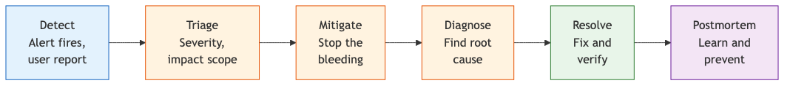
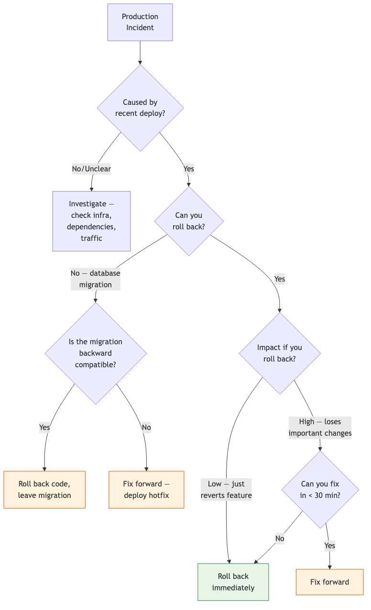
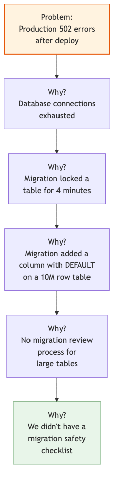

# 22 — Incident Response

Handling production incidents with Claude — triage, live diagnosis, rollback decisions, and blameless postmortems.

---

## What You'll Learn

- The incident response lifecycle from detection to postmortem
- Triage under pressure — severity classification and first actions
- Live diagnosis with Claude — reading logs, correlating events
- Rollback decisions — when to roll back vs fix forward
- Communication during incidents — status updates and escalation
- Blameless postmortems — 5 Whys and action items that stick
- Building runbooks and automating diagnostics for on-call

**Prerequisites**: [11 — Local Environment Setup](11-local-environment-setup.md) (you should understand the runtime environment) and [12 — Debugging & Troubleshooting](12-debugging-and-troubleshooting.md) (you should understand systematic debugging)

---

## The Incident Response Lifecycle



The key principle: **mitigate first, diagnose second**. Stop the bleeding before you search for the cause.

---

## Triage Under Pressure

### Severity Classification

| Severity | Definition | Examples | Response Time |
|----------|-----------|----------|---------------|
| **SEV1** | Complete outage or data loss | Site down, payment processing broken, data corruption | Immediate, all hands |
| **SEV2** | Major feature broken, significant user impact | Login broken for some users, search returning wrong results | < 30 minutes |
| **SEV3** | Minor feature broken, workaround exists | Export button broken (manual export works), slow page loads | < 4 hours |
| **SEV4** | Cosmetic or low-impact issue | Misaligned UI element, minor logging error | Next business day |

### The First 5 Minutes

```
INCIDENT: [describe what's happening]

Help me triage immediately:

1. What's the blast radius? (all users, some users,
   one customer, internal only)
2. Is data being corrupted or lost? (if yes, this is SEV1)
3. When did this start? (check deploy history, cron jobs,
   infra changes)
4. What changed recently? (last deploy, config change,
   dependency update, infrastructure change)
5. Is there an obvious mitigation? (rollback, feature
   flag, scale up, redirect)
```

### What NOT to Do During an Incident

| Don't | Why | Instead |
|-------|-----|---------|
| Deploy a fix without testing | May make it worse | Roll back to known good, then fix calmly |
| Debug in production without a plan | Wastes time, may cause more damage | Follow your runbook, check logs systematically |
| Change multiple things at once | Can't tell what worked | One change at a time, verify each |
| Skip communication | Stakeholders escalate, duplicated effort | Post status updates every 15-30 minutes |
| Blame someone | Shuts down information sharing | Focus on what happened, not who did it |
| Investigate the root cause before mitigating | Users are still affected | Stop the bleeding first |

---

## Live Diagnosis with Claude

### Reading Production Logs

```
Here are the production logs around the time of the
incident (last 30 minutes):

[paste relevant logs]

Help me find:
1. The first error — when did things start going wrong?
2. Error patterns — is it one error repeated or multiple
   different errors?
3. Correlation — do errors cluster around specific
   requests, users, or services?
4. Escalation — are errors increasing, steady, or
   decreasing?
5. Upstream/downstream — are errors caused by our code
   or a dependency?
```

### Correlating Events

```
We have a production issue that started at [time]. Help me
correlate with these event sources:

1. Deploy history — what was deployed around that time?
2. Infrastructure changes — any scaling events, config
   changes?
3. External dependencies — are any third-party services
   having issues?
4. Database — any long-running queries, locks, migrations?
5. Traffic patterns — any unusual traffic spike?
6. Cron jobs — any scheduled jobs running at that time?

What's the most likely cause based on timing?
```

### Dashboard Interpretation

```
I'm looking at our monitoring dashboard during an incident.
Here's what I see:

- Error rate: [describe trend]
- Response time: [describe trend]
- CPU/Memory: [describe trend]
- Database connections: [describe trend]
- Request rate: [describe trend]

What story do these metrics tell? What should I
investigate first?
```

---

## Rollback Decisions

### Decision Tree



### Rollback vs Fix Forward

| Factor | Favors Rollback | Favors Fix Forward |
|--------|----------------|-------------------|
| Confidence in root cause | Unknown or unclear | Known and simple |
| Time to fix | > 30 minutes | < 15 minutes |
| Database migrations | None or backward-compatible | Irreversible migrations ran |
| Blast radius | Wide (all users affected) | Narrow (one feature, few users) |
| Rollback tested? | Yes, known good state | No, untested rollback path |

### Safe Rollback Procedures

```
Help me plan a safe rollback:

1. What version are we rolling back to? [commit/tag]
2. Have any database migrations run since that version?
   If yes:
   - Are they backward-compatible?
   - Do we need to run down migrations?
   - Is there data that was written in new format?
3. Are there any configuration changes to revert?
4. What's the deployment mechanism? (can we do blue/green
   switch or need full redeploy?)
5. How do we verify the rollback worked?
6. Who needs to be notified?
```

---

## Communication During Incidents

### Status Update Template

```
INCIDENT UPDATE — [timestamp]
Status: [Investigating | Identified | Mitigating | Resolved]
Severity: [SEV1-4]
Impact: [what users are experiencing]
Duration: [how long so far]
Next update: [when]

What we know:
- [fact 1]
- [fact 2]

Current action:
- [what we're doing right now]
```

### Escalation Paths

```
Help me determine if I need to escalate this incident:

Current situation: [describe]
Current severity: [SEV level]
People involved: [who's working on it]

Escalate if:
- SEV1 and no progress in 15 minutes
- SEV2 and no progress in 30 minutes
- Need access or permissions I don't have
- Involves data loss or security breach
- Crosses team boundaries (need another team's help)
- Customer-facing with SLA implications
```

---

## Postmortems

### Blameless Analysis

The goal of a postmortem is to prevent recurrence, not assign blame. **Focus on systems, not people.**

```
Help me write a blameless postmortem for this incident:

Incident: [brief description]
Duration: [start time to resolution]
Impact: [users affected, revenue impact, SLA breach]
Root cause: [what caused it]
Resolution: [what fixed it]

Structure:
1. Timeline — minute-by-minute of key events
2. Root cause analysis — 5 Whys
3. What went well (yes, always include this)
4. What went poorly
5. Action items with owners and due dates
6. Lessons learned
```

### The 5 Whys



The 5th Why usually points to a **process or system improvement**, not a person's mistake.

### Action Items That Stick

Bad action items: "Be more careful." "Review things better." "Don't do that again."

Good action items are **specific, measurable, and assignable**:

| Bad | Good |
|-----|------|
| "Be more careful with migrations" | "Add migration linter to CI that flags `ALTER TABLE` on tables > 1M rows — owner: @alice, due: March 15" |
| "Improve monitoring" | "Add alert for database connection pool > 80% utilization — owner: @bob, due: March 10" |
| "Review deploys more carefully" | "Add deploy checklist to PR template with migration safety section — owner: @carol, due: March 12" |
| "Test more" | "Add load test that runs migration against 1M-row test table in staging — owner: @dave, due: March 20" |

---

## On-Call with Claude

### Building Runbooks

```
Help me build a runbook for [service/alert]. Include:

1. Alert description — what triggers this alert?
2. Impact — what users experience when this fires
3. First response — immediate diagnostic steps
4. Common causes and their fixes:
   - Cause A → Fix A
   - Cause B → Fix B
   - Cause C → Fix C
5. Escalation — when and who to escalate to
6. Prevention — what would stop this from happening

Format it so an on-call engineer at 3 AM can follow it
without thinking too hard.
```

### Automating Diagnostics

```
When [alert] fires, I always run the same diagnostic
commands. Help me create a script that:

1. Checks [service] health endpoint
2. Tails the last 100 error logs
3. Checks database connection count
4. Checks memory and CPU usage
5. Checks recent deploy history
6. Formats everything into a summary I can paste into
   the incident channel

Output should be copy-paste ready, not requiring
interpretation at 3 AM.
```

---

## Sample Conversation

> **You**: We're getting 502 errors in production. Deploy went out 15 minutes ago and looked clean — all checks passed. About 30% of requests are failing. Help me triage.
>
> **Claude**: This is likely SEV1 — 30% request failure is major user impact. Let me help you triage:
>
> **Immediate questions:**
> 1. Is this all endpoints or specific ones?
> 2. Is the error rate increasing, stable, or decreasing?
> 3. What was in the deploy? (specifically any database migrations)
>
> While you check those, let me look at what changed in the deploy...
>
> *reads the recent commits and migration files*
>
> **Found a likely cause**: The deploy includes a migration that adds a `status` column to the `orders` table with `DEFAULT 'pending' NOT NULL`. Let me check the table size...
>
> The `orders` table has 8.2 million rows. This migration:
> - Acquires an `ACCESS EXCLUSIVE` lock on the `orders` table
> - Rewrites every row to add the default value (in PostgreSQL < 11, or if using a volatile default)
> - While locked, **all queries touching `orders` block**
> - Blocked queries pile up, exhaust the connection pool
> - New requests get 502 because no database connections available
>
> **Immediate mitigation:**
> 1. The migration may still be running — check with `SELECT * FROM pg_stat_activity WHERE state = 'active' AND query LIKE '%ALTER%'`
> 2. If it's still running, **don't kill it** — that would trigger a full rollback of the ALTER, taking equally long
> 3. If it's done, the 502s should clear as the connection pool recovers
> 4. If connections are still exhausted, restart the application instances to reset pools
>
> **Verify**: Check if the error rate is dropping. If the migration finished, the connection pool should be recovering.
>
> **You**: The migration finished 2 minutes ago. Error rate is dropping — down to 5% now.
>
> **Claude**: Good — the connection pool is recovering. Once it's at 0%, let's add this to the postmortem action items:
>
> 1. **CI migration linter** — flag `ALTER TABLE ... DEFAULT` on tables over 100K rows
> 2. **Safe migration pattern** — add column nullable → backfill in batches → set NOT NULL
> 3. **Staging test with production-size data** — this would have caught the lock duration

---

## Key Takeaways

1. Mitigate first, diagnose second — stop the bleeding before you search for the cause
2. Classify severity immediately — it determines response speed and who to involve
3. Check the deploy history first — most incidents correlate with recent changes
4. Rollback when in doubt — a working old version beats a broken new version
5. Communicate regularly — post status updates even when there's no new information
6. Write blameless postmortems — focus on systems and processes, not individuals
7. Turn every incident into a specific, actionable improvement — "be more careful" is not an action item

---

**Next**: [23 — Technical Debt Management](23-technical-debt-management.md) — Systematically identifying, measuring, and paying down technical debt.
