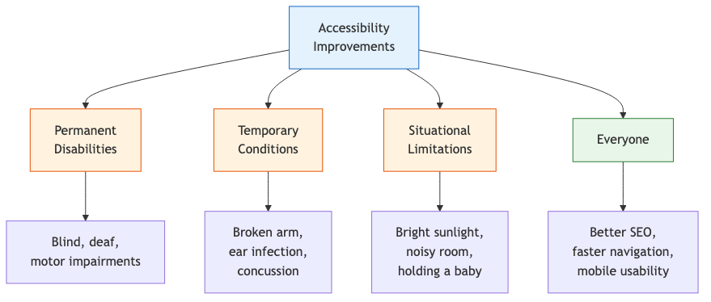
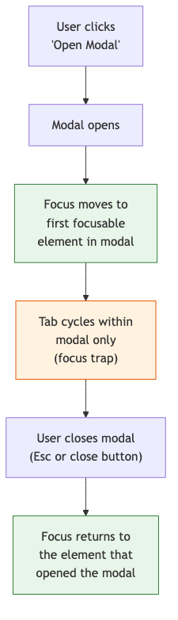

# 24 — Accessibility Auditing

Auditing and improving accessibility with Claude — WCAG compliance, semantic HTML, keyboard navigation, screen readers, and color contrast.

---

## What You'll Learn

- The accessibility mindset — why a11y is a quality requirement
- WCAG compliance levels and running an audit
- Semantic HTML — landmarks, heading hierarchy, and ARIA
- Keyboard navigation — tab order, focus management, keyboard traps
- Screen reader compatibility — testing and common issues
- Color contrast and visual design for all users
- Form accessibility — labels, errors, and autocomplete
- Automated testing with axe-core, pa11y, and Lighthouse

**Prerequisites**: [03 — Codebase Orientation](03-codebase-orientation.md) (you should be able to navigate the codebase) and [06 — Task Execution](06-task-execution.md) (you should understand how to plan and execute changes)

---

## The Accessibility Mindset

Accessibility isn't a feature — it's a quality requirement, like performance or security. It affects more people than you think.

### Who Benefits



Every accessibility improvement helps multiple groups. Keyboard navigation helps power users, motor-impaired users, and anyone with a broken trackpad. Good contrast helps low-vision users, anyone in bright sunlight, and aging eyes.

---

## WCAG Compliance Audit

### WCAG Levels

| Level | Meaning | Target For |
|-------|---------|-----------|
| **A** | Minimum — removes the biggest barriers | All websites (legal minimum in many jurisdictions) |
| **AA** | Standard — addresses major barriers | Most organizations target this |
| **AAA** | Maximum — highest accessibility | Specific contexts (government, education) |

### The POUR Checklist

WCAG organizes requirements around four principles:

```
Run an accessibility audit on [page/component] using
the POUR framework:

**Perceivable** — Can all users perceive the content?
- [ ] All images have meaningful alt text (or alt="" for decorative)
- [ ] Videos have captions and transcripts
- [ ] Color is not the only way to convey information
- [ ] Text meets minimum contrast ratios (4.5:1 for normal text, 3:1 for large)
- [ ] Content is readable at 200% zoom

**Operable** — Can all users operate the interface?
- [ ] All functionality is accessible via keyboard
- [ ] No keyboard traps (can always Tab out)
- [ ] Focus indicators are visible
- [ ] Timing is adjustable (no auto-advancing content without controls)
- [ ] No content that flashes more than 3 times per second

**Understandable** — Can all users understand the content?
- [ ] Language is set on the page (<html lang="en">)
- [ ] Form inputs have visible labels
- [ ] Error messages are clear and suggest how to fix
- [ ] Navigation is consistent across pages
- [ ] Behavior is predictable (no unexpected context changes)

**Robust** — Does the content work with assistive technology?
- [ ] HTML is valid and well-structured
- [ ] ARIA roles and properties are used correctly
- [ ] Custom components expose correct roles and states
- [ ] Content works across different screen readers
```

### Running an Audit

```
Audit our [page/component/application] for accessibility:

1. Check the HTML structure:
   - Is there a logical heading hierarchy (h1 → h2 → h3)?
   - Are landmark regions used (nav, main, aside, footer)?
   - Are lists used for list content?
   - Are tables used for tabular data (not layout)?

2. Check interactive elements:
   - Can every interactive element be reached by Tab?
   - Can every interactive element be activated by keyboard?
   - Do custom components have the right ARIA roles?
   - Are focus states visible?

3. Check content:
   - Do images have alt text?
   - Is color supplemented with another indicator?
   - Does text meet contrast requirements?
   - Are error messages associated with their inputs?

Organize findings by severity:
- Critical: Users cannot complete a task
- Major: Users can complete the task but with difficulty
- Minor: Inconvenient but doesn't block task completion
```

---

## Semantic HTML

### Landmarks

Landmarks let screen reader users jump to major page sections:

```html
<!-- Good: semantic landmarks -->
<header>
  <nav aria-label="Main navigation">...</nav>
</header>
<main>
  <article>...</article>
  <aside aria-label="Related content">...</aside>
</main>
<footer>...</footer>

<!-- Bad: div soup -->
<div class="header">
  <div class="nav">...</div>
</div>
<div class="content">
  <div class="article">...</div>
  <div class="sidebar">...</div>
</div>
<div class="footer">...</div>
```

```
Scan our HTML templates/components for semantic issues:

1. Are we using <div> or <span> where a semantic element
   exists? (nav, main, article, section, aside, header,
   footer, button, a)
2. Is there exactly one <main> per page?
3. Do navigation regions have aria-label if there's
   more than one?
4. Are <section> elements used with headings?
```

### Heading Hierarchy

```
Check our heading hierarchy:

- Is there exactly one <h1> per page?
- Do headings follow a logical order?
  (h1 → h2 → h3, never h1 → h3 skipping h2)
- Are headings used for structure, not styling?
  (don't use <h3> just because you want smaller text)
- Does the heading outline make sense when read alone?
  (a screen reader user navigating by headings should
  understand the page structure)
```

### ARIA Best Practices

The first rule of ARIA: **don't use ARIA if a native HTML element does the job**.

```
Review our ARIA usage:

1. Is ARIA used only where native HTML can't do the job?
   - Bad: <div role="button"> (use <button>)
   - Bad: <div role="link"> (use <a>)
   - OK: <div role="tabpanel"> (no native equivalent)

2. Are ARIA roles complete?
   - role="tab" needs aria-selected
   - role="checkbox" needs aria-checked
   - role="dialog" needs aria-label or aria-labelledby

3. Are aria-live regions used for dynamic content?
   - Search results: aria-live="polite"
   - Error messages: aria-live="assertive"
   - Loading indicators: aria-busy="true"

4. Are IDs unique? (aria-labelledby and aria-describedby
   reference IDs — duplicates break the association)
```

---

## Keyboard Navigation

### Tab Order

```
Test the keyboard tab order on [page]:

1. Press Tab repeatedly from the top of the page
2. Does focus move in a logical reading order?
3. Are all interactive elements reachable?
4. Are non-interactive elements excluded from tab order?
5. Are skip links provided? ("Skip to main content")
6. Does tabindex usage follow the rules?
   - tabindex="0": element in natural tab order (OK)
   - tabindex="-1": focusable by script only (OK)
   - tabindex="1+": overrides natural order (almost always wrong)
```

### Focus Management

Focus management is critical for modals, drawers, and dynamic content:



```
Review our modal/dialog components for focus management:

1. When the modal opens:
   - Does focus move into the modal?
   - Is focus on the first interactive element?
   - Is there an aria-label or aria-labelledby?

2. While the modal is open:
   - Is focus trapped inside? (Tab can't leave the modal)
   - Does Escape close the modal?
   - Is the background content inert? (aria-hidden="true"
     on the rest of the page, or use <dialog> element)

3. When the modal closes:
   - Does focus return to the element that opened it?
   - Is the return smooth (no brief flash of focus elsewhere)?
```

### Keyboard Traps

A keyboard trap is when a user can Tab into something but can't Tab out. This is a critical accessibility failure.

```
Test for keyboard traps:

1. Tab through every interactive element on the page
2. Can you always Tab forward and Shift+Tab backward?
3. Check embedded content (iframes, third-party widgets)
4. Check custom dropdowns, date pickers, and rich editors
5. Verify modal focus traps are intentional and have
   an Escape exit
```

---

## Screen Reader Compatibility

### Testing with Screen Readers

| Screen Reader | Platform | Cost |
|--------------|----------|------|
| **VoiceOver** | macOS, iOS | Free (built-in) |
| **NVDA** | Windows | Free (open source) |
| **JAWS** | Windows | Commercial |
| **TalkBack** | Android | Free (built-in) |

```
Help me test [component] for screen reader compatibility:

1. What does a screen reader announce when focus reaches
   this element?
   - Is the role announced? (button, link, checkbox, etc.)
   - Is the label read? (visible text, aria-label, alt)
   - Is the state read? (expanded, selected, checked, disabled)

2. For dynamic content:
   - Are live regions announcing changes?
   - Are loading states communicated?
   - Are error messages announced?

3. For custom components:
   - Is the component type announced correctly?
   - Can the user understand how to interact with it?
   - Are keyboard shortcuts documented?
```

### Common Screen Reader Issues

| Issue | Impact | Fix |
|-------|--------|-----|
| Missing alt text on images | Content is invisible | Add descriptive alt text (or `alt=""` for decorative) |
| Icon-only buttons | "Button" with no label | Add `aria-label="Close"` or visually hidden text |
| Unlabeled form inputs | "Edit text" with no context | Associate with `<label for="...">` or `aria-label` |
| Custom controls without roles | Read as generic element | Add appropriate `role` and ARIA attributes |
| Dynamic content not announced | Changes are invisible | Use `aria-live` regions |
| Link text like "click here" | No context when navigating by links | Use descriptive link text ("View order details") |

---

## Color Contrast and Visual Design

### Contrast Ratios

WCAG requires minimum contrast between text and background:

| Text Type | AA Minimum | AAA Minimum |
|-----------|-----------|-------------|
| Normal text (< 18px) | 4.5:1 | 7:1 |
| Large text (>= 18px or >= 14px bold) | 3:1 | 4.5:1 |
| UI components and graphics | 3:1 | — |

```
Audit our color palette for contrast compliance:

1. Check text colors against their backgrounds
2. Check button text against button backgrounds
3. Check placeholder text (must meet 4.5:1 too)
4. Check link colors — are they distinguishable from
   surrounding text without relying on color alone?
5. Check focus indicators — do they meet 3:1 contrast?
6. Check disabled states — are they distinguishable?

For each failure, suggest an accessible alternative
that stays close to the original design intent.
```

### Color-Blind Safe Design

```
Review our UI for color-blind accessibility:

1. Do we rely on color alone to convey meaning?
   - Red/green for success/error (add icons or text)
   - Color-coded status without labels
   - Charts with color-only legends

2. Are error states indicated by more than just red?
   - Add an error icon
   - Add error text
   - Add a border or shape change

3. Would the UI work in grayscale?
   (quick test: take a screenshot, desaturate it,
   check if everything is still understandable)
```

---

## Form Accessibility

### Labels and Associations

```
Audit our forms for accessibility:

1. Does every input have a visible label?
   (placeholder text alone is NOT a label — it disappears)
2. Are labels programmatically associated?
   - <label for="email">Email</label>
   - <input id="email" type="email">
3. Are required fields marked?
   - Visually (asterisk)
   - Programmatically (aria-required="true" or required)
4. Are field descriptions associated?
   - aria-describedby="email-hint"
   - <span id="email-hint">We'll never share your email</span>
```

### Error Messages

```
Review our form validation for accessibility:

1. Are errors displayed near the field they relate to?
2. Are error messages associated with the field?
   (aria-describedby or aria-errormessage)
3. Is aria-invalid="true" set on errored fields?
4. Are errors announced by screen readers?
   (aria-live="assertive" on error container)
5. Is there an error summary at the top of the form
   for multi-field validation?
6. Do errors explain HOW to fix the issue?
   (not just "Invalid input" but "Email must include @")
```

### Autocomplete

```
Check our forms for autocomplete attributes:

Common autocomplete values:
- name, given-name, family-name
- email, tel
- street-address, city, postal-code, country
- cc-number, cc-exp, cc-csc (credit card)
- username, current-password, new-password

Benefits:
- Browsers and password managers can autofill correctly
- Assistive technology can identify field purpose
- Mobile keyboards can adapt (email keyboard, phone keyboard)
```

---

## Automated Testing

### CI Integration

```
Help me add accessibility testing to our CI pipeline:

Options:
1. axe-core — most popular, integrates with test runners
2. pa11y — CLI tool, good for page-level audits
3. Lighthouse CI — broader performance + a11y checks

For each:
- How to install and configure
- How to integrate with our test framework
- What it catches vs what it misses
- How to handle false positives
```

### Component-Level Testing

```javascript
// Example: Testing with jest-axe
import { render } from '@testing-library/react';
import { axe, toHaveNoViolations } from 'jest-axe';
expect.extend(toHaveNoViolations);

test('LoginForm has no accessibility violations', async () => {
  const { container } = render(<LoginForm />);
  const results = await axe(container);
  expect(results).toHaveNoViolations();
});
```

```
Add accessibility tests to our component test suite:

1. Which components should we test first?
   (forms, navigation, modals, interactive widgets)
2. For each component:
   - Add an axe-core test (catches ~30-40% of issues)
   - Add keyboard navigation tests
   - Add screen reader label assertions
3. What rules should we configure?
   (start with WCAG AA, exclude known issues with tickets)
```

### What Automation Catches vs Misses

| Automated Tools Catch | Still Requires Manual Testing |
|----------------------|------------------------------|
| Missing alt text | Quality of alt text |
| Contrast ratio failures | Color-only meaning |
| Missing form labels | Label clarity and helpfulness |
| Invalid ARIA attributes | Correct ARIA usage in context |
| Missing landmark regions | Logical page structure |
| Heading hierarchy issues | Heading text quality |
| **~30-40% of WCAG criteria** | **~60-70% require human judgment** |

Automated tests are a safety net, not a complete solution. Schedule regular manual audits with real assistive technology.

---

## Sample Conversation

> **You**: Our custom dropdown component isn't keyboard accessible. Users have to click to open it and click to select an option. Fix the keyboard navigation.
>
> **Claude**: Let me read the current dropdown component...
>
> *reads the component code, styles, and current behavior*
>
> The current dropdown uses `onClick` handlers on `<div>` elements. Here's what needs to change to make it fully keyboard accessible:
>
> **1. Trigger button:**
> - Change from `<div onClick>` to `<button>` (free keyboard support)
> - Add `aria-haspopup="listbox"` and `aria-expanded="true/false"`
> - Pressing Enter/Space opens the dropdown
>
> **2. Option list:**
> - Add `role="listbox"` to the container
> - Add `role="option"` and `aria-selected` to each option
> - Arrow Up/Down moves focus between options
> - Enter selects the focused option
> - Escape closes the dropdown and returns focus to trigger
> - Home/End jump to first/last option
> - Type-ahead: typing a letter jumps to matching option
>
> **3. Focus management:**
> - When opened: focus the currently selected option (or first option)
> - When closed: return focus to the trigger button
> - Focus trap: Tab from last option wraps to first (within the listbox)
>
> **4. Screen reader announcements:**
> - Trigger reads: "Category, dropdown, collapsed" (or "expanded")
> - Options read: "Electronics, option, 2 of 5, selected"
>
> Want me to implement this? I'll follow the WAI-ARIA Listbox pattern.
>
> **You**: Yes, implement it.
>
> **Claude**: *refactors the dropdown component with proper semantic elements, ARIA attributes, keyboard event handlers, and focus management — adds accessibility tests with jest-axe and keyboard navigation tests*

---

## Key Takeaways

1. Accessibility benefits everyone — not just users with disabilities, but power users, mobile users, and search engines
2. Start with semantic HTML — most ARIA is unnecessary if you use the right elements
3. Keyboard navigation is non-negotiable — every interactive element must be keyboard accessible
4. Color alone must never convey meaning — always pair color with text, icons, or patterns
5. Test with real screen readers — automated tools catch only 30-40% of issues
6. Add axe-core to CI — catch regressions early, even if manual audits are needed for completeness
7. Associate labels and errors programmatically — visual proximity alone isn't enough for assistive technology

---

**Next**: [25 — MCP Servers](25-mcp-servers.md) — Connect Claude to databases, APIs, and external tools with the Model Context Protocol.
