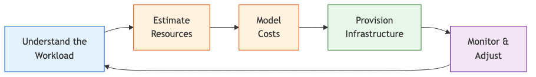
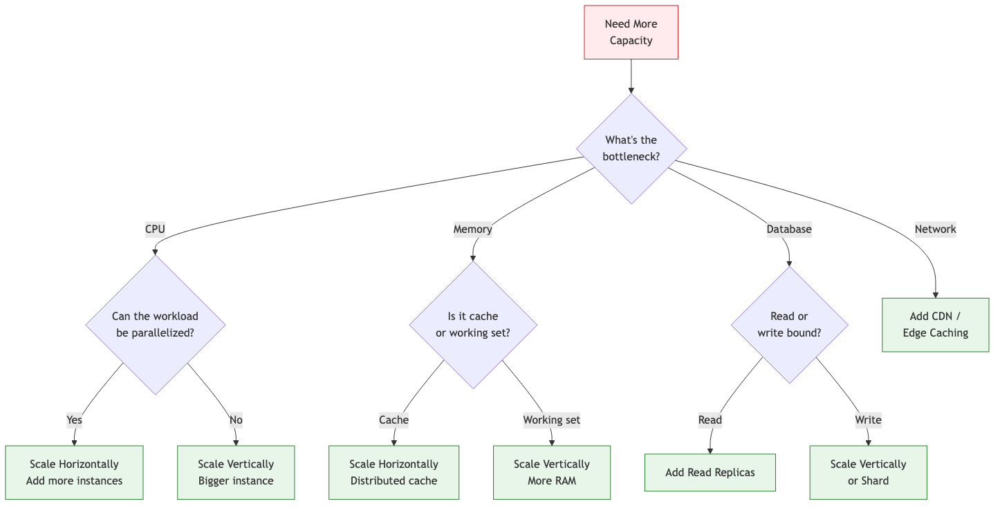

# 29 — Cloud Resource Estimation

Reliably estimate compute, storage, and network requirements — from napkin math to production-grade capacity planning.

---

## What You'll Learn

- The estimation framework: traffic, compute, storage, network, cost
- Back-of-the-envelope math that actually works
- How to use Claude to model resource requirements from your codebase
- Right-sizing instances, databases, and caches
- Scaling math: when to scale vertically vs horizontally
- Cost modeling and forecasting
- Common estimation mistakes and how to avoid them

**Prerequisites**: [04 — Architecture & Dependencies](04-architecture-and-dependencies.md), [21 — Performance Optimization](21-performance-optimization.md)

---

## Why Estimation Matters

Over-provision and you waste money. Under-provision and your system falls over. The goal isn't perfect prediction — it's getting close enough to make informed decisions, then adjusting based on reality.



---

## Step 1: Characterize the Workload

Before estimating resources, you need to understand what the system actually does. Ask Claude to analyze your codebase:

```
Analyze this application's workload characteristics:
1. What are the main request types? (API calls, background jobs, websockets)
2. What's compute-heavy vs I/O-heavy?
3. What are the storage patterns? (write-heavy, read-heavy, append-only)
4. What external services does it depend on?
5. Are there batch/scheduled workloads?
```

### Workload Categories

| Category | Characteristics | Key Resource |
|----------|----------------|--------------|
| **API-heavy** | Many short-lived HTTP requests | CPU, network |
| **Data-processing** | ETL, batch jobs, report generation | CPU, memory, disk I/O |
| **Real-time** | WebSockets, streaming, live updates | Memory, network, connections |
| **Storage-heavy** | File uploads, media processing, logs | Disk, network bandwidth |
| **ML/AI** | Inference, embeddings, model serving | GPU, memory, CPU |

### Gather the Numbers

You need baseline numbers to estimate from. Ask Claude to help extract them from your codebase and infrastructure:

```
Help me gather these baseline metrics for capacity planning:

From the codebase:
- Average payload sizes for our main API endpoints
- Database query patterns (reads vs writes ratio)
- Cache hit/miss patterns if we have caching
- Background job frequency and duration

From our monitoring (if we have access):
- Current requests per second (peak and average)
- Current CPU and memory utilization
- Database connection counts and query times
- Storage growth rate
```

---

## Step 2: Back-of-the-Envelope Math

Good estimates start with simple arithmetic. Master these building blocks:

### The Core Numbers to Know

| Metric | Typical Value | Notes |
|--------|--------------|-------|
| 1 day | 86,400 seconds | ~100K for easy math |
| 1 month | 2.6 million seconds | ~2.5M for easy math |
| 1 vCPU | ~1000 simple req/sec | Highly variable — profile yours |
| 1 GB RAM | ~250K small objects | Depends on object size |
| SSD read | ~500 MB/sec | Sequential; random is much less |
| Network (same region) | ~5 Gbps | Between services |
| PostgreSQL | ~5K-10K simple queries/sec | Single instance, depends on query |
| Redis | ~100K operations/sec | Single instance, simple operations |

### Traffic Estimation

```
Help me estimate the traffic for our application:

We expect:
- 50,000 daily active users
- Each user makes ~20 API requests per session
- Average session length: 15 minutes
- 2 peak hours where traffic is 3x average

Calculate:
1. Average requests per second
2. Peak requests per second
3. Required throughput for 2x safety margin
```

#### The Math Pattern

```
Daily requests = DAU x requests_per_session
                = 50,000 x 20 = 1,000,000/day

Average RPS = 1,000,000 / 86,400 ≈ 12 req/sec

Peak RPS = average x peak_multiplier
         = 12 x 3 = 36 req/sec

With 2x safety margin = 72 req/sec target capacity
```

### Compute Estimation

```
Based on our traffic estimate of 72 req/sec (with safety margin):

Analyze our API endpoints and estimate:
1. Average CPU time per request (profile if possible)
2. How many vCPUs we need at peak
3. Recommended instance type and count
4. Whether we should use auto-scaling or fixed capacity
```

#### The Math Pattern

```
If each request uses ~50ms of CPU time:

CPU-seconds per second = 72 req/sec x 0.05 sec = 3.6 CPU-seconds/sec

Minimum vCPUs needed = 3.6 (round up to 4)

With headroom (target 60% CPU utilization):
vCPUs needed = 4 / 0.6 ≈ 7 vCPUs

That's 2x 4-vCPU instances, or 4x 2-vCPU instances
```

### Memory Estimation

```
Help me estimate memory requirements:

For each running instance, account for:
1. Base application footprint (framework, loaded modules)
2. Per-request memory (request context, response building)
3. Connection pools (database, Redis, external APIs)
4. In-memory caches (if any)
5. Buffers and overhead
```

#### The Math Pattern

```
Base application: 200 MB (Node.js/Express typical)
DB connection pool (20 connections): 40 MB
Redis connection pool: 10 MB
Per-request overhead (100 concurrent): 100 x 2 MB = 200 MB
OS and overhead: 200 MB

Total per instance ≈ 650 MB → provision 1 GB minimum
With safety margin → 2 GB per instance
```

### Storage Estimation

```
Analyze our data model and estimate storage needs:

1. Average row size for each table (schema analysis)
2. Current row count and growth rate
3. Index overhead (typically 20-40% of data size)
4. WAL/transaction log space
5. File/blob storage if applicable
6. Log storage and retention

Project storage needs for 1 year and 3 years.
```

#### The Math Pattern

```
Users table: 500 bytes/row x 100K users = 50 MB
Orders table: 2 KB/row x 1M orders/year = 2 GB/year
Order items: 500 bytes/row x 3M items/year = 1.5 GB/year
Logs: 500 bytes/line x 10M lines/day x 30 days = 150 GB

Indexes (30% overhead): +1 GB
WAL space: +5 GB

Year 1 total: ~160 GB
Year 3 total: ~450 GB (assuming linear growth)
```

---

## Step 3: Database Sizing

Databases are usually the hardest resource to scale. Get this right early.

### Connection Math

```
Analyze our database connection patterns:

1. How many application instances connect to the database?
2. What's the connection pool size per instance?
3. Are there background workers that also connect?
4. What's the maximum concurrent queries?

Calculate:
- Total connections needed
- Whether we need a connection pooler (PgBouncer, RDS Proxy)
- Recommended max_connections setting
```

```
Total connections = (app_instances x pool_size) + (workers x pool_size) + admin_reserve

Example:
4 app instances x 20 pool = 80
2 workers x 10 pool = 20
Admin reserve = 10
Total = 110 connections

PostgreSQL default max_connections = 100 → need to increase or add a pooler
```

### Query Performance Estimation

```
Analyze our most frequent database queries (from the codebase):

For each query:
1. How often is it called? (estimate from API traffic)
2. Does it hit an index or do a table scan?
3. How much data does it return?
4. Can it be cached?

Flag any queries that will become problems as data grows.
```

### Database Instance Sizing

| Workload | AWS RDS | GCP Cloud SQL | Key Metric |
|----------|---------|---------------|------------|
| Small (< 100 QPS) | db.t3.medium | db-custom-2-4096 | 2 vCPU, 4 GB |
| Medium (100-1K QPS) | db.r6g.large | db-custom-4-16384 | 4 vCPU, 16 GB |
| Large (1K-5K QPS) | db.r6g.xlarge | db-custom-8-32768 | 8 vCPU, 32 GB |
| Very large (5K+ QPS) | db.r6g.2xlarge+ | db-custom-16+ | Consider read replicas |

### Read Replicas Decision

```
Should we use read replicas?

Analyze our read/write ratio:
- If > 80% reads: yes, read replicas will help significantly
- If 50-80% reads: maybe, depends on query complexity
- If < 50% reads: probably not, focus on write optimization

Check our codebase for queries that could be routed to replicas
(anything that doesn't need real-time consistency).
```

---

## Step 4: Cache Sizing

### Redis/Memcached Estimation

```
Analyze our caching strategy:

1. What data do we cache? (sessions, query results, computed values)
2. Average size of cached items?
3. How many unique items in the cache at peak?
4. TTL for each cache type?
5. Hit rate targets?

Calculate the memory needed for our cache layer.
```

#### The Math Pattern

```
Sessions: 2 KB x 10,000 active = 20 MB
API response cache: 5 KB x 50,000 entries = 250 MB
User profile cache: 1 KB x 100,000 users = 100 MB
Redis overhead (fragmentation, metadata): +30%

Total: (20 + 250 + 100) x 1.3 ≈ 480 MB → provision 1 GB
```

---

## Step 5: Network and Bandwidth

### Bandwidth Estimation

```
Estimate our bandwidth requirements:

1. Average response size for each endpoint type
2. Requests per second at peak
3. File upload/download traffic
4. Inter-service communication (if microservices)
5. Database traffic
6. CDN offload percentage

Calculate monthly data transfer for cost estimation.
```

#### The Math Pattern

```
API responses: 5 KB avg x 72 req/sec = 360 KB/sec = 31 GB/day
Static assets (CDN miss): 50 KB avg x 10 req/sec = 500 KB/sec = 43 GB/day
File uploads: 2 MB avg x 100/day = 200 MB/day
Database traffic: ~10% of API = 3 GB/day

Daily total: ~77 GB
Monthly total: ~2.3 TB

With CDN handling 90% of static: monthly drops to ~1 TB
```

---

## Step 6: Cost Modeling

### Using Claude for Cost Estimation

```
Based on our resource estimates, model the monthly AWS cost:

Compute:
- 4x t3.large instances (2 vCPU, 8 GB) for the API
- 2x t3.medium instances for background workers

Database:
- 1x RDS PostgreSQL db.r6g.large (4 vCPU, 32 GB, 500 GB storage)
- 1x read replica (same size)

Cache:
- 1x ElastiCache Redis cache.r6g.large (2 vCPU, 13 GB)

Storage:
- 500 GB S3 for file uploads
- 100 GB CloudWatch logs

Network:
- 1 TB data transfer out
- Application Load Balancer

Include reserved instance pricing vs on-demand for 1-year commit.
```

### Cost Optimization Strategies

```
Review our infrastructure estimate and suggest cost optimizations:

1. Are any resources over-provisioned?
2. Should we use reserved instances or savings plans?
3. Can we use spot instances for any workloads?
4. Are there cheaper alternatives (Graviton, burstable, etc.)?
5. What can we offload to managed services vs self-hosted?
6. Storage tier optimization (S3 lifecycle policies)?
```

### Cost Comparison Template

| Resource | On-Demand/mo | Reserved 1yr/mo | Savings |
|----------|-------------|-----------------|---------|
| Compute (4x t3.large) | $240 | $152 | 37% |
| Database (primary + replica) | $580 | $370 | 36% |
| Cache (r6g.large) | $210 | $135 | 36% |
| Storage + transfer | $75 | $75 | 0% |
| Load balancer | $25 | $25 | 0% |
| **Total** | **$1,130** | **$757** | **33%** |

---

## Step 7: Scaling Strategy

### Vertical vs Horizontal



### Auto-Scaling Configuration

```
Help me design an auto-scaling policy:

Current setup:
- 4 app instances (2 vCPU, 8 GB each)
- Average CPU: 35%, Peak CPU: 70%
- Average memory: 45%
- Traffic pattern: 3x spike during business hours

Recommend:
1. Min/max instance count
2. Scale-out trigger (CPU %, request count, custom metric)
3. Scale-in trigger and cooldown period
4. Target tracking vs step scaling
```

---

## Step 8: Load Testing to Validate

Estimates are hypotheses. Load testing validates them.

```
Help me set up a load test to validate our capacity estimates:

1. Generate a realistic traffic profile based on our API endpoints
2. Start at current traffic and ramp to 2x projected peak
3. Monitor: response times, error rates, CPU, memory, DB connections
4. Identify the breaking point

Use k6, Locust, or Artillery (whichever fits our stack).
```

### What to Watch During Load Tests

```
During the load test, help me monitor these metrics and flag
when any of them cross warning thresholds:

- Response time p50, p95, p99 (warn at 2x baseline)
- Error rate (warn at > 0.1%)
- CPU utilization (warn at > 70%)
- Memory utilization (warn at > 80%)
- Database connections (warn at > 80% of max)
- Database query time (warn at 2x baseline)
- Cache hit rate (warn if drops below 90%)
```

---

## The Estimation Document Template

Ask Claude to generate a complete estimation document:

```
Create a capacity planning document for our application using
this template:

## Application Overview
- What it does, tech stack, architecture pattern

## Traffic Model
- DAU, requests/session, peak multiplier
- Calculated RPS (average and peak)

## Resource Requirements
- Compute (instances, vCPUs, memory)
- Database (instance size, connections, storage)
- Cache (memory, instance type)
- Storage (object store, logs)
- Network (bandwidth, data transfer)

## Cost Model
- Monthly cost breakdown
- Reserved vs on-demand comparison
- Cost optimization opportunities

## Scaling Plan
- Triggers for scaling events
- Vertical vs horizontal strategy per component
- Maximum expected scale

## Assumptions and Risks
- What assumptions were made
- What could invalidate them
- Monitoring plan to validate
```

---

## Common Estimation Mistakes

### Forgetting About Peaks

Average traffic is misleading. Design for peaks:

```
Our average is 12 req/sec, but we see 3x spikes during
business hours and 10x spikes during flash sales.

Don't size for 12 req/sec — size for 120 req/sec
(or have auto-scaling that can reach it).
```

### Ignoring Connection Overhead

Applications use more connections than you think:

```
Each app instance might have:
- 20 database connections
- 10 Redis connections
- 5 connections to external APIs
- WebSocket connections (one per active user)

4 instances = 80 DB connections, 40 Redis connections
Scale to 10 instances = 200 DB connections (need a pooler)
```

### Linear Extrapolation

Not everything scales linearly:

```
If 1,000 users need 2 GB of RAM, 100,000 users
don't necessarily need 200 GB.

Some things scale sub-linearly (shared caches, connection reuse).
Some scale super-linearly (database joins, memory fragmentation).

Ask Claude to analyze which parts of your system scale
linearly and which don't.
```

### Not Accounting for Failure

In a distributed system, instances fail. Your capacity must handle it:

```
If you have 4 instances and one fails, can 3 handle
the full load? If not, you need N+1 redundancy.

For databases: if your primary fails and you failover
to a replica, can the replica handle both reads AND writes?
```

---

## Sample Conversation

> **You**: We're launching a new feature that we expect will 3x our traffic. Help me figure out if our infrastructure can handle it.
>
> **Claude**: Let me analyze the current setup and project the impact...
> *reads infrastructure config, deployment files, and application code*
>
> Here's your current state and the 3x projection:
>
> | Resource | Current Usage | At 3x Traffic | Capacity | Status |
> |----------|--------------|---------------|----------|--------|
> | API instances (4x t3.large) | 35% CPU | ~105% CPU | 8 vCPUs | Needs scaling |
> | Database (db.r6g.large) | 1,200 QPS | ~3,600 QPS | ~5,000 QPS | Tight but OK |
> | DB connections | 80/100 | ~240/100 | 100 max | Will fail |
> | Redis cache | 400 MB / 13 GB | ~1.2 GB / 13 GB | 13 GB | Fine |
> | Response time p95 | 120ms | ~300ms (estimated) | N/A | Degraded |
>
> Three critical issues:
> 1. **Compute**: Need 8-10 instances at 3x traffic (or larger instances)
> 2. **DB connections**: Will exceed max_connections — need PgBouncer or RDS Proxy
> 3. **Response time**: Likely to degrade — should add a read replica for heavy queries
>
> Want me to put together a scaling plan with cost estimates?

---

## Key Takeaways

1. Start with simple arithmetic — back-of-the-envelope math catches major sizing errors before they become production incidents
2. Size for peaks, not averages — apply a 2-3x multiplier on top of projected peak traffic
3. Database connections are the most common surprise — always calculate total connections across all instances
4. Validate estimates with load testing — estimates are hypotheses, not facts
5. Plan for failure — N+1 redundancy means losing an instance doesn't cause an outage
6. Re-estimate after major changes — a new feature that changes traffic patterns invalidates old estimates
7. Use reserved instances for stable base load, auto-scaling for peaks

---

**Next**: [30 — Cloud Architecture & Infrastructure](30-cloud-architecture-and-infrastructure.md) — Design and build reliable cloud systems with infrastructure as code.
