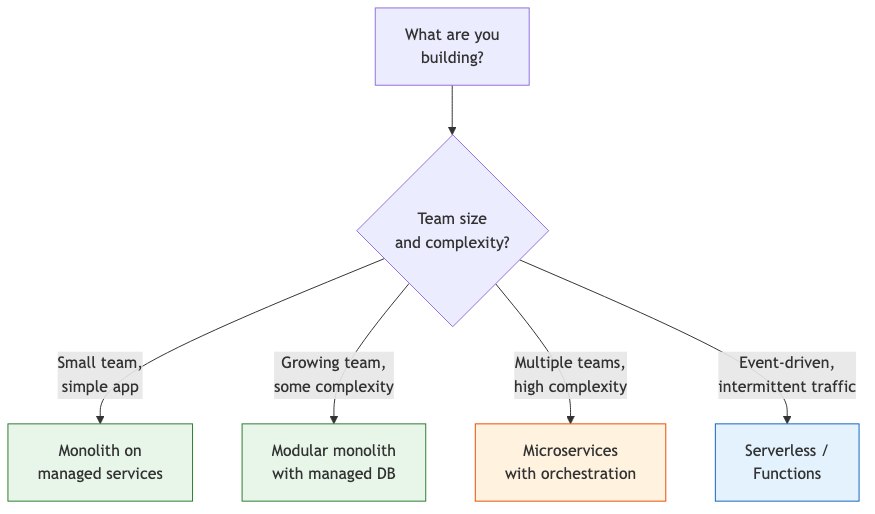
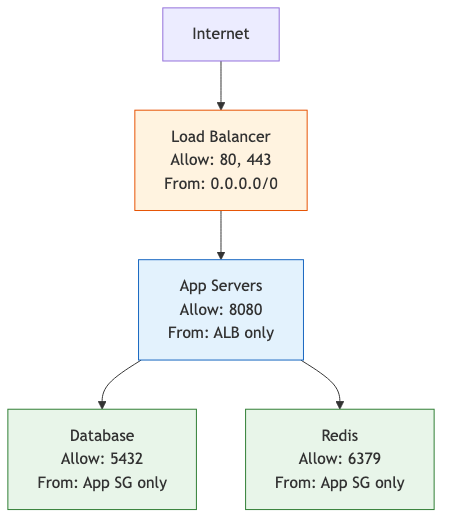
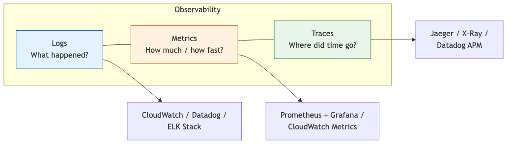

# 30 — Cloud Architecture & Infrastructure

Design, build, and maintain reliable cloud systems — from infrastructure as code to resilience patterns.

---

## What You'll Learn

- Core cloud architecture patterns and when to use each
- Infrastructure as code with Terraform, CloudFormation, and Pulumi
- Designing for reliability: redundancy, failover, and disaster recovery
- Networking fundamentals: VPCs, subnets, security groups, load balancers
- Containerization and orchestration (Docker, ECS, Kubernetes)
- Observability: logging, metrics, alerting
- Using Claude to analyze and improve your infrastructure
- Common architecture mistakes and how to avoid them

**Prerequisites**: [29 — Cloud Resource Estimation](29-cloud-resource-estimation.md), [20 — CI/CD & Automation](20-ci-cd-and-automation.md)

---

## Architecture Patterns

### Choosing the Right Pattern



### Pattern 1: Monolith on Managed Services

Best for most applications. Simpler than you think you need.

```
Analyze our application and recommend a cloud architecture.
We're a team of 5, building a B2B SaaS with ~1000 users.
Current stack: Node.js, PostgreSQL, Redis.

Should we go with a simple monolith deployment or something
more complex? Justify the recommendation.
```

Typical setup:

```
┌─────────────────────────────────────────────┐
│  Load Balancer (ALB / Cloud Load Balancing) │
└──────────────────┬──────────────────────────┘
                   │
        ┌──────────┴──────────┐
        │                     │
   ┌────┴────┐          ┌────┴────┐
   │ App     │          │ App     │
   │ Server  │          │ Server  │
   │ (ECS/   │          │ (ECS/   │
   │  GCR)   │          │  GCR)   │
   └────┬────┘          └────┬────┘
        │                     │
        └──────────┬──────────┘
                   │
     ┌─────────────┼─────────────┐
     │             │             │
┌────┴────┐  ┌────┴────┐  ┌────┴────┐
│ RDS /   │  │ Elasti- │  │ S3 /    │
│ Cloud   │  │ Cache / │  │ GCS     │
│ SQL     │  │ Memory- │  │         │
│         │  │ store   │  │         │
└─────────┘  └─────────┘  └─────────┘
```

### Pattern 2: Microservices

Only when you genuinely need independent deployment and scaling of components. Ask Claude to evaluate:

```
We're considering breaking our monolith into microservices.
Analyze our codebase and tell me:

1. Are there clear service boundaries?
2. Would any component benefit from independent scaling?
3. What's the operational overhead of microservices for our team size?
4. Is a modular monolith a better fit?

Be honest — don't recommend microservices just because they're trendy.
```

### Pattern 3: Serverless

Good for event-driven, intermittent, or bursty workloads:

```
Analyze which parts of our application could be serverless:

- API endpoints with < 30 second execution time
- Background jobs triggered by events
- Scheduled tasks (cron-like)
- File processing pipelines

What stays on servers vs what moves to Lambda/Cloud Functions?
What are the cold start implications?
```

---

## Infrastructure as Code

### Why IaC Matters

Manual infrastructure changes are:
- Unreproducible (what did you click?)
- Un-reviewable (no PR for console changes)
- Undocumented (tribal knowledge)
- Dangerous (one wrong click in production)

IaC solves all of these. Your infrastructure is code — versioned, reviewed, and reproducible.

### Terraform

The most widely-used IaC tool. Works with AWS, GCP, Azure, and many other providers.

```
Analyze our current cloud infrastructure and generate
Terraform configurations that reproduce it:

1. Networking (VPC, subnets, security groups)
2. Compute (instances, containers, auto-scaling)
3. Database (RDS/Cloud SQL, configuration)
4. Cache (ElastiCache/Memorystore)
5. Storage (S3/GCS buckets, lifecycle policies)
6. Load balancing and DNS

Use modules for reusable components.
Separate environments (dev, staging, prod) using workspaces or directory structure.
```

#### Example: Basic VPC Module

```hcl
# modules/networking/main.tf
resource "aws_vpc" "main" {
  cidr_block           = var.vpc_cidr
  enable_dns_hostnames = true
  enable_dns_support   = true

  tags = {
    Name        = "${var.project}-${var.environment}"
    Environment = var.environment
  }
}

resource "aws_subnet" "public" {
  count             = length(var.public_subnet_cidrs)
  vpc_id            = aws_vpc.main.id
  cidr_block        = var.public_subnet_cidrs[count.index]
  availability_zone = var.availability_zones[count.index]

  map_public_ip_on_launch = true

  tags = {
    Name = "${var.project}-${var.environment}-public-${count.index + 1}"
  }
}

resource "aws_subnet" "private" {
  count             = length(var.private_subnet_cidrs)
  vpc_id            = aws_vpc.main.id
  cidr_block        = var.private_subnet_cidrs[count.index]
  availability_zone = var.availability_zones[count.index]

  tags = {
    Name = "${var.project}-${var.environment}-private-${count.index + 1}"
  }
}
```

### Reviewing IaC with Claude

```
Review this Terraform plan output and flag any concerns:
[paste terraform plan output]

Specifically check for:
- Security group rules that are too permissive
- Resources being destroyed unexpectedly
- Missing tags or naming conventions
- Cost implications of changes
- Resources in public subnets that should be private
```

---

## Networking Fundamentals

### VPC Design

```
Design a VPC layout for our application:

Requirements:
- Production and staging environments
- Public-facing API servers
- Private database and cache layer
- Ability to connect to our office VPN
- Multi-AZ for high availability

Generate a network diagram showing subnets, route tables,
NAT gateways, and security groups.
```

### Security Groups

Think of security groups as firewalls for each resource. The principle: deny everything by default, allow only what's needed.

```
Review our security group configuration and flag
any rules that are too permissive:

- Is port 22 (SSH) open to 0.0.0.0/0? (should be VPN only)
- Is the database accessible from the internet? (should be private)
- Are there any "allow all" rules?
- Can application servers talk to each other on all ports? (limit to needed ports)
```

### Security Group Pattern



---

## Containerization

### Docker for Consistency

```
Analyze our application and create an optimized Dockerfile:

1. Use multi-stage builds (build stage + runtime stage)
2. Minimize image size (alpine base, no dev dependencies)
3. Don't run as root
4. Use .dockerignore to exclude unnecessary files
5. Order layers for optimal caching
6. Health check endpoint
```

#### Example: Optimized Node.js Dockerfile

```dockerfile
# Build stage
FROM node:20-alpine AS builder
WORKDIR /app
COPY package*.json ./
RUN npm ci --only=production && \
    cp -R node_modules /prod_modules && \
    npm ci
COPY . .
RUN npm run build

# Runtime stage
FROM node:20-alpine
RUN addgroup -S appgroup && adduser -S appuser -G appgroup
WORKDIR /app
COPY --from=builder /prod_modules ./node_modules
COPY --from=builder /app/dist ./dist
COPY --from=builder /app/package.json ./

USER appuser
EXPOSE 8080
HEALTHCHECK --interval=30s --timeout=5s \
  CMD wget --no-verbose --tries=1 --spider http://localhost:8080/health || exit 1

CMD ["node", "dist/server.js"]
```

### Container Orchestration

For most teams, a managed container service (ECS, Cloud Run, GKE Autopilot) is better than self-managed Kubernetes:

```
We're choosing between ECS Fargate and EKS (Kubernetes).
Our team has 5 engineers. We run 8 services.

Compare:
1. Operational overhead (what do WE manage?)
2. Cost at our scale
3. Deployment complexity
4. Scaling capabilities
5. Monitoring and debugging experience

Be honest about the Kubernetes learning curve.
```

| Factor | ECS Fargate / Cloud Run | Kubernetes (EKS/GKE) |
|--------|------------------------|---------------------|
| Ops overhead | Low — managed by AWS/GCP | High — cluster upgrades, node management |
| Learning curve | Low | High |
| Flexibility | Limited to container basics | Unlimited |
| Cost at small scale | Lower | Higher (control plane cost) |
| When to choose | < 20 services, small team | Large team, complex networking, multi-cloud |

---

## Reliability Patterns

### High Availability

```
Review our architecture for single points of failure:

1. Is every component redundant across availability zones?
2. What happens if one AZ goes down?
3. What happens if our primary database fails?
4. How long is the failover? Is it automatic?
5. Are our DNS records pointing to the load balancer (not a single instance)?
```

### The Reliability Checklist

```
Run through this reliability checklist for our infrastructure:

- [ ] Multi-AZ deployment for all stateless services
- [ ] Database: primary + standby in different AZ, automated failover
- [ ] Load balancer with health checks (not just port check — HTTP 200)
- [ ] Auto-scaling configured with appropriate min/max
- [ ] Circuit breakers for external service calls
- [ ] Retry logic with exponential backoff
- [ ] Graceful degradation (what happens if Redis is down?)
- [ ] Health check endpoints that verify downstream dependencies
- [ ] Deployment strategy that avoids downtime (rolling, blue-green)
- [ ] Backup and restore tested (not just configured — actually tested)
```

### Disaster Recovery

```
Help me design a disaster recovery plan:

1. What's our current RTO (recovery time objective)?
2. What's our current RPO (recovery point objective)?
3. What would it take to recover from:
   - A single instance failure
   - An entire AZ failure
   - A full region failure
   - A database corruption (bad migration, accidental delete)
   - A compromised AWS account

For each scenario, what's automated and what requires manual intervention?
```

### DR Tiers

| Tier | Strategy | RTO | Cost |
|------|----------|-----|------|
| **Backup & Restore** | Regular backups, restore when needed | Hours | Low |
| **Pilot Light** | Minimal infrastructure always running in secondary region | 30-60 min | Medium |
| **Warm Standby** | Scaled-down copy running in secondary region | 5-15 min | High |
| **Multi-Region Active** | Full capacity in multiple regions | < 1 min | Very high |

Most applications should start at Backup & Restore and move up only when business requirements demand it.

---

## Observability

### The Three Pillars



### Setting Up Alerts

```
Help me set up alerting for our production environment.
Define alerts for:

Critical (page someone):
- Error rate > 1% for 5 minutes
- Response time p99 > 2 seconds for 5 minutes
- Any instance unhealthy for > 2 minutes
- Database CPU > 90% for 5 minutes
- Disk space < 10%

Warning (Slack notification):
- Error rate > 0.5% for 10 minutes
- Response time p95 > 1 second for 10 minutes
- CPU > 70% sustained for 15 minutes
- Database connections > 80% of max
- Cache hit rate < 80%

What metrics are we missing?
```

### Structured Logging

```
Review our logging setup:

1. Are we using structured logging (JSON)?
2. Do logs include request ID for tracing?
3. Are sensitive fields redacted (passwords, tokens, PII)?
4. Is the log level appropriate? (not too verbose in prod)
5. Do we have log retention policies?
6. Can we search and filter logs effectively?
```

---

## Infrastructure Review with Claude

### Full Architecture Review

```
Review our entire cloud infrastructure setup. Here are the
Terraform files / CloudFormation templates / deployment configs.

Evaluate:
1. Security: are there any vulnerabilities or misconfigurations?
2. Reliability: single points of failure, backup gaps?
3. Cost: are we over-provisioned anywhere? Under-provisioned?
4. Scalability: what breaks first at 10x traffic?
5. Operations: is everything automated? What's still manual?

Prioritize findings by risk and effort to fix.
```

### Cost Audit

```
Analyze our cloud bill and infrastructure:

1. What are we spending the most on?
2. Are there idle or underutilized resources?
3. Could we use reserved instances or savings plans?
4. Are there cheaper alternatives for any services?
5. Is our data transfer cost reasonable?
6. Are we paying for resources in unused regions?
```

---

## Common Architecture Mistakes

### Over-Engineering from Day One

Starting with Kubernetes, microservices, and multi-region before you have product-market fit. Start simple, evolve when pain demands it.

```
We have 100 users. Do we really need Kubernetes?
```

Usually, no. ECS Fargate, Cloud Run, or even a few EC2 instances with an ALB will serve you until thousands of users.

### Ignoring the Database

The database is almost always the bottleneck. Don't spend weeks optimizing application code while running the smallest database instance available.

```
Our app is slow. Before looking at code, check:
- Is the database instance appropriately sized?
- Are queries using indexes?
- Is the connection pool configured correctly?
- Are we missing obvious query optimizations?
```

### No Backup Testing

Having backups is not the same as being able to restore from them. Test restores regularly:

```
Help me write a runbook for testing database restore:

1. Take a snapshot of the production database
2. Restore it to a temporary instance
3. Verify data integrity (row counts, checksums)
4. Run the application against the restored database
5. Document the time it took (actual RTO)
6. Clean up the temporary instance
```

### Security as an Afterthought

```
Audit our infrastructure for security basics:

- [ ] No SSH keys or credentials in code or config files
- [ ] Database not accessible from the public internet
- [ ] All traffic encrypted in transit (TLS everywhere)
- [ ] IAM roles use least privilege (no admin policies)
- [ ] S3 buckets are not publicly accessible
- [ ] Security groups don't have 0.0.0.0/0 on non-HTTP ports
- [ ] Secrets in a secrets manager (not environment variables in plaintext)
- [ ] CloudTrail / audit logging enabled
```

---

## Sample Conversation

> **You**: We need to move from Heroku to AWS. We have a Rails app with PostgreSQL, Redis, and S3. About 5000 users, growing 20% monthly.
>
> **Claude**: Let me analyze your application and propose an architecture...
> *reads Procfile, database.yml, Redis config, S3 usage patterns*
>
> Here's what I recommend for your migration:
>
> **Architecture**: Monolith on ECS Fargate (no need for Kubernetes at your scale)
>
> | Component | Heroku | AWS Equivalent |
> |-----------|--------|----------------|
> | Web dynos | 2x Standard-2X | 2x ECS Fargate tasks (2 vCPU, 4 GB) |
> | Worker dynos | 1x Standard-1X | 1x ECS Fargate task (1 vCPU, 2 GB) |
> | PostgreSQL | Heroku Postgres Standard | RDS db.t3.medium + read replica |
> | Redis | Heroku Redis Premium | ElastiCache cache.t3.small |
> | S3 | Direct S3 | Same (just update IAM) |
>
> **Estimated cost**: ~$350/month (vs ~$500/month on Heroku)
>
> **Migration steps**:
> 1. Set up VPC and networking (Terraform)
> 2. Provision RDS and restore Heroku DB backup
> 3. Set up ElastiCache Redis
> 4. Dockerize the Rails app
> 5. Deploy to ECS Fargate
> 6. Switch DNS
>
> The 20% monthly growth means you'll want auto-scaling from the start. At current growth rate, you'll need to revisit database sizing in about 6 months.
>
> Want me to start generating the Terraform configs?

---

## Key Takeaways

1. Start simple — monolith on managed services beats microservices for most teams
2. Infrastructure as code is non-negotiable — never click in a console for production changes
3. Security groups should deny by default — only open what's explicitly needed
4. The database is almost always the bottleneck — size it appropriately and test backups
5. Multi-AZ is the minimum for production — single-AZ means a single failure takes you down
6. Test your disaster recovery plan — untested backups are not backups
7. Observability (logs, metrics, traces) must be in place before you need it — not after an incident

---

**Next**: Back to [08 — Ongoing Practices](08-ongoing-practices.md) — Build habits that keep your infrastructure and workflow effective over time.
