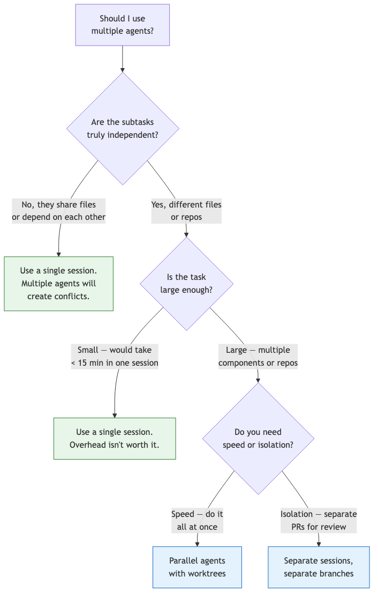
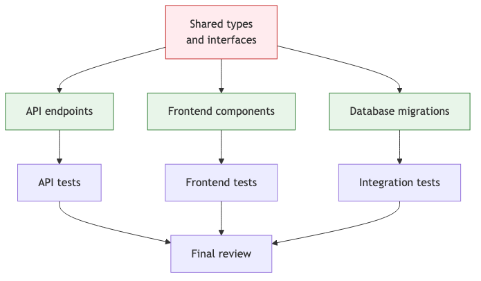

# 33 — Multi-Agent Coordination

Run multiple Claude instances in parallel, split large tasks across agents, and coordinate changes without conflicts.

---

## What You'll Learn

- When single-agent isn't enough — and when it still is
- Splitting work across parallel Claude sessions
- Using worktrees to isolate parallel changes
- Subagent patterns inside Claude Code
- Coordinating changes across multiple repositories
- Handling conflicts between parallel agents
- Task decomposition strategies for multi-agent workflows
- Monitoring and debugging multi-agent runs

**Prerequisites**: [26 — AI Agents & Agentic Patterns](26-ai-agents-and-agentic-patterns.md), [06 — Task Execution](06-task-execution.md)

---

## When to Use Multiple Agents

Most tasks don't need multiple agents. A single Claude Code session handles the vast majority of development work. Use multiple agents when:



### Good Multi-Agent Use Cases

- Updating 10 microservices to use a new API version (each service is independent)
- Migrating test files to a new framework across different modules
- Implementing a feature that has independent frontend and backend work
- Generating documentation for multiple unrelated packages
- Running security audits across several repositories
- Refactoring when different directories have no shared dependencies

### Bad Multi-Agent Use Cases

- Anything where agents edit the same files (merge conflicts guaranteed)
- Sequential work where step 2 depends on step 1's output
- Small tasks that finish in a few minutes anyway
- Exploratory work where the approach isn't clear yet

---

## Pattern 1: Parallel Terminal Sessions

The simplest form of multi-agent coordination — open multiple terminals and run separate Claude sessions.

### Setup

```bash
# Terminal 1 — working on the API
cd ~/project
git checkout -b feature/api-rate-limiting
claude

# Terminal 2 — working on the frontend
cd ~/project
git checkout -b feature/rate-limit-ui
claude

# Terminal 3 — working on documentation
cd ~/project
git checkout -b docs/rate-limiting
claude
```

### The Coordination Problem

If two sessions modify the same file, you'll have merge conflicts. Prevent this by giving each session a clear scope:

**Terminal 1:**
```
Add rate limiting to the API. Only modify files in
src/api/ and src/middleware/. Don't touch anything
in src/frontend/ or docs/.
```

**Terminal 2:**
```
Add a rate limit exceeded UI component. Only modify
files in src/frontend/. Don't touch anything in
src/api/ or docs/.
```

**Terminal 3:**
```
Write documentation for the rate limiting feature.
Only modify files in docs/. Don't touch source code.
```

### Merging the Results

```bash
# After all three sessions are done
git checkout main
git merge feature/api-rate-limiting
git merge feature/rate-limit-ui
git merge docs/rate-limiting
```

If you scoped correctly, these merge cleanly.

---

## Pattern 2: Worktrees for True Isolation

Git worktrees give each agent its own working directory — no risk of stepping on each other's files.

### Setup

```bash
# Create worktrees for parallel work
git worktree add ../project-api feature/api-changes
git worktree add ../project-frontend feature/frontend-changes
git worktree add ../project-tests feature/test-updates

# Start Claude in each worktree
cd ../project-api && claude
cd ../project-frontend && claude
cd ../project-tests && claude
```

### Why Worktrees Beat Branches

| Approach | Shared Working Dir | Risk of Conflicts | Setup Complexity |
|----------|-------------------|-------------------|-----------------|
| Same dir, different branches | Yes | High — unstaged changes leak | Low |
| Separate git clones | No | None | High (disk space, time) |
| **Worktrees** | **No** | **None** | **Low** |

Worktrees share the same `.git` directory but have separate working trees. Each agent gets a clean, isolated copy of the repo.

### Cleanup

```bash
# After merging, clean up worktrees
git worktree remove ../project-api
git worktree remove ../project-frontend
git worktree remove ../project-tests
```

---

## Pattern 3: Subagents Within Claude Code

Claude Code can spawn subagents internally — lightweight parallel workers for independent subtasks.

### When Claude Uses Subagents

Claude may automatically spawn subagents when it detects parallelizable work:

```
Refactor all 8 controller files in src/api/controllers/
to use the new error handling pattern. Each controller
is independent — you can work on them in parallel.
```

Claude recognizes that each controller can be modified independently and may use subagents to parallelize the work.

### Explicitly Requesting Parallel Work

```
I need these three independent tasks done:

1. Add input validation to the signup form (src/frontend/signup/)
2. Add rate limiting middleware (src/api/middleware/)
3. Write a database migration for the new audit_log table (prisma/)

These are in different directories with no shared code.
Work on them in parallel where possible.
```

### Subagent Limitations

- Subagents have their own context window — they can't see the full parent conversation
- They work best for well-defined, scoped tasks
- Complex tasks that require back-and-forth reasoning are better in the main session
- Each subagent adds overhead — don't parallelize trivial tasks

---

## Pattern 4: Headless Agents in Parallel

Run multiple Claude instances non-interactively for batch operations:

```bash
#!/bin/bash
# parallel-migrate.sh — Migrate all services to new auth pattern

services=("user-service" "order-service" "payment-service" "notification-service")

for service in "${services[@]}"; do
  echo "Starting migration for $service..."
  (
    cd "services/$service"
    claude -p "Migrate this service to use the new AuthMiddleware pattern.
      Replace all instances of the old verifyToken() calls with
      the new requireAuth() middleware. Update tests accordingly.
      Only modify files in this directory." \
      --allowedTools "Read,Glob,Grep,Edit,Write,Bash(npm test)" \
      > "../../logs/$service-migration.log" 2>&1
  ) &
done

echo "All migrations started. Waiting for completion..."
wait
echo "Done. Check logs/ for results."
```

### Safety Guardrails for Headless Agents

Always constrain headless agents with `--allowedTools`:

```bash
# GOOD — constrained to specific tools
claude -p "task" --allowedTools "Read,Glob,Grep,Edit,Bash(npm test)"

# BAD — unrestricted access
claude -p "task"
```

| Risk Level | Allowed Tools |
|-----------|---------------|
| Read-only (safest) | `Read,Glob,Grep` |
| Code changes | `Read,Glob,Grep,Edit,Write` |
| Code + tests | `Read,Glob,Grep,Edit,Write,Bash(npm test)` |
| Code + git | `Read,Glob,Grep,Edit,Write,Bash(git:*,npm test)` |

---

## Task Decomposition Strategies

The key to multi-agent coordination is splitting work correctly. Bad decomposition leads to conflicts and wasted effort.

### Decompose by Directory

The safest split — each agent owns a directory:

```
Agent 1: src/api/ (backend endpoints)
Agent 2: src/frontend/ (UI components)
Agent 3: src/shared/ (shared types and utilities)
Agent 4: tests/ (test infrastructure)
```

**Risk**: If agents 1 and 2 both need to change shared types in agent 3's directory.

**Mitigation**: Do the shared changes first in a single session, then parallelize the rest.

### Decompose by Feature Slice

Each agent handles one complete vertical slice:

```
Agent 1: User authentication (all layers)
Agent 2: Order processing (all layers)
Agent 3: Notification system (all layers)
```

**Risk**: Feature slices may share common code (middleware, utilities, types).

**Mitigation**: Identify shared code upfront. Either change shared code first, or assign a "shared code" agent that runs before the others.

### Decompose by Operation Type

Each agent does one type of work across the whole codebase:

```
Agent 1: Add TypeScript types to all untyped functions
Agent 2: Add error handling to all API endpoints
Agent 3: Add logging to all service methods
```

**Risk**: Multiple agents editing the same files (e.g., the same service file needs types, error handling, AND logging).

**Mitigation**: Run these sequentially, not in parallel. Or split files across agents instead.

### The Dependency Graph

Before splitting, map dependencies:

```
Before parallelizing this work, analyze the task and create
a dependency graph:

1. What subtasks are there?
2. Which subtasks depend on which?
3. Which can run in parallel?
4. What shared code might cause conflicts?

Draw this as a Mermaid diagram showing the execution order.
```



In this example: do shared types first (single agent), then parallelize API, frontend, and database work, then parallelize their tests.

---

## Handling Conflicts

Even with good decomposition, conflicts happen. Here's how to handle them.

### Prevention: The Interface Contract

Before splitting work, agree on the interfaces:

```
Before we split this into parallel tasks, define the
interfaces between the API and frontend:

1. What endpoints will exist? (method, path, request/response shapes)
2. What shared types do both sides need?
3. What error format will the API return?

Write these as TypeScript interfaces in src/shared/types/.
We'll implement both sides against these contracts.
```

Do this in a single session first, then split.

### Detection: Check Before Merging

```bash
# After parallel agents finish, check for conflicts
git checkout main
git merge --no-commit feature/api-changes
git merge --no-commit feature/frontend-changes

# If conflicts exist, resolve them:
claude
```

Then in the Claude session:

```
We have merge conflicts from two parallel work streams.
Show me the conflicts and help me resolve them. The API
changes should take precedence for shared types.
```

### Resolution: Let Claude Merge

```
These two branches were developed in parallel:
- feature/api-changes: updated the API response format
- feature/frontend-changes: updated the frontend to call the API

They both modified src/shared/types/api.ts. Resolve the
conflict by keeping the API's version of the types and
updating the frontend to match.
```

---

## Multi-Repository Coordination

When a change spans multiple repos (e.g., a shared library and its consumers):

### Sequential: Library First

```bash
# Step 1: Update the shared library
cd ~/repos/shared-lib
claude -p "Bump the API version and add the new rate limit types."

# Step 2: Publish / make available
npm publish  # or git push, depending on your setup

# Step 3: Update consumers in parallel
for repo in api-service frontend-app admin-dashboard; do
  (
    cd ~/repos/$repo
    claude -p "Update shared-lib to the latest version.
      Migrate all usage of the old rate limit types to the new ones.
      Run tests to verify." \
      --allowedTools "Read,Glob,Grep,Edit,Write,Bash(npm:*)" \
  ) &
done
wait
```

### Coordination via Shared Spec

```
I'm about to update 4 repositories to support the new
authentication flow. Before we start, create a migration
spec that documents:

1. What changes in the shared auth library
2. What each consuming service needs to change
3. The order of operations (what deploys first)
4. Rollback plan if something breaks

Save this as migration-spec.md. I'll use it to coordinate
the parallel updates.
```

---

## Monitoring Multi-Agent Runs

### Log Everything

For headless parallel agents, capture output:

```bash
#!/bin/bash
# Run agents with structured logging
timestamp=$(date +%Y%m%d_%H%M%S)
log_dir="logs/multi-agent-$timestamp"
mkdir -p "$log_dir"

for task in "${tasks[@]}"; do
  claude -p "$task" \
    --allowedTools "Read,Glob,Grep,Edit,Write,Bash(npm test)" \
    > "$log_dir/$task.log" 2>&1 &
  echo "$!" >> "$log_dir/pids.txt"
done

# Wait and report
wait
echo "All agents complete. Logs in $log_dir/"
```

### Post-Run Verification

After parallel agents finish, verify the combined result:

```
Multiple agents just made changes in parallel.
Review the combined diff (all changes together):

1. Are there any conflicts or inconsistencies?
2. Do the changes work together as a coherent whole?
3. Run the full test suite — do all tests pass?
4. Are there any files that multiple agents modified?
```

---

## Anti-Patterns

### The Thundering Herd

**Wrong**: Launch 20 agents to update 20 files simultaneously.

**Right**: Group related files and use 3-4 agents, each handling a logical group. Too many agents means too much coordination overhead and potential resource contention.

### The Blind Split

**Wrong**: Split work without analyzing dependencies first.

**Right**: Map the dependency graph, identify shared code, resolve shared changes first, then parallelize independent work.

### Over-Parallelizing Small Tasks

**Wrong**: Use 5 agents for a task that takes 10 minutes in a single session.

**Right**: If a single session can handle it in under 15 minutes, a single session is faster than coordinating multiple agents. The setup, context-loading, and merge overhead of multi-agent work costs time.

### No Verification After Merge

**Wrong**: Merge all parallel branches and ship without checking the combined result.

**Right**: Always run the full test suite on the merged result. Individual branches passing tests doesn't guarantee the combined result works.

---

## Sample Conversation

> **You**: I need to migrate our entire API from Express to Fastify. We have 12 route files, a middleware stack, and about 200 tests. How should I split this across multiple agents?
>
> **Claude**: Let me analyze the dependencies first...
> *reads all route files, middleware, and shared code*
>
> Here's the dependency graph I found:
>
> **Shared (do first, single session):**
> - `src/middleware/` — 6 middleware files, all used across routes
> - `src/shared/` — request/response types, error handling
> - `src/app.ts` — the Express app setup (becomes Fastify setup)
>
> **Independent (can parallelize after shared changes):**
> - Route group A (auth, users, profiles): 3 files, 65 tests
> - Route group B (orders, cart, checkout): 3 files, 55 tests
> - Route group C (products, categories, search): 3 files, 45 tests
> - Route group D (admin, reports, settings): 3 files, 35 tests
>
> **My recommended plan:**
>
> 1. **Phase 1** (single session): Migrate middleware and shared code to Fastify patterns. Update `app.ts`. This is the foundation everything else depends on.
>
> 2. **Phase 2** (4 parallel agents in worktrees): Each agent migrates one route group and its tests. They all build on Phase 1's branch.
>
> 3. **Phase 3** (single session): Merge all branches, run the full test suite, fix any integration issues.
>
> Want me to start with Phase 1?

---

## Key Takeaways

1. Most tasks don't need multiple agents — start with a single session and only parallelize when there's clear independence
2. Worktrees give the cleanest isolation — each agent gets its own working directory with no risk of file conflicts
3. Always map dependencies before splitting — shared code must be handled first
4. Constrain headless agents with `--allowedTools` — never give unrestricted access to unattended agents
5. Verify the combined result after merging parallel work — individual success doesn't guarantee collective success
6. The setup overhead of multi-agent work is real — don't parallelize tasks that take under 15 minutes in a single session
7. Define interface contracts before splitting — agree on types, endpoints, and data shapes in advance

---

**Next**: [34 — Automation & Headless Workflows](34-automation-and-headless-workflows.md) — Run Claude unattended for CI/CD, scheduled tasks, and custom automation pipelines.
