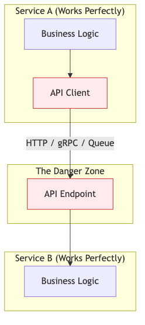
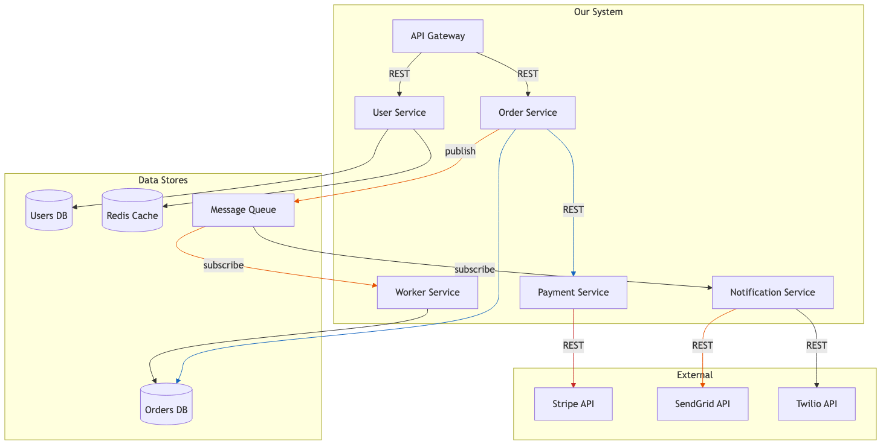
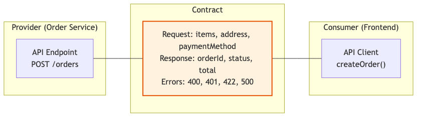

# 37 — Systems Integration Analysis

Map, understand, and verify how components interact in complex distributed systems.

---

## What You'll Learn

- Mapping integration points across a complex system
- Tracing data flow through multiple services, queues, and databases
- Identifying fragile integration points and hidden dependencies
- Contract testing between services
- Analyzing failure modes at integration boundaries
- Event-driven architecture analysis
- API dependency mapping and version compatibility
- Using Claude to untangle legacy integrations

**Prerequisites**: [04 — Architecture & Dependencies](04-architecture-and-dependencies.md), [14 — Testing Strategies](14-testing-strategies.md)

---

## Why Integration Analysis Matters

Individual services can be perfect and the system can still fail. Most production outages happen at integration boundaries — where one system meets another.



The code inside each service is easy to test. The space between services is where things break: network failures, schema mismatches, version incompatibilities, race conditions, and timeout cascades.

---

## Step 1: Map All Integration Points

### The Integration Inventory

Start by cataloging every way your system communicates:

```
Analyze the codebase and map all integration points:

1. HTTP/REST calls — which services call which?
2. gRPC calls — service-to-service RPCs
3. Message queues — who publishes, who subscribes, what topics?
4. Database connections — which services share databases?
5. File/object storage — who reads, who writes?
6. External APIs — third-party services we depend on
7. Shared caches — Redis/Memcached shared between services
8. WebSocket connections
9. Cron jobs and scheduled tasks that trigger cross-service work
10. Batch imports/exports between systems

For each, document:
- Source and destination
- Protocol and format
- Authentication method
- Failure handling (retries, circuit breakers, timeouts)
- Data contract (schema, version)
```

### The Integration Map

Ask Claude to generate a visual map:

```
Generate a Mermaid diagram showing all integration points
in our system. Color-code by type:
- Blue: synchronous (HTTP/gRPC)
- Orange: asynchronous (queues/events)
- Green: data stores (databases/caches)
- Red: external third-party services

Include the direction of data flow.
```



---

## Step 2: Trace Data Flows

### End-to-End Request Tracing

For each critical user journey, trace the complete data flow:

```
Trace the complete data flow for "user places an order":

1. What HTTP request starts the flow?
2. What services are called, in what order?
3. What data is passed between each service?
4. What databases are written to?
5. What events are published?
6. What asynchronous work is triggered?
7. What the user sees at each step

Include timing — what's synchronous (user waits) vs
asynchronous (happens in background)?
```

### Data Transformation Analysis

Data often changes shape as it flows through the system:

```
Trace how "user address" data flows through the system:

1. What format is it in when the user submits it? (frontend)
2. How is it validated? (API layer)
3. How is it stored in the database? (schema)
4. How is it sent to the shipping service? (API contract)
5. How is it sent to the payment processor? (Stripe format)

Are there any places where data is lost, truncated,
or transformed in a way that could cause bugs?
```

### The Data Lineage Diagram

```
For the "order total" field, show me its complete lineage:

- Where is it first calculated?
- Where is it stored?
- Where is it read back?
- Where is it sent to external services?
- Could it ever be different in two places?
  (e.g., stored in orders table AND sent to Stripe — could they disagree?)
```

---

## Step 3: Identify Fragile Points

### The Fragility Checklist

```
Analyze our integrations for fragility. For each
integration point, assess:

1. What happens if the remote service is down?
   - Do we have retries with backoff?
   - Is there a circuit breaker?
   - What does the user see?

2. What happens if the remote service is slow (5s+ latency)?
   - Do we have timeouts configured?
   - Could this cause cascading failures (thread pool exhaustion)?

3. What happens if the data format changes?
   - Is the contract enforced (schema validation)?
   - Are we using strict or permissive deserialization?
   - Would a new field break our parsing?

4. What happens if messages are delivered out of order?
   - Do we depend on ordering guarantees?
   - Is our processing idempotent?

5. What happens if messages are delivered twice?
   - Do we have deduplication?
   - Are operations idempotent?

Rate each integration as: Resilient / Fragile / Unknown
```

### Hidden Dependencies

Some dependencies aren't obvious from the code:

```
Find hidden dependencies in our system:

1. Shared databases — do multiple services write to the same tables?
2. Shared caches — could one service's cache writes break another?
3. Implicit ordering — does Service B assume Service A runs first?
4. Environment dependencies — do services depend on the same
   environment variables or config files?
5. Transitive dependencies — if Service A calls B which calls C,
   does A implicitly depend on C's availability?
6. Clock dependencies — do services assume synchronized clocks?
7. Volume dependencies — does one service assume another can
   handle any volume of requests?
```

### The Blast Radius Map

```
If the Payment Service goes down for 30 minutes:

1. What services are directly affected?
2. What services are indirectly affected (cascade)?
3. What user-facing functionality breaks?
4. What data might become inconsistent?
5. What queues will back up?
6. What happens when it comes back? (thundering herd? data reconciliation?)

Generate a blast radius diagram.
```

---

## Step 4: Contract Testing

### What Contracts Need Testing

Every integration has an implicit or explicit contract. Test them.



### Consumer-Driven Contracts

The consumer defines what it needs, the provider verifies it can deliver:

```
Analyze the API calls between our frontend and API:

For each endpoint the frontend calls:
1. What fields does the frontend actually use from the response?
   (Not what the API returns — what the frontend reads)
2. Are there fields the API returns that nobody uses?
3. Are there fields the frontend expects that could be missing?

This tells us what the real contract is, not what we think it is.
```

### Contract Test Generation

```
Generate contract tests for the Order Service API:

For each endpoint:
1. Test that the response matches the documented schema
2. Test that required fields are always present
3. Test that field types are correct (string, number, array)
4. Test that enum values are within the expected set
5. Test that error responses match the documented format

These tests should run against the real service (in test env),
not mocks. They verify the contract, not the business logic.
```

### Schema Validation at Boundaries

```
Add schema validation at every integration boundary:

1. Validate incoming API requests against the OpenAPI spec
2. Validate outgoing API responses before sending
3. Validate messages before publishing to the queue
4. Validate messages after receiving from the queue

Use zod, joi, or JSON Schema — pick what matches our stack.
If the data doesn't match the contract, reject it loudly.
```

---

## Step 5: Failure Mode Analysis

### Systematic Failure Analysis

For each integration, enumerate what can go wrong:

```
For the integration between Order Service and Payment Service:

Enumerate every failure mode:
1. Payment Service is completely unreachable
2. Payment Service returns 500
3. Payment Service returns 200 but with an error in the body
4. Payment Service times out after 30 seconds
5. Payment Service accepts the charge but our callback fails
6. Payment Service double-charges (we retry, it processes twice)
7. Payment Service returns success, but we fail to record it
8. Network partition — we can't tell if the charge went through

For each: What happens today? What should happen?
What's the recovery process?
```

### The Chaos Engineering Mindset

```
Design chaos experiments for our critical integrations:

1. What if we add 2 seconds of latency to every database query?
2. What if the message queue drops 10% of messages?
3. What if Redis returns stale data?
4. What if the Stripe API returns 503 for 5 minutes?
5. What if one database replica falls behind the primary?

For each: what's the expected behavior of our system?
What would actually happen today? What needs to change?
```

### The Timeout Chain Problem

One of the most common integration failures:

```
Map our timeout chain:

- API Gateway timeout: ?
- Service A → Service B timeout: ?
- Service B → Database timeout: ?
- Service B → External API timeout: ?

Are these configured correctly?

The rule: inner timeouts must be shorter than outer timeouts.
If the API Gateway times out at 30s but Service B waits 60s
for the database, Service B is doing work that nobody will
see the result of.
```

---

## Step 6: Event-Driven Architecture Analysis

### Event Flow Mapping

```
Map all events in our system:

For each event type:
1. Who publishes it?
2. Who subscribes to it?
3. What's the schema?
4. What's the delivery guarantee? (at-most-once, at-least-once, exactly-once)
5. What happens if a subscriber is down?
6. Is processing idempotent?
7. What's the ordering guarantee?

Generate a table and a Mermaid diagram showing the event flow.
```

### Dead Letter Queue Analysis

```
Analyze our dead letter queues:

1. Do we have DLQs configured for all queues?
2. Are there messages currently in DLQs? How many? How old?
3. What types of failures cause messages to land in DLQs?
4. Is there a process for replaying DLQ messages?
5. Do we alert when DLQ depth exceeds a threshold?
```

### Event Versioning

```
Analyze our event schemas for backward compatibility:

1. Have any event schemas changed in the last 6 months?
2. Are old consumers compatible with new event formats?
3. Are new consumers compatible with old event formats?
4. Do events include a version field?
5. What happens when an unknown event version is received?
```

---

## Step 7: Dependency Health Dashboard

### Build a Dependency Map

```
Create a dependency health report:

For each external dependency (databases, APIs, queues, caches):
1. Current availability (can we reach it?)
2. Current latency (p50, p95, p99)
3. Error rate (last hour, last day)
4. Last known outage
5. Fallback behavior (graceful degradation or hard failure?)

For each internal service dependency:
1. Current health check status
2. Current latency for key endpoints
3. Circuit breaker status (open/closed/half-open)
4. Queue depth (if applicable)
```

### Monitoring Recommendations

```
Based on our integration map, what monitoring do we need?

For each integration point:
1. What metrics should we track?
2. What are the warning thresholds?
3. What are the critical thresholds?
4. What's the alerting strategy? (page vs Slack vs dashboard)

Prioritize: which integration failures would cause
the most user impact?
```

---

## Integration Analysis for Legacy Systems

Legacy systems often have the most complex and least documented integrations.

### Discovering Undocumented Integrations

```
Scan the codebase for integration points that might not
be documented:

1. Search for HTTP client usage (fetch, axios, got, requests)
2. Search for database connection strings
3. Search for queue connection configuration
4. Search for environment variables that look like service URLs
5. Search for hardcoded IP addresses or hostnames
6. Search for file system paths that suggest shared storage

For each discovery, document what service it connects to
and what data flows through it.
```

### The Legacy Integration Audit

```
Audit our legacy integrations:

1. Are there integrations using deprecated protocols? (SOAP, XML-RPC)
2. Are there integrations with no error handling?
3. Are there integrations with no timeout configuration?
4. Are there integrations that use shared databases instead
   of APIs? (the database is the integration)
5. Are there integration credentials embedded in code?
6. Are there integrations that nobody on the current team
   understands?

Rank by risk: which legacy integration is most likely
to cause a production incident?
```

---

## Sample Conversation

> **You**: We had an outage last week because the payment service went down and took everything with it. How do I prevent that?
>
> **Claude**: Let me trace the payment service's blast radius...
> *reads service code, API clients, queue configurations*
>
> Here's what I found — the payment service is a critical dependency with no isolation:
>
> **Direct impact** (when Payment is down):
> - Order Service: `createOrder()` calls Payment synchronously with a 30-second timeout — the request just hangs
> - No circuit breaker — Order Service keeps sending requests to a dead service, exhausting its connection pool
> - API Gateway: 30-second timeout means user-facing requests hang for 30 seconds before failing
>
> **Cascade** (what breaks next):
> - Order Service connection pool exhaustion means ALL order endpoints fail, not just payment
> - Frontend retry logic causes 3x the requests to an already overwhelmed Order Service
> - Background workers that process orders back up — 15,000 messages queued when I checked
>
> **The fixes, in priority order:**
>
> 1. **Add a circuit breaker** on Order Service → Payment Service (break the cascade)
> 2. **Reduce the timeout** from 30s to 5s (fail fast instead of hanging)
> 3. **Make payment async** — accept the order, publish to a queue, process payment asynchronously
> 4. **Add a fallback** — when Payment is down, queue orders for later processing instead of failing
> 5. **Add monitoring** — alert when Payment error rate exceeds 1% so you catch it before users do
>
> Want me to implement the circuit breaker first? That's the highest impact, lowest effort fix.

---

## Key Takeaways

1. Most production outages happen at integration boundaries, not inside services — focus your analysis there
2. Map all integration points first — you can't secure what you can't see
3. Trace data flows end-to-end for each critical user journey — follow the data, not the architecture diagram
4. Every integration has a failure mode — enumerate them and verify your system handles each one
5. Contract testing catches schema mismatches before they reach production
6. Inner timeouts must be shorter than outer timeouts — otherwise you're doing work nobody will see
7. Event-driven systems need idempotency, ordering analysis, and dead letter queue monitoring
8. The blast radius of a service failure is almost always larger than you think — map it explicitly

---

**Next**: [38 — Dependency & Risk Analysis](38-dependency-and-risk-analysis.md) — Identify, evaluate, and mitigate risks from external dependencies, vendor lock-in, and supply chain vulnerabilities.
