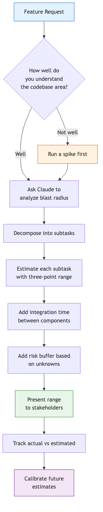
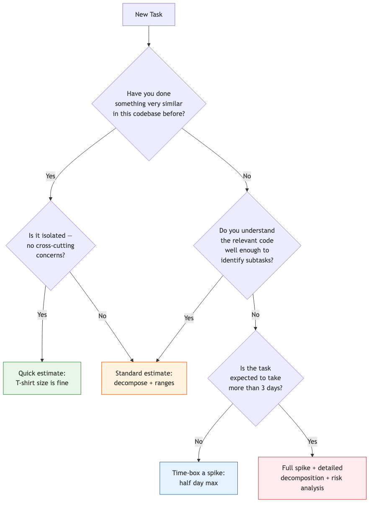

# 41 — Estimation & Scoping

Use Claude to produce codebase-informed estimates that replace gut feelings with data-driven analysis.

---

## What You'll Learn

- Why software estimation is systematically biased and how to counteract it
- Using Claude to analyze actual code for blast radius, dependencies, and complexity
- Breaking features into implementable chunks with task decomposition
- Three-point estimation with ranges and confidence levels
- Scoping features with the MoSCoW framework (must/should/could/won't)
- Running time-boxed spike analyses with Claude
- Estimating integration, refactoring, and migration work
- Tracking estimation accuracy and calibrating over time
- Communicating estimates to stakeholders without false precision

**Prerequisites**: [04 — Architecture & Dependencies](04-architecture-and-dependencies.md), [06 — Task Execution](06-task-execution.md), [23 — Technical Debt Management](23-technical-debt-management.md)

---

## Why Engineers Are Bad at Estimation

This is not a character flaw. It is a well-documented set of cognitive biases that affect every human who estimates future work.

**Optimism bias**: We imagine the happy path. The feature takes two days if nothing goes wrong — but something always goes wrong.

**Unknown unknowns**: We estimate what we can see. The database migration looks straightforward until you discover a trigger that cascades to three other tables.

**Scope creep**: "While we're in there, we should also..." turns a two-day task into a two-week task, one small addition at a time.

**Ignoring integration time**: Building component A takes two days. Building component B takes two days. Connecting A and B takes four days. Nobody estimated the four days.

**Anchoring**: Once someone says "that sounds like a two-week project," every subsequent estimate gravitates toward two weeks regardless of the actual complexity.

The fix is not to try harder. The fix is to use a process that compensates for these biases — and to ground your estimates in the actual code, not your mental model of it.

---

## The Estimation Workflow



---

## How Much Estimation Effort Does This Task Need?

Not every task needs a full estimation process. Use this decision tree.



---

## Using Claude for Codebase-Informed Estimates

The single biggest improvement you can make to estimation is to look at the actual code before giving a number. Claude makes this fast.

### Analyzing Blast Radius

```
We need to add a "team" concept to our user system — users can belong
to multiple teams, and permissions will be scoped to teams.

Before I estimate this, analyze the blast radius:
1. What files currently handle user permissions?
2. What database tables/models would need to change?
3. What API endpoints assume a single-user permission model?
4. What tests reference the current permission system?
5. Are there any caching layers that assume user-level permissions?
```

### Complexity Assessment

```
Rate the complexity of each file in src/billing/ on a scale of 1-5
(1=simple CRUD, 5=deeply coupled, requires domain knowledge).
For anything rated 4+, explain why and what could go wrong.
```

---

## Task Decomposition

A feature is not a task. A task is something one person can finish in a day or less. If you cannot finish it in a day, it is not decomposed enough.

```
I need to add CSV export functionality to our reporting module.

Break this down into implementable subtasks where each one:
- Can be completed and tested independently
- Takes no more than one day
- Has a clear "done" definition

For each subtask, identify:
1. What files need to change
2. What the input and output look like
3. What tests verify it works
4. What it depends on (other subtasks that must come first)
```

### What Good Decomposition Looks Like

A poorly decomposed feature:

| Task | Estimate |
|------|----------|
| Implement CSV export | 5 days |

A well-decomposed feature:

| Task | Estimate | Dependencies |
|------|----------|--------------|
| Add CSV serializer for report data model | 0.5 day | None |
| Write unit tests for CSV serializer | 0.5 day | Serializer |
| Add export button to report UI | 0.5 day | None |
| Create API endpoint for export request | 0.5 day | Serializer |
| Add background job for large exports | 1 day | Endpoint |
| Implement progress tracking for background job | 0.5 day | Background job |
| Add email notification when export completes | 0.5 day | Background job |
| Integration test: full export flow | 0.5 day | All above |
| Load test with large datasets | 0.5 day | All above |

Total: 5 days. Same number, but now you can see where the risk is, what can be parallelized, and where integration time hides.

---

## Estimating with Ranges

Never give a single number. A single number is a lie. Every estimate should be a range.

### Three-Point Estimation

For each subtask, provide three numbers:

- **Best case (B)**: Everything goes smoothly. You have done this exact thing before.
- **Most likely (M)**: Some minor hiccups. A test fails, a requirement was ambiguous.
- **Worst case (W)**: Significant obstacles. A library does not support what you need. A design assumption was wrong.

**Expected duration** = (B + 4M + W) / 6

```
For each subtask in the CSV export feature, give me three-point
estimates (best, likely, worst) in hours.

Be specific about what would cause the worst case. For example:
"Worst case for the serializer: 12 hours — if the report data model
has circular references that break naive CSV serialization."

Generic "things might go wrong" is not useful. Tell me WHAT might
go wrong based on the actual code.
```

### Confidence Levels

Translate ranges into confidence levels for stakeholders:

| Confidence | Meaning | When to use |
|------------|---------|-------------|
| 90% | "We will almost certainly finish by this date" | Use the worst-case number |
| 50% | "There is a coin-flip chance we hit this date" | Use the most-likely number |
| 10% | "Only if everything goes perfectly" | Use the best-case number |

Most stakeholders want the 90% number. Most engineers give the 50% number. This mismatch is the source of most deadline stress.

---

## Scoping Features

Estimation without scoping is meaningless. You cannot estimate "build a notification system" — it could take a week or six months depending on scope.

### The MoSCoW Framework

```
We're building a notification system. Help me scope it using MoSCoW:

**Context**: Web app with 10K users. Currently email-only.

For each requirement, classify as Must / Should / Could / Won't
(this release), and explain why:
- Real-time in-app notification bell
- Notification preferences per user
- Push notifications (mobile)
- Email digest option
- Read/unread tracking
- Notification history page
- Admin broadcast tools

Also identify hidden requirements not on this list but necessary
for the Must Haves to work.
```

### Identifying Hidden Requirements

```
I'm estimating a feature to add two-factor authentication.

Look at our auth system in src/auth/ and identify hidden requirements:
- Migration paths for existing sessions
- Impact on API token authentication
- Changes needed in test suite auth helpers
- Third-party integrations that authenticate via our system
```

---

## Spike Analysis

When you do not know enough to estimate, do not guess. Run a spike: time-boxed research with a fixed output.

```
I need to estimate the work to migrate our search from Elasticsearch
to Typesense. I have never used Typesense.

Help me run a spike — in 2 hours, I want to understand:

1. What our current Elasticsearch usage looks like:
   - How many indices? What query patterns? Any ES-specific features?
2. Which features map directly to Typesense and which don't
3. What our migration path would look like at a high level

Start by analyzing our Elasticsearch client code and query patterns.
```

After a spike, fill in this template:

```
## Spike Report: [Feature Name]

**Time spent**: [X hours]
**What we learned**: [Key findings]
**What we still don't know**: [Unknowns and what it takes to resolve them]
**Revised estimate**: Best [X days] / Likely [X days] / Worst [X days]
**Recommendation**: [Proceed / Need another spike / Reconsider approach]
```

---

## Integration Estimation

Integration is the most commonly underestimated category of work. Building two components is straightforward. Making them work together reliably is where the time goes.

```
We're building a checkout flow with three components:
1. Cart service  2. Payment processing  3. Checkout UI

For each pair, identify the integration surface:
- What data flows between them? What happens on failure?
- What API contracts do they share?

For each surface, estimate: contract definition, happy path,
error handling, and integration tests.
```

### Common Integration Time Sinks

| Integration type | Typical hidden cost |
|-----------------|-------------------|
| API to API | Error handling, retries, circuit breakers, timeout tuning |
| Frontend to API | Loading states, error states, optimistic updates, caching |
| Database migration | Backfill scripts, dual-write period, rollback plan |
| Third-party service | Rate limits, sandbox vs production differences, webhook reliability |
| Auth changes | Session migration, token rotation, backward compatibility |

Rule of thumb: add 30-50% for integration between two components, and 50-100% for three or more.

---

## Estimating Refactoring and Migration Work

Refactoring estimates are the most likely to be wildly wrong because every file is potentially in scope.

```
We want to rename "Organization" to "Workspace" across the codebase.
Analyze the full scope:
1. Files referencing "Organization" (model, type, variable names)?
2. Database tables/columns using this name?
3. API endpoints with "organization" in the URL?
4. Tests referencing this name?
5. Serialized data stores (Redis, queues) with this name?

Group changes by risk: Safe (automated rename), Moderate (needs
deprecation period), High risk (needs migration strategy).
```

---

## Tracking Accuracy Over Time

Estimation is a skill that improves with deliberate practice and feedback.

After each project, record:

| Field | Value |
|-------|-------|
| Task | What was the work? |
| Original estimate | What did you say initially? |
| Actual time | How long did it actually take? |
| Ratio | Actual / Original estimate |
| Why was it off? | Root cause of the difference |

```
Here are my last 10 estimation results:

[paste the log]

Analyze my estimation patterns:
1. Am I consistently over or under-estimating?
2. What types of tasks am I worst at estimating?
3. What correction factor should I apply to future estimates?
4. Are there categories where I should always run a spike first?
```

Over time, a team builds a calibration model: "Integration work takes 2x our estimates." "Anything touching billing takes 50% longer." This is not about blame. It is about data.

---

## Communicating Estimates

An estimate is not a commitment. A commitment is not a target. Confusing these three things causes most project management failures.

- **Estimate**: "Based on the code analysis, this will likely take 8-12 days."
- **Commitment**: "We will deliver this by March 15th."
- **Target**: "We want this done by March 15th."

```
Help me write an estimation summary for stakeholders:
[paste your decomposition, ranges, and risks]

Format: 1) One-sentence summary  2) Delivery range  3) What's included
4) What's excluded  5) Top 3 risks  6) What I need from stakeholders
```

### When to Say "I Need More Information"

It is better to delay an estimate than to give a bad one. Say it when you have not looked at the code, the requirements are ambiguous, or someone expects a number in 30 seconds during a meeting.

Response: "I can give you a T-shirt size now, but I need [X hours] to give you a number I'm confident in."

---

## Sample Conversation

> **You**: We need to add audit logging to our application — every create, update, and delete operation should be logged. The PM wants an estimate by end of day. Can you help me figure out the scope?

> **Claude**: I'll analyze your codebase to understand the scope. Let me look at your data layer first.
>
> Here's what I found:
>
> **Data layer**: You have 34 models in `src/models/`. Of those, 28 have create/update/delete operations exposed through API endpoints.
>
> **Write paths**: There are 3 patterns for data writes:
> 1. Direct ORM calls in service files (19 models)
> 2. Bulk operations in job processors (6 models)
> 3. Raw SQL queries in `src/reports/` (3 models)
>
> **Decomposition**:
>
> | Subtask | Best | Likely | Worst |
> |---------|------|--------|-------|
> | Design audit log schema and storage | 2h | 4h | 8h |
> | Implement ORM middleware/hooks for standard writes | 4h | 8h | 16h |
> | Handle bulk operations in job processors | 4h | 8h | 24h |
> | Instrument raw SQL queries in reports | 2h | 4h | 12h |
> | Build audit log query API | 2h | 4h | 6h |
> | Add audit log viewer UI | 4h | 8h | 12h |
> | Integration tests for all write paths | 4h | 8h | 12h |
> | Performance testing (logging overhead) | 2h | 4h | 8h |
>
> **Totals**: Best 24h (3 days), Likely 48h (6 days), Worst 98h (12+ days)
>
> **Biggest risks**:
> 1. Bulk operations in job processors do not go through the ORM — instrumenting them requires modifying 6 separate job files with different patterns
> 2. Raw SQL queries bypass all middleware — may need to wrap or rewrite them
> 3. Audit log storage volume could be significant at ~50K writes per day
>
> For the PM, I'd suggest: "6-12 working days depending on how we handle bulk operations and raw SQL queries. I can tighten that range after a half-day spike."

---

## Anti-Patterns

**Single-point estimates**: "It will take 5 days." No. It will take between 3 and 10 days. Say that.

**Padding instead of communicating uncertainty**: Adding a hidden 50% buffer to every estimate. Instead, give the real range and explain what drives the uncertainty.

**Estimating without looking at the code**: Your mental model is always simpler than reality. Spend 30 minutes reading the relevant code first — or have Claude do it.

**Anchoring to the first number**: Someone says "two weeks" and every estimate clusters there. Estimate independently before discussing as a group.

**Confusing effort with duration**: "5 days of work" is not "done in 5 days." Context switching, meetings, code review, and blocked dependencies extend duration.

**Not re-estimating when scope changes**: Requirements changed on day 3. Nobody updated the estimate. The original deadline is fiction.

---

## Key Takeaways

1. Estimation bias is cognitive, not moral — use structured processes to counteract it
2. Ground every estimate in the actual code — have Claude analyze blast radius and complexity before committing to a number
3. Decompose until each subtask passes the "can I finish this in a day?" test
4. Always give ranges, never single numbers — use three-point estimation to capture uncertainty
5. Scope before you estimate — the MoSCoW framework forces clarity on what is in and out
6. Run a spike when you do not know enough to estimate — guessing is not estimating
7. Integration time is real work — budget 30-50% on top of component estimates
8. Track your accuracy over time — estimation improves with feedback
9. Estimates, commitments, and targets are different things — make sure stakeholders know which you are giving
10. When in doubt, say "I need more information" — a delayed estimate beats a wrong commitment

---

**Next**: [42 — Monorepo & Multi-Project Management](42-monorepo-and-multi-project.md)
