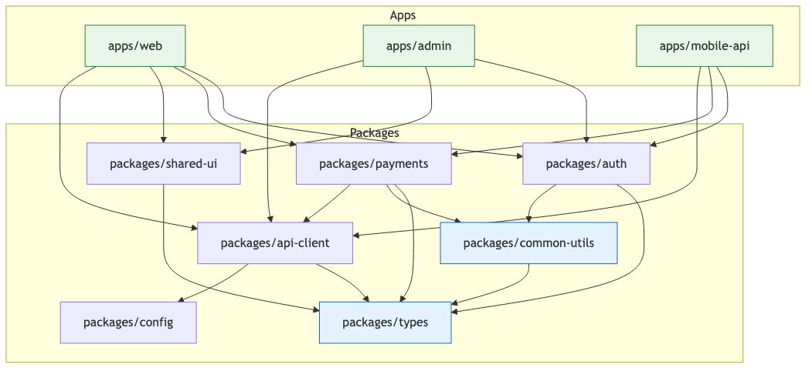

# 42 — Monorepo & Multi-Project Management

Navigate massive monorepos, manage cross-package dependencies, and use Claude to orchestrate changes that span dozens or hundreds of packages.

---

## What You'll Learn

- When to use a monorepo vs multiple repositories — and the tradeoffs of each
- Strategies for orienting Claude in repos with thousands of packages
- Build tool landscape: Nx, Turborepo, Bazel, Lerna
- Managing internal dependencies, version alignment, and phantom dependencies
- Determining the blast radius of a change across packages
- CI/CD strategies that only build and test what changed
- Code ownership boundaries and package-level CLAUDE.md files
- Cross-package refactoring with multi-agent patterns
- Managing multiple distinct applications in a single repository
- Scaling Git performance when the repo gets large

**Prerequisites**: [04 — Architecture & Dependencies](04-architecture-and-dependencies.md), [33 — Multi-Agent Coordination](33-multi-agent-coordination.md), [20 — CI/CD & Automation](20-ci-cd-and-automation.md)

---

## Monorepo vs Multi-Repo

This is not an ideological decision. It depends on how your teams work and how your code is coupled.

| Factor | Favors Monorepo | Favors Multi-Repo |
|--------|-----------------|-------------------|
| Team size | < 50 engineers sharing code | 50+ engineers with clear domain boundaries |
| Code coupling | Packages change together frequently | Packages evolve independently |
| Deployment cadence | Coordinated releases | Independent release cycles |
| Shared tooling | Consistent build/lint/test across all | Teams need different languages or runtimes |
| CI complexity | One pipeline (but it must be smart) | Simple per-repo pipelines (but many to maintain) |

Monorepos win when packages are tightly coupled -- if changing a shared library requires updating five consumers in the same PR, a monorepo eliminates cross-repo coordination pain. Multi-repo wins when teams operate independently with minimal shared code.

Many organizations use a hybrid: a monorepo for the core platform and separate repos for truly independent projects (mobile apps, ML pipelines, infrastructure-as-code).

```
Analyze our repository structure and recommend monorepo vs multi-repo:

1. How many repos have cross-repo dependencies?
2. How often do changes span multiple repos?
3. Are there duplicated configs (ESLint, TypeScript, CI) across repos?
4. Do teams frequently block on releases from other repos?
5. What percentage of code is shared across projects?
```

---

## Navigating Monorepos with Claude

A monorepo with 500 packages and 100,000 files is overwhelming. The key is scoping -- giving Claude the right context so it doesn't waste tokens reading irrelevant packages.

```
I'm working in the @payments package (packages/payments/).
Only look at files within that package and its direct dependencies:
- packages/common-utils/
- packages/api-client/
- packages/types/

Don't explore other packages unless I ask.
```

### CLAUDE.md for Monorepos

A well-structured monorepo uses CLAUDE.md files at multiple levels:

```
my-monorepo/
  CLAUDE.md              # Root: repo-wide conventions, build commands, package layout
  packages/
    auth/
      CLAUDE.md          # Package-specific: architecture, test patterns, owners
    payments/
      CLAUDE.md          # Package-specific: payment flow, compliance notes
```

The root CLAUDE.md should map the package layout, document the build system (e.g., `turbo run build --filter=@company/payments...`), and state repo-wide conventions like npm scoping and where shared types live.

```
Map the internal dependency graph for this monorepo:

1. Read all package.json files under packages/ and apps/
2. Build a graph of internal (@company/*) dependencies
3. Identify highest fan-in (most depended-on) and fan-out packages
4. Flag any circular dependencies
5. Show the graph as a mermaid diagram
```

---

## Monorepo Structure and Dependencies



Notice that `packages/types` is the most depended-on package. A breaking change there affects everything. These high-fan-in packages need the most careful review.

---

## Build Tools

| Tool | Strengths | Best For |
|------|-----------|----------|
| **Turborepo** | Simple setup, great caching, minimal config | JS/TS monorepos wanting fast results with low effort |
| **Nx** | Rich plugins, dependency graph visualization, generators | Large enterprise JS/TS monorepos with many teams |
| **Bazel** | Hermetic builds, multi-language, extreme scale | Multi-language monorepos (Google-scale) |
| **Lerna** | Publishing multiple npm packages from one repo | Open-source multi-package libraries |

```
Review our Turborepo configuration:

1. Read turbo.json and all package.json files
2. Is the task dependency graph correct? (build depends on ^build)
3. Are cache inputs/outputs properly configured?
4. Are there tasks that could run in parallel but don't?
5. Are environment variables affecting output listed in globalEnv?

Suggest specific improvements to reduce build times.
```

### Example turbo.json

```json
{
  "$schema": "https://turbo.build/schema.json",
  "globalDependencies": ["**/.env.*local"],
  "globalEnv": ["NODE_ENV", "CI"],
  "tasks": {
    "build": {
      "dependsOn": ["^build"],
      "inputs": ["src/**", "tsconfig.json", "package.json"],
      "outputs": ["dist/**"]
    },
    "test": {
      "dependsOn": ["build"],
      "inputs": ["src/**", "test/**", "jest.config.*"],
      "outputs": ["coverage/**"]
    },
    "lint": {
      "inputs": ["src/**", ".eslintrc.*", "tsconfig.json"],
      "outputs": []
    }
  }
}
```

---

## Dependency Management in Monorepos

### Version Alignment

All packages should use the same version of shared external dependencies. When `packages/auth` uses React 18.2 and `packages/shared-ui` uses React 18.3, you get runtime errors that are hard to diagnose.

```
Check for version mismatches across all packages:

1. Collect all external dependency versions from every package.json
2. Flag any dependency with different versions in different packages
3. Determine which version to standardize on
4. Check if our workspace config enforces consistency (syncpack, manypkg)
5. Identify intentional version differences
```

### Phantom Dependencies

A phantom dependency is when a package imports a module it doesn't declare in its own `package.json`, but it works because the module is hoisted to the root `node_modules`.

```
Scan for phantom dependencies in our monorepo:

For each package under packages/:
1. Find all import/require statements in source files
2. Compare against declared dependencies in that package's package.json
3. Flag any import that resolves only because of hoisting

These will break if we switch package managers or change hoisting behavior.
```

Prevent these issues by using pnpm strict mode, ensuring internal packages use workspace protocol (`workspace:*`), and adding pre-commit hooks that validate dependency consistency.

---

## Affected Package Analysis

The most important optimization in a monorepo: only build and test what actually changed.

```
I changed the validateEmail function in packages/common-utils/src/validation.ts.

Trace the full impact:
1. Which packages import from packages/common-utils?
2. Of those, which use the validation module specifically?
3. Which apps depend on those packages (transitively)?
4. What tests need to run to verify this change is safe?

Show me the blast radius ordered from most to least affected.
```

```bash
# Turborepo: find affected packages since main
turbo run build --filter=...[origin/main]

# Nx: find affected projects
npx nx affected --base=origin/main --head=HEAD
```

```
Given the files changed in this PR, determine affected packages:

1. Direct: packages where files were modified
2. Downstream: packages that depend on directly changed packages
3. Transitive: packages that depend on downstream packages

For each, list which test suites should run. Skip packages only
affected through devDependencies (no runtime impact).
```

---

## CI/CD for Monorepos

Naive CI that builds everything on every commit doesn't scale. Smart CI only processes what changed.

```yaml
# .github/workflows/ci.yml
name: CI
on:
  pull_request:
    branches: [main]

jobs:
  build-and-test:
    runs-on: ubuntu-latest
    steps:
      - uses: actions/checkout@v4
        with:
          fetch-depth: 0
      - uses: actions/setup-node@v4
      - run: npm ci
      - run: turbo run build --filter=...[origin/main]
      - run: turbo run test --filter=...[origin/main]
```

When packages depend on each other, deployment order matters. If `packages/api-client` changes, it must be published before `apps/web` is deployed.

```
Analyze our deployment pipeline:

1. Build the internal dependency graph
2. Determine correct deployment order (topological sort)
3. Identify which packages are deployed vs only consumed internally
4. Flag any case where the pipeline deploys in the wrong order
5. Check rollback procedures for failed partial deployments
```

For caching, enable Turborepo remote caching, cache `node_modules` by lockfile hash in CI, and ensure build output caches use correct input keys.

---

## Code Ownership

Clear ownership prevents both neglect (nobody owns a package) and friction (too many reviewers on every PR).

```
# .github/CODEOWNERS
*                           @platform-team
packages/auth/              @auth-team
packages/payments/          @payments-team
packages/shared-ui/         @design-systems-team
apps/web/                   @web-team
packages/types/             @platform-team @tech-leads
```

Each team should maintain a package-level CLAUDE.md with team-specific conventions: architecture decisions, testing requirements, deployment procedures, and compliance constraints.

```
Audit our CODEOWNERS file:

1. Are there any packages with no owner assigned?
2. Are there over-broad patterns assigning too many reviewers?
3. Cross-reference with git log — does the assigned team actually
   commit to their owned packages, or is ownership stale?
```

---

## Cross-Package Refactoring

For large refactors, use Claude's multi-agent patterns (see [Guide 33](33-multi-agent-coordination.md)):

```
I need to rename the User type to Account across the entire monorepo.

1. Find every package that imports User from packages/types
2. Categorize: type references, variable names, function parameters,
   database queries, API endpoints, test fixtures
3. Which packages can be updated in parallel vs atomically?
4. Identify public API surfaces that would be breaking changes
5. Can we migrate incrementally with a type alias?
```

For incremental migrations (e.g., moment.js to date-fns), have Claude identify which packages have the simplest usage as starting candidates, create a shared wrapper with the new library, then migrate packages one at a time. For coordinated breaking changes, have Claude list every call site, generate updated code, and create a single atomic PR.

---

## Multi-Project Repositories

Some repos contain multiple distinct applications -- not packages that import each other, but separate projects sharing a repo for convenience.

```
company-repo/
  apps/
    customer-portal/     # React SPA, deployed to Vercel
    internal-api/        # Express API, deployed to AWS ECS
    data-pipeline/       # Python ETL, deployed to Airflow
  shared/
    eslint-config/       # Shared ESLint rules
    tsconfig/            # Shared TypeScript configs
    ci-scripts/          # Shared CI helper scripts
  infrastructure/
    terraform/
```

The apps don't depend on each other at the code level. They share configurations and CI infrastructure but have separate dependency trees, builds, and deployments.

```
Review our multi-project repo: Does each app have its own lockfile
or do they share one? Are shared configs actually shared or duplicated
with drift? Is CI smart enough to only build/deploy what changed?
Are there accidental cross-app imports?
```

---

## Scaling Issues

Monorepos eventually hit performance walls. Git, package managers, and IDEs all struggle at scale.

### Git Performance

```bash
# Enable filesystem monitor for faster git status
git config core.fsmonitor true
git config core.untrackedcache true

# Partial clone — skip downloading all blobs upfront
git clone --filter=blob:none git@github.com:company/monorepo.git

# Sparse checkout — only check out packages you need
git sparse-checkout init --cone
git sparse-checkout set packages/auth packages/types apps/web
```

Sparse checkout lets developers clone the full repo but only materialize the directories they work on. The tradeoff: you can't search code in packages you haven't checked out.

```
Our monorepo git operations are slow. Diagnose: How large is .git?
How many files tracked vs in working tree? Large binaries that should
be in LFS? Is fsmonitor enabled? Would sparse checkout help?
```

For the largest monorepos (100K+ files), virtual file systems like Microsoft's GVFS or Meta's EdenFS provide Git over a virtual filesystem that only materializes files on access.

---

## Sample Conversation

> **You**: I'm working in a Turborepo monorepo with 47 packages. I changed the error handling in packages/http-client and I need to understand what might break.

> **Claude**: I'll trace the impact of your changes through the dependency graph. Let me read your changes and map all consumers.
>
> Your change modifies the `HttpError` class to include a `retryable` boolean and changes `request()` to throw typed errors instead of generic `Error` objects.
>
> **Direct consumers** (import from @company/http-client): 12 packages -- api-client, auth, payments, search, notifications, analytics, uploads, webhooks, admin-api, graphql-gateway, health-check, feature-flags
>
> **Breaking change analysis**:
> - 23 call sites catch `Error` and check `error.message` -- still work but miss the new property
> - 4 call sites in packages/payments use `instanceof Error` -- need updating to `instanceof HttpError`
> - 0 call sites destructure error properties -- new property is non-breaking
>
> The 4 `instanceof` checks in packages/payments are the only breaking changes. Want me to update those and run the affected tests?

> **You**: Yes, fix those and also add the retry logic where the error is retryable.

> **Claude**: I'll update the 4 call sites in packages/payments and add retry logic. Let me check if packages/http-client exports a retry utility, or if we need to implement that in payments.

---

## Key Takeaways

1. Choose monorepo vs multi-repo based on coupling and team structure -- tightly coupled code belongs together, independent projects can live apart
2. Scope Claude's exploration with explicit package boundaries and use CLAUDE.md at both root and package level
3. Pick your build tool based on actual needs -- Turborepo for simplicity, Nx for enterprise, Bazel for multi-language scale
4. Version alignment for external dependencies prevents subtle runtime errors -- enforce with tooling, not discipline
5. Phantom dependencies will break you eventually -- scan for imports that only resolve due to hoisting
6. Affected package analysis is the single most impactful CI optimization
7. CODEOWNERS and package-level CLAUDE.md establish clear team boundaries
8. Cross-package refactoring benefits from multi-agent patterns for parallel updates
9. Git performance degrades at scale -- use sparse checkouts, partial clones, and fsmonitor first
10. Multi-project repos share CI and configuration but not code -- they need different strategies than package monorepos

---

**Next**: [43 — Distributed Systems Patterns](43-distributed-systems-patterns.md)
