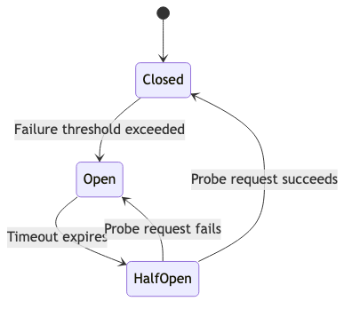
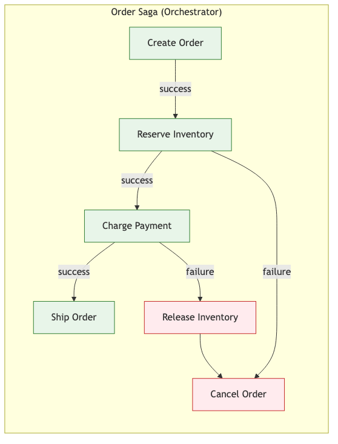
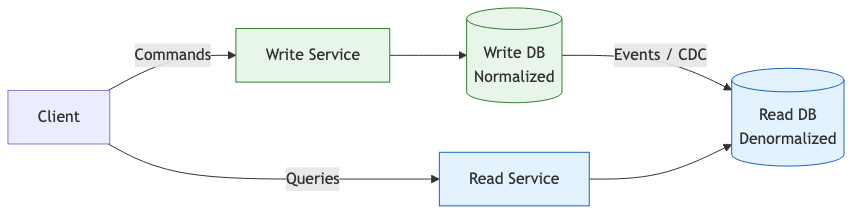

# 43 — Distributed Systems Patterns

Identify, implement, and validate resilience patterns in distributed systems using Claude Code.

---

## What You'll Learn

- Recognizing the fundamental challenges that make distributed systems different
- Implementing circuit breakers, retries, sagas, and bulkheads
- Applying event sourcing and CQRS where they provide real value
- Making every operation idempotent
- Designing for eventual consistency without confusing users
- Using Claude to audit your codebase for missing resilience patterns

**Prerequisites**: [04 — Architecture & Dependencies](04-architecture-and-dependencies.md), [37 — Systems Integration Analysis](37-systems-integration-analysis.md)

---

## The Fundamental Challenges

Distributed systems introduce problems that don't exist in single-process applications. These are not theoretical concerns — they affect every line of code you write.

**The network is unreliable.** Any call to another service can fail at any moment, including after the remote service has already done the work but before you received the response.

**Services fail independently.** Service A can be healthy while Service B is down. Your code must handle partial availability.

**Distributed state is hard.** You cannot have a consistent view of the world across multiple services at the same instant. Data will be stale. Updates will arrive out of order.

**Clocks drift.** You cannot rely on timestamps from different machines to determine ordering.

These four facts drive every pattern in this guide.

---

## Circuit Breaker Pattern

A circuit breaker prevents your service from repeatedly calling a failing dependency. Instead of waiting for timeouts on every request, it fails fast.



**Closed**: Requests flow normally. Failures are counted. When failures exceed a threshold, the breaker trips open.

**Open**: All requests fail immediately. After a configured timeout, the breaker moves to half-open.

**Half-Open**: A single probe request is allowed through. If it succeeds, the breaker closes. If it fails, it opens again.

Use circuit breakers on any synchronous call to another service, database connections, and external API calls.

```
Analyze our service-to-service calls for circuit breaker needs:

For each outbound call:
1. What's the current failure handling and timeout?
2. What happens to callers when this dependency is down?
3. What's the blast radius?

Recommend: failure threshold, time window, open duration,
and fallback behavior for each.
```

```typescript
class CircuitBreaker {
  private state: 'closed' | 'open' | 'half-open' = 'closed';
  private failureCount = 0;
  private lastFailureTime = 0;

  constructor(
    private readonly threshold: number = 5,
    private readonly resetTimeout: number = 30_000,
  ) {}

  async call<T>(fn: () => Promise<T>, fallback?: () => T): Promise<T> {
    if (this.state === 'open') {
      if (Date.now() - this.lastFailureTime > this.resetTimeout) {
        this.state = 'half-open';
      } else {
        if (fallback) return fallback();
        throw new Error('Circuit breaker is open');
      }
    }
    try {
      const result = await fn();
      this.failureCount = 0;
      this.state = 'closed';
      return result;
    } catch (error) {
      this.failureCount++;
      this.lastFailureTime = Date.now();
      if (this.failureCount >= this.threshold) this.state = 'open';
      if (fallback) return fallback();
      throw error;
    }
  }
}
```

---

## Retry Patterns

Retries can save you from transient failures or amplify an outage into a catastrophe. The difference is entirely in the implementation.

**Immediate retry**: Only for very fast, transient errors like dropped TCP connections.

**Fixed delay**: Simple but can cause synchronized retry waves.

**Exponential backoff**: Double the delay between retries (1s, 2s, 4s, 8s). Gives the failing service time to recover.

**Exponential backoff with jitter**: Add randomness to the backoff. This is almost always what you want — without jitter, all clients retry at the same time.

```python
import random, time

def retry_with_backoff(fn, max_retries=3, base_delay=1.0):
    for attempt in range(max_retries):
        try:
            return fn()
        except RetryableError:
            if attempt == max_retries - 1:
                raise
            delay = base_delay * (2 ** attempt)
            time.sleep(delay + random.uniform(0, delay * 0.5))
```

### When Retries Make Things Worse

- **Downstream is overloaded.** Retries add more load. This is a retry storm.
- **Operation is not idempotent.** If the first attempt succeeded but you didn't get the response, retrying creates a duplicate.
- **Every layer retries independently.** Gateway retries 3x, service retries 3x, DB client retries 3x = 27 attempts from one request.

```
Analyze our retry configuration across all services:

1. Which operations have retries? What strategies?
2. Are any retry chains multiplied across layers?
3. Are retried operations idempotent?
4. Is there jitter on the backoff?

Flag any configuration that could cause a retry storm.
```

---

## Saga Pattern

When a business operation spans multiple services, you cannot use a traditional database transaction. The saga pattern coordinates local transactions with compensation actions for rollback.



**Orchestration**: A central coordinator tells each service what to do. Easier to understand and debug. Use when the workflow has clear sequential steps.

**Choreography**: Each service listens for events and decides what to do. More resilient but harder to trace. Use when services are truly independent.

Every step needs a compensation action — not a database rollback, but a new action that semantically reverses the previous one. Compensation actions must themselves be idempotent.

```
Analyze our multi-service transactions:

1. What steps span multiple services?
2. Does each step have a compensation action?
3. What happens if a step or compensation fails?
4. Is saga state persisted for crash recovery?

Design a saga with explicit compensation for each step.
```

---

## Event Sourcing

Store the sequence of events that led to the current state, rather than the current state itself.

**Use it when**: You need audit trails (financial, healthcare, compliance), temporal queries ("what was the state on March 3rd?"), or you already publish events and have dual-write consistency issues.

**Skip it when**: Simple CRUD, data rarely changes, current state is all that matters, or the team has no experience maintaining event-sourced systems.

Events are append-only and not practical to query directly. Build projections (read models) that subscribe to the event stream and maintain queryable views.

```
Does our domain benefit from event sourcing?

1. Do we need an audit trail of all changes?
2. Do we need temporal queries?
3. Are we already publishing events with consistency issues?
4. Which bounded context would benefit most?
```

---

## CQRS

Separate the model for writing data from the model for reading data.



**Use it when**: Reads are 100x writes, complex queries need denormalized data, or combined with event sourcing where projections naturally create read models.

**Skip it when**: Read and write patterns are similar, simple CRUD, or a single database handles both workloads easily.

```
Analyze our data access patterns:

1. What's the read-to-write ratio for main entities?
2. Are reads slow because the model is optimized for writes?
3. Would separating models reduce or increase complexity?
```

---

## Idempotency

The single most important concept in distributed systems. Every operation that can be retried must produce the same result regardless of how many times it runs.

**Idempotency keys**: The client generates a unique key per logical operation. The server checks for duplicates before processing.

```python
def process_payment(idempotency_key: str, amount: float, account_id: str):
    existing = db.query(
        "SELECT result FROM idempotency_log WHERE key = %s",
        (idempotency_key,)
    )
    if existing:
        return existing.result

    result = actually_charge(amount, account_id)
    db.execute(
        "INSERT INTO idempotency_log (key, result) VALUES (%s, %s)",
        (idempotency_key, result)
    )
    return result
```

**Database upserts**: Use `INSERT ... ON CONFLICT UPDATE` instead of check-then-insert.

**Natural idempotency**: "Set balance to $100" is idempotent. "Add $100 to balance" is not. Prefer absolute state over relative changes.

```
Audit our codebase for idempotency:

1. Find all message handlers — what happens if delivered twice?
2. Find all state-modifying endpoints — do they use
   idempotency keys?
3. Find all retry configs — are retried operations idempotent?

For each gap, recommend a specific fix.
```

---

## Eventual Consistency

After a write, different services may have different views of the data. This is not a bug — it is a fundamental property.

**Communicate expectations to users.** If a post doesn't appear in the feed for 2 seconds, users need to understand that's expected.

**Handle stale reads.** Options: read-your-own-writes (route the writer's reads to the write DB briefly), optimistic UI (show the expected result, reconcile later), or version checking (detect stale data on the client).

**Design for convergence.** Use CRDTs, last-writer-wins with vector clocks, or application-level conflict resolution.

```
Find where our system has eventual consistency:

1. Where do we write to one DB and read from another?
2. What's the typical consistency lag?
3. Are there user-facing flows where stale reads cause confusion?

Recommend fixes for the most impactful issues.
```

---

## Bulkhead Pattern

Isolate components so a failure in one cannot exhaust resources needed by others. Use separate thread pools and connection pools per dependency.

```yaml
connection_pools:
  payment_service:
    max_connections: 20
    timeout_ms: 5000
  inventory_service:
    max_connections: 30
    timeout_ms: 3000
  user_service:
    max_connections: 25
    timeout_ms: 2000
```

If payment hangs and exhausts its 20 connections, inventory and user services are unaffected.

```
Analyze our resource pools for isolation gaps:

1. Do we use separate pools per downstream service?
2. Can one slow dependency consume all connections/threads?
3. Where should we add bulkhead boundaries?
```

---

## Distributed Locking

Use distributed locks only when you must ensure exactly one process performs an operation (job deduplication, leader election, preventing concurrent modifications).

**Prefer alternatives**: idempotent operations, work partitioning by shard, optimistic concurrency with version numbers. Distributed locks are fragile — holders crash, leases expire mid-work, and partitions cause split-brain.

**If you must lock**: Use lease-based locks that expire automatically. Add fencing tokens — monotonically increasing values that let downstream resources reject operations from stale lock holders.

```
Search the codebase for distributed locking:

1. Are we using Redis locks, DB advisory locks, or similar?
2. Do locks have TTLs? What if the holder crashes?
3. Are there lock-free alternatives?
4. Do we use fencing tokens?
```

---

## Analyzing Existing Systems

```
Analyze our codebase for distributed systems patterns:

1. Circuit breakers: where implemented, where missing?
2. Retry logic: strategies used, retry storms possible?
3. Sagas: multi-service transactions with compensation?
4. Idempotency: gaps in handlers and endpoints?
5. Bulkheads: pool isolation per dependency?
6. Timeouts: configured everywhere? Inner < outer?

Prioritize gaps by risk of production incident.
```

```
Create a resilience scorecard for each service:

- [ ] Circuit breakers on outbound calls
- [ ] Retry with backoff and jitter
- [ ] Timeouts on all external calls
- [ ] Idempotent message handlers
- [ ] Graceful degradation when dependencies are down
- [ ] Health check endpoint
- [ ] Bulkhead isolation of connection pools
- [ ] Dead letter queue for failed messages
- [ ] Structured logging with correlation IDs
- [ ] Alerts on error rate and latency
```

---

## Sample Conversation

> **You**: We're seeing intermittent checkout failures. Orders sometimes get created but payment isn't charged, or payment is charged twice. Can you analyze the flow?
>
> **Claude**: Let me trace the checkout flow across services...
> *reads order service, payment service, inventory service, event handlers*
>
> I found several issues:
>
> **The core problem**: The order service calls payment synchronously with no idempotency protection and no saga coordination.
>
> On a network timeout:
> 1. Order service sends charge request to payment service
> 2. Payment service processes the charge successfully
> 3. HTTP response is lost due to a network blip
> 4. Order service retries, payment charges again — no idempotency key
>
> On a payment failure:
> 1. Order is created (status: pending)
> 2. Payment call fails
> 3. Order stays "pending" forever — no compensation action
>
> **Fixes, in priority order:**
> 1. **Idempotency keys on payment calls** — generate from order ID, check for duplicates before charging
> 2. **Implement a checkout saga** — Create Order, Reserve Inventory, Charge Payment, Confirm. Each step gets a compensation action.
> 3. **Circuit breaker on payment** — fail fast instead of 30-second timeouts piling up
> 4. **Persist saga state** — recover from crashes mid-transaction
>
> Want me to start with idempotency keys? That's the quickest fix for double charges.

---

## Key Takeaways

1. The network is unreliable, services fail independently, state is distributed, and clocks drift — every design decision must account for these realities
2. Circuit breakers prevent cascade failures by failing fast when a dependency is unhealthy
3. Retries with backoff and jitter handle transient failures, but retries without idempotency create duplicates
4. The saga pattern coordinates multi-service transactions — every forward step needs a compensation action
5. Event sourcing and CQRS are powerful but complex — use them only for specific problems they solve
6. Idempotency is non-negotiable — every retryable operation must produce the same result regardless of repetition
7. Eventual consistency is a property to design for, not a problem to eliminate
8. Bulkheads isolate failures so one slow dependency cannot exhaust shared resources
9. Avoid distributed locks when possible — prefer idempotent operations or optimistic concurrency
10. Use Claude to audit your codebase for missing resilience patterns — the gaps you don't know about cause outages

---

**Next**: [44 — Frontend Architecture](44-frontend-architecture.md)
