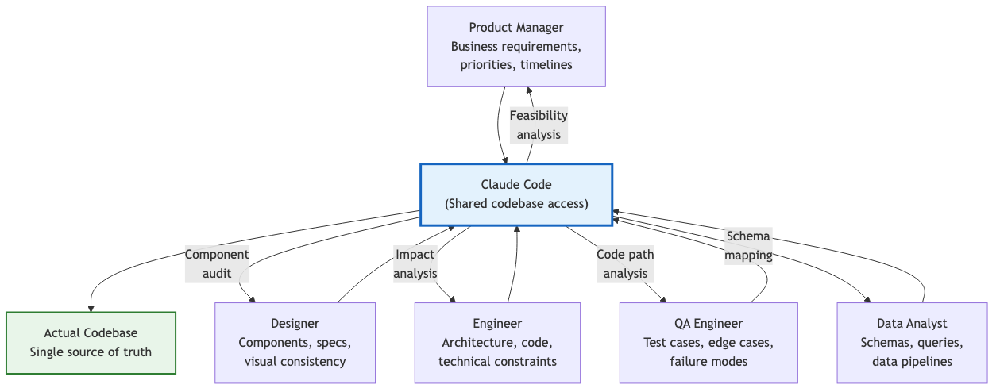
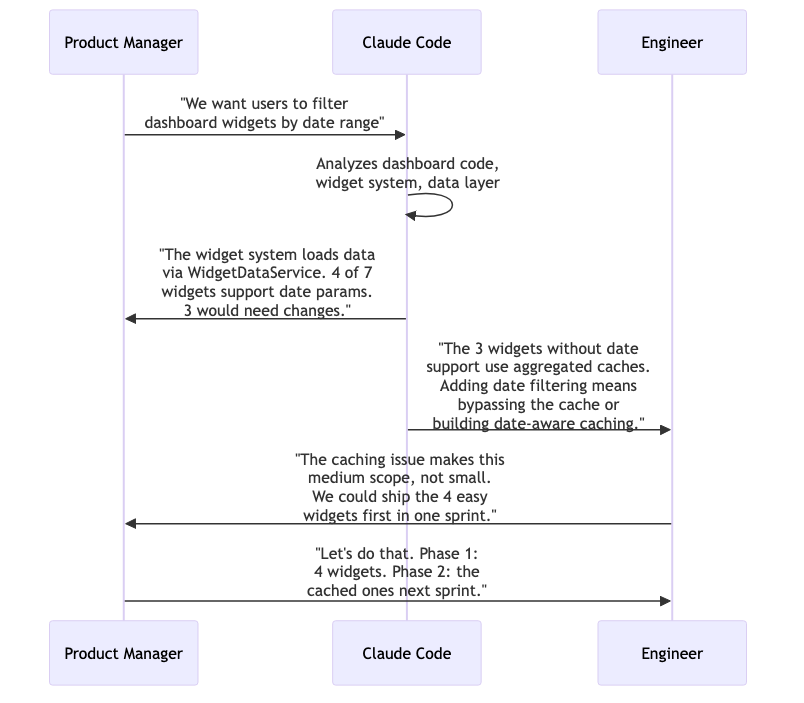

# 46 — Cross-Functional Collaboration

Using Claude Code as a shared tool that bridges the gaps between engineers, product managers, designers, QA, and data analysts working on the same codebase.

---

## What You'll Learn

- Why cross-functional communication breaks down and how Claude can bridge the gaps
- How product managers can assess technical feasibility without reading code
- How designers can audit design system implementation and propose changes that map to real components
- How QA engineers can generate test cases and understand code paths
- How data analysts can trace data pipelines and validate queries against actual schemas
- Translating between technical and business language in both directions
- Using Claude for requirements analysis, collaborative estimation, and status communication
- When Claude helps cross-functional work and when it gets in the way

**Prerequisites**: [17 — Collaboration & Team Workflows](17-collaboration-and-team-workflows.md) (team-level Claude practices) and [03 — Codebase Orientation](03-codebase-orientation.md) (understanding how Claude explores a codebase)

---

## The Cross-Functional Gap

Every role on a product team has different vocabulary, different tools, and different priorities:

- **Engineers** think in code, systems, and technical constraints
- **Product managers** think in user stories, business value, and timelines
- **Designers** think in components, interactions, and visual consistency
- **QA engineers** think in test coverage, edge cases, and failure modes
- **Data analysts** think in schemas, queries, and data integrity

These differences create friction. A PM asks "how hard is this?" and gets a vague answer because the engineer hasn't traced the actual code paths yet. A designer proposes a UI change without knowing the frontend architecture uses a completely different component model. A QA engineer writes test cases based on requirements docs that don't reflect what the code actually does.

Claude can sit in the middle, reading the actual codebase and translating between these perspectives.



The key insight: Claude reads the code so non-engineers don't have to, and it translates the code so engineers don't have to spend time explaining it.

---

## For Product Managers

### Assessing Technical Feasibility

PMs often need to know "how hard is this?" before committing to a feature. Instead of interrupting an engineer, a PM can ask Claude directly:

```
We're considering adding bulk export for user reports.
Users would select multiple reports and download them
as a ZIP file.

Look at the current report generation code and tell me:
1. How are reports generated today?
2. What infrastructure exists that we could reuse?
3. What would need to be built from scratch?
4. Are there any technical constraints that would
   limit this feature (file size, memory, timeouts)?
5. Give me a rough sense of scope: small (a few days),
   medium (a sprint), or large (multiple sprints).
```

This gives the PM a grounded answer based on actual code, not guesswork.

### Translating Business Requirements into Technical Context

When writing a feature spec, a PM can use Claude to anchor it in reality:

```
I'm writing a spec for this feature: "Allow admins to
configure notification preferences per team."

Look at the current notification system and user/team
models, then help me understand:
1. What data models exist that are relevant?
2. What configuration options already exist?
3. What would this feature need that doesn't exist yet?
4. Are there any existing patterns for per-team settings
   I should reference in the spec?
```

### Understanding Technical Decisions

When engineers make technical decisions that affect the product roadmap, PMs need to understand the "why":

```
The engineering team says we need to migrate from
PostgreSQL full-text search to Elasticsearch before
we can build the advanced search feature. Explain
to me in business terms:
1. What limitation are they hitting?
2. Why can't the current approach handle it?
3. What does the migration buy us beyond this feature?
4. What are the risks if we skip it?

Look at the actual search implementation to base
your answer on facts, not generalities.
```

---

## For Designers

### Auditing Design System Implementation

Designers create component specs, but the implementation sometimes drifts. Claude can close that gap:

```
I'm auditing our Button component implementation
against the design system spec.

The spec says:
- 3 variants: primary, secondary, ghost
- 4 sizes: sm, md, lg, xl
- States: default, hover, active, disabled, loading
- Icon support: left icon, right icon, icon-only

Look at the actual Button component code and tell me:
1. Which variants and sizes are implemented?
2. Which states are handled?
3. Is icon support implemented as specified?
4. Are there any props or behaviors in the code that
   aren't in the spec (implementation drift)?
5. Are there any inconsistencies in how the component
   is used across the codebase?
```

### Understanding Frontend Architecture

Designers who understand the component structure can propose designs that are easier to implement:

```
I'm designing a new settings page. Before I start,
help me understand:
1. What layout components exist (sidebar, panels, grids)?
2. What form components exist (inputs, selects, toggles)?
3. How are settings pages currently structured in code?
4. Are there any reusable patterns I should design around?

Show me the component names and their props so I can
design with the actual building blocks.
```

### Checking Component Usage Consistency

```
Find every place where a modal/dialog component is used
in the codebase. For each one, tell me:
1. What component is used (is it always the same one?)
2. What size/variant is chosen
3. How the close behavior works
4. Whether there's a consistent pattern or if every
   modal does its own thing

I want to know if we need to standardize modal behavior.
```

---

## For QA Engineers

### Generating Test Cases from Code

QA engineers can use Claude to generate test cases grounded in what the code actually does, not just what the requirements say:

```
Look at the checkout flow implementation — from cart
through payment to order confirmation. Generate test
cases for:
1. Happy path (normal purchase)
2. Edge cases (empty cart, single item, max items)
3. Error handling (payment failure, timeout, invalid input)
4. Boundary conditions (price = 0, quantity limits)
5. Concurrency issues (double-submit, session expiry)

For each test case, reference the specific code path
that handles it (or note if there's no handling).
```

### Understanding Code Paths That Need Testing

```
We just merged a PR that changes the user permissions
system. Look at the diff and tell me:
1. What code paths were changed?
2. What existing functionality could break?
3. What test cases would cover the changes?
4. Are there any paths that aren't covered by
   existing tests?

Focus on the blast radius — what else touches the
code that changed.
```

### Regression Test Design

```
We keep finding bugs in the invoice generation feature.
Look at the code, the recent git history for that module,
and any existing tests. Then:
1. What areas have changed most frequently (bug-prone)?
2. What test coverage exists today?
3. Where are the gaps?
4. Propose a regression test suite that would catch
   the types of bugs we've been seeing.
```

### Exploratory Testing Guidance

```
I'm doing exploratory testing on the new reporting
dashboard. I've already tested the basics. Look at
the code and suggest:
1. Non-obvious interactions I should test
2. State combinations that might cause issues
3. Browser/device-specific concerns
4. Data edge cases (empty data, huge datasets,
   special characters in names)
5. Timing-dependent behavior (loading states, caching)
```

---

## For Data Analysts

### Understanding Data Pipelines

```
I need to understand where the "monthly active users"
metric comes from. Trace the data pipeline:
1. What events are captured and where?
2. How are they stored (raw events, aggregated tables)?
3. What transformations happen between capture and
   the final metric?
4. Are there any filters or exclusions applied?
5. Where could data loss or double-counting happen?
```

### Validating SQL Queries Against the Schema

```
I wrote this query to calculate revenue by product
category for the last quarter:

[paste SQL]

Look at the actual database schema and tell me:
1. Are my JOINs correct? Am I missing any needed joins?
2. Am I using the right column for the date filter?
3. Could this query produce duplicate rows?
4. Are there NULL values I'm not handling?
5. Does the schema have any gotchas (soft deletes,
   timezone handling, enum values) that affect this?
```

### Tracing Data Origins

```
The "customer_lifetime_value" field shows up in our
analytics dashboard. Trace it back to its source:
1. Where is it calculated?
2. What raw data feeds into it?
3. When and how often is it updated?
4. What business logic is applied (discounts,
   refunds, currency conversion)?
5. Is there documentation or comments explaining
   the formula?
```

### Understanding Schema Relationships

```
I need to build a report that joins customer data
with order data with product data. Map out:
1. The relevant tables and their relationships
2. The join keys between them
3. Any many-to-many relationships I need to handle
4. Fields that might have different meanings in
   different tables (e.g., "status" in orders vs.
   "status" in products)
```

---

## Translating Between Roles

### Technical Decisions to Business Impact

Engineers make decisions that have business implications. Claude can translate:

```
Our team decided to rewrite the search indexing
pipeline from batch processing to real-time streaming.
Explain this decision for our PM and stakeholders:
1. What will users notice changing?
2. What business metrics will improve?
3. What's the timeline impact on other roadmap items?
4. What are the risks in non-technical terms?

Base this on the actual code and architecture,
not abstract descriptions.
```

### Business Requirements to Technical Specs

PMs write requirements. Engineers need specs. Claude bridges them:

```
Here's the product requirement:
"Users should be able to schedule reports to run
automatically and receive them via email."

Look at the codebase and translate this into a
technical spec:
1. What existing systems does this touch?
2. What new components are needed?
3. What's the data model?
4. What are the API endpoints?
5. What infrastructure changes are needed
   (job scheduler, email service)?
6. What are the failure modes and how should
   each be handled?
```

---

## Requirements Analysis with Claude

When a new feature request comes in, use Claude to do a thorough impact analysis before the team estimates:

```
New feature request: "Add two-factor authentication
(2FA) for admin users."

Analyze the codebase and tell me:

1. WHAT CHANGES: What files and modules need to change?
   List them with a brief description of each change.

2. BLAST RADIUS: What existing functionality could
   be affected? What other systems depend on the
   auth flow?

3. EDGE CASES: What scenarios need special handling?
   (account recovery, lost devices, session management,
   API keys, etc.)

4. TESTING STRATEGY: What test cases are needed?
   What existing tests need updating?

5. DEPENDENCIES: Do we need any new libraries,
   services, or infrastructure?

6. UNKNOWNS: What questions need human answers
   before this can be implemented?
```

This gives the entire team — PM, engineer, QA — a shared understanding of what the feature actually involves.

---

## Collaborative Estimation

### The Three-Way Conversation

The most effective cross-functional estimation combines PM context, engineering knowledge, and Claude's codebase analysis:



### Running an Estimation Session

```
We're estimating this feature: [description].

The PM says: [PM's context — why it matters,
who wants it, what's the deadline]

The engineer says: [engineer's initial gut feel
or concerns]

Now analyze the codebase and give us:
1. A breakdown of the work into discrete tasks
2. For each task, what needs to happen technically
3. Dependencies between tasks
4. What can be parallelized
5. Where the uncertainty is highest

Don't give time estimates — we'll decide those.
Just give us the task breakdown and complexity factors.
```

---

## Shared Context with CLAUDE.md

### Cross-Functional Glossary

Add a glossary to your CLAUDE.md that both technical and non-technical team members can reference:

```
# Domain Glossary (for CLAUDE.md)

## Business Terms
- **ARR**: Annual Recurring Revenue. Calculated in
  `lib/metrics/revenue.ts` using the `subscriptions` table.
- **Churn**: When a customer cancels. Tracked via the
  `subscription_events` table, event_type = 'cancelled'.
- **MRR**: Monthly Recurring Revenue. ARR / 12. See
  `calculateMRR()` in `lib/metrics/revenue.ts`.

## Technical Terms That Non-Engineers Should Know
- **Migration**: A versioned change to the database
  structure. Found in `db/migrations/`.
- **Cache invalidation**: When we clear stored data so
  fresh data gets loaded. Relevant when data seems stale.
- **Feature flag**: A toggle that enables/disables a
  feature without deploying code. Managed in
  `config/feature_flags.yml`.

## Terms That Mean Different Things to Different People
- **"Deploy"**: Engineers mean pushing code to servers.
  PMs mean the feature is available to users. These are
  NOT always the same (feature flags).
- **"Done"**: Engineers mean code is merged. QA means
  it's tested. PM means users can use it. Define which
  one you mean.
```

### Domain Model Documentation

```
Analyze our data models and generate a domain model
summary that both engineers and non-engineers can read.
For each major entity:
1. What it represents in business terms
2. Its key attributes (plain language)
3. How it relates to other entities
4. Where it lives in code

Keep the language simple. A PM should be able to read
this and understand our data model.
```

---

## Status Communication

### Generating Non-Technical Status Updates

After a sprint of technical work, use Claude to summarize for stakeholders:

```
Look at the git log for the last two weeks on this
repo. Summarize what changed in terms a PM or
stakeholder would care about:
1. What user-facing changes were made?
2. What bugs were fixed (and what was the user impact)?
3. What infrastructure improvements were made
   (and why they matter for the product)?
4. What's in progress but not yet complete?

Skip internal refactors unless they enable something
the business cares about. Use plain language.
```

### Sprint Review Preparation

```
We have a sprint review tomorrow. Based on the commits
and PRs merged this sprint, help me prepare:
1. A 3-bullet summary of what we shipped
2. A demo script showing the key changes
3. Talking points for technical decisions that
   stakeholders might ask about
4. Known issues or caveats to mention proactively
```

### Incident Summaries for Non-Technical Audiences

```
We had an incident yesterday. Here's the technical
postmortem: [paste or point to file].

Write a summary for non-technical stakeholders:
1. What happened (user impact, not technical details)
2. How long it lasted
3. How many users were affected
4. What we did to fix it
5. What we're doing to prevent it from happening again

No jargon. No blame. Focus on impact and resolution.
```

---

## When Claude Helps vs. Hinders Cross-Functional Work

### Claude Is a Bridge, Not a Wall

Claude should make it easier for people to collaborate, not replace the collaboration itself.

**Claude helps when:**
- A PM needs a quick feasibility check before a planning meeting
- A designer wants to verify component implementation without waiting for an engineer
- A QA engineer needs to understand code paths to write better test cases
- An analyst needs to trace data flow to validate a query
- Anyone needs a translation between technical and business language

**Claude hinders when:**
- People use it to avoid talking to each other directly
- A PM asks Claude instead of discussing trade-offs with the engineer
- A designer gets Claude's analysis but skips the conversation about constraints
- Teams use Claude summaries as a substitute for sprint reviews and demos

### The Human Conversation Still Matters

Claude can prepare you for a conversation, but it should not replace the conversation:

```
I'm about to meet with the design team about our
component library. Prepare me:
1. What components have drifted from their design specs?
2. Where are the biggest inconsistencies?
3. What would be the highest-impact fixes?

I'll use this to have a productive conversation
with the designers — not to tell them what to do.
```

### A Rule of Thumb

Use Claude to **gather context before** a cross-functional conversation, not to **avoid** one. The best outcomes happen when everyone has the same information and then discusses it together.

| Situation | Use Claude For | Still Talk To |
|-----------|---------------|---------------|
| Feasibility question | Initial analysis of the codebase | The engineer, to discuss trade-offs |
| Design implementation check | Audit of current component state | The designer, to align on priorities |
| Test coverage gap | Identifying untested paths | The engineer, to understand intent |
| Data pipeline question | Tracing the flow in code | The data engineer, to confirm assumptions |
| Estimation | Task breakdown and complexity factors | The whole team, to decide scope |

---

## Sample Conversation

> **You**: We got a feature request from the PM: "Let users export their dashboard as a PDF." Before our planning meeting, I want to understand what this actually involves. Analyze the dashboard code and break it down.
>
> **Claude**: Let me look at the dashboard implementation...
>
> *reads dashboard components, rendering logic, data fetching, and existing export functionality*
>
> Here's what's involved:
>
> **What exists today:**
> - Dashboards render using React components in `src/components/dashboard/`
> - There's already a CSV export for individual widgets (`src/services/export/csvExport.ts`)
> - No PDF generation capability exists in the codebase
>
> **What needs to happen:**
> 1. Add a PDF generation library (likely puppeteer or a headless Chrome solution for accurate rendering)
> 2. Create a server-side rendering path for dashboards (currently client-only)
> 3. Handle dynamic content: 3 of 8 widget types load data asynchronously with loading states
> 4. Handle user-specific theming (dark mode, custom colors)
>
> **Blast radius:**
> - The dashboard layout uses CSS Grid with `fr` units that may not render identically in headless Chrome
> - Two widgets use canvas-based charts (the charting library has known print/export quirks)
> - Dashboard permissions would need to be enforced on the export endpoint
>
> **Edge cases:**
> - Dashboards with 20+ widgets could produce very large PDFs
> - Widgets with interactive filters -- what state gets exported?
> - Real-time widgets (live metrics) -- what timestamp gets captured?
>
> **Unknowns that need PM input:**
> - Should the export look exactly like the screen, or can it be a simplified layout?
> - Is this a synchronous download or an async job with email delivery?
> - Do we need to support custom page sizes or orientation?
>
> This is medium-to-large scope. The server-side rendering path is the biggest piece of work and has the most uncertainty.
>
> **You**: That's exactly what I needed. Can you also write up a non-technical summary I can share with the PM before our meeting?
>
> **Claude**: Here's a summary for the PM:
>
> **Dashboard PDF Export -- Technical Assessment**
>
> This feature is feasible but has meaningful complexity. The main challenge is that our dashboards are built to render in a browser, and generating a PDF requires rendering them on the server -- which is a new capability we'd need to build.
>
> Key questions for scoping:
> - Does the PDF need to match the screen exactly, or can we simplify the layout? (Exact match is significantly harder.)
> - For large dashboards, should the PDF download immediately or should we email it when ready? (Immediate download has size and timeout limits.)
> - What should happen with interactive widgets that have filters or real-time data?
>
> Rough scope: If we go with a simplified layout and async delivery, this is a sprint of work. If we need exact visual fidelity and instant download, it's closer to two or three sprints due to the server-side rendering work.
>
> I'd suggest we discuss these questions at planning and then have engineering spike the server-side rendering approach for half a sprint before committing to a timeline.

---

## Key Takeaways

1. Claude bridges cross-functional gaps by reading code and translating between technical and business perspectives -- PMs, designers, QA, and analysts can all query the codebase through Claude
2. Product managers can assess feasibility, understand technical decisions, and ground their specs in the actual codebase without needing to read code themselves
3. Designers can audit component implementation against design specs and understand the frontend architecture to propose implementable designs
4. QA engineers can generate test cases grounded in real code paths, not just requirements documents, catching gaps that spec-based testing misses
5. Data analysts can trace data pipelines end-to-end, validate queries against actual schemas, and understand transformations that affect their metrics
6. Cross-functional glossaries in CLAUDE.md prevent miscommunication by defining terms that mean different things to different roles
7. Use Claude to prepare for conversations, not to replace them -- the best cross-functional outcomes come from informed people discussing trade-offs together

---

**Next**: Back to the [main page](../README.md) to explore all guides by track.
