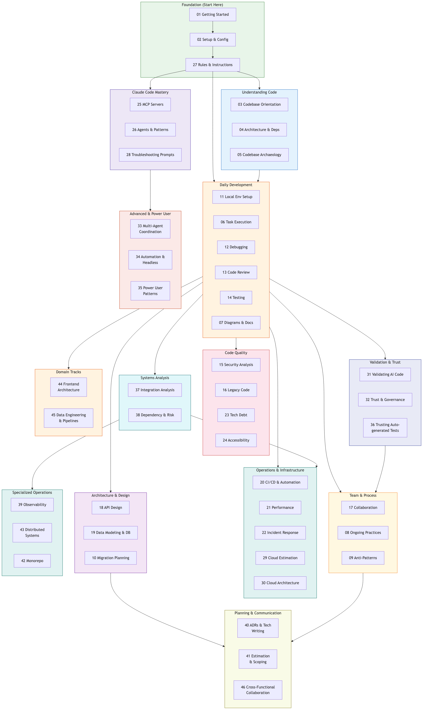

# Navigating Complex Codebases with Claude Code

A practical, modular guide for using [Claude Code](https://docs.anthropic.com/en/docs/claude-code) to understand, navigate, and work effectively in large or unfamiliar codebases.

46 guides organized into tracks you can follow based on your role and what you're trying to do. Start with the Foundation, then follow the track that matches your needs.

---

## Roadmap



---

## Tracks

### Foundation (Start Here)

Everyone should read these first. They cover installation, configuration, and how to give Claude effective instructions.

| # | Guide | Description |
|---|-------|-------------|
| 01 | [Getting Started](01-getting-started.md) | Installation, first launch, key concepts, your first 5-minute exploration |
| 02 | [Setup & Configuration](02-setup-and-configuration.md) | CLAUDE.md, permissions, the `.claude/` directory, MCP servers, team workflows |
| 27 | [Rules & Instructions](27-rules-and-instructions.md) | CLAUDE.md hierarchy, writing effective rules, shaping behavior, hooks |

### Understanding Code

For when you're joining a codebase or need to build a deep mental model before making changes.

| # | Guide | Description |
|---|-------|-------------|
| 03 | [Codebase Orientation](03-codebase-orientation.md) | Big-picture analysis, entry points, request tracing, strategies by project type |
| 04 | [Architecture & Dependencies](04-architecture-and-dependencies.md) | Build systems, databases, dependency analysis, architecture diagrams |
| 05 | [Codebase Archaeology](05-codebase-archaeology.md) | Git history, pain points, cross-cutting concerns, tribal knowledge |

### Daily Development

The core workflow — getting a project running, making changes, debugging, reviewing, and testing.

| # | Guide | Description |
|---|-------|-------------|
| 11 | [Local Environment Setup](11-local-environment-setup.md) | From `git clone` to running — Docker, databases, services, troubleshooting setup failures |
| 06 | [Task Execution](06-task-execution.md) | Plan mode, tests-first, blast radius, making changes, working with PRs |
| 12 | [Debugging & Troubleshooting](12-debugging-and-troubleshooting.md) | Systematic debugging — logs, stack traces, performance, flaky tests, the debugging decision tree |
| 13 | [Code Review](13-code-review.md) | Reviewing PRs — understanding diffs, tracing impact, spotting issues, writing constructive comments |
| 14 | [Testing Strategies](14-testing-strategies.md) | Writing effective tests — unit/integration/e2e, edge cases, mocking, hard-to-test code |
| 07 | [Diagrams & Documentation](07-diagrams-and-documentation.md) | Mermaid diagram catalog, generating docs, onboarding materials |

### Code Quality

Guides for improving and maintaining code health — security, legacy code, tech debt, and accessibility.

| # | Guide | Description |
|---|-------|-------------|
| 15 | [Security Analysis](15-security-analysis.md) | Auditing for vulnerabilities — OWASP Top 10, auth flows, injection risks, dependency CVEs |
| 16 | [Working with Legacy Code](16-working-with-legacy-code.md) | Safely modifying untested code — characterization tests, strangler fig, incremental improvement |
| 23 | [Technical Debt Management](23-technical-debt-management.md) | Systematic debt management — identifying, measuring, prioritizing, and paying down tech debt |
| 24 | [Accessibility Auditing](24-accessibility-auditing.md) | WCAG compliance — semantic HTML, keyboard navigation, screen readers, color contrast |

### Validation & Trust

Ensuring AI-generated code is correct, safe, and production-ready — from individual verification to team-wide governance.

| # | Guide | Description |
|---|-------|-------------|
| 31 | [Validating AI-Generated Code](31-validating-ai-generated-code.md) | The verification pyramid — tests, static analysis, manual review, adversarial testing, production monitoring |
| 32 | [Trust & Governance](32-trust-and-governance.md) | Progressive trust, team policies, audit trails, compliance (SOC 2, HIPAA, PCI), measuring AI code quality |
| 36 | [Trusting Autogenerated Tests](36-trusting-autogenerated-tests.md) | The test trust ladder — red-green verification, mutation testing, assertion quality, testing complex systems |

### Systems Analysis

Understanding and verifying how components interact — integration points, failure modes, dependency risks.

| # | Guide | Description |
|---|-------|-------------|
| 37 | [Systems Integration Analysis](37-systems-integration-analysis.md) | Mapping integrations, tracing data flows, contract testing, failure mode analysis, event-driven systems |
| 38 | [Dependency & Risk Analysis](38-dependency-and-risk-analysis.md) | Dependency health, supply chain security, vendor lock-in, license compliance, upgrade strategies |

### Architecture & Design

For building new systems or evolving existing ones — APIs, data models, and large-scale migrations.

| # | Guide | Description |
|---|-------|-------------|
| 18 | [API Design & Evolution](18-api-design-and-evolution.md) | Designing APIs — REST/GraphQL conventions, versioning, backward compatibility, deprecation strategies |
| 19 | [Data Modeling & Database Design](19-data-modeling-and-database-design.md) | Schema design — normalization, indexing strategies, query optimization, ER modeling |
| 10 | [Migration Planning](10-migration-planning.md) | Assessing scope, incremental strategies, database migrations, rollback planning |

### Operations & Infrastructure

CI/CD pipelines, performance, incident response, and cloud infrastructure — from estimation to architecture.

| # | Guide | Description |
|---|-------|-------------|
| 20 | [CI/CD & Automation](20-ci-cd-and-automation.md) | Pipelines — GitHub Actions, debugging builds, deployment strategies, integrating Claude into automation |
| 21 | [Performance Optimization](21-performance-optimization.md) | Proactive optimization — profiling, caching strategies, load testing, database tuning |
| 22 | [Incident Response](22-incident-response.md) | Production incidents — triage, rollback decisions, postmortems, on-call with Claude |
| 29 | [Cloud Resource Estimation](29-cloud-resource-estimation.md) | Capacity planning — traffic modeling, compute/storage/network math, cost forecasting, scaling strategies |
| 30 | [Cloud Architecture & Infrastructure](30-cloud-architecture-and-infrastructure.md) | Building reliable cloud systems — IaC, networking, containers, reliability patterns, observability |

### Team & Process

Scaling Claude Code across a team — collaboration workflows, sustainable habits, and common pitfalls.

| # | Guide | Description |
|---|-------|-------------|
| 17 | [Collaboration & Team Workflows](17-collaboration-and-team-workflows.md) | Team practices — shared CLAUDE.md, onboarding, pair programming, knowledge capture |
| 08 | [Ongoing Practices](08-ongoing-practices.md) | Session management, CLAUDE.md evolution, verification habits, knowledge building |
| 09 | [Anti-Patterns](09-anti-patterns.md) | Common mistakes with examples, consequences, and fixes |

### Claude Code Mastery

Deeper understanding of how Claude Code works — MCP connectivity, agentic patterns, and fixing prompt issues.

| # | Guide | Description |
|---|-------|-------------|
| 25 | [MCP Servers](25-mcp-servers.md) | Model Context Protocol — connecting Claude to databases, APIs, and external tools |
| 26 | [AI Agents & Agentic Patterns](26-ai-agents-and-agentic-patterns.md) | What agents really are, Claude Code as an agent, subagents, headless mode, multi-agent patterns |
| 28 | [Troubleshooting Prompt Results](28-troubleshooting-prompt-results.md) | Diagnosing bad output — root causes, before/after prompts, the prompt improvement checklist |

### Advanced & Power User

For experienced Claude Code users ready to coordinate multiple agents, automate workflows, and push the limits.

| # | Guide | Description |
|---|-------|-------------|
| 33 | [Multi-Agent Coordination](33-multi-agent-coordination.md) | Parallel agents, worktrees, task decomposition, conflict resolution, cross-repo coordination |
| 34 | [Automation & Headless Workflows](34-automation-and-headless-workflows.md) | CI/CD recipes, automated PR review, scheduled tasks, custom pipelines, safety guardrails |
| 35 | [Power User Patterns](35-power-user-patterns.md) | Context management, session strategies, custom MCP servers, hooks, advanced prompting, internal tooling |

### Specialized Operations

Deep dives into observability, distributed systems resilience, and monorepo management.

| # | Guide | Description |
|---|-------|-------------|
| 39 | [Observability & Monitoring](39-observability-and-monitoring.md) | Logs, metrics, traces — structured logging, alerting, dashboards, SLIs/SLOs, error budgets |
| 43 | [Distributed Systems Patterns](43-distributed-systems-patterns.md) | Circuit breakers, sagas, event sourcing, CQRS, idempotency, eventual consistency, bulkheads |
| 42 | [Monorepo & Multi-Project Management](42-monorepo-and-multi-project.md) | Nx/Turborepo/Bazel, affected analysis, cross-package refactoring, CI/CD for monorepos |

### Planning & Communication

Architecture decisions, estimation, technical writing, and working across roles.

| # | Guide | Description |
|---|-------|-------------|
| 40 | [Architecture Decision Records & Technical Writing](40-architecture-decision-records.md) | ADRs, RFCs, design docs, technical writing principles, documenting existing decisions |
| 41 | [Estimation & Scoping](41-estimation-and-scoping.md) | Codebase-informed estimates, task decomposition, range estimation, scoping features, spike analysis |
| 46 | [Cross-Functional Collaboration](46-cross-functional-collaboration.md) | Working with PMs, designers, QA — translating between roles, shared context, collaborative estimation |

### Domain Tracks

Specialized guides for frontend and data engineering workflows.

| # | Guide | Description |
|---|-------|-------------|
| 44 | [Frontend Architecture](44-frontend-architecture.md) | Component design, state management, design systems, bundle optimization, frontend testing |
| 45 | [Data Engineering & Pipelines](45-data-engineering-and-pipelines.md) | ETL/ELT, pipeline orchestration, data quality, schema evolution, warehouse design, data lineage |

---

## Paths by Role

Not sure where to start? Find your situation below and follow the recommended path.

### Individual Contributor (New to Claude Code)

You've never used Claude Code and want to get productive fast.

```
Foundation (01 → 02 → 27) → Daily Development (11 → 06 → 12)
  → Validation & Trust (31) → Claude Code Mastery (28)
```

### Developer Joining a New Codebase

You know Claude Code but need to ramp up on an unfamiliar project.

```
Foundation (02 → 27) → Understanding Code (03 → 04 → 05)
  → Daily Development (11 → 06) → Validation & Trust (31)
```

### Senior Developer / Tech Lead

You're guiding architecture decisions, reviewing code, and setting team standards.

```
Foundation (01 → 02 → 27) → Understanding Code (03 → 04)
  → Systems Analysis (37 → 38) → Validation & Trust (31 → 32 → 36)
  → Architecture & Design (18 → 19) → Planning (40 → 41)
  → Code Quality (15 → 23) → Team & Process (17 → 08)
```

### DevOps / Platform Engineer

You're responsible for CI/CD, infrastructure, cloud resources, and reliability.

```
Foundation (01 → 02 → 27) → Systems Analysis (37 → 38)
  → Operations & Infrastructure (20 → 29 → 30 → 21 → 22)
  → Specialized Ops (39 → 43) → Advanced (34 → 33)
```

### Team Lead Rolling Out Claude Code

You're introducing Claude Code to your team and want to set up shared workflows.

```
Foundation (01 → 02 → 27) → Validation & Trust (31 → 32)
  → Team & Process (17 → 08 → 09) → Claude Code Mastery (25 → 26 → 28)
```

### Power User / Automation Engineer

You're already proficient with Claude Code and want to maximize throughput and automate everything possible.

```
Foundation (27) → Claude Code Mastery (25 → 26 → 28)
  → Advanced (33 → 34 → 35) → Validation & Trust (31 → 32)
```

### Developer Working on Legacy Systems

You're maintaining or modernizing old, complex, or poorly-documented code.

```
Foundation (01 → 02 → 27) → Understanding Code (03 → 04 → 05)
  → Validation & Trust (31) → Code Quality (16 → 23)
  → Daily Development (12 → 14) → Architecture & Design (10)
```

### Full-Stack Developer (Building New Features)

You're designing and implementing features end-to-end.

```
Foundation (01 → 02 → 27) → Daily Development (06 → 14 → 12)
  → Validation & Trust (31) → Architecture & Design (18 → 19)
  → Domains (44) → Code Quality (15 → 24)
```

### Frontend Developer

You're focused on UI, components, state management, and frontend performance.

```
Foundation (01 → 02 → 27) → Daily Development (11 → 06 → 12)
  → Domains (44) → Code Quality (24 → 15) → Validation & Trust (31 → 36)
```

### Data Engineer

You're building and maintaining data pipelines, warehouses, and data quality systems.

```
Foundation (01 → 02 → 27) → Understanding Code (03 → 04)
  → Domains (45) → Architecture & Design (19) → Systems Analysis (37)
  → Validation & Trust (31 → 36)
```

### Product Manager

You work with engineers and want to use Claude for feasibility analysis, scoping, and communication.

```
Foundation (01 → 02) → Planning (41 → 46) → Understanding Code (03)
```

### QA Engineer

You're responsible for test strategy, automation, and quality across the product.

```
Foundation (01 → 02 → 27) → Daily Development (14 → 12)
  → Validation & Trust (31 → 36) → Planning (46)
```

---

## Quick Reference

Jump directly to the guide you need:

| I need to... | Guide |
|---|---|
| Install and get started | [01 — Getting Started](01-getting-started.md) |
| Configure Claude for my project | [02 — Setup & Configuration](02-setup-and-configuration.md) |
| Write effective CLAUDE.md rules | [27 — Rules & Instructions](27-rules-and-instructions.md) |
| Understand an unfamiliar codebase | [03 — Codebase Orientation](03-codebase-orientation.md) |
| Map out architecture and dependencies | [04 — Architecture & Dependencies](04-architecture-and-dependencies.md) |
| Dig into git history and past decisions | [05 — Codebase Archaeology](05-codebase-archaeology.md) |
| Get a project running locally | [11 — Local Environment Setup](11-local-environment-setup.md) |
| Plan and execute a code change | [06 — Task Execution](06-task-execution.md) |
| Debug a tricky issue | [12 — Debugging & Troubleshooting](12-debugging-and-troubleshooting.md) |
| Review a pull request | [13 — Code Review](13-code-review.md) |
| Write or improve tests | [14 — Testing Strategies](14-testing-strategies.md) |
| Generate diagrams or docs | [07 — Diagrams & Documentation](07-diagrams-and-documentation.md) |
| Audit for security vulnerabilities | [15 — Security Analysis](15-security-analysis.md) |
| Safely modify legacy code | [16 — Working with Legacy Code](16-working-with-legacy-code.md) |
| Manage technical debt | [23 — Technical Debt Management](23-technical-debt-management.md) |
| Audit for accessibility | [24 — Accessibility Auditing](24-accessibility-auditing.md) |
| Design or evolve an API | [18 — API Design & Evolution](18-api-design-and-evolution.md) |
| Design a database schema | [19 — Data Modeling & Database Design](19-data-modeling-and-database-design.md) |
| Plan a large migration | [10 — Migration Planning](10-migration-planning.md) |
| Set up or fix CI/CD | [20 — CI/CD & Automation](20-ci-cd-and-automation.md) |
| Optimize performance | [21 — Performance Optimization](21-performance-optimization.md) |
| Handle a production incident | [22 — Incident Response](22-incident-response.md) |
| Estimate cloud resources and costs | [29 — Cloud Resource Estimation](29-cloud-resource-estimation.md) |
| Design cloud infrastructure | [30 — Cloud Architecture & Infrastructure](30-cloud-architecture-and-infrastructure.md) |
| Set up team workflows | [17 — Collaboration & Team Workflows](17-collaboration-and-team-workflows.md) |
| Build sustainable habits | [08 — Ongoing Practices](08-ongoing-practices.md) |
| Avoid common mistakes | [09 — Anti-Patterns](09-anti-patterns.md) |
| Connect Claude to external tools (MCP) | [25 — MCP Servers](25-mcp-servers.md) |
| Understand agents and agentic patterns | [26 — AI Agents & Agentic Patterns](26-ai-agents-and-agentic-patterns.md) |
| Verify AI-generated code is correct | [31 — Validating AI-Generated Code](31-validating-ai-generated-code.md) |
| Establish team trust and governance for AI code | [32 — Trust & Governance](32-trust-and-governance.md) |
| Trust AI-generated tests | [36 — Trusting Autogenerated Tests](36-trusting-autogenerated-tests.md) |
| Map system integrations and failure modes | [37 — Systems Integration Analysis](37-systems-integration-analysis.md) |
| Assess dependency health and supply chain risk | [38 — Dependency & Risk Analysis](38-dependency-and-risk-analysis.md) |
| Run multiple agents in parallel | [33 — Multi-Agent Coordination](33-multi-agent-coordination.md) |
| Automate tasks with headless Claude | [34 — Automation & Headless Workflows](34-automation-and-headless-workflows.md) |
| Level up as a power user | [35 — Power User Patterns](35-power-user-patterns.md) |
| Set up observability (logs, metrics, traces) | [39 — Observability & Monitoring](39-observability-and-monitoring.md) |
| Write ADRs, RFCs, or design docs | [40 — Architecture Decision Records](40-architecture-decision-records.md) |
| Estimate effort and scope features | [41 — Estimation & Scoping](41-estimation-and-scoping.md) |
| Navigate or manage a monorepo | [42 — Monorepo & Multi-Project Management](42-monorepo-and-multi-project.md) |
| Implement distributed systems patterns | [43 — Distributed Systems Patterns](43-distributed-systems-patterns.md) |
| Understand or improve frontend architecture | [44 — Frontend Architecture](44-frontend-architecture.md) |
| Build or maintain data pipelines | [45 — Data Engineering & Pipelines](45-data-engineering-and-pipelines.md) |
| Collaborate across roles (PM, design, QA) | [46 — Cross-Functional Collaboration](46-cross-functional-collaboration.md) |
| Fix bad prompt results | [28 — Troubleshooting Prompt Results](28-troubleshooting-prompt-results.md) |

---

## Further Reading

- [Claude Code Documentation](https://docs.anthropic.com/en/docs/claude-code)
- [CLAUDE.md Best Practices](https://docs.anthropic.com/en/docs/claude-code/memory)
