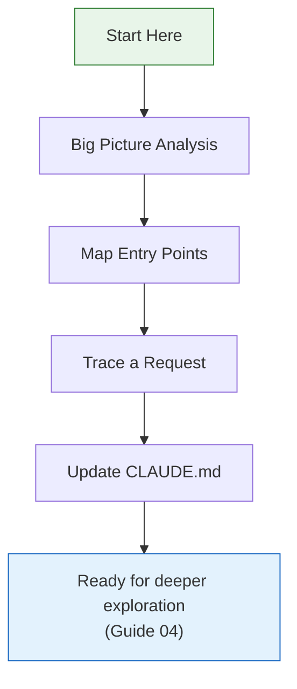
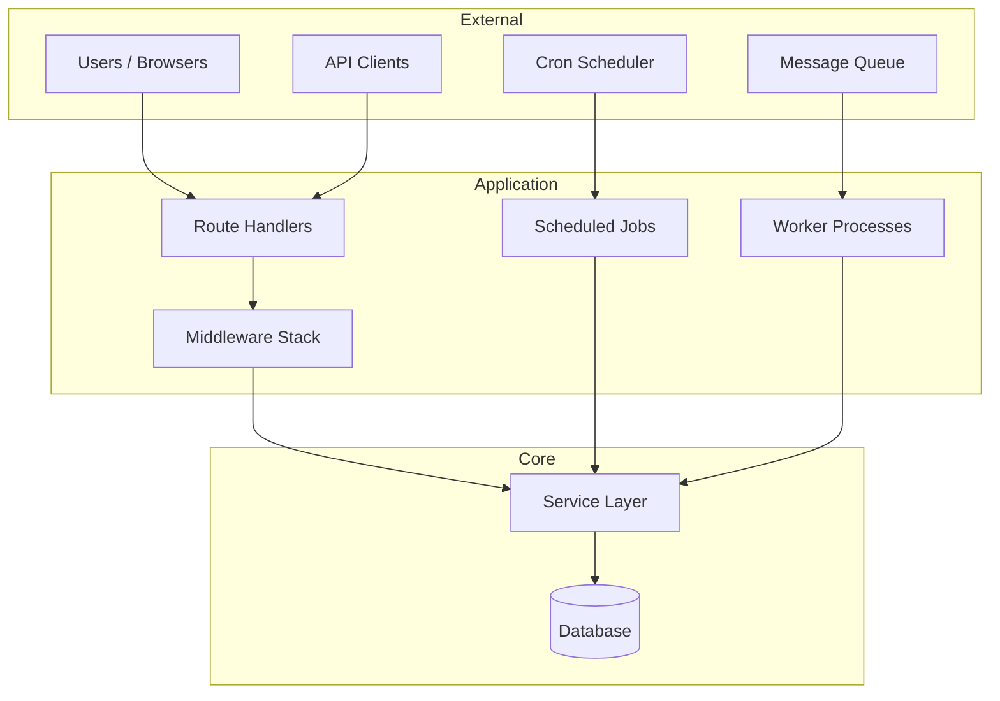
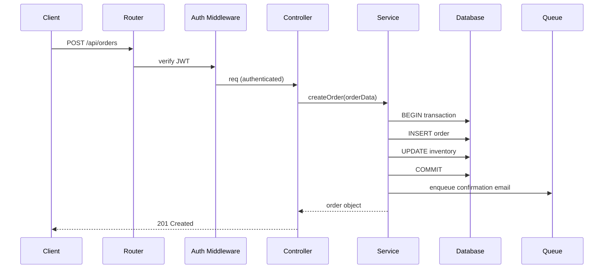

# 03 — Codebase Orientation

Build a mental map of any codebase — its purpose, structure, entry points, and data flow — without changing anything.

---

## What You'll Learn

- How to do a comprehensive big-picture analysis
- Mapping entry points and understanding how execution begins
- Tracing requests end-to-end through the system
- Adapting your approach by project type (web app, CLI, library, pipeline)
- Strategies for very large codebases (monorepos, microservices)

**Prerequisites**: [02 — Setup & Configuration](02-setup-and-configuration.md) (CLAUDE.md should exist, even if empty)

---

## Why Orientation Matters

This is the most important phase — resist the urge to skip ahead. Spending 15–30 minutes building a mental model of the codebase will make every subsequent task faster, safer, and more accurate.



---

## Step 1: Get the Big Picture

Start with a broad exploration. This single prompt gives you the lay of the land:

```
Do a deep dive on this codebase. I want to understand:
- What this project does (its purpose and users)
- The tech stack (languages, frameworks, major libraries)
- High-level architecture (how the code is organized)
- Major domains and bounded contexts
- How data flows through the system
```

Claude will read directory structures, config files, package manifests, and key source files. This typically takes a few minutes on a large codebase.

### What Good Output Looks Like

A useful response will cover:
- **Purpose**: "This is an e-commerce platform that handles product catalogs, shopping carts, and order processing"
- **Stack**: specific versions and frameworks, not just "JavaScript"
- **Organization**: directory structure with what each top-level directory contains
- **Domains**: bounded contexts like "user management," "inventory," "payments"
- **Data flow**: how information moves from input to output

### Follow Up — Always

Claude's first summary won't capture everything. Probe areas that seem important or unclear:

```
What did you miss? Are there any unusual patterns or
non-obvious aspects of this architecture?
```

```
Tell me more about the [specific area]. How does it
connect to the rest of the system?
```

### Sample Conversation: E-Commerce Monolith

Here's how a real deep dive might go:

> **You**: Do a deep dive on this codebase. I want to understand what it does, the tech stack, how it's organized, the major domains, and how data flows.
>
> **Claude**: *reads package.json, directory structure, key config files, several source files*
>
> This is an e-commerce platform built with:
> - **Backend**: Node.js/Express with TypeScript
> - **Frontend**: React SPA in `client/`
> - **Database**: PostgreSQL with Knex.js for queries and migrations
> - **Cache**: Redis for sessions and product catalog caching
> - **Queue**: Bull for async order processing
>
> The code is organized into domain modules under `src/modules/`:
> - `auth/` — login, registration, JWT token management
> - `catalog/` — product listings, categories, search
> - `cart/` — shopping cart, saved items
> - `orders/` — order creation, payment processing, fulfillment
> - `notifications/` — email and SMS via SendGrid/Twilio
>
> Data flow: HTTP request → Express router → module controller → service layer → repository → PostgreSQL. Async operations (order confirmation emails, inventory updates) go through the Bull queue.
>
> **You**: What about the `legacy/` directory I see? And how does the frontend talk to the backend?
>
> **Claude**: *reads additional files*
>
> Good catch. `legacy/` contains the original PHP application — they're migrating from PHP to Node module by module. The `legacy/` routes are proxied through Express via `src/middleware/legacy-proxy.ts`. About 30% of customer-facing pages still hit the PHP app...

Notice the follow-up question uncovered critical context (the PHP migration) that the first pass missed. This is typical.

---

## Step 2: Map the Entry Points

Every system has "edges" — the places where execution begins or external input arrives:

```
Identify all the entry points in this system:
- Main files, CLI commands, or startup scripts
- HTTP route handlers and API endpoints
- Event listeners, message queue consumers
- Scheduled jobs or cron tasks
- Exported public APIs (if this is a library)
```

### Entry Point Diagram

A typical web application has entry points at multiple layers:



Ask Claude to create a version of this diagram specific to the project you're exploring.

---

## Step 3: Trace a Request End-to-End

Pick a core feature and trace it from start to finish. This reveals how the layers of the system actually connect:

```
Trace what happens when a user hits POST /api/orders — follow
the request from the HTTP handler through middleware, business
logic, database queries, and back to the response. Show me
every file and function involved.
```

Replace the endpoint with whatever makes sense for the project:
- **CLI tool**: trace a command execution
- **Data pipeline**: trace a record through processing stages
- **Library**: trace a public API call through internal functions

### What You're Looking For

The trace reveals:
- **Middleware order** — authentication, validation, logging
- **Layer boundaries** — where does the controller end and the service begin?
- **Data transformations** — how does input become output?
- **Error paths** — what happens when something fails?
- **Side effects** — what else happens besides the main response (events, logs, cache updates)?

### Ask for a Sequence Diagram

After the trace, ask Claude to visualize it:

```
Generate a Mermaid sequence diagram showing the request
flow we just traced for POST /api/orders.
```



---

## Step 4: Update CLAUDE.md

After orientation, capture what you've learned:

```
Based on everything we've explored, update CLAUDE.md with:
- Build, run, test, and lint commands
- Key architectural decisions
- Important file paths and what they contain
- Any conventions you've noticed
```

This compounds over time. After a few sessions, your CLAUDE.md becomes a genuinely useful onboarding document.

---

## Adapting by Project Type

Different project types need different exploration strategies:

### Web Application (API + Frontend)
Start with: routes/endpoints → controllers → services → database
Key questions: How does auth work? What's the request lifecycle? How does the frontend call the API?

### CLI Tool
Start with: command parser → command handlers → core logic
Key questions: How are commands registered? How is output formatted? How is config loaded?

### Library / SDK
Start with: public API surface → internal modules → utilities
Key questions: What's exported? What's the versioning strategy? Are there breaking changes in recent releases?

### Data Pipeline
Start with: data sources → ingestion → transformations → output/storage
Key questions: How is data validated? What happens on failure? How are retries handled? What's the throughput?

### Mobile App
Start with: screens/views → navigation → state management → API layer
Key questions: How is navigation structured? Where does state live? How does offline mode work?

---

## When the Codebase Is REALLY Big

Large codebases (monorepos, microservices) need modified strategies:

### Monorepos

Don't try to understand everything at once. Start with:

```
This is a monorepo. Give me an overview of:
1. What packages/services exist and what each one does (one line each)
2. How they depend on each other
3. Which ones are most actively developed (recent git activity)

Then tell me which 2-3 packages I should understand first
if I'm going to work on [your area of focus].
```

### Microservices

Focus on the service boundaries and communication patterns:

```
Map out the microservice architecture:
- What services exist and what each one owns
- How do they communicate (REST, gRPC, events, queues)?
- Where is the API gateway or entry point?
- What shared infrastructure exists (databases, caches, message brokers)?

Generate an architecture diagram in Mermaid showing the
services and their connections.
```

### General Strategies for Scale

1. **Scope your exploration** — understand one domain or service thoroughly before moving on
2. **Use subagents for parallel exploration** — ask Claude to research multiple areas simultaneously
3. **Focus on the boundaries** — understand how services/packages interact; internals can wait
4. **Find the "walking skeleton"** — the minimal path through the system that exercises all layers

---

## Key Takeaways

1. Spend 15–30 minutes on orientation before doing anything else — it pays off on every subsequent task
2. Always follow up on Claude's initial summary; the first pass misses things
3. Tracing a real request end-to-end teaches you more than reading architecture docs
4. Adapt your approach to the project type — a CLI tool is explored differently than a web app
5. For large codebases, scope your exploration to the area you'll work in first

---

**Next**: [04 — Architecture & Dependencies](04-architecture-and-dependencies.md) — Understand the build system, database, and dependency graph.
