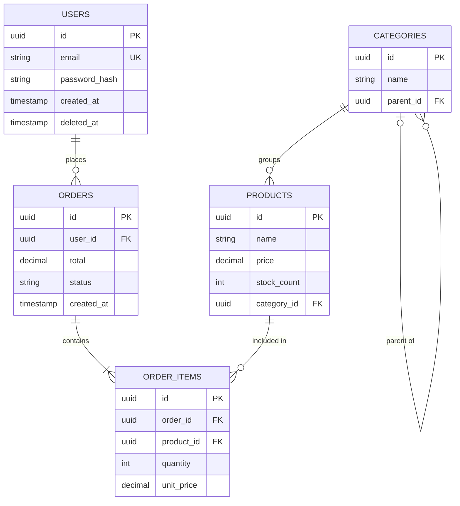
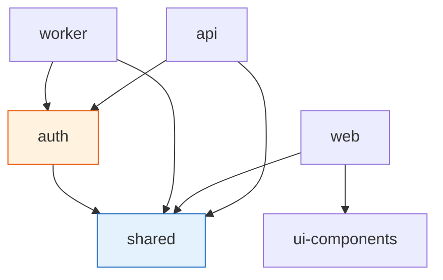
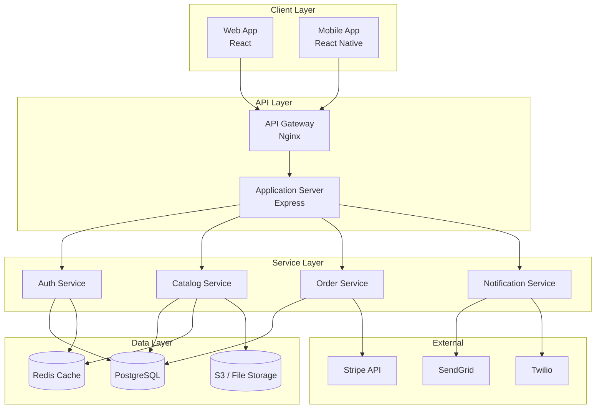

# 04 — Architecture & Dependencies

Understand the build system, database layer, dependency graph, and infrastructure of any project.

---

## What You'll Learn

- How to analyze build systems for common tools (npm, Gradle, Make, etc.)
- Exploring database schemas and generating ER diagrams
- Dependency analysis — what to look for, red flags to watch for
- Generating architecture diagrams (C4 model, component diagrams)
- Understanding infrastructure (Docker, Kubernetes, Terraform)

**Prerequisites**: [03 — Codebase Orientation](03-codebase-orientation.md)

---

## Build System Analysis

Before you can run, test, or deploy anything, you need to understand how the project builds.

### The Prompt

```
Explain the build system for this project:
- How are dependencies managed?
- What are the build steps?
- Are there multiple build targets or environments?
- Is there code generation, compilation, or transpilation involved?
- How does the CI/CD pipeline work?
```

Then verify it actually works:

```
Run the build and tell me if it succeeds. If it fails, diagnose why.
```

### What to Look For by Build Tool

| Build Tool | Key Files | Watch For |
|-----------|-----------|-----------|
| npm/yarn/pnpm | `package.json`, lockfile | `scripts` section, `workspaces`, peer deps |
| Gradle | `build.gradle(.kts)`, `settings.gradle` | Multi-module setup, custom tasks, plugins |
| Maven | `pom.xml` | Parent POMs, module hierarchy, profiles |
| Make | `Makefile` | Phony targets, dependency chains, variables |
| CMake | `CMakeLists.txt` | Find packages, compile flags, targets |
| Cargo | `Cargo.toml` | Features, workspace members, build scripts |
| Go | `go.mod`, `go.sum` | Module path, replace directives |

### Understanding CI/CD

```
Walk me through the CI/CD pipeline:
- Where is it defined? (GitHub Actions, Jenkins, CircleCI, etc.)
- What checks run on every PR?
- How does deployment work?
- Are there different stages (dev, staging, production)?
- What secrets or environment variables does it need?
```

---

## Database Schema Exploration

### The Prompt

```
Analyze the database layer:
- What database(s) does this project use?
- Walk me through the schema — key tables/collections and their relationships
- How are migrations managed?
- Are there any ORMs or query builders in use?
- Generate an entity relationship diagram in Mermaid format
```

### Sample ER Diagram

Claude will generate something like this based on the actual schema:



### Follow-Up Questions

After the initial schema overview, dig deeper:

```
What are the most complex queries in this codebase?
Are there any N+1 query patterns or performance concerns?
```

```
How does the migration history look? Are there any
pending or problematic migrations?
```

---

## Dependency Analysis

### The Prompt

```
Analyze the project's dependencies:
- What are the major/unusual external dependencies and why are they used?
- Are there any vendored or forked dependencies?
- Are there internal packages or a monorepo structure?
- Are any dependencies outdated or known to be problematic?
```

### Red Flags to Watch For

Ask Claude to look for these specifically:

```
Check the dependencies for red flags:
- Abandoned packages (no updates in 2+ years)
- Packages with known security vulnerabilities
- Duplicate packages that do the same thing
- Pinned versions that are very old
- Dependencies that seem too heavy for what they do
```

### Dependency Relationship Diagram

For projects with internal packages or a monorepo structure:

```
Generate a Mermaid diagram showing how the internal
packages/modules depend on each other. Highlight
any circular dependencies.
```



---

## Architecture Diagrams

### Component Diagram

Ask Claude to map the major components and their interactions:

```
Generate a component architecture diagram in Mermaid showing:
- The major components/services
- How they communicate (sync vs async)
- External services and integrations
- Data stores
```



### C4 Model Diagrams

For larger systems, ask Claude to use the C4 model (Context, Containers, Components, Code):

```
Generate C4 model diagrams for this system:
1. Context diagram — the system and its external actors
2. Container diagram — the major deployable units
3. Component diagram for [specific container] — the internal structure
```

---

## Understanding Infrastructure

If the project includes infrastructure-as-code, explore it:

### Docker

```
Analyze the Docker setup:
- What Dockerfiles exist and what do they build?
- Is there a docker-compose.yml? What services does it define?
- How do the containers network with each other?
- What volumes are mounted?
- What's the difference between dev and production Docker configs?
```

### Kubernetes

```
Analyze the Kubernetes configuration:
- What deployments, services, and ingresses are defined?
- How is configuration managed (ConfigMaps, Secrets)?
- What's the scaling strategy?
- Are there any CronJobs or DaemonSets?
```

### Terraform / Infrastructure as Code

```
Analyze the infrastructure code:
- What cloud resources are provisioned?
- How are environments separated (dev, staging, prod)?
- What's the state management strategy?
- Are there any modules being reused?
```

### Infrastructure Diagram

```
Generate a Mermaid diagram showing the infrastructure
architecture — servers, databases, caches, queues,
and how traffic flows through them.
```

---

## Putting It All Together

After exploring architecture and dependencies, you should be able to answer:

1. **How do I build and run this project?** — Build commands, prerequisites, environment setup
2. **What does the data model look like?** — Tables, relationships, data flow
3. **What are the major dependencies and why?** — External packages, internal packages, their purposes
4. **How is this deployed?** — CI/CD, infrastructure, environments
5. **Where are the boundaries?** — Service boundaries, package boundaries, layer boundaries

Update your CLAUDE.md with the key findings:

```
Update CLAUDE.md with the build commands, key infrastructure
notes, and any dependency gotchas we discovered.
```

---

## Key Takeaways

1. Verify the build works early — nothing else matters if you can't build
2. ER diagrams reveal data relationships faster than reading migration files
3. Dependency red flags (abandoned packages, duplicates, vulnerabilities) are worth finding early
4. Architecture diagrams at different levels (system, component, code) serve different purposes
5. Infrastructure config is part of the codebase — understand it before making changes that affect deployment

---

**Next**: [05 — Codebase Archaeology](05-codebase-archaeology.md) — Dig into git history, pain points, and the stories behind the code.
