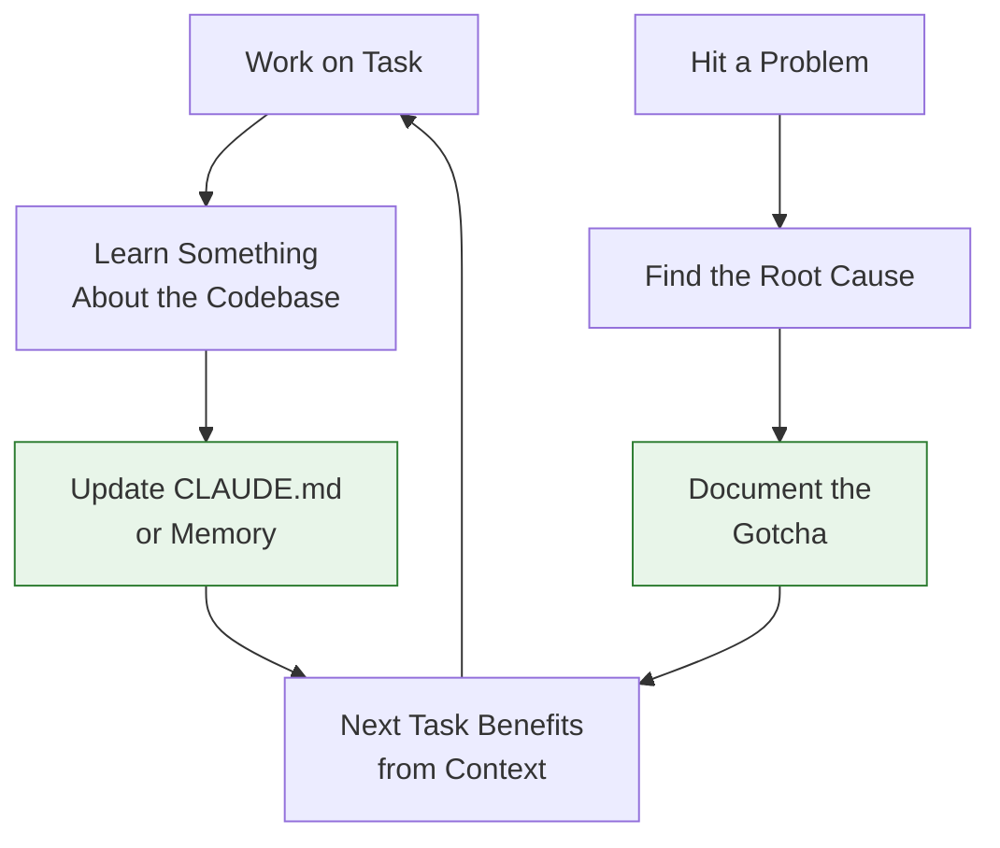

# 08 — Ongoing Practices

Build sustainable habits that compound over time — session management, knowledge building, and verification.

---

## What You'll Learn

- How to manage sessions: when to `/clear`, `/compact`, or start fresh
- Evolving your CLAUDE.md from basic to comprehensive
- Using subagents to parallelize exploration
- Verification habits that prevent mistakes
- The "explain before change" pattern
- Building a personal knowledge base with Claude's memory system

**Prerequisites**: [01 — Getting Started](01-getting-started.md)

---

## The Ongoing Feedback Loop

Good Claude Code usage isn't a linear process — it's a cycle:



Every session should leave the project slightly better documented than you found it.

---

## Session Management

### When to `/compact`

Use `/compact` when:
- Claude mentions the context is getting long
- You're switching topics within the same logical task
- You've done a lot of exploration and are ready to start implementing
- Claude seems to be forgetting things you discussed earlier

`/compact` compresses the conversation history into a summary. You stay in the same session but free up space.

### When to `/clear`

Use `/clear` when:
- You're done with one task and starting a completely unrelated one
- The conversation has gone off-track and you want a clean start
- Claude seems confused by accumulated context from earlier discussion

`/clear` wipes the conversation history but stays in the same directory with the same CLAUDE.md.

### When to Start a New Session

Exit Claude and re-run `claude` when:
- You're switching to a different project
- You've changed CLAUDE.md and want Claude to re-read it from scratch
- You've installed new MCP servers or changed configuration

### Session Strategy Summary

| Situation | Action |
|-----------|--------|
| Context getting full, same task | `/compact` |
| Task complete, starting new task | `/clear` |
| Switched topic mid-session | `/compact` then re-state focus |
| Claude seems confused | `/clear` and re-state your goal |
| Changed project config | Exit and restart `claude` |

---

## CLAUDE.md Evolution

A CLAUDE.md that's been maintained over time looks very different from a fresh one.

### Week 1: The Basics

```markdown
# Project Context

## Build & Run
- Install: `npm install`
- Dev: `npm run dev`
- Test: `npm test`
- Lint: `npm run lint`
```

### Month 1: Growing Knowledge

```markdown
# Project Context

## Build & Run
- Install: `npm install`
- Dev: `npm run dev`
- Test: `npm test`
- Single test: `npm test -- --testPathPattern=<pattern>`
- Lint: `npm run lint`
- DB migrations: `npm run migrate`
- Seed data: `npm run seed`

## Architecture
- Express API in `src/api/` — controllers → services → repositories
- React frontend in `client/` — pages → components → hooks
- PostgreSQL database, Knex.js for queries
- Bull queue for async jobs in `src/workers/`

## Conventions
- Named exports only (no default exports)
- Error handling: throw AppError instances
- Tests next to source: `foo.ts` → `foo.test.ts`
- New endpoints need: route, controller, service, test, API doc entry

## Gotchas
- The `user` table uses soft deletes — always filter on `deleted_at IS NULL`
- `legacy/` is being migrated to `src/api/v2/` — don't add code to legacy
- The `config` module caches on first load — restart dev server after .env changes
- Stripe webhooks must be tested with `stripe listen --forward-to localhost:3000/webhooks`
```

### Ongoing: What to Add

Every session, ask yourself: *"Did I learn something that would help future sessions?"* If yes, capture it:

```
Update CLAUDE.md with anything from this session that
would help future sessions — new conventions, gotchas,
or architectural notes we discovered.
```

---

## Subagent Parallelization

When you need to explore multiple unrelated areas, Claude can spin up parallel research tasks:

```
Research these three areas in parallel:
1. How the authentication system works
2. How the payment processing pipeline works
3. How the notification system works

Give me a summary of each.
```

### When to Use Subagents

- Exploring multiple unrelated modules simultaneously
- Researching different files for context before making a change
- Comparing implementations across different parts of the codebase

### When NOT to Use Subagents

- For sequential tasks where later steps depend on earlier results
- For simple, single-file lookups (just read the file directly)
- When the areas being researched are deeply interrelated

---

## Verification Habits

Claude is powerful but not infallible. Build these habits into your workflow:

### After Claude Explains Something

Spot-check by reading a key file yourself. Not because you don't trust Claude, but because reading the actual code deepens your understanding:

```
You mentioned the auth middleware is in src/middleware/auth.ts.
Let me read that file to confirm and understand the details.
```

### After Claude Makes a Change

Always review the diff before committing:

```
Show me the complete diff of everything we changed.
```

### After Claude Says "This Is the Only Place"

Run a quick search to confirm:

```
You said this function is only called from OrderService.
Search the entire codebase to confirm there are no other
callers — including tests, scripts, or dynamic references.
```

### After Claude's Summary Seems Incomplete

Probe deeper:

```
What about [specific area]? You didn't mention it in your
summary. Is it not relevant, or did you miss it?
```

---

## The "Explain Before Change" Pattern

When you encounter confusing code, resist the urge to just fix the symptom:

```
Explain what this code does and WHY it does it this way
before we consider changing it. Is there a reason for this
complexity that isn't obvious?
```

This pattern prevents three common mistakes:
1. "Simplifying" code that handles a real edge case
2. Removing "dead code" that's actually reached through a non-obvious path
3. Refactoring a workaround without fixing the root cause

### Example

> **You**: This function has a weird 3-second sleep in the middle. Can we remove it?
>
> **Claude**: *reads git blame, checks tests*
>
> That sleep was added in commit abc123 to work around a race condition with the payment processor webhook. The Stripe webhook sometimes arrives before the database transaction commits, causing a "order not found" error. The sleep gives the transaction time to complete.
>
> The proper fix would be to use an idempotency key and retry the webhook processing, but removing the sleep without that fix would reintroduce the original bug.
>
> **You**: Good to know. Let's do the proper fix instead.

Without the "explain before change" pattern, you might have removed the sleep and caused intermittent production errors.

---

## Building a Personal Knowledge Base

### Claude's Memory System

Claude can store personal notes in `.claude/memory/` that persist across sessions. Use this for:

- Personal workflow preferences
- Notes about specific areas you're working on
- Reminders about things you want to follow up on

```
Remember that I prefer to see test output in verbose mode
and I always want to review diffs before committing.
```

### CLAUDE.md vs. Memory

| What | Where |
|------|-------|
| Project build commands | CLAUDE.md (shared with team) |
| Code conventions | CLAUDE.md (shared with team) |
| "I prefer verbose test output" | Memory (personal) |
| "Don't auto-commit my changes" | Memory (personal) |
| "The payments module is fragile" | CLAUDE.md (shared with team) |

---

## Documentation Auditing

Codebases drift from their documentation. Periodically check:

```
Compare what's documented in the README against what
the code actually does. Are there discrepancies?
What's outdated? What's missing?
```

Good times to audit:
- After a major feature lands
- When onboarding a new team member
- When you notice the docs don't match reality

---

## Key Takeaways

1. Use `/compact` to free context, `/clear` for new tasks, restart for config changes
2. CLAUDE.md compounds over time — add to it every session, keep it concise
3. Subagents are powerful for parallel exploration of unrelated areas
4. Build verification habits: spot-check explanations, review diffs, confirm "only" claims
5. Always explain before changing — understanding intent prevents regressions
6. Separate team knowledge (CLAUDE.md) from personal preferences (memory)

---

**Next**: [09 — Anti-Patterns](09-anti-patterns.md) — Common mistakes and how to avoid them.
