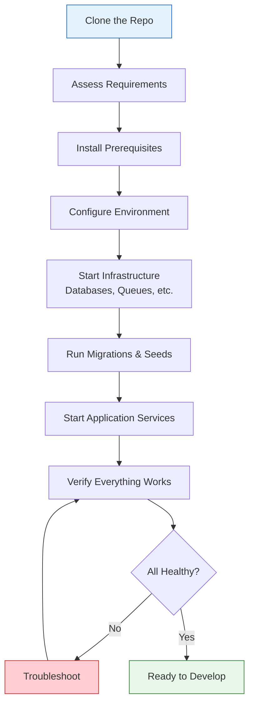
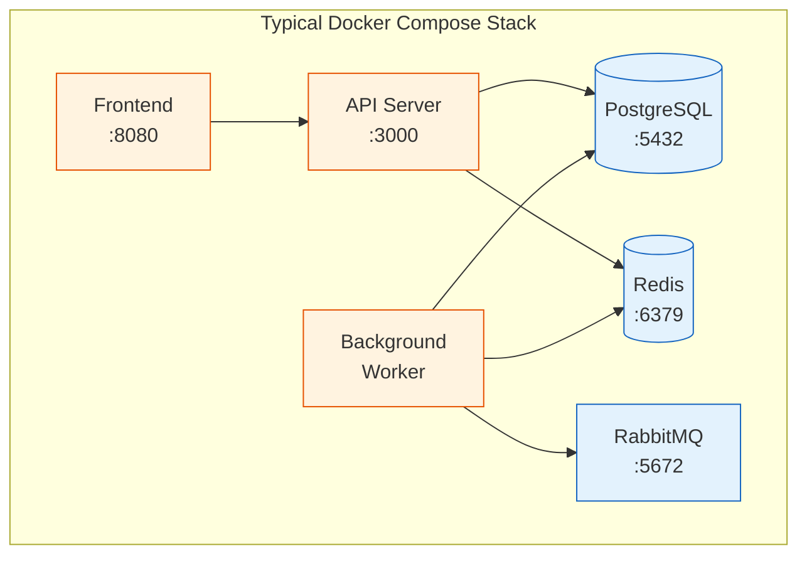
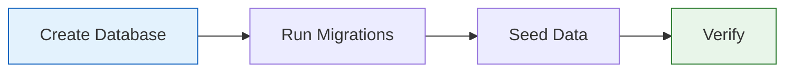
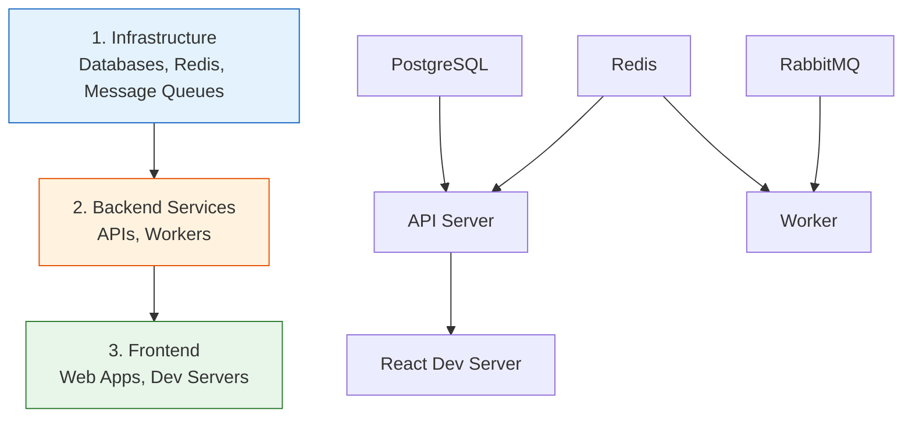

# 11 — Local Environment Setup

Get from `git clone` to a fully running local development environment — even on complex projects with Docker, databases, and multiple services.

---

## What You'll Learn

- How to inventory everything a project needs before installing anything
- Using Claude to identify and install language runtimes, databases, and tools
- Setting up environment variables and secrets safely
- Analyzing and running Docker-based development environments
- Database setup — migrations, seed data, and common connection issues
- Starting multiple services in the right order
- Verifying the full stack is healthy
- Troubleshooting the most common setup failures

**Prerequisites**: [02 — Setup & Configuration](02-setup-and-configuration.md) (CLAUDE.md should exist) and [03 — Codebase Orientation](03-codebase-orientation.md) (you should understand the project structure)

---

## Why Setup Deserves Its Own Guide

Getting a complex project running locally is often the hardest part of joining a new codebase. The README might be outdated, setup scripts might assume tools you don't have, and error messages during setup are often cryptic. Claude can read every config file, Dockerfile, and setup script in the project and tell you exactly what you need.



---

## Step 1: Assess What You Need

Before installing anything, ask Claude to inventory the project's requirements:

```
I just cloned this project and need to get it running locally.
Analyze all configuration files — Dockerfiles, docker-compose,
package.json, Gemfile, requirements.txt, Makefile, .tool-versions,
README, CONTRIBUTING docs — and give me a complete inventory:

1. Language runtimes and their required versions
2. Databases and other data stores
3. Message queues, caches, or other infrastructure
4. External services or APIs the app connects to
5. CLI tools needed for building or running
6. Any OS-level dependencies (native libraries, etc.)
```

Claude will read everything and produce a consolidated list, even catching requirements that the README forgot to mention.

### What to Look For

Claude checks these files to build the inventory:

| File | Reveals |
|------|---------|
| `Dockerfile`, `docker-compose.yml` | Services, base images, ports, volumes |
| `package.json`, `Gemfile`, `requirements.txt`, `go.mod` | Language, dependencies, required versions |
| `.tool-versions`, `.node-version`, `.python-version`, `.ruby-version` | Exact runtime versions |
| `Makefile`, `Justfile`, `Taskfile.yml` | Build and setup commands |
| `.env.example`, `.env.template` | Required environment variables |
| `README.md`, `CONTRIBUTING.md`, `docs/setup.md` | Manual setup steps (may be outdated) |
| CI config (`.github/workflows/`, `.circleci/`, etc.) | What actually runs — often more accurate than docs |

> **Tip**: CI configuration is often the most reliable source of truth for what a project needs, because it has to work every time. Ask Claude to cross-reference CI files with the README.

---

## Step 2: Install Prerequisites

Once you know what the project needs, ask Claude to help install it:

```
Based on the requirements you found, what do I need to install
on macOS? I already have Homebrew and Docker Desktop. Give me
the commands in the right order, and flag anything where the
version matters.
```

### Version Managers

Most projects need specific runtime versions. Claude can identify the right approach:

```
This project uses Node 20 and Python 3.11. What's the best way
to install these specific versions without conflicting with other
projects on my machine? I'm on macOS.
```

Claude will recommend version managers (like `nvm`, `pyenv`, `asdf`, or `mise`) based on what the project already uses:

- If there's a `.tool-versions` file → suggest `asdf` or `mise`
- If there's a `.node-version` file → suggest `nvm` or `fnm`
- If there's a `.python-version` file → suggest `pyenv`

### Platform-Specific Issues

Different platforms have different gotchas. Claude can anticipate these:

```
I'm on an Apple Silicon Mac (M2). Are there any known
architecture issues with this project's dependencies?
Check for native modules, binary dependencies, or anything
that might need Rosetta or special build flags.
```

Common platform issues Claude can catch:

- **macOS ARM**: Native Node modules that need rebuilding, Python packages with C extensions, Docker image architecture mismatches
- **Linux**: Missing system libraries for building native extensions, different package manager commands
- **Both**: OpenSSL version conflicts, locale settings, file watcher limits

---

## Step 3: Environment Variables and Secrets

### Finding the Template

```
Where does this project define its environment variables?
Look for .env.example, .env.template, .env.sample, config
templates, or documentation about required configuration.
List every variable, what it does, and whether I need a
real value or if a default/dummy value works for local dev.
```

### Understanding Each Variable

Ask Claude to categorize them:

```
For each environment variable in .env.example, categorize it:
- REQUIRED for local dev (app won't start without it)
- OPTIONAL for local dev (feature won't work, but app runs)
- HAS A SAFE DEFAULT (just copy the example value)
- NEEDS A REAL VALUE (I need to get this from somewhere)

For variables that need real values, tell me where to get them
(sign up for a service, ask a teammate, generate locally, etc.)
```

### Common Patterns

| Variable Pattern | Typical Local Value |
|-----------------|-------------------|
| `DATABASE_URL` | `postgres://localhost:5432/appname_dev` |
| `REDIS_URL` | `redis://localhost:6379` |
| `SECRET_KEY`, `JWT_SECRET` | Any random string (use `openssl rand -hex 32`) |
| `API_KEY` for external services | May need a real key, or check for a sandbox/test mode |
| `PORT` | Usually fine as default, check for conflicts |
| `NODE_ENV`, `RAILS_ENV` | `development` |

> **Tip**: If the project connects to third-party APIs, ask Claude whether there's a mock/stub mode for local development, so you don't need real API keys to get started.

---

## Step 4: Docker and Container Setup

Many projects use Docker for local development. Claude can analyze the setup and help you through it.

### Analyzing Docker Compose

```
Analyze the docker-compose.yml file:
1. What services are defined and what does each do?
2. What ports are exposed and could any conflict with
   things I might already have running?
3. What volumes are mounted? Are there any that might
   cause permission issues?
4. What's the dependency order — which services need
   to start first?
5. Are there any build steps vs. pre-built images?
```



### Debugging Container Startup

When containers fail to start:

```
The postgres container keeps restarting. Here's the output
from docker compose logs postgres:

[paste the log output]

What's going wrong and how do I fix it?
```

Common container issues Claude can diagnose:

- **Port conflicts**: Another process already using the port → `lsof -i :5432`
- **Volume permission issues**: Host/container user ID mismatch
- **Image architecture mismatch**: x86 image on ARM Mac → need `platform: linux/amd64` or an ARM-compatible image
- **Build failures**: Missing build arguments, network issues pulling base images
- **Health check failures**: Service starts but isn't ready → check health check config and timeouts

### Port Conflicts

```
Check if any of the ports in docker-compose.yml are already
in use on my machine. If there are conflicts, show me how
to remap ports without breaking the service connections.
```

---

## Step 5: Database Setup

### Running Migrations

```
How do I set up the database for local development?
Look for migration files, seed scripts, and setup commands.
Tell me the exact sequence of commands to run, and what
each one does.
```

### Common Database Setup Flows



| Framework | Create | Migrate | Seed |
|-----------|--------|---------|------|
| Rails | `rails db:create` | `rails db:migrate` | `rails db:seed` |
| Django | `createdb` or Docker | `python manage.py migrate` | `python manage.py loaddata` |
| Node/Prisma | `prisma db push` or `prisma migrate dev` | (included) | `prisma db seed` |
| Node/Knex | `knex migrate:latest` | (same) | `knex seed:run` |
| Laravel | `php artisan migrate` | (same) | `php artisan db:seed` |

### Connecting to Containerized Databases

A common gotcha: your app is running on the host but the database is in Docker.

```
The app can't connect to the database. The app is running
on my host machine and the database is in Docker. The
DATABASE_URL is set to localhost:5432 but I'm getting
"connection refused." What's wrong?
```

Claude will check:
- Is the port actually mapped in `docker-compose.yml`?
- Is the database container running and healthy?
- Is the database ready to accept connections (not still initializing)?
- Are the credentials correct?
- Is there a network configuration issue?

### Database Version Mismatches

```
The migration is failing with a syntax error. The project
uses PostgreSQL 15 features but I have PostgreSQL 14
installed locally. What are my options?
```

---

## Step 6: Service Orchestration

Complex projects often have multiple services that need to start in a specific order.

### Mapping Service Dependencies

```
Map all the services in this project and their dependencies.
Which services need to be running for each other service to
work? What's the correct startup order? Generate a dependency
diagram.
```

### Startup Order



### Health Checks

Don't just start services — verify they're actually ready:

```
After starting all services, how do I verify each one is
healthy and accepting connections? Look for health check
endpoints, CLI commands, or other ways to confirm each
service is ready.
```

Common health check approaches:

| Service | How to Check |
|---------|-------------|
| Web server | `curl http://localhost:3000/health` |
| PostgreSQL | `pg_isready -h localhost -p 5432` |
| Redis | `redis-cli ping` → `PONG` |
| RabbitMQ | Management UI at `http://localhost:15672` |
| Elasticsearch | `curl http://localhost:9200/_cluster/health` |

---

## Step 7: Verify the Full Setup

Once everything is running, do a full smoke test:

```
All services are running. Help me verify the full stack
is working correctly:
1. Can the API server connect to the database?
2. Can it connect to Redis/cache?
3. Can the frontend reach the API?
4. Are background workers processing jobs?
5. Are there any errors in any service logs?

Walk me through what to check and what "healthy" looks like.
```

### The Verification Checklist

```
Generate a setup verification checklist specific to this
project — every service, connection, and feature I should
test to confirm my local environment is fully working.
```

Example output:

> - [ ] API server starts without errors on port 3000
> - [ ] `GET /api/health` returns 200
> - [ ] Can create a user via the API
> - [ ] User appears in the database
> - [ ] Frontend loads at `http://localhost:8080`
> - [ ] Frontend can log in with seed user credentials
> - [ ] Background job processes within 5 seconds
> - [ ] File uploads work (check S3/minio connection)
> - [ ] Email sending works (check Mailhog at `localhost:8025`)

---

## Step 8: Troubleshooting Common Failures

When setup goes wrong, give Claude the full context:

```
I'm stuck on setup. Here's what happened:

1. What I ran: [the command]
2. What I expected: [what should have happened]
3. What actually happened: [the error or unexpected behavior]
4. Full error output: [paste it]

Help me figure out what's wrong and how to fix it.
```

### Common Setup Issues and Fixes

#### Port Conflicts

```
Error: listen EADDRINUSE: address already in use :::3000
```

```
Something else is using port 3000. Help me find what
process is using it and decide whether to kill it or
reconfigure this project to use a different port.
```

#### Missing Native Dependencies

```
The npm install / pip install / bundle install is failing
with a compilation error. Here's the output:

[paste error]

What native dependency am I missing and how do I install it?
```

Common culprits:
- `node-gyp` failures → missing Xcode CLI tools, Python, or build tools
- Python C extensions → missing `libffi`, `openssl`, or other system libraries
- Ruby native gems → missing `libpq-dev`, `imagemagick`, etc.

#### Version Mismatches

```
The app is crashing on startup with this error:

[paste error]

I think it might be a version mismatch. Check what versions
of everything I have installed versus what the project expects.
```

#### Permission Issues

```
I'm getting "permission denied" errors when [describe what
you're doing]. The files/directories involved are:

[paste ls -la output of the relevant paths]

What's wrong with the permissions and how do I fix it safely?
```

#### Architecture-Specific Problems (ARM/x86)

```
Docker build is failing or a container keeps crashing. I'm
on an Apple Silicon Mac. Could this be an architecture issue?
Here's the error:

[paste error]

If it is an architecture problem, what are my options?
```

Options Claude might suggest:
- Add `platform: linux/amd64` to `docker-compose.yml`
- Use an ARM-compatible base image
- Build from source instead of using pre-built binaries
- Run under Rosetta 2

---

## Sample Conversation

> **You**: I just cloned the company's main product repo. The README says "run `make setup`" but that's failing. Can you help me get this running?
>
> **Claude**: *reads Makefile, docker-compose.yml, .env.example, package.json, README, CI config*
>
> The `make setup` command is trying to do several things in sequence, and it looks like it's failing on the database migration step. Here's what the full setup needs:
>
> **Infrastructure** (via Docker Compose):
> - PostgreSQL 15 on port 5432
> - Redis 7 on port 6379
> - MinIO (S3-compatible storage) on port 9000
>
> **Application**:
> - Node.js 20 (you have 18 — this is likely causing the TypeScript build failure)
> - pnpm 8 (you have npm — the project uses pnpm workspaces)
>
> **The problem**: The Makefile assumes Node 20 is installed, but you have Node 18. The build step uses Node 20 syntax that fails on 18.
>
> Want me to walk you through the full setup step by step?
>
> **You**: Yes, let's do it properly.
>
> **Claude**: First, let's get the right Node version. The project has a `.node-version` file specifying 20.11.0...
>
> *[walks through nvm install, pnpm install, docker compose up, env setup, migrations, and verification]*
>
> **You**: Everything started but the API tests are failing with "connection refused" for Redis.
>
> **Claude**: *checks docker compose ps output and Redis configuration*
>
> The Redis container is running but it's configured with a password in `docker-compose.yml` (`requirepass: devpassword123`), and your `.env` has `REDIS_URL=redis://localhost:6379` without the password. Change it to:
>
> ```
> REDIS_URL=redis://:devpassword123@localhost:6379
> ```
>
> The colon before the password is intentional — Redis URLs use `:password@host` format with no username.

---

## Key Takeaways

1. Assess before installing — let Claude inventory everything the project needs by reading config files, not just the README
2. CI configuration is often the most reliable source of truth for project requirements
3. Categorize environment variables into "required," "optional," and "has safe default" to avoid getting blocked by missing API keys
4. When Docker containers fail, give Claude the full log output — the answer is almost always in there
5. Check health endpoints after starting services, not just whether the process is running
6. Version mismatches (runtime, database, tools) are the most common cause of "works for them, not for me" — check versions early
7. Keep your working setup notes in CLAUDE.md so the next person (or your next session) benefits

---

**Next**: [12 — Debugging & Troubleshooting](12-debugging-and-troubleshooting.md) — Systematically debug issues with Claude's help.
