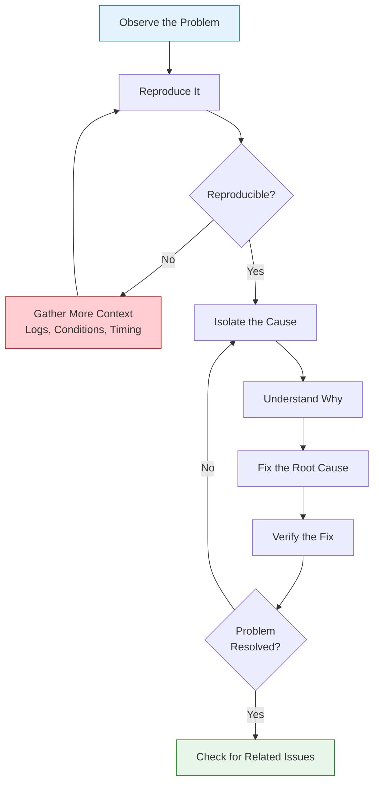
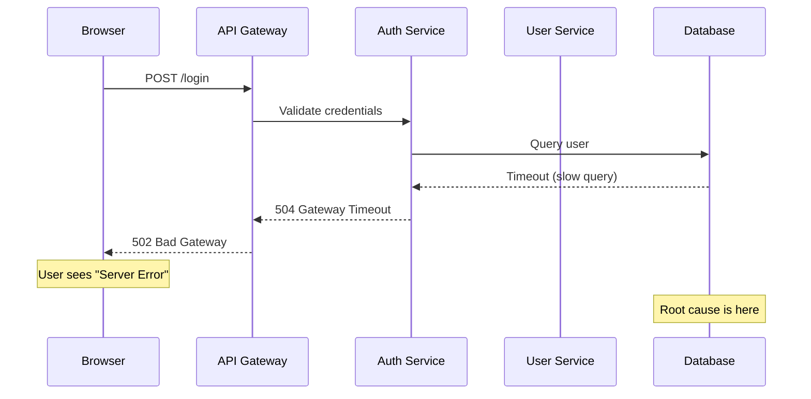
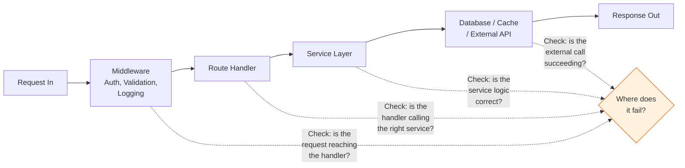
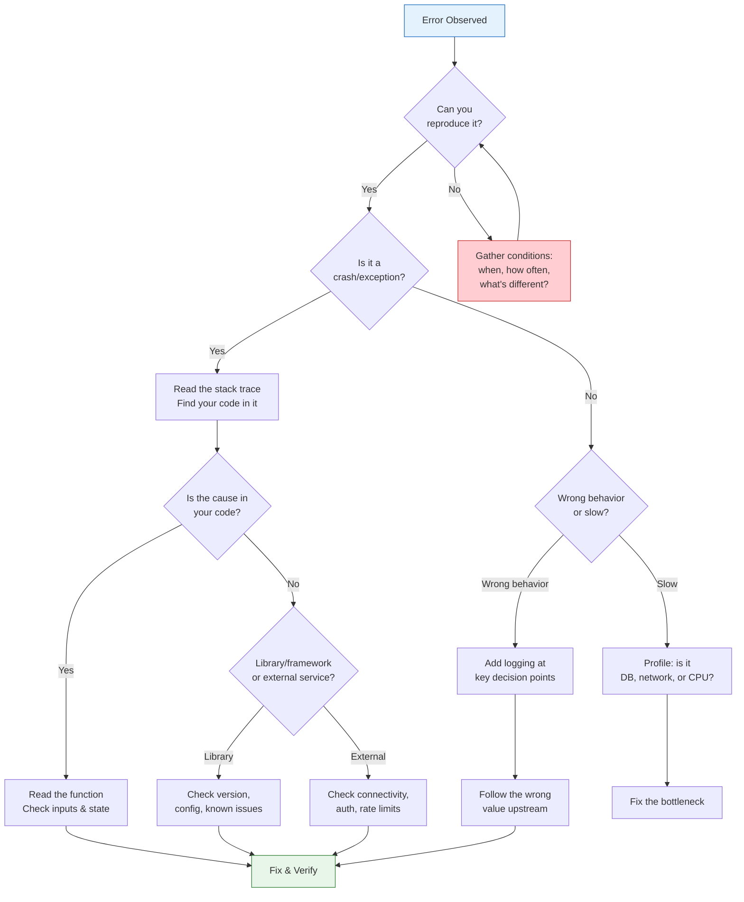

# 12 — Debugging & Troubleshooting

Systematically debug issues with Claude — from reading error output to tracing root causes across the full stack.

---

## What You'll Learn

- The debugging mindset: reproduce, understand, then fix
- How to give Claude the right context for effective debugging
- Reading stack traces, error codes, and log output
- Log analysis — filtering noise, correlating events across services
- Frontend debugging with browser developer tools
- Backend debugging — tracing requests through middleware, services, and databases
- Database debugging — slow queries, connection issues, migration failures
- Network and integration debugging — CORS, certificates, service-to-service failures
- Performance debugging — slow endpoints, memory leaks, N+1 queries
- Flaky test debugging — identifying non-determinism and shared state
- A decision tree for "I have an error, now what?"

**Prerequisites**: [03 — Codebase Orientation](03-codebase-orientation.md) (you should understand the project structure) and [11 — Local Environment Setup](11-local-environment-setup.md) (the app should be running locally)

---

## The Debugging Mindset

Effective debugging with Claude follows a consistent pattern: **reproduce first, understand second, fix third.** Jumping straight to a fix wastes time and often masks the real problem.



### How to Provide Context to Claude

The quality of Claude's debugging help depends entirely on the context you provide. More is better:

```
I'm seeing [describe the problem]. Here's what I know:

- What I expected: [expected behavior]
- What actually happens: [actual behavior]
- When it started: [always, after a recent change, intermittently]
- Full error output: [paste everything — don't truncate]
- Steps to reproduce: [exact steps]
- What I've already tried: [list attempts]
```

> **Tip**: Don't paraphrase error messages — paste the full output. The line you think is irrelevant often contains the actual clue.

---

## Reading Error Output

### Stack Traces

Stack traces read from bottom to top (the cause) to top (where it surfaced):

```
This stack trace is from [language/framework]. Help me
read it:

[paste the full stack trace]

1. What is the root cause?
2. Which line is the actual problem vs. framework internals?
3. What file and function should I look at first?
```

Claude will identify which frames are your code vs. framework/library code and point you to the most relevant line.

### Error Codes and Messages

```
I'm getting this error and I don't understand what it means:

[paste the error]

Explain what this error means in the context of this project,
what typically causes it, and where I should look to fix it.
```

### Decoding Cryptic Errors

Some errors are misleading. The message says one thing, but the cause is something else entirely:

| What the Error Says | What It Often Means |
|--------------------|--------------------|
| `ECONNREFUSED` | The service you're connecting to isn't running |
| `ENOMEM` / `heap out of memory` | Process needs more memory, or there's a memory leak |
| `CORS error` | Backend isn't sending the right headers, or you're hitting the wrong URL |
| `404 Not Found` (on an API) | Route doesn't exist, or middleware is blocking it |
| `EACCES: permission denied` | File ownership issue, or port < 1024 requires root |
| `Module not found` | Missing dependency, wrong path, or build issue |
| `Segmentation fault` | Native dependency issue, version mismatch, or memory corruption |

---

## Log Analysis

### Reading Log Files

```
Here are the recent logs from [service name]. Something
is going wrong but I'm not sure what. Analyze these logs:

1. Are there any errors or warnings?
2. Is there a pattern to the errors (timing, frequency)?
3. What was happening right before the first error?
4. What do you recommend investigating first?

[paste log output]
```

### Filtering Noise

Production and development logs are noisy. Ask Claude to focus:

```
These logs have a lot of routine output. Filter out the
noise and show me only:
- Errors and warnings
- Slow operations (anything taking more than 1 second)
- Failed requests
- Connection issues
- Anything unusual compared to normal operation patterns
```

### Correlating Events Across Services

When debugging microservices, problems in one service manifest in another:



```
I'm seeing 502 errors on the frontend but I think the
problem is deeper in the stack. Here are logs from each
service in the request chain:

API Gateway: [paste]
Auth Service: [paste]
Database slow query log: [paste]

Trace the request through the system and find where
the actual failure is occurring.
```

### Structured vs. Unstructured Logs

```
This service outputs JSON-structured logs. Help me query
them to find all requests that:
- Took more than 2 seconds
- Resulted in a 5xx error
- Happened in the last hour

What jq or grep commands should I use?
```

---

## Browser Developer Tools

When debugging frontend issues, give Claude what you see in the browser dev tools.

### Console Errors

```
I'm seeing these errors in the browser console:

[paste console output]

What's causing them and where in the code should I look?
```

### Network Tab

The Network tab is one of the most useful debugging tools. Copy the relevant details:

```
This API request is failing. Here's what the Network tab shows:

Request: POST /api/users
Status: 422 Unprocessable Entity
Request Headers: [paste relevant headers]
Request Body: [paste the payload]
Response Body: [paste the response]

What's wrong with the request?
```

### React / Vue Devtools

```
The component isn't rendering what I expect. Here's the
current state from React DevTools:

Component: UserProfile
Props: [paste props]
State: [paste state]

And here's what the component code looks like:
[paste component or point to file]

Why is it rendering [wrong thing] instead of [expected thing]?
```

> **Tip**: If you have an MCP server that can access browser state, Claude can inspect dev tools output directly. Otherwise, copy and paste the relevant details.

---

## Backend Debugging

### Tracing Request Failures

When an API request fails, trace it through the stack:

```
A POST to /api/orders is returning 500. I need to trace
this request through the system. Help me:

1. Find the route handler for this endpoint
2. Identify all middleware it passes through
3. Find the service layer code it calls
4. Check the database queries it runs
5. Figure out which step is failing

Start by finding the route definition and we'll trace
from there.
```



### Connection Issues

```
The app can't connect to [service]. Here's the error:

[paste error]

Check the connection configuration: host, port, credentials,
SSL settings. Is the service actually running and reachable?
What command can I run to test the connection directly?
```

### Timeout and Retry Patterns

```
Some requests are timing out intermittently. Help me find:
1. What timeout values are configured for this service?
2. Is there retry logic? If so, what's the strategy?
3. Could retries be making the problem worse (retry storms)?
4. What's the right timeout value based on the dependency's
   expected response time?
```

---

## Database Debugging

### Slow Queries

```
This page is taking 8 seconds to load. I suspect it's a
database issue. Help me:

1. Find what queries this page/endpoint runs
2. Identify which query is slow
3. Explain the query execution plan
4. Suggest how to optimize it (indexes, query rewrite, etc.)
```

### N+1 Query Detection

```
I think there might be an N+1 query problem on this endpoint.
Look at the data access pattern:

[paste the controller/service code or describe the endpoint]

Is this loading related data in a loop? If so, what's the
fix — eager loading, a join, or a batch query?
```

### Connection Pool Exhaustion

```
The app is intermittently failing with "too many connections"
or connection timeout errors. Help me:

1. Find the connection pool configuration
2. Check if connections are being properly released
3. Look for long-running transactions that hold connections
4. Recommend pool size settings for this workload
```

### Migration Issues

```
The database migration is failing with this error:

[paste error]

What's wrong? Is it safe to retry, or do I need to
manually fix the database state first? Check if the
migration is idempotent.
```

---

## Network and Integration Debugging

### CORS Issues

```
I'm getting CORS errors in the browser:

[paste the error]

Where is CORS configured in the backend? What origin,
methods, and headers are currently allowed? What needs
to change for this request to work?
```

### Certificate Errors

```
I'm getting SSL/TLS certificate errors when connecting to
[service]. Here's the error:

[paste error]

Is this a self-signed cert issue, an expired cert, a
hostname mismatch, or something else? What's the right
fix (not just disabling SSL verification)?
```

### Service-to-Service Communication

```
Service A can't reach Service B. Both are running (I verified).
Help me check:
- Are they on the same Docker network?
- Is the hostname correct (localhost vs. container name)?
- Is the port correct (host port vs. container port)?
- Is there a firewall or security group blocking traffic?
```

### Webhook Debugging

```
Our webhook endpoint is receiving calls but they seem to be
failing silently. Help me:
1. Find the webhook handler code
2. Check what validation it does on incoming requests
3. Add logging so I can see what's being received
4. Verify the webhook signature validation (if applicable)
```

---

## Performance Debugging

### Identifying Slow Endpoints

```
The app feels slow but I'm not sure which endpoints are
the problem. Help me:
1. Find any existing performance logging or metrics
2. Identify endpoints that are likely slow (complex queries,
   external API calls, heavy computation)
3. Suggest how to add basic timing instrumentation
```

### Memory Leaks

```
The app's memory usage keeps growing over time and
eventually crashes. Help me:
1. Identify common memory leak patterns in [language/framework]
2. Look for likely culprits in this codebase (event listeners
   not removed, caches without limits, closures holding
   references)
3. Suggest how to profile memory usage to find the leak
```

### CPU Profiling

```
This endpoint is using a lot of CPU. The response time
is high even when the database is fast. Help me:
1. Look at the code path for this endpoint
2. Identify computationally expensive operations
3. Suggest optimizations (caching, algorithm changes,
   moving work to a background job)
```

---

## Flaky Test Debugging

Flaky tests — tests that sometimes pass and sometimes fail — are among the most frustrating bugs to debug.

### Identifying the Type of Flakiness

```
This test is flaky — it passes most of the time but fails
occasionally. Help me identify the type of non-determinism:

[paste the test code and the failure output]

Common causes to check:
- Timing / race conditions
- Shared mutable state between tests
- Test order dependency
- External service dependency
- Time-sensitive logic (dates, timeouts)
- Random data generation
- Resource contention (ports, files, DB)
```

### Timing Issues

```
This test fails with a timeout when the system is under
load. The test waits for an async operation but sometimes
it takes longer than expected. Show me:
1. What the test is waiting for
2. What the current timeout is
3. Whether we should increase the timeout or fix the
   underlying performance issue
4. Whether there's a way to make this test event-driven
   instead of time-based
```

### Shared State

```
These tests pass individually but fail when run together.
Help me find what state is being shared between them:
- Global variables or singletons
- Database state not cleaned up between tests
- Files written to disk
- Environment variables modified during tests
- Module-level caches
```

---

## The Debugging Decision Tree

When you hit an error, use this flowchart to determine your approach:



### Using the Decision Tree with Claude

```
I need to debug something. Let me walk through it:

- The problem: [describe it]
- Reproducible: [yes/no/sometimes]
- Type: [crash, wrong behavior, slow, or flaky test]
- Stack trace or error: [paste if available]
- When it happens: [always, under load, specific input, etc.]

Help me follow the debugging decision tree to find the
root cause.
```

---

## Sample Conversation

> **You**: The app works fine in local dev but a feature is broken in staging. Users can't upload files — they get a generic "Something went wrong" error. Where do I start?
>
> **Claude**: Let's trace this systematically. First, let me look at the file upload flow.
>
> *reads upload route handler, middleware, and file service*
>
> The upload endpoint does three things:
> 1. Validates file type and size (middleware)
> 2. Uploads to S3 (file service)
> 3. Saves metadata to the database (controller)
>
> Since it works locally, the code logic is probably fine. The difference between dev and staging is usually configuration. Let me check:
>
> - **Local dev** uses MinIO (S3-compatible) via `S3_ENDPOINT=http://localhost:9000`
> - **Staging** should use real S3 via `S3_ENDPOINT` and `S3_BUCKET`
>
> Can you check the staging environment variables? Specifically `S3_ENDPOINT`, `S3_BUCKET`, `AWS_ACCESS_KEY_ID`, and `AWS_REGION`. Also, can you get the actual error from the staging logs instead of the generic message?
>
> **You**: Here are the staging logs around the time of the failure:
>
> ```
> [ERROR] FileService.upload: AccessDenied: Access Denied
>   at Request.extractError (node_modules/aws-sdk/lib/services/s3.js:712:35)
> ```
>
> **Claude**: That's an S3 permissions error — the app can connect to S3 but the IAM role or credentials don't have permission to write to the bucket.
>
> The error is `AccessDenied`, not `InvalidAccessKeyId` or `NoSuchBucket`, so the credentials and bucket exist — it's specifically a permissions issue.
>
> Check these things in staging:
> 1. Does the IAM role/user have `s3:PutObject` permission on the target bucket?
> 2. Is there a bucket policy that restricts writes?
> 3. Is the bucket name correct — including any environment prefix?
>
> Looking at the code, I see the upload goes to `${S3_BUCKET}/uploads/${userId}/`. Make sure the IAM policy allows writes to that path prefix, not just the bucket root.
>
> **You**: The IAM policy only had `s3:GetObject`. Added `s3:PutObject` and it works now.
>
> **Claude**: That fixes it. The "works in dev, broken in staging" pattern is almost always one of three things:
>
> 1. **Missing or different environment variables** (most common)
> 2. **Permission differences** (like this case — local MinIO has no access controls)
> 3. **Network restrictions** (security groups, firewalls, VPN requirements)
>
> Consider adding a startup health check that verifies S3 write access so this surfaces immediately on deployment instead of when a user tries to upload.

---

## Key Takeaways

1. Reproduce first, understand second, fix third — resist the urge to guess at solutions
2. Paste full error output, not paraphrases — the clue is often in the part you'd skip
3. For "works locally, fails elsewhere" problems, focus on configuration and permissions differences
4. Trace requests through the full stack to find where the actual failure occurs — it's often not where the error surfaces
5. Use the debugging decision tree to stay systematic instead of guessing randomly
6. Flaky tests are almost always caused by shared state, timing, or test order — ask Claude to check for all three
7. Add logging and health checks after debugging to catch the same class of problem earlier next time

---

**Next**: [13 — Code Review](13-code-review.md) — Review PRs with Claude — understanding diffs, spotting issues, and writing constructive comments.
