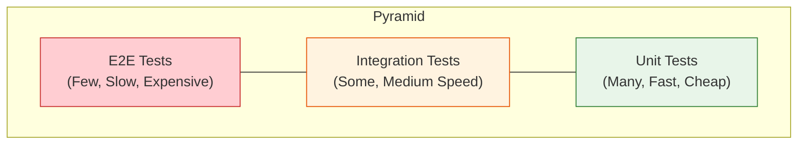
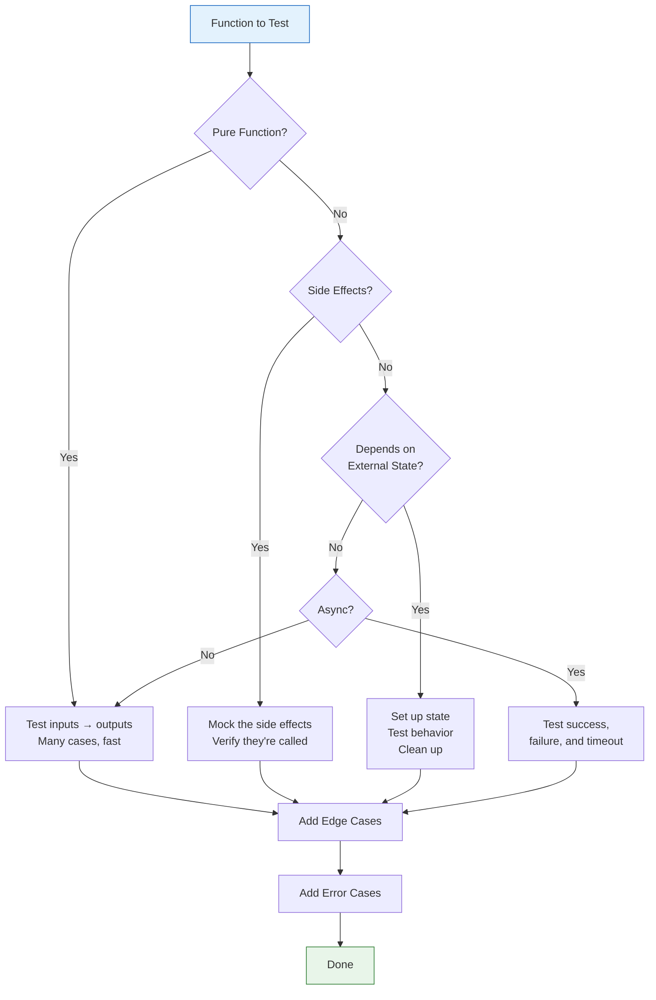
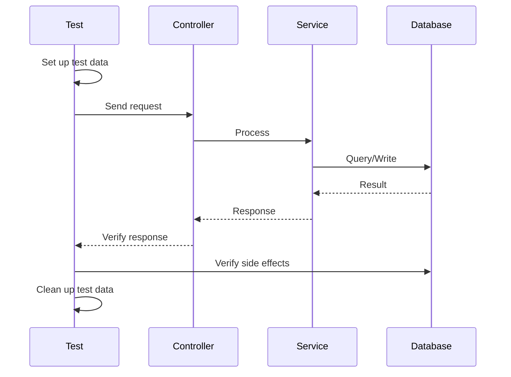

# 14 — Testing Strategies

Writing effective tests with Claude — unit, integration, e2e, edge cases, mocking, and hard-to-test code.

---

## What You'll Learn

- The testing pyramid and when to use each level
- How to read existing test structure and identify coverage gaps
- Generating test cases with Claude — edge cases, unhappy paths, boundary conditions
- Writing unit tests for pure functions, mocked dependencies, and error conditions
- Writing integration tests for multi-component flows and API endpoints
- Writing e2e tests for critical user journeys
- Strategies for testing hard-to-test code: side effects, time-dependent logic, external APIs
- Keeping tests fast, reliable, and maintainable

**Prerequisites**: [06 — Task Execution](06-task-execution.md) (you should understand the tests-first workflow)

---

## The Testing Pyramid



| Level | What It Tests | Speed | When to Use |
|-------|--------------|-------|-------------|
| **Unit** | Single function or class in isolation | Milliseconds | Default — test everything here first |
| **Integration** | Multiple components working together | Seconds | Database queries, API endpoints, service interactions |
| **E2E** | Full user journeys through the real system | Minutes | Critical paths only — login, checkout, core workflows |

### The Right Balance

- **Most tests should be unit tests** — they're fast, reliable, and easy to debug
- **Integration tests verify the wiring** — do the components connect correctly?
- **E2E tests are a safety net** — they catch issues that lower levels miss, but they're slow and fragile

### What Makes a Good Test

A good test is:
- **Fast** — no unnecessary I/O, setup, or waiting
- **Isolated** — doesn't depend on other tests or shared state
- **Deterministic** — same result every time, no flakiness
- **Readable** — test name describes the behavior, assertions are clear
- **Focused** — tests one behavior, fails for one reason

---

## Understanding Existing Tests

Before writing new tests, understand what's already there:

```
Analyze the test structure in this project:
1. What testing framework(s) are used?
2. How are tests organized (by feature, by type, co-located)?
3. What naming conventions do the tests follow?
4. What helpers, fixtures, or factories exist?
5. Are there shared setup/teardown patterns?
```

### Finding Coverage Gaps

```
Look at the tests for [module/feature]:
- What behaviors are tested?
- What behaviors are NOT tested?
- Are error paths covered?
- Are edge cases covered?
- Which functions have no tests at all?
```

### Reading Test Names as Specifications

Good test names form a specification. Ask Claude to extract one:

```
Read the test file for [module] and list all the
behaviors it verifies. Format it as a specification:
"[Module] should..."
```

This shows you at a glance what's tested and, by omission, what isn't.

---

## Generating Test Cases with Claude

### The "What Should I Test?" Prompt

When you're not sure what to test:

```
I need to write tests for [function/module]. Look at the
code and tell me every test case I should write:

1. Happy path scenarios
2. Error conditions
3. Edge cases and boundary values
4. Invalid inputs
5. State transitions (if applicable)

Don't write the tests yet — just list the cases.
```

### Edge Case Generation

Claude is particularly good at identifying edge cases you might miss:

```
Here's a function that [describe what it does]. What edge
cases could break it?

Think about:
- Empty inputs, null, undefined
- Very large inputs, very small inputs
- Boundary values (0, -1, MAX_INT)
- Unicode, special characters, emoji
- Concurrent access
- Clock/timezone issues
- Type coercion surprises
```

### The Test Case Decision Tree



---

## Writing Unit Tests

### Pure Functions

Pure functions are the easiest to test — given inputs, verify outputs:

```
Write unit tests for [function]. It takes [inputs] and
returns [output]. Follow the existing test patterns in
this project. Include:
- Normal inputs
- Edge cases (empty, null, boundary values)
- Invalid inputs (what should throw/return errors)
```

### Mocking Dependencies

When code depends on external services, databases, or other modules:

```
Write unit tests for [function] that depends on
[dependency]. Mock the dependency to test:
1. The happy path — dependency returns expected data
2. Dependency returns empty/null
3. Dependency throws an error
4. Dependency times out (if async)

Use the mocking pattern already established in this
project's tests.
```

### Testing Error Conditions

Error paths are where bugs hide. Test them explicitly:

```
Write tests for the error handling in [function]:
- What happens when [input] is invalid?
- What happens when [dependency] fails?
- Does it throw the right error type?
- Does the error message include useful context?
- Does it clean up resources on failure?
```

### Table-Driven Tests

When testing many input/output combinations:

```
Write table-driven tests for [function]. I want to test
these scenarios in a data-driven way rather than writing
separate test functions for each one. Use the pattern
this project already uses for parameterized tests.
```

---

## Writing Integration Tests

### Multi-Component Flows

Integration tests verify that components work together:



```
Write an integration test for [endpoint/flow]:
1. Set up the necessary test data
2. Execute the operation
3. Verify the response
4. Verify any side effects (database changes, events emitted)
5. Clean up

Use the project's existing database setup/teardown patterns.
```

### Database Setup and Teardown

```
How does this project handle database state in tests?
- Is there a test database?
- Are there factories or fixtures?
- How is data cleaned up between tests?
- Are transactions used for isolation?

Show me the existing pattern so I can follow it.
```

### API Endpoint Testing

```
Write integration tests for the [endpoint] API:
- Test successful requests with valid input
- Test validation errors (missing fields, wrong types)
- Test authentication (unauthenticated, wrong role)
- Test not-found cases
- Verify response shape matches the API contract
```

---

## Writing E2E Tests

### When E2E Tests Are Worth the Cost

E2E tests are expensive — slow to run, fragile, hard to debug. Use them only for:

- **Critical user journeys** — login, signup, checkout, core workflows
- **Integration seams** — where multiple systems connect (API + database + queue + email)
- **Regression prevention** — bugs that slipped through unit and integration tests

### Keeping E2E Tests Maintainable

```
Review the existing e2e tests. Are they following
best practices?
- Do they use page objects or similar abstractions?
- Are they testing user behavior, not implementation details?
- Do they have reasonable timeouts?
- Are selectors resilient (data-testid vs. CSS classes)?
- Could any of these be replaced by cheaper integration tests?
```

### Critical User Journeys

```
What are the critical user journeys in this application
that should have e2e test coverage? Think about:
- The paths where failure means revenue loss or data loss
- Flows that cross multiple services or systems
- Anything that has broken in production before
```

---

## Testing Hard-to-Test Code

### Side Effects

Code that sends emails, writes files, or calls external services:

```
This function [describe it] has side effects — it
[sends email / writes to disk / calls external API].
How do I test it without actually triggering those
side effects?

Options I'm considering:
- Dependency injection
- Mocking/stubbing the side effect
- Using a test double (fake implementation)

What approach fits this project's patterns best?
```

### Time-Dependent Code

Code that uses `Date.now()`, `setTimeout`, or time-based logic:

```
This code depends on the current time:
[paste relevant code]

How do I test it reliably? I need to:
- Control what "now" means during the test
- Test boundary conditions (midnight, DST, timezone)
- Avoid tests that are flaky depending on when they run
```

### External API Dependencies

```
This code calls [external API]. How should I test it?
Options:
1. Mock the HTTP client
2. Record/replay actual API responses
3. Use a contract test
4. Use a test sandbox (if the API provides one)

What does this project already do for external API tests?
```

### Legacy Code with No Interfaces

When code isn't designed for testability:

```
This function is hard to test because [reasons]:
- It directly instantiates its dependencies
- It has global state
- It does I/O in the middle of business logic

What's the minimum change I can make to make it testable
without a full refactor? I want to add tests first,
then refactor.
```

---

## Test Maintenance

### Keeping Tests Fast

Slow tests get skipped. Keep them fast:

```
These tests are slow — the full suite takes [time].
Help me identify:
1. Tests doing unnecessary I/O (real DB when a mock would do)
2. Tests with artificial delays (sleep/setTimeout)
3. Tests that could be parallelized
4. Tests that set up more data than they need
5. Integration tests that should be unit tests
```

### Avoiding Flakiness

Flaky tests erode trust in the test suite. Common causes:

| Cause | Fix |
|-------|-----|
| Timing dependencies | Use event-driven waits, not `sleep()` |
| Shared state between tests | Isolate test data, clean up in `afterEach` |
| Test order dependency | Each test should set up its own state |
| Port/resource conflicts | Use dynamic ports, unique temp directories |
| External service dependency | Mock it, or use a local test double |
| Non-deterministic data | Seed random generators, use fixed test data |

### When to Update vs. Delete Tests

```
These tests are failing after our changes. For each one,
tell me:
1. Is the test verifying behavior we intentionally changed?
   → Update the test expectations
2. Is the test verifying behavior that should still work?
   → Our code has a bug, fix the code
3. Is the test outdated and testing something that no longer
   exists? → Delete it
4. Is the test flaky and not related to our change?
   → Fix the flakiness separately
```

---

## Sample Conversation

> **You**: I'm adding a payment processing feature. Help me plan the test coverage.
>
> **Claude**: Let me look at the payment-related code and existing tests...
>
> *reads payment service, existing payment tests, test helpers*
>
> Here's the test plan for the payment processing feature:
>
> **Unit tests** (payment service):
> - Successful payment with valid card → returns confirmation
> - Declined card → throws `PaymentDeclinedError` with reason
> - Expired card → throws `PaymentDeclinedError`
> - Invalid amount (zero, negative, too many decimals) → throws `ValidationError`
> - Currency conversion when payment currency differs from account currency
> - Idempotency key prevents duplicate charges
> - Amount below minimum → throws `ValidationError`
> - Amount above maximum → requires additional verification flag
>
> **Unit tests** (payment validation):
> - Valid card number passes Luhn check
> - Invalid card number fails Luhn check
> - Expiry date in the past → rejected
> - Expiry date this month → accepted
> - CVV wrong length → rejected
>
> **Integration tests**:
> - Full payment flow: create intent → confirm → verify in database
> - Failed payment: create intent → decline → verify no charge recorded
> - Webhook handling: receive payment confirmation → update order status
> - Refund flow: process refund → verify credit recorded
>
> **Edge cases I'd prioritize**:
> - Network timeout during payment gateway call — is the payment retried? Could it double-charge?
> - Race condition: two payment attempts for the same order simultaneously
> - Payment succeeds at the gateway but database write fails — is there a reconciliation mechanism?
>
> **You**: That race condition concern is a good catch. Let's start with the unit tests for the payment service.
>
> **Claude**: *writes tests following the project's existing patterns, using the test factories for user and order data*

---

## Key Takeaways

1. Start with "what should I test?" before writing any test code — Claude can generate comprehensive case lists from reading the source
2. Most tests should be unit tests — they're fast, reliable, and easy to debug
3. Test error paths and edge cases, not just the happy path — that's where bugs live
4. Follow the project's existing test patterns — consistency matters more than theoretical best practices
5. Integration tests verify wiring; e2e tests are a safety net — don't over-invest in slow tests
6. Make hard-to-test code testable with minimal changes — inject dependencies, extract side effects, control time
7. Flaky tests are worse than missing tests — they erode trust in the entire suite

---

**Next**: [15 — Security Analysis](15-security-analysis.md) — Audit for vulnerabilities — injection risks, auth flows, and dependency CVEs.
