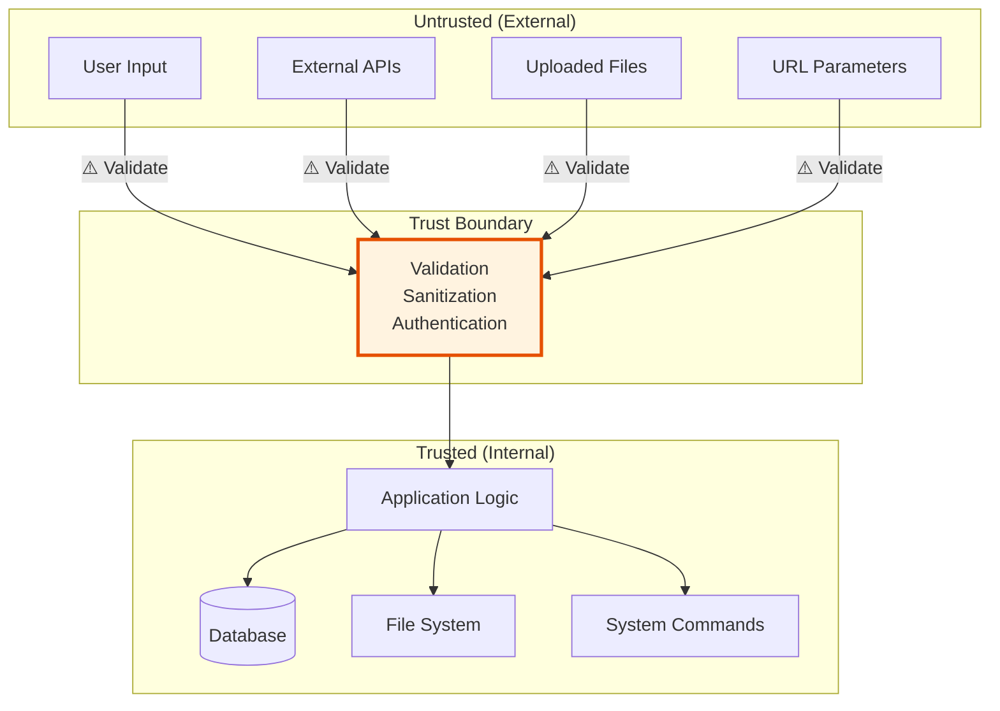
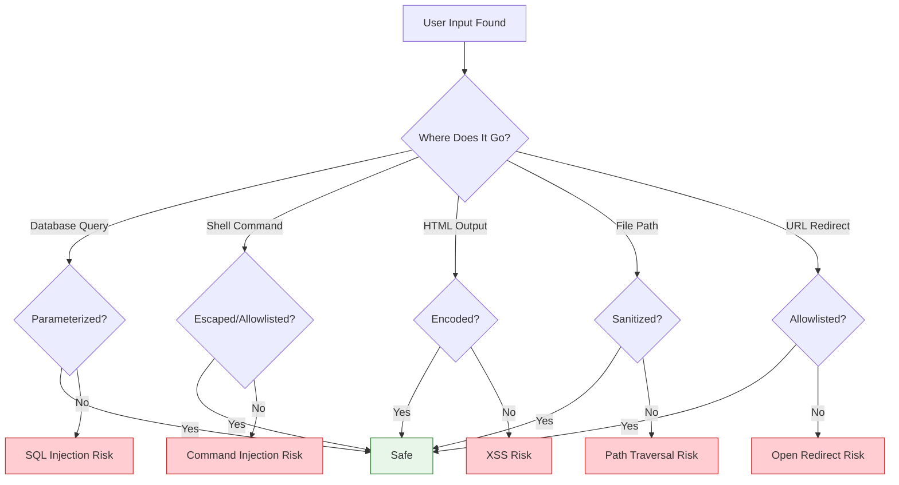
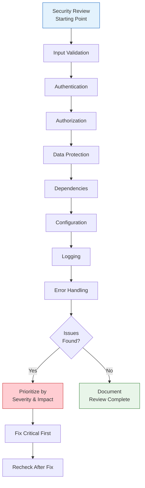

# 15 — Security Analysis

Auditing for vulnerabilities with Claude — OWASP Top 10, auth flows, injection risks, and dependency CVEs.

---

## What You'll Learn

- The security mindset: thinking like an attacker, trust boundaries, defense in depth
- Spotting injection vulnerabilities: SQL, command, XSS, path traversal
- Reviewing authentication and authorization flows
- Data protection: PII handling, credential storage, sensitive data in logs
- Scanning dependencies for known vulnerabilities
- Using the OWASP Top 10 as a review checklist
- Writing security-focused test cases

**Prerequisites**: [03 — Codebase Orientation](03-codebase-orientation.md) (you should understand the project structure) and [04 — Architecture & Dependencies](04-architecture-and-dependencies.md) (you should understand the dependency graph)

---

## The Security Mindset

Security analysis isn't about finding every possible vulnerability — it's about systematically thinking through how the system could be abused. Shift from "how does this work?" to "how could this be exploited?"

### Trust Boundaries

Every system has trust boundaries — the lines where data crosses from "untrusted" to "trusted." These are where vulnerabilities live:



```
Map the trust boundaries in this application:
1. Where does untrusted input enter the system?
2. Where is input validated or sanitized?
3. Are there any places where untrusted input reaches
   sensitive operations (DB queries, file system, shell
   commands) without validation?
```

### Defense in Depth

Never rely on a single layer of security. Ask Claude to check for layered defenses:

```
For [feature/endpoint], check if there are multiple
layers of protection:
- Input validation at the API boundary
- Type checking / schema validation in the service layer
- Parameterized queries at the database layer
- Output encoding in the response

If any layer is missing, that's a gap.
```

---

## Input Validation and Injection

### SQL Injection

The most well-known vulnerability. Look for raw string concatenation in queries:

```
Search this codebase for potential SQL injection:
- String concatenation or template literals in SQL queries
- Any use of raw queries (not parameterized)
- User input flowing into ORDER BY, LIMIT, or table names
  (which can't be parameterized in most ORMs)
- Dynamic WHERE clause construction

Show me each instance and whether it's actually
vulnerable or safely parameterized.
```

### Command Injection

When user input reaches shell commands:

```
Search for any place where user input could reach
a shell command — exec(), spawn(), system(), or
backticks. Check:
- Is the input validated against an allowlist?
- Is it properly escaped?
- Could a user inject shell metacharacters (;, |, &&)?
```

### Cross-Site Scripting (XSS)

```
Check the frontend for XSS vulnerabilities:
- Are there any uses of dangerouslySetInnerHTML (React),
  v-html (Vue), or [innerHTML] (Angular)?
- Is user-generated content escaped before rendering?
- Are URL parameters reflected in the page without sanitization?
- Is Content-Security-Policy configured?
```

### Path Traversal

```
Check for path traversal vulnerabilities:
- Is user input used to construct file paths?
- Can a user use ../ to access files outside the
  intended directory?
- Are there filename sanitization checks?
- Is there a whitelist of allowed directories?
```

### Injection Decision Tree



---

## Authentication and Authorization

### Reviewing Auth Flows

```
Walk me through the authentication flow:
1. How do users authenticate (session, JWT, OAuth)?
2. Where are credentials validated?
3. How are tokens/sessions created, stored, and invalidated?
4. What's the token/session lifetime?
5. Is there refresh token rotation?
6. How does password reset work?
7. Is there brute force protection (rate limiting, lockout)?
```

### Session Management

```
Review the session management for security issues:
- Are session IDs cryptographically random?
- Are sessions invalidated on logout?
- Is there session fixation protection?
- Are cookies set with Secure, HttpOnly, and SameSite flags?
- Is session data stored server-side (not in the cookie)?
```

### Authorization Checks

Authentication says *who you are*. Authorization says *what you can do*. They're often confused:

```
Check the authorization model:
- Is there a consistent pattern for checking permissions?
- Are there any endpoints that check authentication but
  not authorization (any logged-in user can access)?
- Can users access or modify other users' resources by
  changing IDs in the URL?
- Is there vertical privilege escalation (regular user
  accessing admin features)?
- Is there horizontal privilege escalation (user A
  accessing user B's data)?
```

### Common Auth Vulnerabilities

| Vulnerability | What to Check |
|--------------|---------------|
| Missing auth on endpoints | New endpoints added without middleware |
| IDOR (Insecure Direct Object Reference) | `/api/users/123/profile` — can user 456 access it? |
| JWT issues | Weak signing key, `none` algorithm accepted, no expiry |
| Session fixation | Session ID unchanged after login |
| Password storage | Plaintext, weak hashing (MD5/SHA1), no salt |
| Token in URL | Auth tokens in query params (logged, cached, referer leaked) |

---

## Data Protection

### PII Handling

```
Search for personally identifiable information (PII) in
this codebase:
- Where is PII collected (names, emails, addresses, SSN)?
- Where is it stored?
- Is it encrypted at rest?
- Who/what has access to it?
- Is there a data retention or deletion mechanism?
```

### Sensitive Data in Logs

One of the most common data leaks:

```
Check the logging throughout the application:
- Are passwords, tokens, or API keys ever logged?
- Are request bodies logged (which might contain PII)?
- Are error messages leaking internal details
  (stack traces, SQL queries, file paths)?
- Is there a log sanitization mechanism?
```

### Credential Storage

```
How are secrets managed in this project?
- Are there hardcoded credentials, API keys, or secrets?
- Is there a .env file? Is it in .gitignore?
- Are production secrets managed through environment
  variables, a vault, or a secrets manager?
- Check git history — were secrets ever committed and
  then removed? (They're still in the history.)
```

### Encryption

```
Review the encryption practices:
- Is data encrypted in transit (HTTPS everywhere)?
- Is sensitive data encrypted at rest?
- What encryption algorithms are used — are any outdated
  (DES, RC4, MD5 for hashing)?
- How are encryption keys managed?
```

---

## Dependency Vulnerabilities

### Scanning for CVEs

```
Check the project's dependencies for known vulnerabilities:
1. What dependency management tool does this project use?
2. Run the appropriate audit command (npm audit, pip audit,
   cargo audit, etc.)
3. For each vulnerability found:
   - What's the severity (critical, high, medium, low)?
   - Is the vulnerable code actually reachable in our app?
   - Is there a patched version available?
   - What's the upgrade path — is it a breaking change?
```

### Evaluating Severity

Not all CVEs are equal. Help prioritize:

```
For each vulnerability found, assess the actual risk:
- Is the vulnerable function called in our code?
- Is the vulnerability exploitable from the outside, or
  does it require local access?
- What's the worst case if it's exploited?
- Is there a workaround if we can't upgrade immediately?
```

### Supply Chain Risks

```
Review the dependency tree for supply chain risks:
- Are there any dependencies with very few maintainers?
- Are there dependencies that haven't been updated in years?
- Are there any that were recently transferred to new owners?
- Are lock files committed to the repository?
- Are dependency versions pinned or using ranges?
```

---

## OWASP Top 10 Checklist

Use the OWASP Top 10 as a systematic audit framework:

```
Audit this application against the OWASP Top 10. For each
category, check whether the application is vulnerable and
rate the risk:

1. Broken Access Control
2. Cryptographic Failures
3. Injection
4. Insecure Design
5. Security Misconfiguration
6. Vulnerable Components
7. Authentication Failures
8. Data Integrity Failures
9. Logging & Monitoring Failures
10. Server-Side Request Forgery (SSRF)

For each, tell me:
- Are we vulnerable? (Yes / Partially / No)
- Where specifically? (file/line)
- What's the fix?
```

---

## Security Testing

### Writing Security Test Cases

```
Write security-focused test cases for [feature]:
- Can unauthenticated users access protected endpoints?
- Can users access other users' data by manipulating IDs?
- What happens with malicious input (SQL injection strings,
  XSS payloads, extremely long input)?
- Do rate limits actually work?
- Are CORS headers correct?
```

### Threat Modeling

```
Help me do a basic threat model for [feature/system]:
1. What are the assets worth protecting?
2. Who are the threat actors (external attacker,
   malicious insider, compromised dependency)?
3. What are the attack vectors?
4. What are the existing mitigations?
5. What gaps remain?
```

### Security Review Checklist



---

## Sample Conversation

> **You**: Audit this file upload endpoint for security issues. Here's the handler code: [paste code]
>
> **Claude**: Let me analyze this file upload endpoint...
>
> *reads the handler, middleware, file storage logic, and validation*
>
> I found several security issues:
>
> **Critical — Path traversal in filename:**
> The uploaded filename is used directly in the storage path: `path.join(uploadDir, req.file.originalname)`. An attacker could upload a file named `../../../etc/cron.d/malicious` to write outside the upload directory.
>
> Fix: Replace the original filename with a generated UUID. Store the original name in the database only.
>
> **Critical — No file type validation on content:**
> The code checks the file extension (`.jpg`, `.png`) but not the actual content. An attacker could upload a PHP/JSP shell script renamed as `shell.jpg`. If the upload directory is web-accessible, they could execute it.
>
> Fix: Validate the file's magic bytes using a library like `file-type`. Also ensure the upload directory is not directly served by the web server.
>
> **High — No file size limit:**
> There's no `limits.fileSize` in the multer configuration. An attacker could upload extremely large files to exhaust disk space.
>
> Fix: Set `limits: { fileSize: 10 * 1024 * 1024 }` (10MB or whatever is appropriate).
>
> **High — Missing antivirus scanning:**
> Uploaded files aren't scanned for malware. If these files are served to other users, this could be a distribution vector.
>
> Fix: Integrate with ClamAV or a similar scanning service before accepting the upload.
>
> **Medium — No rate limiting:**
> The endpoint has no rate limiting. An attacker could flood it with upload requests.
>
> Fix: Add the rate limiting middleware that other endpoints use.
>
> **You**: Good catches. The path traversal and file type issues are the most critical — help me fix those first.

---

## Key Takeaways

1. Think about trust boundaries — every place where untrusted input enters the system is a potential vulnerability
2. Check for injection at every boundary — SQL, command, XSS, and path traversal are the most common
3. Authentication is not authorization — always check both, separately
4. Scan dependencies regularly — a vulnerable dependency is an open door
5. Use the OWASP Top 10 as a systematic checklist — it catches the issues that account for most real-world breaches
6. Sensitive data leaks through logs more often than through direct exploits — check what gets logged
7. Defense in depth means multiple layers — don't rely on a single validation check

---

**Next**: [16 — Working with Legacy Code](16-working-with-legacy-code.md) — Safely modify untested code with characterization tests and incremental improvement.
