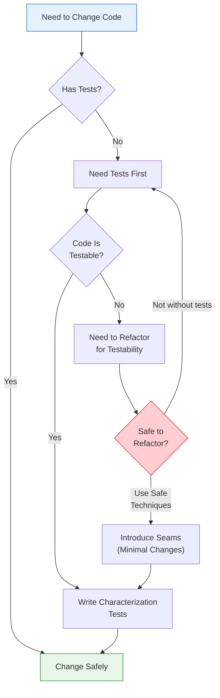
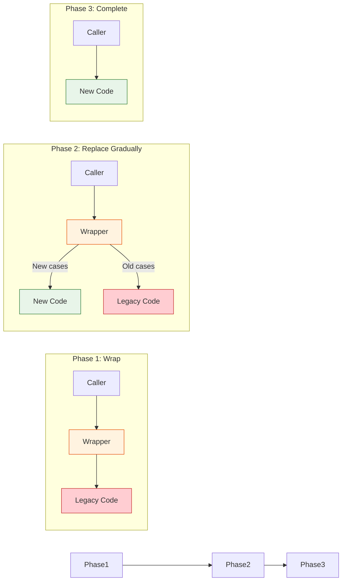
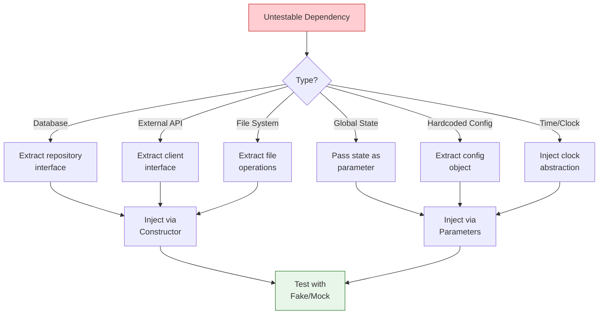

# 16 — Working with Legacy Code

Safely modifying untested code — characterization tests, the strangler fig pattern, and incremental improvement.

---

## What You'll Learn

- What makes code "legacy" and why it's hard to change
- Making code safe to change with characterization tests and the "golden master" technique
- Understanding implicit behavior — side effects, hidden dependencies, undocumented assumptions
- The strangler fig pattern for incremental replacement
- Breaking dependencies to make untestable code testable
- Refactoring safely in small, verified steps
- Dealing with "god objects" — monolithic classes and functions

**Prerequisites**: [05 — Codebase Archaeology](05-codebase-archaeology.md) (understanding git history and context) and [06 — Task Execution](06-task-execution.md) (the change workflow)

---

## Understanding "Legacy"

Legacy code isn't just old code. It's code that:

- **Has no tests** — you can't change it without fear of breaking something
- **Has no documentation** — the only specification is the code itself
- **Has lost its authors** — the people who wrote it are gone, and their decisions are mysteries
- **Resists change** — every modification feels risky because you can't verify correctness

The core problem: **you need to change the code, but you can't safely change the code without tests, and you can't easily write tests without changing the code.** This is the legacy code paradox.



---

## Making It Safe to Change

### Characterization Tests

Characterization tests don't test what code *should* do — they test what code *actually does*. They capture current behavior so you'll know if you accidentally change it:

```
I need to modify [function/class] but it has no tests.
Before I change anything, help me write characterization
tests that capture its current behavior:

1. Read the code and identify all possible inputs
2. Trace through each code path
3. Write tests that document what it currently returns
   for each scenario — even if the behavior seems wrong
4. Include edge cases and error paths

Don't fix any bugs you find — just document the
current behavior in tests.
```

### The "Golden Master" Technique

For complex functions with many code paths, use the golden master approach:

```
This function is too complex to manually trace every path.
Help me create a golden master test:

1. Identify a representative set of inputs that cover
   the major code paths
2. Run the function with each input set
3. Capture the exact output
4. Write a test that asserts the output matches

This gives us a regression safety net even if we don't
fully understand every code path.
```

### When Existing Behavior Is Wrong

Sometimes you'll discover bugs while writing characterization tests. Resist the urge to fix them:

```
I found what looks like a bug while writing
characterization tests — [describe the issue].

Don't fix it yet. Instead:
1. Write a test that documents the CURRENT (buggy) behavior
2. Add a comment: "Known issue: [description]"
3. We'll fix it as a separate step after we have our
   safety net in place
```

---

## Understanding Implicit Behavior

Legacy code is full of undocumented behavior that other parts of the system depend on:

### Reading for Side Effects

```
Analyze [function] and list ALL its side effects — not
just its return value, but everything else it does:

- Database writes or updates
- File system changes
- Cache modifications
- Event emissions or message queue publishes
- Global state mutations
- Logging (that other systems might parse)
- External API calls
- Setting cookies or session data

Some of these side effects might be intentional behavior
that other code depends on.
```

### Hidden Dependencies

```
What does [function/class] depend on that isn't obvious
from its signature?

Look for:
- Global variables or singletons it reads
- Environment variables it checks
- Files it reads from disk
- Database tables it queries (beyond its "own" table)
- Time-of-day or date-dependent behavior
- Configuration it reads at runtime
```

### Undocumented Assumptions

```
What assumptions does [function] make that aren't checked
or documented?

Look for:
- Input validation it skips (assumes caller validates)
- State it expects to exist (assumes initialization happened)
- Order dependencies (assumes called after X)
- Data format assumptions (assumes UTF-8, assumes sorted)
- Concurrency assumptions (assumes single-threaded)
```

---

## The Strangler Fig Pattern

Instead of rewriting legacy code all at once, gradually replace it piece by piece — like a strangler fig growing around a tree.



### Step 1: Create the Wrapper

```
I want to replace [legacy function/class] incrementally
using the strangler fig pattern.

Step 1: Create a wrapper that:
- Has the same interface as the legacy code
- Delegates all calls to the legacy code (for now)
- Gives us a seam where we can start routing to new code

Don't change any behavior yet — callers should see no
difference.
```

### Step 2: Route New Cases to New Code

```
Now let's route [specific case/feature] through the new
implementation instead of the legacy code:

1. Write the new implementation for this specific case
2. Add routing logic in the wrapper: if [condition],
   use new code; otherwise, use legacy code
3. Write tests for the new code path
4. Keep the legacy path as a fallback
```

### Step 3: Migrate and Remove

```
We've migrated [X] of [Y] cases to the new code. Check:
1. Is the legacy code path still being hit? How can we tell?
2. Are there cases we missed?
3. Can we safely remove the legacy code and the wrapper?

Help me verify that nothing still depends on the
legacy path before we remove it.
```

---

## Breaking Dependencies

When legacy code can't be tested because of hard-wired dependencies, you need to introduce seams — places where you can substitute test doubles.

### Introducing Seams

```
[function] directly instantiates [dependency] inside its
body, making it impossible to test in isolation. What's the
simplest way to introduce a seam so I can inject a test
double?

Options:
- Constructor injection
- Parameter injection
- Extract and override (create a protected method)
- Module-level injection (replace the import)
```

### Dependency Injection for Untestable Code

```
This class creates its own database connection, HTTP client,
and file system access internally. I want to make it testable
without a major refactor. Show me the minimal changes:

1. Extract the dependency creation into a method I can override
2. Accept optional dependencies in the constructor
3. Keep the default behavior identical for production code
```

### The Dependency Breaking Decision Tree



---

## Refactoring Safely

The mantra: **"Make the change easy, then make the easy change."** — Kent Beck

### Small Verified Steps

Never refactor and change behavior at the same time:

```
I want to refactor [code] and also add [new feature].
Help me plan this as two separate steps:

Step 1 — Refactor (no behavior change):
- What structural changes do we need?
- How do we verify nothing changed? (tests should still pass)

Step 2 — Add the feature (behavior change):
- Now that the code is cleaner, what's the change?
- What new tests do we need?
```

### Extract Method

The most common and safest refactoring:

```
This function is [X] lines long. Help me extract
smaller methods from it:

1. Identify logical blocks that do one thing
2. For each block, suggest a method name and signature
3. The extracted methods should be pure if possible
4. After extraction, the original function should read
   like a high-level outline

Do one extraction at a time — I'll run tests between each.
```

### Replace Magic Numbers and Strings

```
Find all magic numbers and hardcoded strings in [file]:
- What does each one mean?
- Suggest named constants for each
- Group related constants together

This is a safe refactoring — it changes no behavior.
```

---

## Dealing with "God Objects"

God objects are classes or functions that do too much. They're hard to understand, hard to test, and hard to change because everything depends on them.

### Identifying Responsibilities

```
This class is [X] lines long and seems to do everything.
Help me identify its distinct responsibilities:

1. Group its methods by what domain concern they handle
2. Identify which instance variables each group uses
3. Draw the dependency graph between groups
4. Which groups could be extracted into their own class?
```

### Extracting Responsibilities

```
We identified that [class] has [N] responsibilities.
Let's extract [specific responsibility] into its own class:

1. What methods and data belong to this responsibility?
2. Create the new class with those methods
3. Delegate from the original class to the new one
4. Don't change the public interface of the original class
   yet — callers should see no difference

We'll update callers to use the new class directly in a
later step.
```

### Breaking Up Monolithic Functions

```
This function is [X] lines long with deeply nested
conditionals. Help me break it up:

1. Identify the early returns / guard clauses
2. Extract the nested blocks into named methods
3. Flatten the control flow
4. Each extracted method should be independently testable

Show me the plan — I'll do one extraction at a time
and run tests between each.
```

---

## Sample Conversation

> **You**: I need to modify an 800-line controller with no tests. It handles order processing — create, update, cancel, refund. I need to add a "partial refund" feature. How do I approach this safely?
>
> **Claude**: Let me read the controller first...
>
> *reads the full controller, related models, and routes*
>
> This controller has four main responsibilities mixed together:
> 1. Request validation and parsing (lines 1–150)
> 2. Order business logic (lines 151–500)
> 3. Payment gateway interaction (lines 501–680)
> 4. Response formatting and error handling (lines 681–800)
>
> The refund logic is in `handleRefund()` at line 580. It calls the payment gateway directly, updates the order status, and sends a notification — all in one 90-line method with no tests.
>
> Here's my recommended approach:
>
> **Step 1: Write characterization tests for `handleRefund()`**
> - Test with a fully paid order → full refund
> - Test with an already-refunded order → error
> - Test with a canceled order → error
> - Test with a gateway failure → error handling
>
> **Step 2: Extract the payment gateway interaction**
> - Pull the gateway call into a separate method/class
> - Inject it so we can mock it in tests
> - Run characterization tests — they should still pass
>
> **Step 3: Add partial refund**
> - Now that the code is testable, add partial refund as a new code path
> - Write tests first for the new behavior
> - Implement the feature
>
> This way we never modify untested code. We add tests, refactor safely, *then* add the feature.
>
> **You**: Good plan. Let's start with the characterization tests.
>
> **Claude**: *writes tests that capture the current behavior of `handleRefund()`, using mocks for the payment gateway and database*

---

## Key Takeaways

1. Write characterization tests before changing anything — capture what the code does now, even if it seems wrong
2. Never refactor and change behavior in the same step — one at a time, with tests between
3. Legacy code has implicit behavior that other code depends on — map side effects before modifying
4. The strangler fig pattern lets you replace legacy code gradually without a risky big-bang rewrite
5. Break dependencies with the minimum change needed — inject via constructors, parameters, or method overrides
6. "Make the change easy, then make the easy change" — invest in structure before adding features
7. God objects can be broken up by extracting responsibilities one at a time, keeping the original interface stable

---

**Next**: [17 — Collaboration & Team Workflows](17-collaboration-and-team-workflows.md) — Team practices for shared CLAUDE.md, onboarding, and pair programming.
