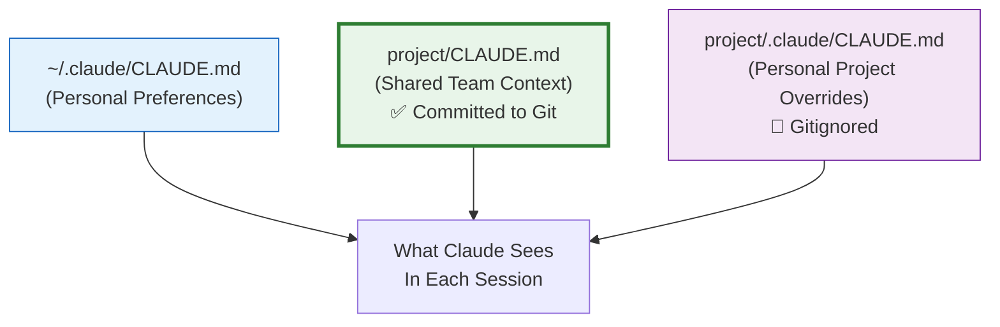
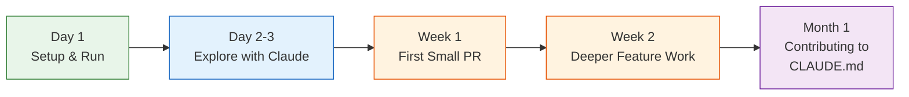
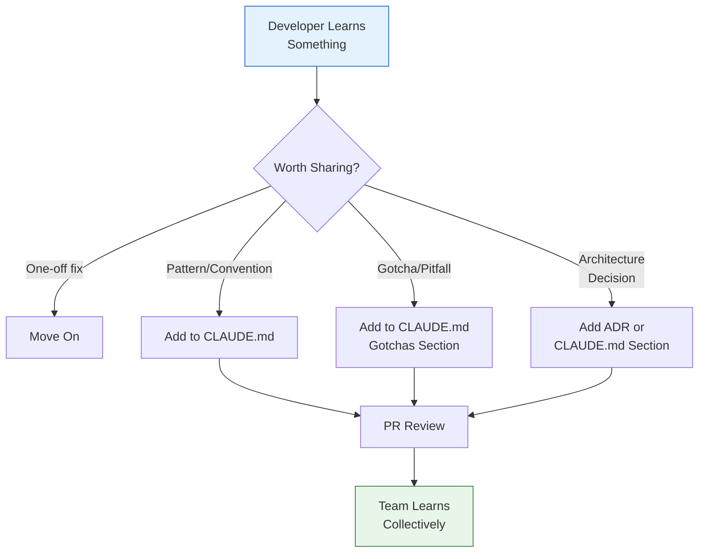

# 17 — Collaboration & Team Workflows

Team practices for using Claude Code together — shared CLAUDE.md, consistent prompting, onboarding, and pair programming.

---

## What You'll Learn

- Sharing CLAUDE.md effectively — what belongs in team context vs. personal context
- Establishing consistent prompting conventions across the team
- Using Claude for onboarding new team members
- Pair programming with Claude as a collaborative partner
- Team-level practices for knowledge capture and review cadence
- Cross-team collaboration strategies for multi-repo environments

**Prerequisites**: [02 — Setup & Configuration](02-setup-and-configuration.md) (you should understand CLAUDE.md and settings) and [08 — Ongoing Practices](08-ongoing-practices.md) (you should understand session management and knowledge building)

---

## Sharing CLAUDE.md

### The CLAUDE.md Hierarchy

CLAUDE.md files exist at multiple levels. Teams should use each level intentionally:



| Level | What Goes Here | Who Maintains It |
|-------|---------------|-----------------|
| **Personal** (`~/.claude/CLAUDE.md`) | Editor preferences, communication style, personal shortcuts | Individual |
| **Project shared** (`project/CLAUDE.md`) | Build commands, architecture, conventions, coding standards | Team (via PR) |
| **Project personal** (`project/.claude/CLAUDE.md`) | Personal overrides, local env specifics, scratch notes | Individual |

### What Belongs in Shared CLAUDE.md

The shared CLAUDE.md should contain information that helps *any* team member work on the project:

```
Review our CLAUDE.md and tell me:
1. What's here that's genuinely useful for the whole team?
2. What's here that's personal preference (should move
   to personal CLAUDE.md)?
3. What's missing that would help a new team member?
4. Is anything outdated or wrong?
```

**Good shared content:**
- Build, test, lint, and deploy commands
- Architecture decisions and their rationale
- Coding conventions and patterns to follow
- Common gotchas and their solutions
- Important file paths and what they contain
- Testing patterns and where to put new tests

**Keep personal:**
- Communication style preferences ("be concise," "explain in detail")
- Editor-specific settings
- Local environment specifics (paths, ports)
- Personal workflow shortcuts

### CLAUDE.md Review Process

Treat CLAUDE.md changes like code changes — they should go through PR review:

```
I want to add the following to our shared CLAUDE.md.
Review it for:
- Accuracy — is this actually how the project works?
- Usefulness — would this help someone unfamiliar?
- Conciseness — is it as short as it can be?
- Conflicts — does it contradict anything already there?

[paste proposed addition]
```

---

## Consistent Prompting Conventions

### Team Prompt Patterns

Teams work better when they use consistent patterns for common tasks. Establish shared vocabulary:

**For code exploration:**
```
Trace the [feature] flow from [entry point] to [endpoint].
Show me every file and function involved.
```

**For making changes:**
```
Add [feature] following the patterns in [reference file].
Include tests. Run the linting and test suite when done.
```

**For debugging:**
```
This error is happening: [paste error]. Reproduce the
issue, find the root cause, and suggest a fix.
```

**For code review:**
```
Review [file/PR] for: correctness, test coverage,
security issues, and adherence to our conventions.
```

### Shared Vocabulary

Establish terms the whole team uses consistently:

| Term | Team Definition |
|------|----------------|
| "Trace the flow" | Follow a request end-to-end, listing every file/function |
| "Check blast radius" | Find all callers and dependents of the changed code |
| "Golden master test" | Capture current output as the test expectation |
| "Strangler wrap" | Create a wrapper around legacy code for incremental replacement |
| "Characterization test" | Test that documents existing behavior, not intended behavior |

Add these to your shared CLAUDE.md so every team member (and Claude) uses them the same way.

### Anti-Patterns to Avoid

| Anti-Pattern | Why It's Bad | Instead |
|-------------|-------------|---------|
| Each dev has different CLAUDE.md conventions | Inconsistent results, knowledge silos | Agree on shared content and review process |
| Long, rambling prompts | Claude loses focus, inconsistent output | Use short, structured prompts with clear goals |
| "Just fix it" prompts | No verification criteria, risky changes | State the goal, constraints, and how to verify |
| Duplicating instructions | Conflicts when things change | Keep one source of truth in shared CLAUDE.md |

---

## Onboarding with Claude

### New Hire Onboarding

Claude is an excellent onboarding assistant. A new team member can explore the codebase systematically:

```
I'm new to this project. Walk me through:
1. What does this project do? (purpose, users)
2. What's the tech stack?
3. How is the code organized?
4. How do I build and run it?
5. How do I run the tests?
6. What are the most important files to understand?
7. What are the main coding conventions?
```

### "Explore with Claude" Exercises

Give new team members structured exploration tasks:

**Exercise 1 — Trace a request:**
```
Pick the [core endpoint] and trace the request from
the HTTP handler through to the database. Document what
you find — this will be your first contribution to
CLAUDE.md.
```

**Exercise 2 — Find the testing pattern:**
```
Look at the test files for [module]. Understand the
testing patterns, then write a test for [untested function]
following the same patterns.
```

**Exercise 3 — Read the history:**
```
Use git log to find the last 5 significant changes to
[important file]. For each one, understand what changed
and why. Document any conventions or decisions you discover.
```

### Generating Onboarding Materials

```
Generate an onboarding guide for a new developer joining
this project. Include:

1. First-day setup (prerequisites, cloning, building)
2. Architecture overview (with a diagram)
3. Key concepts and domain terminology
4. Common development tasks and how to do them
5. Where to find things (important file paths)
6. How to get help (documentation, team contacts, Slack)

Keep it concise — a new developer should be able to read
it in under 30 minutes.
```

### Onboarding Timeline



---

## Pair Programming with Claude

### The Driver-Navigator Pattern

In traditional pair programming, one person drives (types) while the other navigates (thinks strategically). With Claude, this works well:

**You drive, Claude navigates:**
```
I'm going to implement [feature]. As I code, I want you
to act as my navigator:
- Watch for bugs or issues as I describe my changes
- Suggest better approaches if you see one
- Remind me of edge cases I might be missing
- Point out when I'm straying from project conventions
```

**Claude drives, you navigate:**
```
Implement [feature] following the patterns in [reference].
I'll review each change before you move on. After each file,
stop and let me confirm before continuing.
```

### Collaborative Exploration

When investigating a complex problem together:

```
Let's explore this together. I think the bug is in
[area] but I'm not sure. Let's:
1. Start at [entry point] and trace the flow
2. I'll tell you what I expect at each step
3. You tell me what actually happens
4. We'll find where expectation and reality diverge
```

### Real-Time Code Review

Use Claude for immediate feedback as you code:

```
I just wrote this function. Quick review before I move on:
[paste code]

Check for:
- Obvious bugs
- Missing error handling
- Style issues compared to the rest of the codebase
```

---

## Team-Level Practices

### Knowledge Capture



When someone discovers something useful during a Claude session, it should flow back to the team:

```
I just discovered that [finding]. Help me write a concise
addition to CLAUDE.md that captures this for the team.
Include:
- The pattern/convention/gotcha
- When it applies
- An example if it's not obvious
```

### CLAUDE.md Review Cadence

Schedule regular reviews of your shared CLAUDE.md:

- **Weekly**: Quick check — is anything outdated? Any new gotchas from this sprint?
- **Monthly**: Deeper review — are conventions still accurate? Does the architecture section reflect reality?
- **Quarterly**: Full audit — remove stale content, reorganize, fill gaps

```
Review our CLAUDE.md against the current state of the
codebase. Flag anything that:
1. Is outdated (code has changed but CLAUDE.md hasn't)
2. Is missing (important patterns not documented)
3. Contradicts what the code actually does
4. Is too verbose (could be more concise)
```

### Prompt Libraries

Some teams maintain a shared set of useful prompts for common tasks:

```
# In CLAUDE.md or a separate team document:

## Common Prompts

### Adding a new API endpoint
"Add a new [method] [path] endpoint. Follow the pattern
in [reference endpoint]. Include input validation, error
handling, and tests."

### Database migration
"Create a migration to [change]. Include both up and down
migrations. Check for data that would violate new constraints."

### Investigating a production issue
"[Error] is happening in production. Check the [service]
logs, trace the request flow, and identify the root cause.
Don't make any changes — just analyze."
```

---

## Cross-Team Collaboration

### Sharing Context Across Boundaries

When multiple teams work on the same system:

```
I'm working on [team A's service] and need to understand
how [team B's service] works. Based on:
- Their CLAUDE.md (if available)
- Their API documentation
- Their code structure

Help me understand:
1. How our services communicate
2. What data we send/receive
3. What assumptions each side makes
4. Where to look if something breaks between us
```

### Multi-Repo Strategies

For organizations with many repositories:

```
We have multiple repos that work together:
- [repo 1]: [purpose]
- [repo 2]: [purpose]
- [repo 3]: [purpose]

I'm making a change in [repo 1] that affects [repo 2].
Help me:
1. Understand the interface between them
2. Identify what needs to change in [repo 2]
3. Plan the rollout order to avoid breaking the integration
```

### Shared CLAUDE.md Conventions Across Repos

When multiple repos share patterns, establish organization-wide conventions:

```
# Organization-level conventions (in each repo's CLAUDE.md)

## Org Standards
- All APIs follow REST conventions in [link to style guide]
- Error responses use the standard error format: { error: { code, message, details } }
- All services emit structured logs in JSON format
- Database migrations use [tool] with timestamps, not sequential numbers
```

---

## Sample Conversation

> **You**: I'm pair programming with Claude to refactor our notification system from a monolithic `NotificationService` into separate channel handlers (email, SMS, push). Let's do this step by step.
>
> **Claude**: Let me read the current `NotificationService` first...
>
> *reads the service, tests, and callers*
>
> The current `NotificationService` is 450 lines with methods for email, SMS, and push notifications all mixed together. It has 12 callers across the codebase. Here's my plan:
>
> **Phase 1 — Extract without changing callers:**
> 1. Create `EmailNotifier`, `SmsNotifier`, `PushNotifier` classes
> 2. Move the relevant methods to each
> 3. `NotificationService` delegates to them internally
> 4. All existing tests still pass, callers unchanged
>
> **Phase 2 — Update callers (gradual):**
> 5. New code uses the specific notifier directly
> 6. Existing callers migrated one at a time in separate PRs
>
> **Phase 3 — Clean up:**
> 7. Once all callers migrated, remove the delegating methods from `NotificationService`
>
> Want to start with Phase 1? I'll extract `EmailNotifier` first and stop for your review.
>
> **You**: Yes, start with EmailNotifier. Show me before moving on.
>
> **Claude**: *extracts `EmailNotifier` class, moves the 3 email methods, adds delegation in `NotificationService`, runs tests*
>
> Here's what I did:
> - Created `src/notifications/EmailNotifier.ts` with `sendWelcome()`, `sendReset()`, and `sendDigest()`
> - `NotificationService` now creates an `EmailNotifier` internally and delegates the email methods
> - All 23 existing tests pass
> - No callers changed
>
> Want to review the code before I continue with `SmsNotifier`?

---

## Key Takeaways

1. Treat shared CLAUDE.md like code — review changes through PRs, keep it accurate and concise
2. Separate team conventions from personal preferences — use the right CLAUDE.md level for each
3. Establish shared prompting patterns — consistent vocabulary gives consistent results
4. Use Claude for structured onboarding — new team members can explore systematically with guided exercises
5. Pair programming with Claude works best with clear roles — either you drive and Claude navigates, or vice versa
6. Capture team knowledge continuously — when someone learns something, it should flow back to CLAUDE.md
7. Review CLAUDE.md regularly — stale context is worse than no context

---

**That completes the guide series.** Go back to the [main page](../README.md) to explore all guides or revisit earlier topics.
