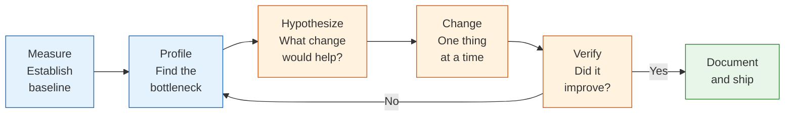
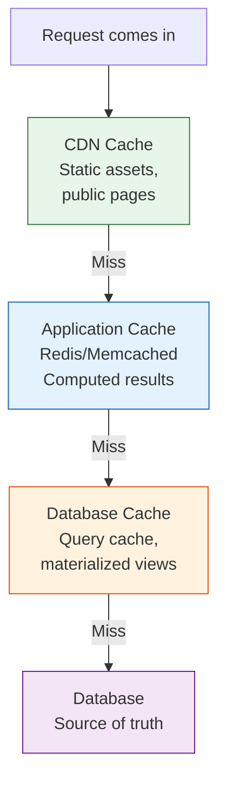

# 21 — Performance Optimization

Proactive performance optimization with Claude — profiling, caching, load testing, and database tuning.

---

## What You'll Learn

- The performance mindset — measure first, optimize second
- Profiling CPU, memory, I/O, and network bottlenecks
- Frontend performance — bundle size, render performance, Core Web Vitals
- Backend performance — response times, throughput, connection pooling
- Caching strategies and invalidation patterns
- Database tuning — query optimization, connection pools, read replicas
- Load testing — designing tests, interpreting results, finding breaking points
- Performance budgets and preventing regression

**Prerequisites**: [03 — Codebase Orientation](03-codebase-orientation.md) (you should be able to navigate the codebase) and [12 — Debugging & Troubleshooting](12-debugging-and-troubleshooting.md) (you should understand systematic debugging approaches)

---

## The Performance Mindset

The first rule of optimization: **measure before you change**.

```
I think [feature/endpoint/page] is slow. Before I start
optimizing, help me:

1. Define "slow" — what's the current measurement and
   what's the target?
2. Identify where to measure (client, server, database)
3. Establish a baseline with real numbers
4. Identify the bottleneck before changing anything

I don't want to optimize the wrong thing.
```

### The Optimization Cycle



**Common mistakes:**
- Optimizing without measuring first ("I think this is slow")
- Optimizing the wrong layer (the database is fast — the problem is 50 HTTP calls)
- Changing multiple things at once (you can't tell what helped)
- Micro-optimizing code that runs once per request instead of fixing the O(n^2) loop

---

## Profiling

### Where to Profile

| Symptom | Profile This | Tools |
|---------|-------------|-------|
| Slow page load | Network waterfall, bundle size | Browser DevTools, Lighthouse |
| Slow API response | Server-side execution time | Node profiler, py-spy, pprof |
| High memory usage | Heap snapshots, allocations | Chrome DevTools, heapdump, Valgrind |
| High CPU usage | CPU profile, flame graph | `perf`, `flamegraph`, V8 profiler |
| Slow queries | Query execution plan | `EXPLAIN ANALYZE`, slow query log |
| High disk I/O | File operations, logging | `strace`, `dtruss`, `iostat` |

### Reading Profiles with Claude

```
Here's a CPU flame graph / profile output from our
[service]. Help me interpret it:

[paste profile or describe findings]

1. Where is the most CPU time spent?
2. Are there unexpected hot spots?
3. Is there a single function dominating?
4. Do I see signs of N+1 queries, serialization overhead,
   or unnecessary computation?
5. What should I optimize first for the biggest impact?
```

---

## Frontend Performance

### Core Web Vitals

| Metric | What It Measures | Good | Needs Work | Poor |
|--------|-----------------|------|------------|------|
| **LCP** (Largest Contentful Paint) | Loading speed | < 2.5s | 2.5-4s | > 4s |
| **INP** (Interaction to Next Paint) | Responsiveness | < 200ms | 200-500ms | > 500ms |
| **CLS** (Cumulative Layout Shift) | Visual stability | < 0.1 | 0.1-0.25 | > 0.25 |

```
Analyze our frontend for performance issues:

1. What's our bundle size? Can it be reduced?
   - Are we tree-shaking unused exports?
   - Are there large dependencies with smaller alternatives?
   - Are we code-splitting by route?
2. What's our LCP element? Can we load it faster?
   - Is the critical CSS inlined?
   - Are above-the-fold images optimized and lazy-loaded?
3. What causes layout shifts?
   - Images without width/height?
   - Dynamically injected content?
   - Web fonts without size-adjust?
```

### Bundle Size Optimization

```
Analyze our JavaScript bundle and find optimization
opportunities:

1. Run the bundle analyzer and identify the largest modules
2. Flag dependencies over 50KB that might have lighter
   alternatives
3. Check for duplicate dependencies (same lib, different
   versions)
4. Are we importing entire libraries when we only use one
   function? (e.g., import _ from 'lodash' vs
   import groupBy from 'lodash/groupBy')
5. Is dynamic import used for routes and heavy components?
```

### Render Performance

```
This component re-renders too frequently. Help me diagnose:

1. What props change on each parent render?
2. Are callbacks recreated every render? (missing useCallback)
3. Are objects/arrays recreated every render? (missing useMemo)
4. Is this component subscribed to a context that changes
   too broadly?
5. Would React.memo help here?
6. Is there expensive computation that should be memoized?

Note: only memoize if profiling shows this is actually
causing jank — don't over-optimize.
```

---

## Backend Performance

### Response Time Analysis

```
Our [endpoint] has a p50 of [X]ms and p99 of [Y]ms.
Help me break down where time is spent:

1. Request parsing and validation
2. Authentication/authorization
3. Database queries (how many? how long each?)
4. External API calls
5. Business logic computation
6. Response serialization
7. Middleware overhead

Where's the biggest gap between p50 and p99? That's
usually the most impactful area to optimize.
```

### Connection Pooling

```
Review our database connection pool configuration:

Current settings:
- Pool size: [N]
- Max overflow: [N]
- Connection timeout: [N]s
- Idle timeout: [N]s

Help me evaluate:
1. Is the pool sized correctly for our workload?
   (rule of thumb: pool size = 2 * CPU cores + disk spindles)
2. Are connections being returned to the pool promptly?
3. Are we seeing "connection pool exhausted" errors?
4. What's our connection churn rate?
5. Should we use PgBouncer or a similar pooler for
   many short-lived connections?
```

---

## Caching Strategies

### What to Cache



```
Identify caching opportunities in our application:

1. Which endpoints are called most frequently?
2. Which of those return data that doesn't change often?
3. Which database queries are repeated with the same
   parameters?
4. Which computations are expensive but deterministic?
5. What's the acceptable staleness for each? (seconds,
   minutes, hours)

For each candidate:
- Where should it be cached? (CDN, app memory, Redis, DB)
- What's the cache key?
- What triggers invalidation?
```

### Cache Invalidation Patterns

| Pattern | How It Works | Best For |
|---------|-------------|----------|
| **TTL (time-based)** | Expires after N seconds | Data that can be slightly stale (user profiles, product listings) |
| **Event-based** | Invalidated when source data changes | Data that must be fresh after writes (cart, permissions) |
| **Write-through** | Write to cache and database simultaneously | Data written infrequently, read frequently |
| **Write-behind** | Write to cache, async flush to database | High write throughput, eventual consistency OK |
| **Cache-aside** | App checks cache, falls back to DB, populates cache | Most common general pattern |

```
Review our caching for correctness:

1. Can we serve stale data after a write?
   (race between update and cache invalidation)
2. What happens on cache failure? (does the app still work?)
3. Are cache keys unique enough? (user-specific data
   must include user ID in key)
4. Do we have thundering herd protection? (many cache
   misses at once when TTL expires)
5. Is our cache sized correctly? (eviction rate too high =
   cache too small)
```

---

## Database Tuning

Database tuning for existing systems — for designing schemas from scratch, see [Guide 19](19-data-modeling-and-database-design.md).

### Identifying Slow Queries

```
Help me find and optimize our slowest database queries:

1. Enable slow query log (queries over 100ms)
2. Find the top 10 slowest queries by total time
3. For each one:
   - Run EXPLAIN ANALYZE
   - Identify the bottleneck (sequential scan, sort,
     nested loop)
   - Recommend a fix (index, query rewrite, denormalize)
4. Estimate the impact of each fix
```

### Connection Pool Sizing

Too few connections = requests wait. Too many = database overloaded.

```
Our database has [N] max connections. We have [M]
application instances, each with a pool of [P].

Check:
1. Total connections: M * P = [?]. Is this < N?
   (leave 20% headroom for admin connections)
2. Are connections being held during slow operations?
   (external API calls while holding a DB connection)
3. Would PgBouncer help? (yes if many short-lived
   connections from serverless functions)
```

### Read Replicas

```
We're considering read replicas. Help me evaluate:

1. What % of our queries are reads vs writes?
2. Which read queries could safely run on a replica?
   (not ones that need to see their own writes)
3. What's our replication lag tolerance?
4. How do we handle routing in the application?
   (connection per query? middleware? ORM configuration?)
```

---

## Load Testing

### Designing Load Tests

```
Help me design a load test for [service/endpoint]:

1. What are the key scenarios to test?
   (login, browse, search, checkout)
2. What's the expected traffic pattern?
   (steady, spiky, gradually increasing)
3. What are the SLAs? (p99 < 500ms, error rate < 0.1%)
4. What's the expected peak load?
5. How do we generate realistic test data?
6. What do we monitor during the test?
```

### Interpreting Load Test Results

```
Here are our load test results:

[paste results — requests/sec, latency percentiles,
error rates at different load levels]

Help me interpret:
1. Where's the inflection point? (load where latency
   spikes or errors start)
2. What's the bottleneck? (CPU, memory, DB connections,
   network)
3. Does latency degrade gracefully or suddenly?
4. Are there error patterns? (timeouts vs 500s vs specific
   errors)
5. What's our safe operating capacity with headroom?
```

### Finding Breaking Points

Run tests at increasing load levels to find where the system degrades:

| Load Level | Purpose |
|-----------|---------|
| **Baseline** (expected traffic) | Verify SLAs at normal load |
| **Peak** (2x baseline) | Verify behavior at expected peaks |
| **Stress** (3-5x baseline) | Find the breaking point |
| **Soak** (baseline for hours) | Find memory leaks and resource exhaustion |
| **Spike** (0 → peak → 0) | Test auto-scaling and recovery |

---

## Performance Budgets

### Defining Budgets

```
Help me define performance budgets for our application:

Frontend:
- JavaScript bundle: max [X] KB (gzipped)
- LCP: max [X] seconds
- INP: max [X] ms
- CLS: max [X]

Backend:
- API response time (p99): max [X] ms
- Database query time (p99): max [X] ms
- Memory usage per instance: max [X] MB

What CI checks can we add to enforce these budgets?
```

### Preventing Regression

```
Our page load time has regressed from 2.1s to 3.4s over
the last month. Help me:

1. Identify when the regression started (binary search
   through recent deploys)
2. Compare bundle sizes between the good and bad versions
3. Check for new dependencies added recently
4. Look for changes to critical rendering path
5. Suggest CI checks to catch this earlier next time
```

---

## Sample Conversation

> **You**: Our `/api/dashboard` endpoint's p99 latency has crept from 800ms to 2.5s over the last two months. Help me find and fix the cause.
>
> **Claude**: Let me investigate systematically. First, let me read the dashboard endpoint handler...
>
> *reads the route handler, service layer, and database queries*
>
> The dashboard endpoint makes these calls:
> 1. `getUser()` — 1 query, ~5ms
> 2. `getRecentActivity()` — 1 query, ~20ms
> 3. `getProjectStats()` — **1 query per project** (N+1!)
> 4. `getNotifications()` — 1 query, ~10ms
> 5. `getTeamMembers()` — 1 query, ~15ms
>
> **Found it**: `getProjectStats()` runs one query per project. Two months ago the average user had 5 projects. Checking recent data... the average is now 23 projects.
>
> The p99 user likely has 50+ projects, meaning 50+ sequential database queries just for stats.
>
> **Fix options:**
>
> | Option | Effort | Impact |
> |--------|--------|--------|
> | Batch query (fetch all project stats in one query) | Low | ~50ms instead of 50 * 20ms |
> | Cache project stats (5-minute TTL) | Medium | Near-instant for cached users |
> | Pre-compute stats in background job | High | Fastest reads, but adds complexity |
>
> I'd recommend starting with the batch query — it's the simplest fix and addresses the root cause. Want me to implement it?
>
> **You**: Yes, batch query. Show me the change.
>
> **Claude**: *rewrites `getProjectStats()` to accept an array of project IDs and fetch all stats in a single query with `WHERE project_id IN (...)`, updates the dashboard handler to pass all project IDs at once, runs the existing tests*

---

## Key Takeaways

1. Measure before optimizing — gut feelings about "what's slow" are often wrong
2. Profile to find the bottleneck — don't guess, look at the data
3. Change one thing at a time — otherwise you can't tell what helped
4. Cache strategically — know what invalidates the cache before you add one
5. N+1 queries are the most common backend performance problem — look for loops that execute queries
6. Performance budgets prevent regression — add CI checks for bundle size and response time
7. Load test to find your breaking point before your users do

---

**Next**: [22 — Incident Response](22-incident-response.md) — Handling production incidents with triage, rollback decisions, and blameless postmortems.
