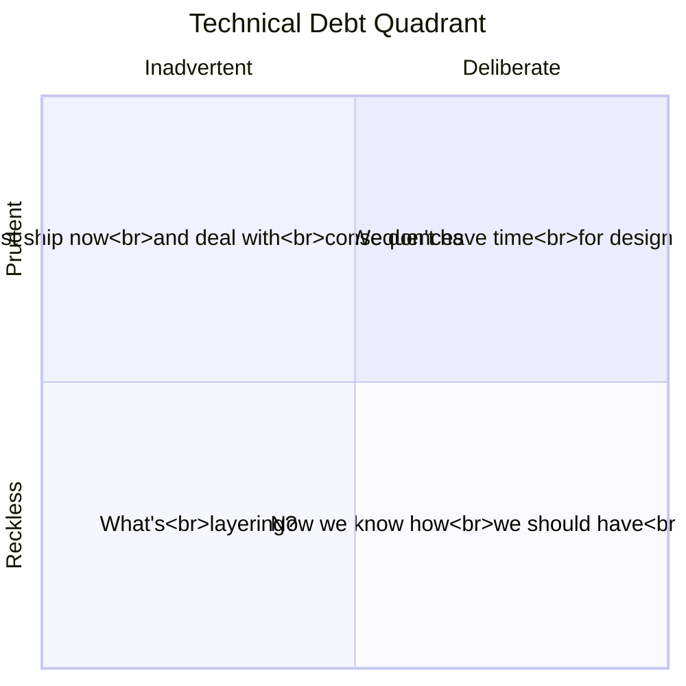
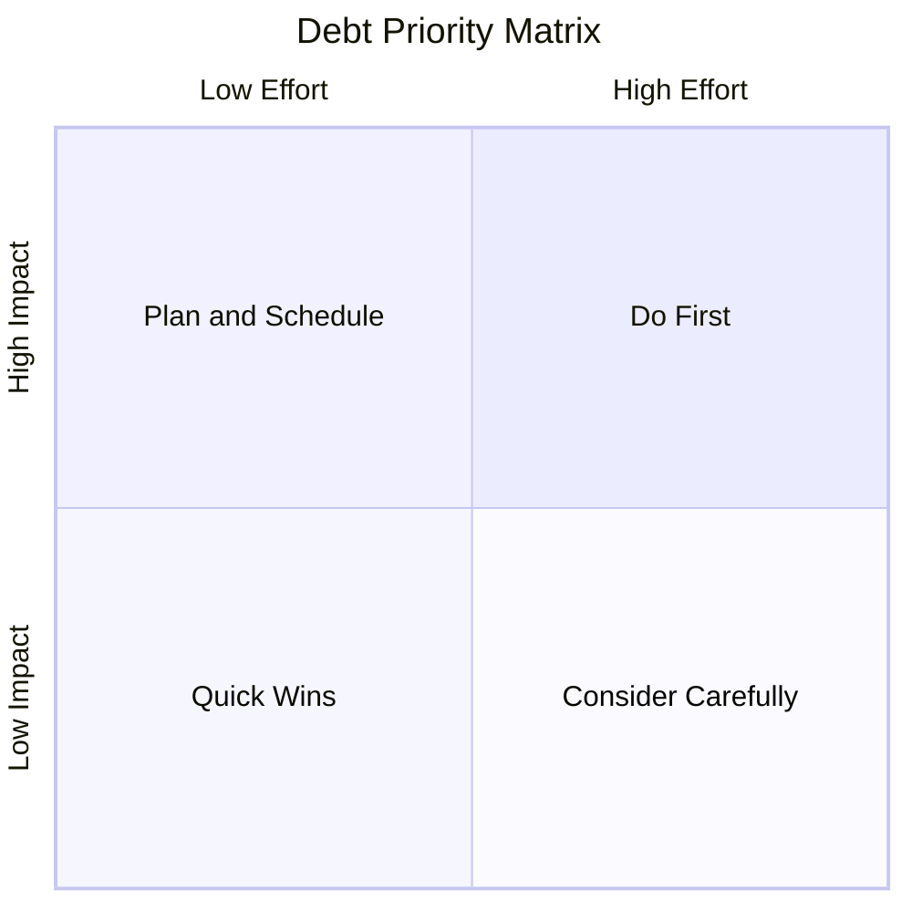
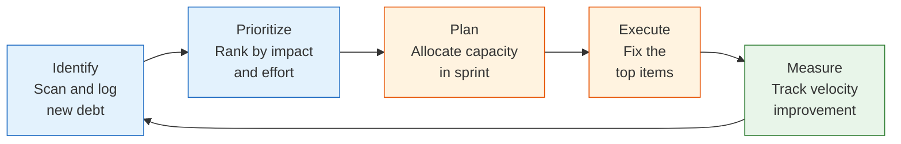

# 23 — Technical Debt Management

Systematically identifying, measuring, prioritizing, and paying down technical debt.

---

## What You'll Learn

- Understanding technical debt — intentional vs accidental, the interest metaphor
- Identifying debt at code, architecture, and process levels
- Measuring and tracking debt with a debt register
- Prioritizing repayment using impact and effort
- Creating a sustainable repayment plan
- Making the case to stakeholders in business language
- Preventing new debt with quality gates

**Prerequisites**: [05 — Codebase Archaeology](05-codebase-archaeology.md) (you should understand how to read a codebase's history) and [09 — Anti-Patterns](09-anti-patterns.md) (you should understand common mistakes and their consequences)

---

## Understanding Technical Debt

### The Debt Metaphor

Technical debt is like financial debt — it's not inherently bad, but **unmanaged debt compounds**.

- **Principal**: The shortcut or compromise itself (the code that needs improving)
- **Interest**: The ongoing cost of working around it (slower development, more bugs, harder onboarding)
- **Default**: When interest becomes unbearable (rewrites, outages, team attrition)

### Fowler's Technical Debt Quadrant



| Quadrant | Example | Response |
|----------|---------|----------|
| **Deliberate + Prudent** | "Ship with manual process, automate next sprint" | Track it, pay it back on schedule |
| **Deliberate + Reckless** | "We don't have time for tests" | Challenge the decision, document the risk |
| **Inadvertent + Prudent** | "Now that we understand the domain better, our model is wrong" | Natural — refactor as understanding grows |
| **Inadvertent + Reckless** | Poor design due to lack of knowledge | Invest in learning and code review |

---

## Identifying Debt with Claude

### Code-Level Debt

```
Scan this codebase for technical debt indicators:

1. Code smells:
   - Functions over 50 lines
   - Files over 500 lines
   - Deeply nested conditionals (> 3 levels)
   - Duplicated code blocks
   - TODO/FIXME/HACK comments

2. Test debt:
   - Untested files (no corresponding test)
   - Low coverage areas
   - Skipped/disabled tests
   - Tests without assertions

3. Dependency debt:
   - Outdated dependencies (major versions behind)
   - Deprecated packages still in use
   - Multiple libraries for the same purpose
   - Packages with known vulnerabilities

Organize findings by severity: critical, high, medium, low.
```

### Architecture-Level Debt

```
Analyze our architecture for structural debt:

1. Coupling:
   - Which modules have the most cross-dependencies?
   - Are there circular dependencies?
   - Which changes tend to cascade across many files?

2. Abstraction:
   - Are there leaky abstractions? (implementation details
     exposed through interfaces)
   - Are there missing abstractions? (the same pattern
     repeated without a shared component)
   - Are there wrong abstractions? (forced generalizations
     that make simple things hard)

3. Scalability:
   - What breaks first at 10x current load?
   - Are there single points of failure?
   - Which components can't be deployed independently?
```

### Process-Level Debt

```
Review our development process for debt:

1. Build and deploy:
   - How long does CI take? Is it getting slower?
   - Are there manual deployment steps?
   - How often do deploys fail?

2. Documentation:
   - Is the README accurate?
   - Are API docs in sync with code?
   - Can a new developer onboard in under a week?

3. Development workflow:
   - How long does local setup take?
   - Are there frequent "works on my machine" issues?
   - How often do developers work around tool limitations?
```

---

## Measuring and Tracking Debt

### The Debt Register

Track debt systematically, not in scattered TODOs:

```
Help me create a technical debt register. For each item,
capture:

1. ID: unique identifier (DEBT-001)
2. Title: short description
3. Category: code / architecture / process / dependency
4. Severity: critical / high / medium / low
5. Interest: what ongoing cost does this impose?
   (developer time, bug frequency, incident risk)
6. Principal: what would it take to fix?
   (estimated effort in days)
7. Affected areas: which files, services, or teams
8. Date identified: when we found it
9. Owner: who's responsible for the fix
10. Status: identified / planned / in-progress / resolved
```

**Example debt register entries:**

| ID | Title | Category | Severity | Interest (weekly) | Principal |
|----|-------|----------|----------|-------------------|-----------|
| DEBT-001 | Monolithic user service | Architecture | High | 4 hrs cross-team coordination | 3 weeks |
| DEBT-002 | No integration tests for payments | Code | Critical | 2 hrs manual testing per PR | 1 week |
| DEBT-003 | jQuery still in admin panel | Dependency | Medium | 1 hr context-switching | 2 weeks |
| DEBT-004 | Manual staging deployments | Process | High | 3 hrs per deploy, error-prone | 3 days |

### Impact Assessment

```
For each debt item in our register, help me quantify
the impact:

1. Developer time: How many hours per week does this
   cost the team?
2. Bug frequency: How many bugs per quarter are caused
   by this?
3. Incident risk: What's the probability and severity
   of an incident?
4. Onboarding cost: How much longer does onboarding
   take because of this?
5. Opportunity cost: What can't we build because of
   the time this consumes?
```

---

## Prioritizing Debt Repayment

### The Priority Matrix



| Quadrant | Strategy |
|----------|----------|
| **High impact, low effort** (top-left) | Do these first — maximum ROI |
| **High impact, high effort** (top-right) | Plan and schedule into sprints |
| **Low impact, low effort** (bottom-left) | Quick wins — do opportunistically (boy scout rule) |
| **Low impact, high effort** (bottom-right) | Probably not worth doing — reconsider periodically |

### Prioritization Prompt

```
Here's our technical debt register:

[paste register]

Help me prioritize using these criteria:
1. Impact on developer velocity (hours saved per week)
2. Risk reduction (probability × severity of incident)
3. Effort to fix (developer-days)
4. Dependencies (does fixing A make fixing B easier?)
5. Strategic alignment (does it enable planned features?)

Rank the top 5 items to tackle next and explain why.
```

### Risk-Based Prioritization

Some debt items aren't about velocity — they're about risk:

```
For our critical debt items, assess risk:

1. What's the worst-case scenario if we don't fix this?
2. How likely is that scenario in the next 6 months?
3. Would fixing this have prevented any recent incidents?
4. Is the risk increasing over time? (more users, more
   data, more developers)
5. Is there a regulatory or compliance dimension?

Flag anything where risk × likelihood justifies
immediate action regardless of effort.
```

---

## Creating a Repayment Plan

### Sprint Allocation Strategies

| Strategy | How It Works | Best For |
|----------|-------------|----------|
| **20% Rule** | Reserve 20% of each sprint for debt repayment | Steady improvement, works for most teams |
| **Dedicated Sprints** | Full sprint focused on debt every 4-6 weeks | Large debt items, team morale reset |
| **Boy Scout Rule** | Leave code cleaner than you found it on every PR | Small, incremental improvements |
| **Tech Debt Fridays** | One day per week dedicated to debt | Predictable, visible, sustainable |
| **Opportunistic** | Fix debt when touching related code | Zero overhead, but inconsistent |

### The Incremental Repayment Cycle



```
Help me create a 3-month debt repayment plan:

Current capacity: [X developers, Y sprints per month]
Debt allocation: [20% of sprint / dedicated sprint / etc.]
Top debt items: [paste from prioritized register]

For each item:
1. Break it into small, shippable increments
2. Estimate each increment
3. Identify dependencies between items
4. Assign to sprints
5. Define how we'll measure improvement
```

### Quick Wins

Start with quick wins to build momentum and demonstrate value:

```
From our debt register, find items that:
1. Take less than 1 day to fix
2. Have measurable impact (faster CI, fewer warnings,
   better error messages)
3. Can be done alongside feature work
4. Don't require coordination across teams

These are our "boy scout" opportunities — fix them
whenever you're in the area.
```

---

## Making the Case to Stakeholders

### Speaking Business Language

Technical leaders often struggle to get buy-in because they describe debt in technical terms. Translate to business impact:

| Technical Description | Business Translation |
|----------------------|---------------------|
| "Our test coverage is 30%" | "Every feature release requires 2 days of manual testing, and we still ship bugs monthly" |
| "We have circular dependencies" | "Adding a simple feature takes 3x longer because changes cascade unpredictably" |
| "Our deployment is manual" | "Each deploy takes 4 hours of engineer time and fails 1 in 5 times" |
| "We need to upgrade to React 18" | "We can't hire React developers because no one wants to work on a 5-year-old version" |
| "Our database isn't indexed properly" | "Page load times have doubled in 6 months — we're losing customers" |

### Building the Business Case

```
Help me build a business case for a tech debt sprint.
Here are our top debt items:

[paste top 5 items with impact data]

Create a one-page proposal that includes:
1. Current cost (hours per week, incidents per quarter)
2. Proposed investment (2 sprints of focused work)
3. Expected return (hours saved, risk reduced)
4. ROI calculation (payback period)
5. What happens if we DON'T address this (projected cost
   in 6 months)
6. Success metrics (how we'll measure improvement)

Write it for a non-technical VP who cares about velocity,
reliability, and team retention.
```

### Visualizing Debt Impact

```
Help me create visualizations showing:

1. Debt trend over time (is it growing or shrinking?)
2. Developer velocity impact (sprint velocity vs debt load)
3. Incident correlation (incidents caused by known debt)
4. Time allocation (% of time on debt interest vs features)
5. Projected improvement (if we invest X, we gain Y)
```

---

## Preventing New Debt

### Quality Gates

Prevent new debt from entering the codebase:

```
Help me set up quality gates in our CI pipeline:

1. Test coverage minimum: don't merge if coverage drops
   below [X]% (for changed files)
2. Linting: no new lint warnings (treat warnings as errors)
3. Bundle size budget: fail if bundle grows beyond [X]KB
4. Dependency checks: fail on deprecated or vulnerable deps
5. Complexity limits: flag functions with cyclomatic
   complexity > [X]
6. Migration safety: lint migrations for unsafe patterns
```

### Definition of Done

Add debt-prevention criteria to your definition of done:

```
A feature is "done" when:
- [ ] Code reviewed and approved
- [ ] Tests written (unit + integration for happy path)
- [ ] No new lint warnings
- [ ] Documentation updated (if API or behavior changed)
- [ ] No new TODO/HACK comments without a linked ticket
- [ ] Existing tests still pass
- [ ] Performance impact assessed for user-facing changes
```

### Code Review for Debt

```
When reviewing PRs, check for new debt:

1. Does this PR introduce shortcuts that should be
   tracked? (add to debt register if so)
2. Does it follow existing patterns, or create a new
   inconsistent pattern?
3. Are there TODOs without tickets?
4. Is the test coverage adequate for the change?
5. Does it increase coupling between modules?
6. Would a future developer understand this code without
   asking the author?
```

---

## Sample Conversation

> **You**: I want to propose a tech debt sprint to my manager. Help me build a compelling case from our codebase.
>
> **Claude**: Let me scan the codebase for debt indicators first...
>
> *scans for code smells, test coverage, outdated dependencies, TODO comments, and complexity metrics*
>
> Here's what I found:
>
> **Critical debt:**
> 1. **No integration tests for the payment flow** — the most revenue-critical path has only unit tests with mocked dependencies. Impact: 3 payment bugs in the last quarter required emergency fixes.
> 2. **Manual deployment to staging** — takes 2 hours each time, fails ~20% of the time. The team deploys 3x per week. That's 6 hours/week on a process that should be automated.
>
> **High debt:**
> 3. **UserService god object** (1,200 lines) — every user-related PR touches this file, causing merge conflicts in 40% of PRs.
> 4. **37 `@ts-ignore` comments** — type safety gaps that have caused 5 runtime errors in the last month.
>
> **Business case draft:**
>
> **Current cost**: ~15 developer-hours per week in debt interest (manual deploys, merge conflicts, debugging type errors, manual payment testing).
>
> **Proposed investment**: 1 dedicated sprint (2 weeks, 3 developers).
>
> **Expected outcome**:
> - Automated staging deploys: save 6 hrs/week
> - Payment integration tests: prevent ~1 emergency fix/month (8 hrs each)
> - UserService split: reduce merge conflicts by ~40%
>
> **ROI**: Investment of ~240 developer-hours. Weekly savings of ~15 hours. **Payback in 16 weeks**, then pure savings.
>
> **If we don't act**: The manual deploy process will become the bottleneck as we scale from 3 to 5 deploys/week. The payment bugs will continue (one has already required a customer credit). The UserService will grow further as the team grows.
>
> Want me to refine this into a one-page document you can present?

---

## Key Takeaways

1. Track debt in a register, not in scattered TODOs — you can't manage what you don't measure
2. Quantify interest in hours per week — abstract "code quality" doesn't motivate action
3. Prioritize by ROI — high impact, low effort items first
4. Fix debt incrementally — boy scout rule for small items, dedicated sprints for large ones
5. Translate to business language — "3 hours per week wasted" is more compelling than "high cyclomatic complexity"
6. Prevent new debt with quality gates — it's cheaper to prevent debt than to pay it down
7. Celebrate debt repayment — make improvements visible so the team sees the value

---

**Next**: [24 — Accessibility Auditing](24-accessibility-auditing.md) — Auditing and improving accessibility with WCAG compliance, semantic HTML, and keyboard navigation.
