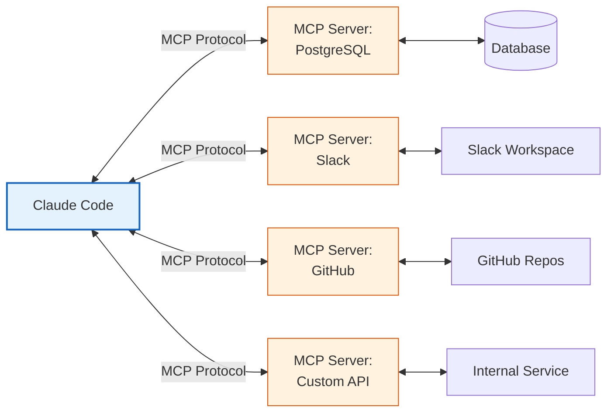
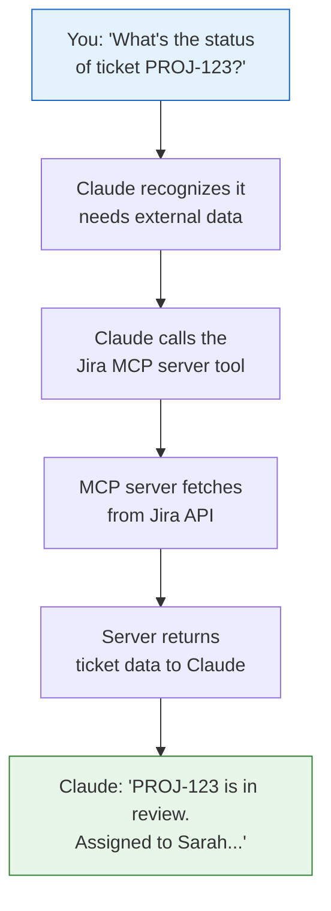

# 25 — MCP Servers

Understand the Model Context Protocol — what it is, what it isn't, and how to use it to give Claude Code access to external tools and data sources.

---

## What You'll Learn

- What MCP actually is — a connectivity protocol, not an agent framework
- How MCP servers work with Claude Code
- Configuring and using MCP servers in your projects
- Common MCP use cases (databases, project management, monitoring)
- The clear distinction between MCP, agents, and rules
- When to use MCP vs other approaches
- Common misconceptions that trip people up

**Prerequisites**: [02 — Setup & Configuration](02-setup-and-configuration.md)

---

## What MCP Actually Is

MCP — Model Context Protocol — is a standardized way for AI tools like Claude Code to connect to external data sources and services. Think of it like USB-C for AI: a standard interface that lets different tools plug into different services using the same protocol.



An MCP server is a lightweight process that:

1. **Runs locally** alongside Claude Code
2. **Exposes tools** that Claude can call (query a database, fetch a ticket, post a message)
3. **Handles the connection** to the external service (authentication, protocols, etc.)
4. **Returns structured data** that Claude can reason about

Claude decides **when** to use these tools based on your conversation context — you don't manually invoke them.

---

## MCP Is Not What You Think

Before going further, let's clear up the most common confusions:

| Concept | What It Is | What It Is NOT |
|---------|-----------|----------------|
| **MCP** | A connectivity protocol — gives Claude access to external tools and data | An agent framework, an AI model, a replacement for APIs |
| **MCP Server** | A tool provider — like a REST API adapter for AI | An AI agent, a chatbot, an autonomous system |
| **Agent** | An autonomous behavior loop (observe → think → act) | A protocol, a server, a configuration file |
| **Rules** | Behavioral instructions (CLAUDE.md) | Connectivity, tool access, external integrations |

**MCP servers are to Claude what browser extensions are to a browser**: they extend what it can access, but they don't change how it thinks or behaves.

---

## How MCP Works in Claude Code

### The Flow

When you ask Claude something that requires external data:



You don't tell Claude to "use the MCP server." You just ask your question, and Claude uses the available tools when relevant.

### Configuration

MCP servers are configured in your project or user settings:

**Project-level** (`.claude/settings.json`):

```json
{
  "mcpServers": {
    "postgres": {
      "command": "npx",
      "args": ["-y", "@modelcontextprotocol/server-postgres"],
      "env": {
        "DATABASE_URL": "postgresql://localhost:5432/myapp_dev"
      }
    }
  }
}
```

**User-level** (`~/.claude/settings.json`):

```json
{
  "mcpServers": {
    "github": {
      "command": "npx",
      "args": ["-y", "@modelcontextprotocol/server-github"],
      "env": {
        "GITHUB_TOKEN": "ghp_xxxxxxxxxxxx"
      }
    }
  }
}
```

**Where to configure**:

- **Project settings**: servers the whole team needs (database, project management)
- **User settings**: personal tools (your GitHub token, your Slack workspace)
- **Sensitive tokens**: always use user-level settings or environment variables — never commit secrets

---

## Setting Up Your First MCP Server

### Step 1: Choose a Server

Popular community MCP servers:

| Server | What It Does |
|--------|-------------|
| `@modelcontextprotocol/server-postgres` | Query PostgreSQL databases |
| `@modelcontextprotocol/server-sqlite` | Query SQLite databases |
| `@modelcontextprotocol/server-github` | Access GitHub repos, issues, PRs |
| `@modelcontextprotocol/server-slack` | Read/search Slack messages |
| `@modelcontextprotocol/server-filesystem` | Access files outside the project |
| `@modelcontextprotocol/server-memory` | Persistent key-value memory |

### Step 2: Add the Configuration

Add to `.claude/settings.json`:

```json
{
  "mcpServers": {
    "sqlite": {
      "command": "npx",
      "args": ["-y", "@modelcontextprotocol/server-sqlite", "--db-path", "./data/app.db"]
    }
  }
}
```

### Step 3: Restart Claude Code

MCP servers are loaded at startup. After changing the configuration, restart Claude Code for changes to take effect.

### Step 4: Verify It Works

```
What MCP tools do you have available? Can you list them?
```

Claude will show you the tools exposed by your configured MCP servers.

### Step 5: Use It Naturally

```
Show me the schema of the users table and the last 10 rows.
```

Claude will use the database MCP server to query the schema and data, then present the results.

---

## Practical Use Cases

### Database Exploration

With a database MCP server configured:

```
Show me all tables in the database, their row counts,
and any tables that seem to have orphaned records
(foreign keys pointing to rows that don't exist).
```

```
What indexes exist on the orders table? Are there any
slow queries that might benefit from additional indexes?
```

### Project Management Integration

With a Jira or Linear MCP server:

```
What tickets are assigned to me in the current sprint?
Which ones are blocked?
```

```
I just finished implementing the auth changes. Update
ticket PROJ-456 to "In Review" and add a comment
summarizing what was changed.
```

### Monitoring and Observability

With a monitoring MCP server:

```
What errors have been showing up in production logs
in the last hour? Group them by frequency.
```

### Custom Internal Tools

You can build MCP servers for any internal system:

```
Check the feature flag service — is the "new-checkout"
flag enabled in staging? What percentage rollout is it at?
```

---

## Building a Custom MCP Server

If no existing server fits your needs, you can build your own. An MCP server is a process that speaks the MCP protocol over stdin/stdout.

### Minimal Example (Node.js)

```javascript
import { McpServer } from "@modelcontextprotocol/sdk/server/mcp.js";
import { StdioServerTransport } from "@modelcontextprotocol/sdk/server/stdio.js";
import { z } from "zod";

const server = new McpServer({
  name: "my-internal-api",
  version: "1.0.0",
});

server.tool(
  "get_deploy_status",
  "Check the deployment status of a service",
  { service: z.string().describe("Service name") },
  async ({ service }) => {
    const response = await fetch(
      `https://deploy.internal/api/status/${service}`
    );
    const data = await response.json();
    return {
      content: [{ type: "text", text: JSON.stringify(data, null, 2) }],
    };
  }
);

const transport = new StdioServerTransport();
await server.connect(transport);
```

Then configure it:

```json
{
  "mcpServers": {
    "deploy": {
      "command": "node",
      "args": ["./tools/deploy-mcp-server.js"]
    }
  }
}
```

### When to Build Custom vs Use Existing

**Use an existing server when**: there's a community server for your service (database, GitHub, Slack)

**Build custom when**: you have internal APIs or proprietary systems that Claude needs to access

---

## Security Considerations

### Principle of Least Privilege

Give MCP servers the minimum access they need:

- **Database servers**: use a read-only database user when possible
- **API servers**: use tokens with limited scopes
- **File system servers**: restrict to specific directories

### Token Management

Never commit tokens to your project settings:

```json
{
  "mcpServers": {
    "github": {
      "command": "npx",
      "args": ["-y", "@modelcontextprotocol/server-github"],
      "env": {
        "GITHUB_TOKEN": "${GITHUB_TOKEN}"
      }
    }
  }
}
```

Use environment variables or user-level settings for sensitive credentials.

### Review What Tools Are Exposed

When you first set up an MCP server, check what tools it exposes:

```
List all MCP tools available and what each one can do.
Are any of them write operations I should be careful with?
```

---

## MCP vs Other Approaches

### When to Use MCP

Use MCP when **Claude needs live access to external systems during your conversation**:

- Querying a database to understand schema or data
- Checking ticket status in project management tools
- Looking up deployment or monitoring information
- Accessing files outside the project directory

### When NOT to Use MCP

**Your application code calls an API**: That's just regular code. MCP is for Claude's access to tools, not your application's.

**You want to change Claude's behavior**: Use rules (CLAUDE.md). See [27 — Rules & Instructions](27-rules-and-instructions.md).

**You want Claude to act autonomously**: That's an agentic pattern, not a connectivity concern. See [26 — AI Agents & Agentic Patterns](26-ai-agents-and-agentic-patterns.md).

**You don't need external data**: Claude Code already reads files, runs commands, and interacts with git. You don't need MCP for standard development tasks.

---

## Common Misconceptions

### "I need MCP to use Claude Code"

No. Claude Code works great without any MCP servers. MCP extends what Claude can access, but all core functionality — reading code, making changes, running tests, using git — works out of the box.

### "MCP is an agent framework"

No. MCP is a connectivity protocol. It gives Claude access to tools. An agent framework would handle autonomous behavior loops, planning, and execution — that's what Claude Code itself does. MCP just gives the agent more tools to work with.

### "MCP servers are AI agents"

No. MCP servers are tool providers. They're closer to REST API adapters than to autonomous agents. They receive a request, do something, and return a result. They don't think, plan, or make decisions.

### "MCP replaces the Claude API"

No. MCP is for giving Claude Code access to external tools during conversations. The Claude API is for building applications that use Claude programmatically. Different purposes entirely.

---

## Sample Conversation

> **You**: I need to understand the data model for our reporting feature. Can you query the database and show me the relevant tables?
>
> **Claude**: Let me query the database schema...
> *uses postgres MCP server to list tables and their columns*
>
> I found 4 tables related to reporting:
> - `reports` — the main report definitions (23 rows)
> - `report_schedules` — when reports run (15 rows)
> - `report_outputs` — generated report files (1,247 rows)
> - `report_permissions` — who can view what (42 rows)
>
> Here's how they relate:
> *generates ER diagram*
>
> A few things I noticed: `report_outputs` has a `status` column with values 'pending', 'running', 'completed', 'failed'. About 3% of outputs are in 'failed' status. Want me to investigate those?
>
> **You**: Yes, show me the failed ones from the last week.
>
> **Claude**: *queries report_outputs for recent failures*
>
> There are 8 failed reports this week. They all share the same `report_id` (14) which is the "Monthly Revenue Summary." The error messages suggest a timeout — likely a slow query. Want me to look at the report's SQL?

---

## Key Takeaways

1. MCP is a connectivity protocol — it gives Claude access to external tools and data, nothing more
2. MCP servers are tool providers, not agents — they don't think or make decisions
3. You don't need MCP for standard development — Claude Code reads files, runs commands, and uses git without it
4. Configure MCP servers in `.claude/settings.json` (project) or `~/.claude/settings.json` (personal)
5. Follow least-privilege principles — read-only access, scoped tokens, never commit secrets
6. Don't confuse MCP (connectivity) with agents (behavior) or rules (instructions) — they're three different concerns

---

**Next**: [26 — AI Agents & Agentic Patterns](26-ai-agents-and-agentic-patterns.md) — Understand what agents really are and how Claude Code already acts as one.
