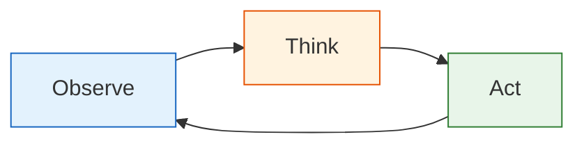
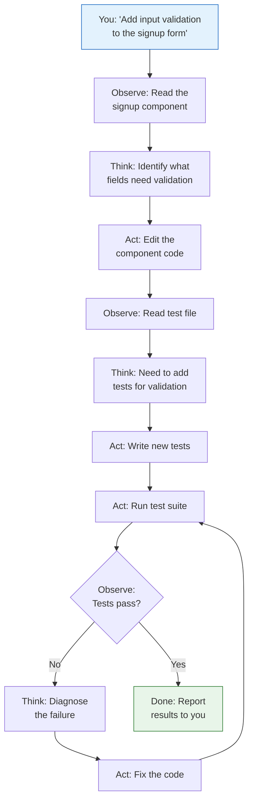
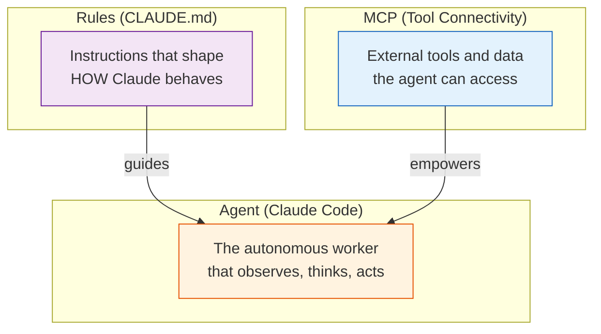

# 26 — AI Agents & Agentic Patterns

Understand what "agent" actually means, recognize that Claude Code already is one, and learn when you need more.

---

## What You'll Learn

- What "agent" actually means — and what it doesn't
- How Claude Code already functions as an agent
- The spectrum of autonomy from single queries to multi-agent systems
- Agentic patterns you can use today (subagents, headless mode, CI/CD)
- The clear distinction between agents, MCP, and rules
- When to build custom agents vs just using Claude Code
- Common misconceptions that lead people astray

**Prerequisites**: [06 — Task Execution](06-task-execution.md), [25 — MCP Servers](25-mcp-servers.md)

---

## What "Agent" Actually Means

An agent is an AI system that autonomously takes actions in a loop:



The key elements:

1. **Observe** — take in information from the environment (read files, see errors, check test output)
2. **Think** — reason about what to do next based on observations
3. **Act** — take an action that changes the environment (edit a file, run a command, make an API call)
4. **Loop** — observe the result of the action and decide what to do next

This is what makes an agent different from a simple question-and-answer interaction. An agent doesn't just respond — it takes actions, observes results, and iterates.

### Not Everything Is Agentic

Asking Claude "What does this function do?" and getting an explanation is **not** agentic. That's a query — one input, one output, no actions.

Asking Claude "Fix this bug" **is** agentic — Claude reads code, identifies the problem, makes changes, runs tests, checks results, and potentially iterates.

---

## Claude Code Is Already an Agent

This is the most important thing to understand: **Claude Code is an agent**. You don't need to build one.

When you give Claude Code a task like "Add input validation to the signup form," here's what happens:



Claude Code:
- **Reads files** to understand the current state
- **Reasons** about what needs to change
- **Edits code** to implement the solution
- **Runs commands** to test and verify
- **Iterates** when things don't work
- **Reports back** when the task is complete

That's an agent. It's already doing the observe-think-act loop.

---

## The Agent Spectrum

Not all interactions require the same level of autonomy. Think of it as a spectrum:

### Level 1: Single Query (Not Agentic)

One question, one answer. No actions taken.

```
What does the OrderService.calculateTotal method do?
```

Claude reads and explains. No changes, no iteration.

### Level 2: Multi-Step Task Execution (Agentic)

Claude takes multiple actions, observes results, and iterates.

```
Fix the bug where orders with discount codes show the wrong total.
```

Claude reads code, traces the bug, makes a fix, runs tests, verifies.

### Level 3: Autonomous Workflows

Claude runs without human interaction — headless mode, CI/CD integration.

```bash
# Claude runs autonomously in CI to review a PR
claude -p "Review this PR for bugs, security issues, and style problems. \
  Post your review as a GitHub comment." \
  --allowedTools "Read,Glob,Grep,Bash(gh:*)"
```

### Level 4: Multi-Agent Systems

Multiple Claude instances working on different parts of a task simultaneously.

```
# Claude Code spawns subagents to work in parallel
# Each subagent gets its own context and can work independently
```

In Claude Code, this happens with subagents and worktrees — Claude can spin up parallel workers for independent tasks.

**Most of the time, Level 2 is all you need.** A single Claude Code session handles the vast majority of development tasks.

---

## Agentic Patterns in Claude Code

### Pattern 1: Plan-Execute-Verify

The most common agentic pattern. Use plan mode (`Shift+Tab`) to have Claude think before acting:

```
Plan how to add OAuth2 support to our auth system.
Don't write code yet — analyze the current auth flow,
identify what needs to change, and propose an approach.
```

After reviewing the plan:

```
Good plan. Go ahead and implement it.
```

Claude executes the plan, running tests along the way, and reports results.

### Pattern 2: Subagents for Parallel Work

When a task has independent parts, Claude can spawn subagents:

```
Refactor all API endpoints to use the new response format.
Each endpoint is independent — work on them in parallel.
```

Claude may use subagents to handle different endpoints simultaneously, each working in its own context.

### Pattern 3: Headless Mode for Automation

Run Claude non-interactively for automated tasks:

```bash
# Generate release notes from recent commits
claude -p "Generate release notes for all commits since the last tag. \
  Group by feature, bugfix, and chore. Write to CHANGELOG.md." \
  --allowedTools "Read,Glob,Grep,Bash(git:*),Write"
```

```bash
# Auto-fix lint errors
claude -p "Run the linter and fix all auto-fixable issues. \
  For non-auto-fixable issues, list them." \
  --allowedTools "Read,Glob,Grep,Bash,Edit"
```

### Pattern 4: Claude in CI/CD

Integrate Claude into your GitHub Actions workflow:

```yaml
name: Claude PR Review
on:
  pull_request:
    types: [opened, synchronize]

jobs:
  review:
    runs-on: ubuntu-latest
    steps:
      - uses: actions/checkout@v4
      - name: Claude Review
        run: |
          claude -p "Review the changes in this PR. Focus on:
            - Potential bugs
            - Security concerns
            - Performance implications
            Post a constructive review." \
            --allowedTools "Read,Glob,Grep,Bash(git:*,gh:*)"
```

### Pattern 5: Worktrees for Isolated Parallel Work

When parallel tasks might conflict (both editing the same files), use git worktrees:

```
I need to update both the API validation and the frontend form validation.
These might touch shared types. Use worktrees so each change
is isolated, and we can merge them separately.
```

Claude creates separate git worktrees, makes changes independently, and you can review and merge each branch.

---

## Agents vs MCP vs Rules

These three concepts are frequently conflated. Here's how they relate:



| Concept | Role | Analogy |
|---------|------|---------|
| **Agent** (Claude Code) | The autonomous worker that performs tasks | A skilled contractor |
| **MCP** | External tools and data the agent can access | The contractor's tools and materials |
| **Rules** (CLAUDE.md) | Instructions that shape behavior | The contractor's job description and guidelines |

You hire the contractor (use Claude Code). You give them tools (configure MCP servers). You give them instructions (write CLAUDE.md rules). These are three different concerns.

---

## When to Build Custom Agents

Most people don't need to build custom agents. Claude Code handles the vast majority of development workflows. But there are cases where building something custom makes sense.

### Use Claude Code When...

- You're doing interactive development work
- Tasks are conversational — you want to review and steer
- You need the full development environment (file system, git, terminal)
- The task is a standard software engineering workflow

### Build a Custom Agent When...

- You need a domain-specific autonomous loop (e.g., data pipeline monitoring)
- The workflow needs to run as a service (not a CLI session)
- You're integrating AI into a product (not your development workflow)
- You need custom tool definitions beyond what MCP provides

### Building with the API

If you do need a custom agent, use the Anthropic API with tool use:

```python
import anthropic

client = anthropic.Anthropic()

tools = [
    {
        "name": "query_database",
        "description": "Run a SQL query against the analytics database",
        "input_schema": {
            "type": "object",
            "properties": {
                "query": {"type": "string", "description": "SQL query to execute"}
            },
            "required": ["query"]
        }
    }
]

# The agent loop
messages = [{"role": "user", "content": "Find the top revenue anomalies this week"}]

while True:
    response = client.messages.create(
        model="claude-sonnet-4-6",
        max_tokens=4096,
        tools=tools,
        messages=messages
    )

    # If Claude wants to use a tool, execute it and continue the loop
    if response.stop_reason == "tool_use":
        tool_call = next(b for b in response.content if b.type == "tool_use")
        result = execute_tool(tool_call.name, tool_call.input)
        messages.append({"role": "assistant", "content": response.content})
        messages.append({"role": "user", "content": [
            {"type": "tool_result", "tool_use_id": tool_call.id, "content": result}
        ]})
    else:
        # Claude is done — print the final response
        print(response.content[0].text)
        break
```

This is the core pattern: give Claude tools, let it decide which to use, execute them, and loop until it's done.

---

## Common Misconceptions

### "I need to build an agent to use Claude"

No. Claude Code **is** the agent. When you run `claude` in your terminal and give it a task, you're already using an agentic AI system. You don't need to write a framework around it.

### "MCP servers are agents"

No. MCP servers are tool providers — they receive a request and return a result. They don't observe, think, or decide anything. They're more like REST APIs than autonomous actors. See [25 — MCP Servers](25-mcp-servers.md).

### "Agents are just chatbots"

No. A chatbot responds to messages. An agent takes actions, observes results, and iterates. Claude Code edits files, runs tests, debugs failures — that's fundamentally different from generating chat responses.

### "More agents = better"

Not necessarily. A single well-prompted Claude Code session often outperforms a complex multi-agent setup. Multiple agents add coordination overhead, potential conflicts, and debugging complexity. Start with one agent (Claude Code) and only add more when you have genuinely independent parallel work.

### "Agentic = autonomous = unsupervised"

You can and should keep humans in the loop. Claude Code is designed for interactive use — you review plans, approve changes, steer direction. Even in automated workflows (headless mode, CI/CD), set clear boundaries with `--allowedTools` to limit what Claude can do.

---

## Sample Conversation: Agentic Task Execution

> **You**: Our API response times have degraded since last week's deploy. Find out why and fix it.
>
> **Claude**: Let me investigate. I'll start by looking at what changed in the last deploy...
> *reads recent git log, identifies changed files*
>
> The deploy included changes to the OrderService query logic. Let me trace the performance impact...
> *reads the changed query code, identifies a missing index*
> *checks the database migration files*
>
> Found it. The new query in `OrderService.getRecentOrders()` does a full table scan because there's no index on `orders.created_at`. The old code filtered by `status` first (which is indexed), but the new code filters by `created_at`.
>
> Here's my plan:
> 1. Add a database migration for the missing index
> 2. Verify the query plan improves
> 3. Add a test to catch future missing indexes
>
> Want me to proceed?
>
> **You**: Yes, go ahead.
>
> **Claude**: *creates migration file*
> *runs migration locally*
> *verifies query plan now uses the index*
> *writes a test*
> *runs full test suite — all pass*
>
> Done. The migration adds an index on `orders.created_at`. Locally, the query went from 340ms to 2ms. Tests pass. Ready for PR?

---

## Key Takeaways

1. An agent is an observe-think-act loop — Claude Code is already one
2. You don't need to build an agent to use Claude agentically — just give Claude Code a task
3. Most development work needs Level 2 autonomy (multi-step tasks) — not complex multi-agent systems
4. Agents (behavior), MCP (connectivity), and Rules (instructions) are three separate concerns
5. Start with a single Claude Code session — only add subagents or custom agents when you have genuinely independent parallel work
6. Keep humans in the loop — agentic doesn't mean unsupervised

---

**Next**: [27 — Rules & Instructions](27-rules-and-instructions.md) — Shape Claude's behavior with CLAUDE.md and project conventions.
