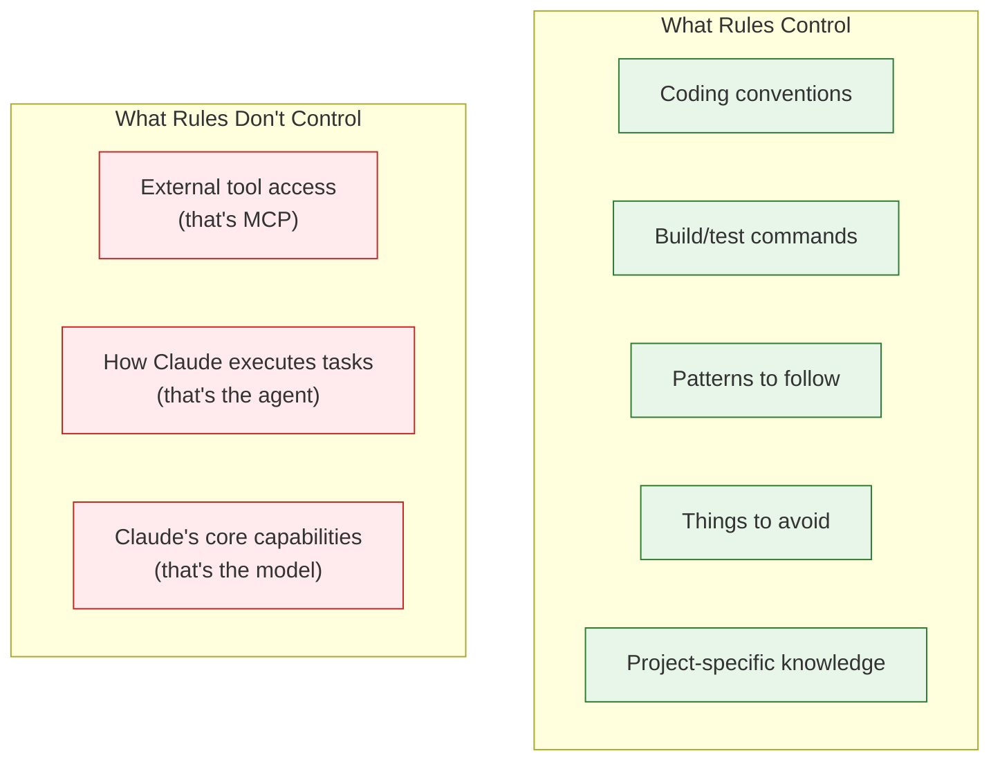
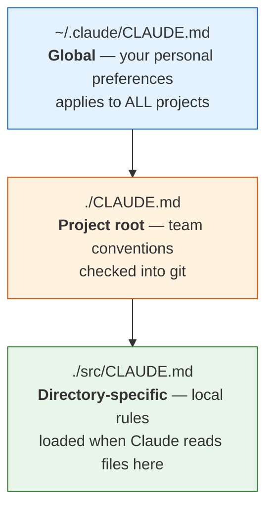

# 27 — Rules & Instructions

Shape Claude's behavior with persistent instructions — from personal preferences to team-wide conventions.

---

## What You'll Learn

- What rules are in Claude Code and why they matter
- The CLAUDE.md hierarchy — global, project, and directory-level rules
- Writing effective, actionable rules that Claude actually follows
- What to put in CLAUDE.md and what to leave out
- How rules differ from MCP (connectivity) and agents (behavior loops)
- Advanced patterns: custom workflows, hooks, and evolving rules over time
- Common mistakes that make CLAUDE.md less effective

**Prerequisites**: [02 — Setup & Configuration](02-setup-and-configuration.md), [06 — Task Execution](06-task-execution.md)

---

## What Rules Are

Rules are persistent instructions that shape how Claude behaves in your project. The primary mechanism in Claude Code is **CLAUDE.md files** — markdown files that Claude reads at the start of every session.

Think of CLAUDE.md as your project's style guide for AI. It tells Claude:
- What conventions to follow
- What tools and commands to use
- What patterns to prefer or avoid
- What the project expects

Rules are **not** connectivity (that's MCP) and **not** an execution model (that's the agent). Rules are the instructions the agent follows.



---

## The CLAUDE.md Hierarchy

CLAUDE.md files follow a hierarchy — more specific files override more general ones:



### Global: `~/.claude/CLAUDE.md`

Your personal preferences that apply everywhere:

```markdown
# My Preferences

- Always use SSH for git remotes — never HTTPS
- When writing commit messages, use conventional commits format
- Prefer functional patterns over class-based where possible
- Use vim keybindings references when explaining editor shortcuts
```

### Project Root: `./CLAUDE.md`

Team conventions shared via version control:

```markdown
# Project Rules

## Commands
- Run tests: `npm test`
- Run single test: `npm test -- --grep "test name"`
- Lint: `npm run lint`
- Build: `npm run build`

## Conventions
- Use TypeScript strict mode — no `any` types
- Use Prisma for all database access, never raw SQL
- API responses follow our standard envelope: `{ data, error, meta }`
- Use `zod` for all input validation at API boundaries

## Patterns
- Controllers handle HTTP concerns only — business logic goes in services
- All services are dependency-injected via constructor
- Use `Result<T, E>` pattern for operations that can fail — no throwing in services
```

### Directory-Specific: `./src/api/CLAUDE.md`

Rules that apply only when Claude works in a specific directory:

```markdown
# API Directory Rules

- Every endpoint must have OpenAPI JSDoc annotations
- Use the `requireAuth` middleware for all non-public endpoints
- Rate limiting is configured in `middleware/rateLimit.ts` — add new limits there
- Integration tests for endpoints go in `__tests__/integration/`
```

### What Goes Where

| Level | Put Here | Example |
|-------|----------|---------|
| **Global** | Personal preferences, editor choices, commit style | "Use conventional commits" |
| **Project** | Build commands, coding conventions, tech stack choices | "Use Prisma, not raw SQL" |
| **Directory** | Area-specific patterns, local testing instructions | "All API endpoints need OpenAPI annotations" |

---

## Writing Effective Rules

### Be Specific and Actionable

Claude can follow concrete instructions. Vague aspirations get ignored.

**Bad** (too vague):
```markdown
- Write clean, maintainable code
- Follow best practices
- Make sure tests are good
```

**Good** (specific and actionable):
```markdown
- Use snake_case for database column names, camelCase for TypeScript variables
- Every public function must have a JSDoc comment with @param and @returns
- Test files go next to source files: `foo.ts` -> `foo.test.ts`
```

### Use Imperative Mood

Rules are instructions, not suggestions:

**Bad**: "It would be nice if tests were run before committing"

**Good**: "Always run `npm test` before creating a commit"

### Include the Why (When Not Obvious)

```markdown
- Never use `DELETE` endpoints — use soft deletes with a `deleted_at` column
  (our compliance requirements mandate data retention for 7 years)
```

### Keep It Concise

Claude reads CLAUDE.md at the start of every session. Every line costs context. Keep it tight:

- **Target**: under 100 lines of actual rules for project-level CLAUDE.md
- **Trim**: remove rules that Claude already follows by default
- **Group**: organize related rules together under clear headers

### Group Related Rules

```markdown
## Database
- Use Prisma for all queries
- Never use raw SQL
- Migrations go in `prisma/migrations/`

## Testing
- Run tests: `npm test`
- Unit tests: `*.test.ts` next to source
- Integration tests: `__tests__/integration/`
- Always mock external services in unit tests
```

---

## What to Put in CLAUDE.md

### Always Include

- **Build/test/lint commands** — Claude needs to know how to run things
- **Naming conventions** — file names, variables, database columns
- **Technology choices** — which ORM, which test framework, which patterns
- **Patterns to follow** — "Controllers call services, services call repositories"
- **Patterns to avoid** — "Never use `any` type, never use `var`"
- **Common gotchas** — "The test database must be running before integration tests"

### Include When Relevant

- **PR/commit conventions** — message format, review expectations
- **Architecture boundaries** — "Frontend never imports from backend directly"
- **Environment specifics** — "Use Docker for local development"
- **File structure** — where new files of each type should go

---

## What NOT to Put in CLAUDE.md

### Things Claude Already Knows

Don't state the obvious:

```markdown
# DON'T DO THIS
- Write clean code
- Handle errors properly
- Use meaningful variable names
- Follow SOLID principles
```

Claude already knows these things. Stating them wastes context.

### Long Documents

CLAUDE.md is not a place for:
- Full architecture documentation (put that in `docs/`)
- API specifications (use OpenAPI/Swagger)
- Onboarding guides (link to them instead)
- Meeting notes or decision records (use ADRs)

If you need to reference longer docs, link to them:

```markdown
- Architecture overview: see `docs/architecture.md`
- API conventions: see `docs/api-conventions.md`
```

### Dynamic Information

Don't put things that change frequently:
- Current sprint goals
- Feature flags that are being tested
- Temporary workarounds (use code comments instead)

### Redundant Language Best Practices

Don't restate what the language community already agrees on:

```markdown
# DON'T DO THIS (for a Python project)
- Use list comprehensions where appropriate
- Follow PEP 8
- Use type hints
```

Only add language conventions when your project **deviates** from the standard or has specific preferences.

---

## Rules vs MCP vs Agents

These three concepts serve different purposes:

| Concept | Purpose | Configured In | Example |
|---------|---------|---------------|---------|
| **Rules** | Shape Claude's behavior | CLAUDE.md files | "Use Prisma for database access" |
| **MCP** | Give Claude access to external tools | `.claude/settings.json` | Connect to PostgreSQL, Slack, Jira |
| **Agents** | The execution model | Claude Code itself | The observe-think-act loop |

**Rules** tell Claude HOW to behave. **MCP** gives Claude access to external TOOLS. **Agents** are the execution model. Don't mix these up.

If you want Claude to follow a coding convention → write a rule in CLAUDE.md.
If you want Claude to query your database → configure an MCP server.
If you want Claude to autonomously complete a task → just give it a task (it's already an agent).

---

## Advanced Patterns

### Custom Workflows

Define repeatable workflows in CLAUDE.md:

```markdown
## Workflows

### When I say "deploy check"
1. Run `npm test`
2. Run `npm run lint`
3. Run `npm run build`
4. Check for uncommitted changes
5. Report any issues

### When I say "new endpoint"
1. Create the route in `src/api/routes/`
2. Create the controller in `src/api/controllers/`
3. Create the service in `src/services/`
4. Add OpenAPI annotations
5. Write integration tests
6. Update the API documentation
```

### Using `/init` to Bootstrap

For a new project, use the `/init` command to have Claude generate an initial CLAUDE.md:

```
/init
```

Claude will analyze your project structure, detect the tech stack, find build commands, and generate a starting CLAUDE.md. Review and edit it — Claude's initial draft is a starting point, not the final version.

### Evolving Rules Over Time

Rules should grow organically:

1. **You notice a pattern**: Claude keeps using raw SQL instead of Prisma
2. **You correct it**: "Use Prisma, not raw SQL"
3. **You add a rule**: Add "Use Prisma for all database access, never raw SQL" to CLAUDE.md
4. **It doesn't happen again**: the rule prevents future occurrences

Don't try to write every rule upfront. Add them as you discover what Claude needs to be told.

### Conditional Rules

Rules can be scoped to specific contexts:

```markdown
## API Files (src/api/**)
- Always add OpenAPI JSDoc annotations
- Use the `ApiResponse<T>` wrapper for all return types
- Log all errors with `logger.error()` before returning error responses

## Frontend Files (src/components/**)
- Use CSS modules, not inline styles
- Every component needs a `.stories.tsx` Storybook file
- Use `useTranslation()` for all user-facing strings
```

Put these in directory-specific CLAUDE.md files for best results.

---

## Hooks

Hooks are shell commands that run automatically before or after Claude uses specific tools. They're configured in `.claude/settings.json`:

```json
{
  "hooks": {
    "postToolUse": [
      {
        "matcher": "Write|Edit",
        "command": "npx prettier --write $CLAUDE_FILE_PATH"
      }
    ]
  }
}
```

### Common Hook Use Cases

- **Auto-format** after file writes (Prettier, Black, gofmt)
- **Lint check** after edits to catch issues immediately
- **Custom validation** (check that files match naming conventions)

Hooks complement rules — rules tell Claude what to do, hooks enforce it automatically.

---

## Common Mistakes

### Making CLAUDE.md Too Long

Every line costs context window space. A 500-line CLAUDE.md dilutes the important rules. Keep it under 100 lines of actual rules — link to longer docs when needed.

### Being Too Vague

"Write good tests" tells Claude nothing it doesn't already know. "Unit tests must cover happy path, error cases, and edge cases with descriptive names using the pattern `should [expected behavior] when [condition]`" is actionable.

### Contradicting Rules at Different Levels

If your global CLAUDE.md says "use tabs" and your project CLAUDE.md says "use spaces," Claude gets confused. Audit your hierarchy for conflicts.

### Not Checking CLAUDE.md into Git

Your project's CLAUDE.md belongs in version control. The whole team benefits from shared rules. Only personal preferences go in `~/.claude/CLAUDE.md`.

### Treating CLAUDE.md as Documentation

CLAUDE.md is **instructions**, not documentation. Don't explain how the system works — tell Claude how to work in the system. Link to docs for background context.

---

## Sample Conversation

> **You**: I keep having to remind Claude to use our response format for API endpoints. How do I make it stick?
>
> **Claude**: You should add a rule to your project's CLAUDE.md. Let me check what you have now...
> *reads ./CLAUDE.md*
>
> Your current CLAUDE.md has build commands and some naming conventions, but nothing about API response format. I'd suggest adding:
>
> ```markdown
> ## API Conventions
> - All API responses must use the envelope format: `{ data: T, error: string | null, meta: { requestId, timestamp } }`
> - Use the `ApiResponse<T>` helper from `src/api/utils/response.ts` — never construct the envelope manually
> - Error responses use HTTP status codes AND the `error` field in the envelope
> ```
>
> Want me to add this to your CLAUDE.md?
>
> **You**: Yes, and also add that we use zod for request validation.
>
> **Claude**: *edits CLAUDE.md to add the API conventions section including the zod rule*
>
> Done. I added the API response format rules and the zod validation requirement. These will take effect in every future session. Want me to also add a directory-specific CLAUDE.md in `src/api/` with more detailed API rules?

---

## Key Takeaways

1. CLAUDE.md is your primary tool for shaping Claude's behavior — use it
2. Keep rules specific, actionable, and concise — under 100 lines of actual rules
3. Use the hierarchy: global for personal preferences, project for team conventions, directory for local rules
4. Evolve rules organically — add them when you notice Claude needs guidance
5. Don't restate what Claude already knows — focus on project-specific conventions
6. Check project CLAUDE.md into git so the whole team benefits
7. Rules (behavior), MCP (connectivity), and agents (execution) are separate concerns

---

**Next**: [28 — Troubleshooting Prompt Results](28-troubleshooting-prompt-results.md) — When Claude's output isn't what you expected, diagnose and fix it.
