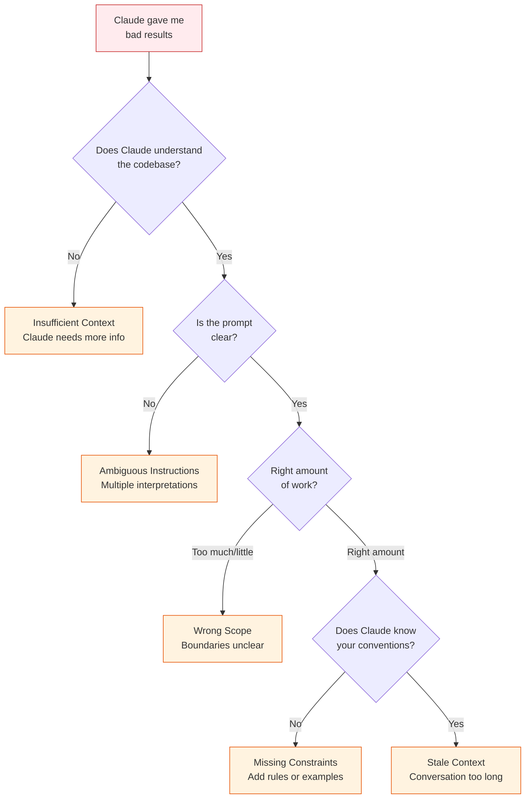

# 28 — Troubleshooting Prompt Results

When Claude's output isn't what you expected — diagnose the root cause and fix it.

---

## What You'll Learn

- The five root causes of bad Claude output
- How to diagnose which cause you're hitting
- Before-and-after prompt examples for every common problem
- The prompt improvement checklist
- When to start a new conversation
- Escalation strategies when nothing seems to work

**Prerequisites**: [06 — Task Execution](06-task-execution.md), [27 — Rules & Instructions](27-rules-and-instructions.md)

---

## The Diagnosis Framework

When Claude gives you bad results, it's almost always one of these five root causes:



Let's walk through each one with concrete examples.

---

## Problem: Code Doesn't Match Your Patterns

**Symptom**: Claude writes working code, but it doesn't look like the rest of your codebase.

**Root cause**: Claude doesn't know your patterns.

**Before** (bad prompt):
```
Add a new endpoint for deleting users.
```

**After** (good prompt):
```
Add a new endpoint for deleting users. Follow the same pattern
as the existing endpoints in src/api/controllers/orderController.ts —
same error handling, same response format, same middleware chain.
```

**Permanent fix**: Add your conventions to CLAUDE.md:

```markdown
## API Conventions
- Controllers follow the pattern in src/api/controllers/orderController.ts
- Use ApiResponse<T> wrapper for all responses
- All mutations require auth middleware
```

---

## Problem: Changes to the Wrong Files

**Symptom**: Claude edits files you didn't expect, or creates new files instead of modifying existing ones.

**Root cause**: Claude doesn't understand the project structure, or your prompt didn't specify scope.

**Before** (bad prompt):
```
Fix the authentication bug.
```

**After** (good prompt):
```
Fix the authentication bug where tokens aren't being refreshed.
The relevant code is in src/services/auth/tokenService.ts.
Only modify files in src/services/auth/.
```

**Prevention**: Use plan mode first:

```
Before making any changes, analyze the authentication flow.
Which files are involved? Where's the token refresh logic?
Show me your understanding before we change anything.
```

---

## Problem: Solution Is Over-Engineered

**Symptom**: You asked for a simple fix, Claude refactored half the codebase.

**Root cause**: Prompt was too open-ended, no scope boundaries.

**Before** (bad prompt):
```
Improve the login flow.
```

**After** (good prompt):
```
Fix the null pointer exception in UserService.login() when
the user doesn't exist. Make the smallest possible change.
Don't refactor surrounding code.
```

**More constraining prompts**:

```
Add input validation to the signup form.
Only add validation — don't restructure the form,
don't change the styling, don't modify the API.
```

```
Make the minimal change needed to fix this bug.
No refactoring, no cleanup, no additional improvements.
```

---

## Problem: Claude Goes in Circles

**Symptom**: Claude apologizes, tries again, gets the same error, apologizes again. Or it keeps suggesting the same approach that already failed.

**Root cause**: Context is polluted from too many failed attempts.

**Before** (continuing in a polluted conversation):
```
Try again, that didn't work either.
```

**After** (fresh start):
```
/clear
```

Then in the new conversation:

```
I need to fix the database connection timeout issue in
src/db/pool.ts. The pool runs out of connections under load.

What I've already tried (don't try these again):
- Increasing pool size to 50 (didn't help)
- Adding connection timeout of 5s (connections still leaked)

The real problem might be unreleased connections. Check for
any code paths where connections are acquired but not released.
```

**Key technique**: Tell Claude what you've already tried so it doesn't repeat failed approaches.

---

## Problem: Claude Hallucinates APIs

**Symptom**: Claude uses functions, methods, or APIs that don't exist in your codebase.

**Root cause**: Claude is guessing instead of reading the actual code.

**Before** (bad prompt):
```
Use the UserService to add email verification.
```

**After** (good prompt):
```
Read the actual source of src/services/UserService.ts first.
Then add email verification using only the methods that
actually exist. Don't assume the API — verify it.
```

**Prevention prompts**:

```
Before writing any code, read the files you plan to use.
List the actual methods available, then propose your approach.
```

```
What methods does OrderService actually expose?
Read the file — don't guess.
```

---

## Problem: Tests Pass But Solution Is Wrong

**Symptom**: Claude makes tests green, but the actual behavior isn't what you wanted.

**Root cause**: Claude optimized for test results, not for correct behavior. Or the tests themselves don't capture the right requirements.

**Before** (bad prompt):
```
Make the failing tests pass.
```

**After** (good prompt):
```
The correct behavior is: when a user submits a form with
an invalid email, show the error message "Please enter
a valid email address" below the input field without
clearing the other fields.

First, check if the existing tests actually verify this
behavior. If they don't, fix the tests to match the
correct behavior, then fix the implementation.
```

**Key principle**: Describe the desired **behavior**, not just the test outcome.

---

## Problem: Claude Ignores CLAUDE.md Rules

**Symptom**: You have rules in CLAUDE.md but Claude doesn't follow them.

**Root cause**: CLAUDE.md is too long (rules get diluted), rules are too vague, or the file isn't in the right place.

**Diagnosis**:

```
What does our CLAUDE.md say about [specific topic]?
```

If Claude can't find or recall the rule, the file may be too long or the rule may be buried.

**Fixes**:

1. **Keep CLAUDE.md concise** — under 100 lines of rules. Long files dilute important rules.
2. **Make rules specific** — "Use snake_case for DB columns" not "Follow naming conventions"
3. **Verify file location** — project CLAUDE.md should be at the repo root
4. **Reinforce inline** when needed:

```
Remember: we use the ApiResponse<T> wrapper for all endpoints.
Now add the new endpoint following that pattern.
```

---

## Problem: Claude Does Too Much or Too Little

### Too Much

**Symptom**: "Fix the login bug" and Claude refactors the entire auth system, adds new features, and restructures the database.

**Fix**: Set explicit scope boundaries:

```
Fix the login bug where the "Remember Me" checkbox
doesn't persist between sessions.

Scope:
- ONLY modify the login form component and its test
- Don't change the auth service
- Don't add new features
- Don't refactor existing code
```

### Too Little

**Symptom**: "Improve the app" and Claude changes one CSS color.

**Fix**: Be specific about what "improve" means:

```
Improve the error handling in src/api/controllers/:
1. Add try/catch blocks to all controller methods
2. Use our standard ApiError class for all error responses
3. Add request ID to all error logs
4. Write tests for the error cases
```

**The principle**: The less specific your prompt, the less predictable the output. Be precise about what you want.

---

## The Prompt Improvement Checklist

When Claude's output isn't right, run through this checklist:

| Question | If "No" |
|----------|---------|
| Did I give Claude enough context about the problem? | Show relevant files, explain the background |
| Did I specify WHAT files or areas to focus on? | Name specific files, directories, or functions |
| Did I explain the desired outcome? | Describe what "done" looks like, not just the problem |
| Did I set scope boundaries? | Say what to change AND what NOT to change |
| Did I mention conventions or patterns to follow? | Point to example files or CLAUDE.md rules |
| Is my conversation fresh enough? | Use `/compact` or start new if > 10 back-and-forths |
| Did I use plan mode for complex tasks? | Toggle with `Shift+Tab` before the task |
| Did I tell Claude what I already tried? | Prevent it from repeating failed approaches |

---

## When to Start a New Conversation

Start fresh when:

- **You've exchanged more than ~10 messages** on the same issue without resolution
- **Claude seems confused** about what you want — responses don't match your requests
- **You've changed direction** significantly from the original task
- **The context is cluttered** with failed attempts, reverted changes, and tangents
- **After `/compact`** if results are still poor — sometimes you need a clean slate

### How to Start Fresh Effectively

Don't just start over with the same vague prompt. Carry forward what you learned:

```
I need to fix the payment processing timeout issue.

Context:
- The problem is in src/services/payment/processor.ts
- The Stripe webhook handler holds a database transaction
  too long when processing subscription renewals
- I tried increasing the timeout but the real issue is
  the transaction scope

Fix: move the Stripe API call outside the database
transaction in the processRenewal() method.
```

This gives Claude everything it needs without the baggage of a polluted conversation.

---

## Escalation Strategies

When basic prompt improvement doesn't work, escalate through these strategies in order:

### Level 1: Rephrase

Same intent, different words:

```
# Before
Fix the caching issue.

# After
The Redis cache returns stale data after a user updates
their profile. The cache key is `user:{id}` and it should
be invalidated when PUT /api/users/:id is called.
```

### Level 2: Add Context

Show Claude what it needs to see:

```
Read these files first:
- src/cache/redis.ts (the cache layer)
- src/api/controllers/userController.ts (where the update happens)
- src/services/userService.ts (business logic)

Then explain why the cache isn't being invalidated on user update.
```

### Level 3: Break It Down

Split a complex task into smaller pieces:

```
# Instead of one big task:
"Implement the full checkout flow"

# Break into steps:
"Step 1: Add the cart total calculation. Just the calculation
logic in CartService — no UI, no payment yet."
```

Then after each step is done, give the next one.

### Level 4: Plan First

Use plan mode to align before executing:

```
Before writing any code, create a detailed plan for
adding WebSocket support to the notification system.

Include:
- What files need to change
- What new files are needed
- What the message format should look like
- What could go wrong

Don't implement anything yet.
```

Review the plan. Correct any misunderstandings. Then say "Go ahead."

### Level 5: Show, Don't Tell

Give Claude an example of what you want:

```
Here's how we handle the "create" endpoint for orders:
[paste the existing code]

Now create a similar endpoint for invoices, following
the exact same structure — same error handling, same
response format, same middleware chain, same test pattern.
```

### Level 6: Fresh Start with Full Context

Nuclear option — new conversation with everything Claude needs:

```
I need to add rate limiting to our API.

Project: Node.js/Express API with TypeScript
Files: src/api/middleware/ for middleware, src/api/routes/ for routes
Pattern: see src/api/middleware/auth.ts for how middleware is structured
Convention: we use express-rate-limit, configured per-route
Test pattern: see src/api/middleware/__tests__/auth.test.ts

Add rate limiting to POST /api/orders:
- 10 requests per minute per authenticated user
- Return 429 with Retry-After header
- Follow the same middleware pattern as auth.ts
- Write tests following the same pattern as auth.test.ts
```

---

## Prompt Patterns That Reliably Work

### The "Read First" Pattern

```
Read [files]. Then [task].
```

Forces Claude to understand before acting.

### The "Like This One" Pattern

```
Follow the same pattern as [existing file/function].
```

Gives Claude a concrete example to match.

### The "Scope Fence" Pattern

```
Only modify [these files]. Don't change [these other things].
```

Prevents Claude from wandering.

### The "What Already Failed" Pattern

```
I've already tried [approach]. That didn't work because [reason].
```

Prevents repeating failed approaches.

### The "Describe Done" Pattern

```
When this is done, [specific observable behavior].
```

Gives Claude a clear target.

---

## Sample Conversation

> **You**: Claude keeps writing API endpoints that don't match our format. I've told it three times now.
>
> **Claude**: If you're repeating the same correction, that's a sign to add a rule to CLAUDE.md. Let me check your current rules...
> *reads CLAUDE.md*
>
> Your CLAUDE.md has build commands and some naming conventions, but nothing about API endpoint format. That's why the correction doesn't stick across sessions — each new session starts fresh.
>
> I'd recommend adding something like:
>
> ```markdown
> ## API Endpoints
> - All endpoints use the controller/service/repository pattern in src/api/
> - Response format: `{ data: T, error: string | null, meta: { requestId } }`
> - Use `ApiResponse<T>` from src/api/utils/response.ts — never construct manually
> - Error responses: use `ApiError` class with appropriate HTTP status code
> - See src/api/controllers/orderController.ts as the reference implementation
> ```
>
> Want me to add this to your CLAUDE.md?
>
> **You**: Yes, do it.
>
> **Claude**: *edits CLAUDE.md*
>
> Done. From now on, every Claude Code session will read these rules. You shouldn't need to repeat this correction again.

---

## Key Takeaways

1. Bad output is almost always insufficient context, ambiguous instructions, wrong scope, missing constraints, or stale context
2. Be specific — the less precise your prompt, the less predictable the output
3. Use the "Read First" pattern to prevent hallucinated APIs
4. Set scope boundaries — say what to change AND what not to change
5. If you're correcting Claude repeatedly, add a rule to CLAUDE.md so it sticks
6. Start a new conversation when context gets polluted — carry forward lessons, not baggage
7. Describe the desired behavior, not just "make tests pass"
8. Use the prompt improvement checklist before blaming Claude

---

**Next**: [29 — Cloud Resource Estimation](29-cloud-resource-estimation.md) — Reliably estimate compute, storage, and network requirements for your cloud infrastructure.
