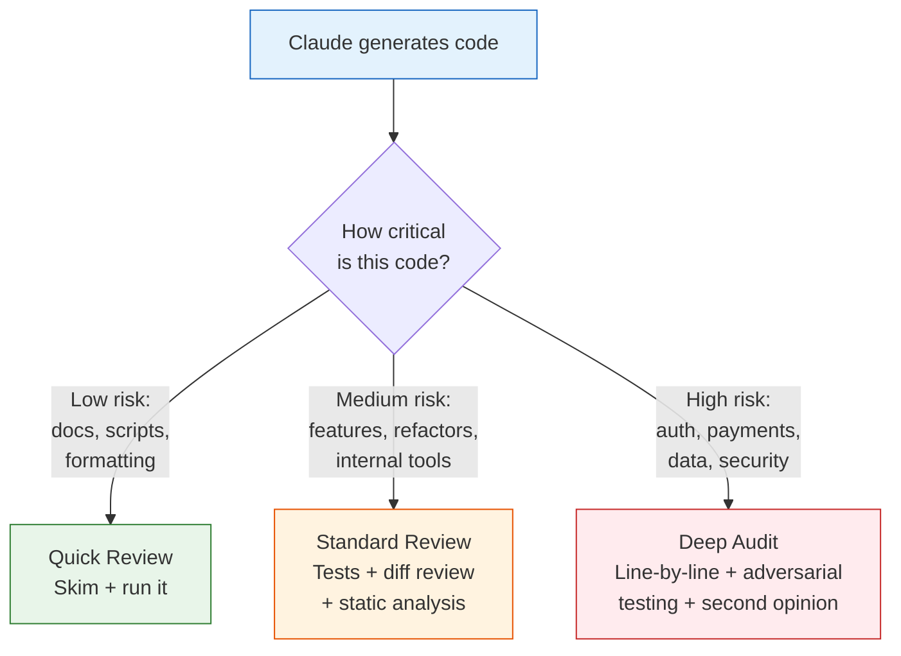
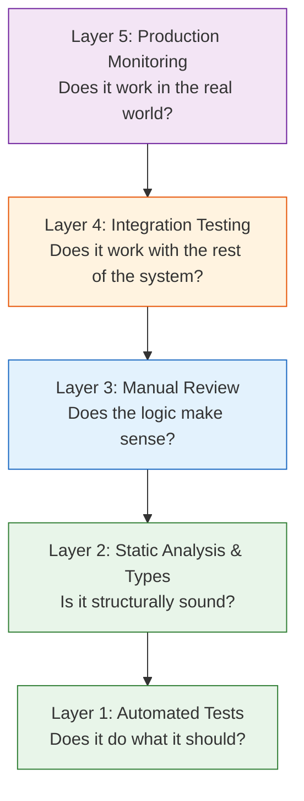

# 31 — Validating AI-Generated Code

Systematically verify that code Claude writes is correct, safe, and production-ready — before it reaches your users.

---

## What You'll Learn

- Why "it looks right" isn't enough — the trust gap with AI-generated code
- A layered verification framework: from quick checks to deep audits
- Using Claude itself to challenge and test its own output
- Static analysis, type checking, and automated safety nets
- Manual review strategies for AI-generated code
- Testing patterns specifically designed to catch AI mistakes
- When to trust and when to verify more carefully
- Building a verification habit that doesn't slow you down

**Prerequisites**: [06 — Task Execution](06-task-execution.md), [14 — Testing Strategies](14-testing-strategies.md)

---

## The Trust Gap

Claude writes plausible code. That's the problem — plausible code can look correct at a glance while containing subtle bugs. The same way you wouldn't ship a junior developer's code without review, you shouldn't ship AI-generated code without verification.



The level of verification should match the risk. Not all code needs the same scrutiny.

---

## The Verification Pyramid

Think of verification in layers — each layer catches different types of problems:



Don't skip layers. Each catches things the others miss.

---

## Layer 1: Automated Tests

The first line of defense. If Claude wrote code, it should also write tests — and then you verify both.

### Have Claude Write Tests First

```
Before implementing the change, write tests that define
the expected behavior. Include:
- Happy path for each scenario
- Edge cases (empty input, null, boundary values)
- Error cases (invalid input, network failures, permission denied)
- Concurrency issues if applicable

Don't implement anything yet — just the tests.
```

Review the tests before the implementation. Tests are easier to verify than implementation code because they express **intent**.

### Then Verify the Tests Are Actually Testing Something

A common AI mistake: tests that pass but don't actually verify anything meaningful.

```
Review the tests you just wrote. For each test:
1. What specific behavior does it verify?
2. If I broke the implementation, would this test catch it?
3. Is the assertion actually checking the right thing?
   (not just "it didn't throw an error")
4. Are there assertions, or does the test just call functions
   without checking results?
```

### Red-Green Verification

The strongest test validation pattern:

```
Run the tests BEFORE implementing the change.
They should fail — if they pass before the code
exists, the tests aren't testing anything.

Then implement the change and run them again.
They should pass now.
```

If tests pass before the implementation exists, they're worthless.

### Mutation Testing Mindset

Ask Claude to challenge its own tests:

```
Look at the tests you wrote. For each test, describe
one way the implementation could be wrong but the test
would still pass. Then add a test that catches that case.
```

---

## Layer 2: Static Analysis and Types

Automated tools catch entire categories of bugs that visual review misses.

### Type Checking

```
Run the type checker on the changes. Are there any:
- Uses of `any` that bypass type safety?
- Type assertions (as Type) that could mask errors?
- Missing null checks?
- Implicit type coercions?

If you added any `any` types, explain why and whether
we can use a more specific type instead.
```

### Linting

```
Run the linter on all changed files.
Are there any warnings or errors?
Fix them — don't suppress them.
```

### Static Analysis Checklist

Ask Claude to run through this after making changes:

```
Run static analysis on the changes:
1. Run `npm run lint` (or project equivalent)
2. Run `npm run typecheck` (or project equivalent)
3. Check for any new compiler warnings
4. Are there any TODO or FIXME comments in the new code?
5. Did any dependencies change? If so, why?
```

---

## Layer 3: Manual Review

This is where human judgment matters most. Tools catch structural issues; humans catch logical ones.

### The Diff Review

After Claude makes changes, review the diff carefully:

```
Show me a complete summary of every file changed,
what changed in each one, and why. Include the full
diff for files with logic changes.
```

### What to Look for in AI-Generated Code

AI code has specific failure modes. Watch for these:

| Problem | What It Looks Like | How to Catch It |
|---------|-------------------|-----------------|
| **Plausible but wrong logic** | Code that reads naturally but has a subtle logical error | Trace through with concrete examples |
| **Hallucinated APIs** | Calls to methods that don't exist in your codebase | Search for the method/function — does it actually exist? |
| **Incomplete error handling** | Happy path works, but errors are swallowed or mishandled | Ask "what happens if this fails?" for each external call |
| **Missing edge cases** | Works for typical inputs, fails on boundaries | Test with empty, null, very large, and malformed inputs |
| **Security gaps** | No input validation, SQL injection, XSS | Review every user input path and every database query |
| **Wrong assumptions** | Code assumes something about the environment that isn't true | Check all assumptions against actual documentation |
| **Copy-paste drift** | Similar code for similar cases, but with subtle inconsistencies | Compare parallel code paths side by side |

### The "Explain It Back" Test

Ask Claude to explain its own code. Gaps in explanation reveal gaps in correctness:

```
Explain this code to me line by line. For each significant
decision, explain why you made that choice and what
alternatives you considered. What are the edge cases?
```

If Claude can't explain a design choice clearly, that's a red flag.

### The "What Could Go Wrong" Test

```
Look at the code you just wrote. List every way it
could fail, cause data loss, or produce wrong results.
Be pessimistic. Include:
- What if the database is slow or down?
- What if two users hit this at the same time?
- What if the input is malformed?
- What if the external API returns unexpected data?
- What if this runs out of memory?
```

---

## Layer 4: Integration Testing

Unit tests verify components in isolation. Integration tests verify they work together.

### Test the Real Flow

```
Write an integration test that exercises the full flow
from API request to database and back. Use a real
test database — no mocking for integration tests.

Cover:
- The complete happy path
- Authentication/authorization
- Database constraints and transactions
- Error responses
```

### Test Against the Real Environment

```
Can we run this change against a staging environment?
If so, describe what I should test manually and what
to look for. What's the fastest way to verify this
works end-to-end?
```

---

## Layer 5: Production Monitoring

Even after all verification, monitor the change after deployment.

```
What metrics should I watch after deploying this change?
Set up alerts for:
- Error rate increases
- Response time degradation
- Unusual database query patterns
- Any new error types in logs

How long should I monitor before considering this stable?
```

---

## Using Claude to Challenge Its Own Code

One of the most effective patterns: use Claude as its own adversary.

### The Adversarial Review

After Claude writes code, ask it to review that same code critically:

```
Now pretend you're a senior developer reviewing this code
in a PR. Be critical. What would you flag? What concerns
would you raise? Don't be nice — find problems.
```

### The "Break It" Challenge

```
Try to break the code you just wrote. Write test cases
specifically designed to find bugs:
- Boundary values
- Concurrent access
- Unexpected types
- Extremely large inputs
- Unicode and special characters
- Timezone edge cases
- Empty/null/undefined everything
```

### The Security Audit

```
Review the code you just wrote as a security auditor.
Check for:
- Can any user input reach a SQL query unescaped?
- Can any user input be rendered in HTML without sanitization?
- Are there any hardcoded secrets or credentials?
- Can a user access data they shouldn't?
- Are there any timing attacks possible?
- Are cryptographic operations done correctly?
```

### Second Opinion Pattern

For critical code, start a new conversation and ask Claude to review without context of how it was written:

```
Review this code for correctness and security. This is
for [describe the feature]. Here are the requirements:
[list requirements].

Does this code correctly implement the requirements?
What bugs or security issues do you see?
```

A fresh context avoids confirmation bias from the original conversation.

---

## Risk-Based Verification Levels

Not all code needs the same level of scrutiny. Match verification effort to risk:

### Low Risk — Quick Verification

**What**: Documentation, formatting, simple scripts, dev tooling, configuration

**Verification**:
- Skim the diff
- Run it once to see if it works
- Run the linter

**Time**: 1-2 minutes

### Medium Risk — Standard Verification

**What**: New features, refactors, bug fixes, internal tools, API endpoints

**Verification**:
- Review the diff carefully
- Run full test suite
- Add new tests if coverage is thin
- Run static analysis
- Use the "What Could Go Wrong" test

**Time**: 10-20 minutes

### High Risk — Deep Audit

**What**: Authentication, authorization, payment processing, data migrations, security-sensitive code, anything touching PII

**Verification**:
- Line-by-line manual review
- Adversarial testing (try to break it)
- Security audit
- Second opinion (fresh Claude conversation or human reviewer)
- Integration test against staging
- Monitor closely after deployment

**Time**: 30-60 minutes

### Critical Risk — External Review Required

**What**: Cryptographic operations, financial calculations, compliance-sensitive logic, core security infrastructure

**Verification**:
- All of the above, plus
- Human expert review (don't rely solely on AI for this)
- Consider formal verification for critical algorithms
- Document the verification process for audit trails

---

## Verification Checklist

Use this checklist after any non-trivial Claude-generated code:

```markdown
## Pre-Merge Verification

### Tests
- [ ] Tests exist for the new/changed code
- [ ] Tests cover happy path, edge cases, and error cases
- [ ] Tests fail when expected (red-green verified)
- [ ] Test suite passes completely
- [ ] No tests were weakened or removed to make them pass

### Static Analysis
- [ ] Type checker passes with no new warnings
- [ ] Linter passes with no new warnings
- [ ] No new `any` types, `@ts-ignore`, or lint suppressions

### Code Review
- [ ] Diff reviewed — all changes are intentional
- [ ] No hallucinated APIs (all called functions actually exist)
- [ ] Error handling is complete (no swallowed errors)
- [ ] Edge cases are handled (null, empty, boundary values)
- [ ] No hardcoded secrets or credentials

### Security (for medium+ risk)
- [ ] User input is validated and sanitized
- [ ] Database queries are parameterized
- [ ] Authorization checks are in place
- [ ] No sensitive data in logs

### Integration (for high risk)
- [ ] Integration tests pass
- [ ] Tested against staging environment
- [ ] Monitoring and alerting configured
```

---

## Common AI Code Mistakes

Patterns to watch for specifically in AI-generated code:

### 1. Tests That Test Nothing

```javascript
// BAD — this test always passes
test('should process order', async () => {
  const result = await processOrder(mockOrder);
  expect(result).toBeDefined(); // Only checks it's not undefined
});

// GOOD — actually verifies behavior
test('should process order and update inventory', async () => {
  const result = await processOrder(mockOrder);
  expect(result.status).toBe('completed');
  expect(result.total).toBe(29.99);
  expect(mockInventory.reduce).toHaveBeenCalledWith('SKU-123', 1);
});
```

### 2. Error Handling That Hides Bugs

```javascript
// BAD — swallows the error
try {
  await saveUser(data);
} catch (error) {
  console.log('Error saving user');
  return null;
}

// GOOD — handles the error properly
try {
  await saveUser(data);
} catch (error) {
  logger.error('Failed to save user', { error, userId: data.id });
  throw new AppError('USER_SAVE_FAILED', 'Could not save user', { cause: error });
}
```

### 3. Looks Complete But Missing a Case

```javascript
// BAD — handles active and inactive, but what about suspended?
function getUserAccess(user) {
  if (user.status === 'active') return 'full';
  if (user.status === 'inactive') return 'none';
  // Missing: suspended, banned, pending_review...
}

// GOOD — exhaustive handling
function getUserAccess(user) {
  switch (user.status) {
    case 'active': return 'full';
    case 'inactive': return 'none';
    case 'suspended': return 'read_only';
    case 'banned': return 'none';
    default:
      throw new Error(`Unknown user status: ${user.status}`);
  }
}
```

### 4. Hardcoded Assumptions

```javascript
// BAD — assumes USD, assumes 2 decimal places
function formatPrice(amount) {
  return `$${amount.toFixed(2)}`;
}

// Question to ask: is this always USD? Does our app support other currencies?
```

---

## Sample Conversation

> **You**: I asked Claude to add a password reset flow. How should I verify this before merging?
>
> **Claude**: Password reset is high-risk code — it touches authentication, email delivery, and token security. Here's my verification plan:
>
> **Tests to check:**
> 1. Reset token is cryptographically random (not sequential, not guessable)
> 2. Token expires after a reasonable time (15-30 minutes)
> 3. Token is single-use (can't be reused after password is changed)
> 4. Invalid/expired tokens return a generic error (don't leak whether the email exists)
> 5. Rate limiting prevents brute-force token guessing
> 6. Rate limiting prevents email spam (requesting resets for the same email)
>
> **Security checks:**
> - Is the token stored hashed in the database? (never plaintext)
> - Is the reset link sent over HTTPS?
> - Does the password update invalidate all existing sessions?
> - Is the new password validated against your password policy?
>
> **Let me review the code...**
> *reads the implementation*
>
> I found two issues:
> 1. The token is stored in plaintext in the `password_resets` table — it should be hashed with bcrypt or SHA-256
> 2. After password change, existing sessions are NOT invalidated — a compromised session would still work
>
> Want me to fix these and add tests for them?

---

## Key Takeaways

1. Match verification effort to risk — not all code needs the same scrutiny
2. Have Claude write tests first, then verify the tests actually test something meaningful (red-green verification)
3. Use Claude as its own adversary — ask it to review, break, and security-audit its own code
4. Watch for AI-specific failure modes: hallucinated APIs, tests that test nothing, swallowed errors, missing edge cases
5. Static analysis and type checking catch entire categories of bugs that visual review misses
6. For high-risk code (auth, payments, security), always do a line-by-line review and consider a human second opinion
7. The "second opinion" pattern — reviewing code in a fresh conversation — avoids confirmation bias
8. Build verification into your workflow as a habit, not an afterthought

---

**Next**: [32 — Trust & Governance for AI-Assisted Development](32-trust-and-governance.md) — Establish team-wide practices for trusting and governing AI-generated code.
