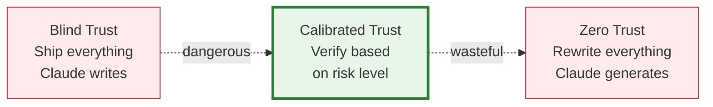

# 32 — Trust & Governance for AI-Assisted Development

Establish team-wide practices for when to trust, how to verify, and how to govern AI-generated code at scale.

---

## What You'll Learn

- The trust spectrum — from blind trust to blocking mistrust
- Progressive trust: how to build confidence over time
- Governance frameworks for teams using AI code generation
- Audit trails and accountability
- Compliance considerations (SOC 2, HIPAA, PCI, etc.)
- Establishing team standards for AI-generated code
- Measuring code quality from AI contributions
- When AI-generated code needs human sign-off

**Prerequisites**: [31 — Validating AI-Generated Code](31-validating-ai-generated-code.md), [17 — Collaboration & Team Workflows](17-collaboration-and-team-workflows.md)

---

## The Trust Spectrum

Most teams fall to one extreme — either trusting everything Claude writes or distrusting everything. Both are wrong.



**Calibrated trust** means: trust the output based on evidence, context, and risk — not based on feelings about AI.

---

## Progressive Trust

Trust should be earned through evidence, not given upfront. Build confidence incrementally.

### Stage 1: Verify Everything

When you're new to Claude Code, or using it in a new codebase:

- Review every line of generated code
- Run all tests manually
- Compare Claude's approach to how you would have done it
- Keep a mental (or actual) tally of what Claude gets right and wrong

**Duration**: First 1-2 weeks

### Stage 2: Trust-but-Verify by Risk

After you've seen Claude's patterns in your codebase:

- **Low risk**: Skim the diff, run tests, ship
- **Medium risk**: Review carefully, run tests, check edge cases
- **High risk**: Deep audit, adversarial testing, human review

**Duration**: Ongoing — this is where most teams should stabilize

### Stage 3: Selective Autonomy

For well-defined, repetitive, low-risk tasks:

- Automated Claude workflows (CI/CD, formatting, boilerplate)
- Headless mode with constrained tools
- Human review only when Claude flags uncertainty

**Duration**: Only after extensive Stage 2 experience

### What Builds Trust

| Trust Signal | Example |
|-------------|---------|
| Consistent test passage | Claude's code passes tests on first try 90%+ of the time |
| Matches codebase patterns | Code follows your conventions without being told |
| Handles edge cases | Claude proactively handles nulls, errors, boundaries |
| Accurate self-assessment | When Claude says "I'm not sure about X," X is actually uncertain |
| Clean diffs | Changes are focused — no unnecessary modifications |
| Honest about limitations | Claude says "I can't verify this without running it" instead of guessing |

### What Erodes Trust

| Warning Sign | Example |
|-------------|---------|
| Hallucinated APIs | Claude calls functions that don't exist in your codebase |
| Tests that don't test | Tests pass but don't actually verify behavior |
| Overconfident answers | Claude says "this is correct" when it's subtly wrong |
| Scope creep | Asked to fix a bug, refactors the whole module |
| Ignoring rules | CLAUDE.md says "use Prisma" but Claude writes raw SQL |
| Silent failures | Error handling that swallows exceptions |

---

## Team Governance Framework

### Define Your Team's AI Code Policy

Every team using AI code generation should have clear answers to these questions:

```markdown
## AI Code Generation Policy

### What Claude Can Do Without Approval
- Write tests for existing code
- Generate documentation and diagrams
- Refactor with existing test coverage
- Fix linter warnings and type errors
- Write boilerplate (routes, models, migrations)

### What Requires Standard PR Review
- New features and business logic
- Bug fixes
- API changes
- Database queries
- Configuration changes

### What Requires Senior/Security Review
- Authentication and authorization changes
- Payment processing logic
- Data migrations (especially destructive ones)
- Security-sensitive code (encryption, token handling)
- Changes to shared libraries used by multiple services
- Infrastructure and deployment configuration

### What Claude Should Never Do Alone
- Delete production data
- Modify access controls
- Change encryption keys or secrets
- Push directly to main/production branches
- Modify compliance-related audit logging
```

### Code Ownership and Accountability

AI-generated code still needs a human owner:

```
When Claude writes code that gets merged:
- The developer who prompted and reviewed it is the owner
- They are responsible for its correctness and maintenance
- Their name is on the commit and the PR
- "Claude wrote it" is not an excuse for bugs
```

This isn't about blame — it's about ensuring someone is paying attention and will fix issues that arise.

---

## Review Standards for AI Code

### PR Review Checklist (AI-Generated)

Teams should have an explicit checklist for reviewing AI-generated PRs:

```markdown
## AI Code PR Review

### Reviewer confirms:
- [ ] I understand what this code does (not just that it "looks right")
- [ ] I've traced the logic with at least one concrete example
- [ ] Tests exist and I've verified they test meaningful behavior
- [ ] I've checked for hallucinated APIs (all calls reference real code)
- [ ] Error handling is complete — no swallowed exceptions
- [ ] No security concerns (injection, auth bypass, data exposure)
- [ ] Changes are scoped — no unnecessary modifications
- [ ] Code matches our conventions and patterns
- [ ] I would be comfortable debugging this code at 2 AM
```

The last item is the most important. If you can't debug it, you shouldn't ship it.

### The "2 AM Test"

Before approving AI-generated code, ask yourself:

> If this code causes an incident at 2 AM and I get paged, can I understand and fix it?

If the answer is no — if the code is too clever, too unfamiliar, or too opaque — it needs to be rewritten in a way you understand, regardless of whether it's technically correct.

---

## Audit Trails

### Why Audit Trails Matter

When AI generates code, you lose the implicit audit trail of "a human thought about every line." Replace it with an explicit one.

### What to Track

| What | How | Why |
|------|-----|-----|
| That AI was involved | Co-authored-by tag in commits | Transparency — reviewers know to look more carefully |
| What was asked | Link to Claude session or summarize in PR description | Context for future debugging |
| What was verified | Verification checklist in PR | Evidence that someone actually reviewed it |
| What changed | Standard git diff | Same as any code change |

### Co-Authored-By Convention

Use the `Co-Authored-By` tag in commits to indicate AI involvement:

```
Add rate limiting to upload endpoint

Implements per-user rate limiting with a 10 req/min
limit and Retry-After headers.

Verification: full test suite, security review, manual testing
against staging.

Co-Authored-By: Claude <noreply@anthropic.com>
```

This makes it easy to search for AI-generated commits later:

```bash
git log --grep="Co-Authored-By: Claude"
```

### PR Description Template

```markdown
## Summary
[What this PR does]

## AI Involvement
- [ ] Fully AI-generated (human-reviewed)
- [ ] AI-assisted (human wrote core logic, AI helped with tests/boilerplate)
- [ ] AI-reviewed only (human wrote all code, AI reviewed for issues)

## Verification
- [ ] Tests cover all new behavior
- [ ] Tests verified with red-green method
- [ ] Static analysis passes
- [ ] Security review completed (for sensitive code)
- [ ] Manual testing completed

## Risk Level
- [ ] Low (docs, formatting, config)
- [ ] Medium (features, refactors)
- [ ] High (auth, payments, data)
```

---

## Compliance Considerations

### SOC 2

SOC 2 requires evidence of change management processes. AI-generated code needs:

- **Access controls**: Who can prompt Claude to make changes?
- **Change approval**: Are AI-generated changes reviewed before merging?
- **Audit logging**: Can you trace who requested the change and who approved it?
- **Separation of duties**: The person who generated the code shouldn't be the only reviewer

### HIPAA

For systems handling protected health information:

- AI-generated code touching PHI needs extra review for data handling
- Verify that AI didn't introduce new logging that might capture PHI
- Ensure data access patterns comply with minimum necessary standards
- Document the AI review process as part of your security program

### PCI DSS

For payment processing systems:

- AI-generated code in the cardholder data environment needs security review
- Verify no new data storage of card numbers, CVVs, etc.
- Review for injection vulnerabilities at every input boundary
- Document AI involvement in change management records

### General Compliance Guidance

```
Review this code for compliance implications:

1. Does it introduce new data storage? What data?
2. Does it change data access patterns?
3. Does it add new logging? Could logs contain sensitive data?
4. Does it change authentication or authorization?
5. Does it affect data retention or deletion?
6. Does it introduce new external service connections?
```

---

## Measuring Trust Over Time

Track these metrics to understand if your AI code practices are working:

### Quality Metrics

| Metric | What It Tells You | Target |
|--------|-------------------|--------|
| Bug rate (AI vs human code) | Whether AI code has more bugs | Should be comparable |
| Time-to-review (AI PRs) | Whether reviews are thorough enough | Should not be faster than human PRs |
| Test coverage of AI code | Whether AI code is well-tested | Should be equal or higher |
| Post-deploy incidents from AI code | Whether AI code is production-ready | Should be comparable to human code |
| Reverts of AI-generated code | Whether AI changes are stable | Should be low |

### Process Metrics

| Metric | What It Tells You |
|--------|-------------------|
| % of PRs with verification checklist completed | Team adoption of verification practices |
| % of AI commits with Co-Authored-By tag | Transparency compliance |
| Time to first production issue per AI PR | Early warning quality indicator |
| Developer confidence survey (quarterly) | Whether the team trusts the process |

### How to Collect

```
Analyze our git history for the last quarter:
1. How many commits were AI-assisted (Co-Authored-By: Claude)?
2. How many of those were later reverted or had follow-up fixes?
3. What's the bug rate for AI-assisted vs non-AI-assisted code?
4. Are there patterns in what AI gets right vs wrong?
```

---

## Team Onboarding

When a new team member starts using Claude Code, they need to understand the team's trust and verification practices.

### Onboarding Checklist

```markdown
## AI Code Generation Onboarding

### Read These First
- [ ] Team AI Code Policy (what requires what level of review)
- [ ] PR review checklist for AI-generated code
- [ ] Guide 31 — Validating AI-Generated Code
- [ ] This guide (32 — Trust & Governance)

### Set Up
- [ ] Configure CLAUDE.md with team rules
- [ ] Set up Co-Authored-By in git config
- [ ] Familiarize with the verification checklist
- [ ] Pair with an experienced team member on first AI-assisted PR

### First Week
- [ ] Complete at least one AI-assisted change with full verification
- [ ] Review at least one AI-assisted PR from a teammate
- [ ] Discuss any concerns or surprises with the team
```

---

## Establishing Team Standards

### The Standards Conversation

Have this conversation as a team before going all-in on AI code generation:

1. **What's our risk tolerance?** — How much verification is enough for different code areas?
2. **Who reviews AI code?** — Same reviewers as human code, or additional scrutiny?
3. **What's off-limits?** — Are there parts of the codebase where AI shouldn't generate code?
4. **How do we handle disagreements?** — If a developer trusts Claude but the reviewer doesn't?
5. **How do we learn from mistakes?** — When AI code causes a bug, how do we improve the process?

### Evolving Standards

Your trust framework should evolve:

```
Review our AI code incidents and verification process quarterly:

1. What bugs came from AI-generated code?
2. Would our verification process have caught them?
3. What verification steps proved most valuable?
4. What steps added time without catching issues?
5. Should we adjust our risk levels for any code areas?
```

---

## Sample Conversation

> **You**: We're rolling out Claude Code to the whole engineering team (15 people). What governance should we put in place?
>
> **Claude**: Let me review your current development workflow first...
> *reads CLAUDE.md, CI/CD config, PR templates, team structure*
>
> Based on your setup, here's what I'd recommend:
>
> **Immediate (before rollout):**
> 1. Add the AI Code Policy to your team wiki — defining what needs standard review vs senior review vs no AI generation
> 2. Update your PR template to include the AI involvement and verification sections
> 3. Set up a team CLAUDE.md with your conventions (you already have a good start)
>
> **First month:**
> 4. Everyone starts in "verify everything" mode
> 5. Pair reviews — new Claude users pair with experienced ones on first few PRs
> 6. Weekly 15-minute retro on AI code: what worked, what didn't, surprises
>
> **After first month:**
> 7. Move to risk-based verification (low/medium/high)
> 8. Track metrics: bug rate, revert rate, review thoroughness
> 9. Quarterly review of the policy based on actual data
>
> **Important for your compliance requirements** (I noticed you have SOC 2):
> - Co-Authored-By tags on all AI-assisted commits
> - Verification checklists attached to PRs (not just approved — documented)
> - Separation of duties: the developer who generated code shouldn't be the sole reviewer
>
> Want me to draft the PR template and team policy document?

---

## Key Takeaways

1. Calibrated trust beats both blind trust and zero trust — verify based on risk, not feelings
2. Progressive trust is earned through evidence — start by verifying everything, then relax as confidence grows
3. Every AI-generated change needs a human owner who is accountable for its correctness
4. The "2 AM Test": if you can't debug it during an incident, don't ship it
5. Audit trails (Co-Authored-By, PR checklists, risk levels) replace the implicit audit trail of human authorship
6. Compliance frameworks (SOC 2, HIPAA, PCI) require documented verification — "Claude wrote it" is not sufficient
7. Measure trust over time — track bug rates, revert rates, and review quality to evolve your practices
8. Team standards should be explicit and reviewed quarterly — don't assume everyone has the same verification habits

---

**Next**: Back to the [main page](../README.md) to explore all guides by track.
