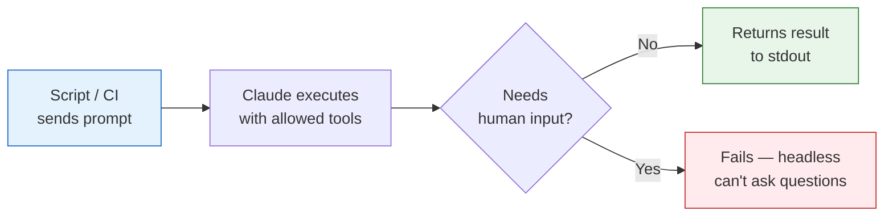
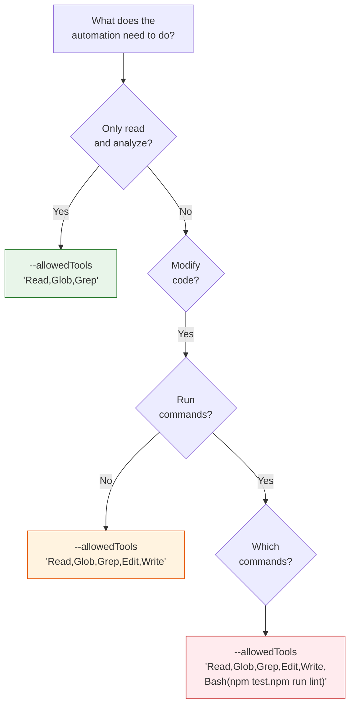

# 34 — Automation & Headless Workflows

Run Claude without human interaction — CI/CD integration, scheduled tasks, code review bots, and custom automation pipelines.

---

## What You'll Learn

- Headless mode fundamentals — running Claude non-interactively
- CI/CD integration recipes (GitHub Actions, GitLab CI, Jenkins)
- Automated code review on pull requests
- Scheduled maintenance tasks (dependency updates, dead code removal, doc generation)
- Building custom automation pipelines
- Safety guardrails for unattended operation
- Output parsing and error handling
- When automation helps vs when it introduces risk

**Prerequisites**: [26 — AI Agents & Agentic Patterns](26-ai-agents-and-agentic-patterns.md), [20 — CI/CD & Automation](20-ci-cd-and-automation.md), [31 — Validating AI-Generated Code](31-validating-ai-generated-code.md)

---

## Headless Mode Fundamentals

Headless mode (`claude -p`) runs Claude non-interactively. You give it a prompt, it executes, and it returns the result. No human in the loop during execution.



### Basic Usage

```bash
# Simple query — no tools needed
claude -p "Explain what the main() function in src/app.ts does"

# Task with file access
claude -p "List all TODO comments in the codebase" \
  --allowedTools "Read,Glob,Grep"

# Task with code changes
claude -p "Fix all TypeScript strict mode errors in src/utils/" \
  --allowedTools "Read,Glob,Grep,Edit"

# Task with code changes and testing
claude -p "Add input validation to the signup endpoint and run tests" \
  --allowedTools "Read,Glob,Grep,Edit,Write,Bash(npm test)"
```

### Output Formats

```bash
# Plain text (default)
claude -p "Summarize the architecture"

# JSON output for programmatic parsing
claude -p "List all API endpoints as JSON" --output-format json

# Stream output for real-time feedback
claude -p "Refactor the auth module" --stream
```

### The --allowedTools Flag

This is the most important safety mechanism for headless operation. It controls what Claude can do:

```bash
# Read-only — safest, can't change anything
--allowedTools "Read,Glob,Grep"

# Analysis with shell commands (read-only)
--allowedTools "Read,Glob,Grep,Bash(git log:*,git diff:*,npm list:*)"

# Code modification
--allowedTools "Read,Glob,Grep,Edit,Write"

# Code modification with testing
--allowedTools "Read,Glob,Grep,Edit,Write,Bash(npm:*,npx:*)"

# Code modification with git
--allowedTools "Read,Glob,Grep,Edit,Write,Bash(git:*,npm:*)"
```

**Rule**: Grant the minimum tools needed. If a task only requires reading, don't allow editing.

---

## CI/CD Integration Recipes

### Recipe 1: Automated PR Review

Run Claude on every PR to catch issues before human review:

```yaml
# .github/workflows/claude-review.yml
name: Claude Code Review
on:
  pull_request:
    types: [opened, synchronize]

jobs:
  review:
    runs-on: ubuntu-latest
    steps:
      - uses: actions/checkout@v4
        with:
          fetch-depth: 0  # Full history for diff context

      - name: Get changed files
        id: changes
        run: |
          echo "files=$(git diff --name-only origin/${{ github.base_ref }}...HEAD | tr '\n' ' ')" >> $GITHUB_OUTPUT

      - name: Claude Review
        env:
          ANTHROPIC_API_KEY: ${{ secrets.ANTHROPIC_API_KEY }}
        run: |
          claude -p "Review the changes in this PR.

          Changed files: ${{ steps.changes.outputs.files }}

          For each file, check for:
          - Bugs or logic errors
          - Security vulnerabilities (injection, auth bypass, data exposure)
          - Performance issues
          - Missing error handling
          - Missing tests for new behavior

          Format your review as markdown. Be specific — reference
          file names and line numbers. Only flag real issues,
          not style preferences." \
            --allowedTools "Read,Glob,Grep" \
            --output-format json > review.json

      - name: Post Review Comment
        uses: actions/github-script@v7
        with:
          script: |
            const review = require('./review.json');
            await github.rest.issues.createComment({
              owner: context.repo.owner,
              repo: context.repo.repo,
              issue_number: context.issue.number,
              body: review.result
            });
```

### Recipe 2: Auto-Fix Lint Errors

Automatically fix lint issues and push a commit:

```yaml
# .github/workflows/claude-lint-fix.yml
name: Claude Lint Fix
on:
  pull_request:
    types: [opened, synchronize]

jobs:
  lint-fix:
    runs-on: ubuntu-latest
    steps:
      - uses: actions/checkout@v4
        with:
          ref: ${{ github.head_ref }}
          token: ${{ secrets.GITHUB_TOKEN }}

      - uses: actions/setup-node@v4
        with:
          node-version: 20

      - run: npm ci

      - name: Check for lint errors
        id: lint
        run: |
          npm run lint 2>&1 | tee lint-output.txt
          echo "has_errors=$([[ -s lint-output.txt ]] && echo true || echo false)" >> $GITHUB_OUTPUT

      - name: Claude Fix Lint Errors
        if: steps.lint.outputs.has_errors == 'true'
        env:
          ANTHROPIC_API_KEY: ${{ secrets.ANTHROPIC_API_KEY }}
        run: |
          claude -p "Fix the lint errors in this project.
            Here's the lint output:
            $(cat lint-output.txt)

            Fix each error. Don't change behavior — only fix
            lint issues. Run the linter again after fixes
            to verify they're resolved." \
            --allowedTools "Read,Glob,Grep,Edit,Bash(npm run lint)"

      - name: Commit fixes
        run: |
          git config user.name "claude-bot"
          git config user.email "claude-bot@noreply.github.com"
          git add -A
          git diff --staged --quiet || git commit -m "fix: auto-fix lint errors

          Co-Authored-By: Claude <noreply@anthropic.com>"
          git push
```

### Recipe 3: Automated Test Generation

Generate tests for new code that lacks coverage:

```yaml
# .github/workflows/claude-test-gen.yml
name: Claude Test Coverage
on:
  pull_request:
    types: [opened, synchronize]

jobs:
  test-coverage:
    runs-on: ubuntu-latest
    steps:
      - uses: actions/checkout@v4
        with:
          ref: ${{ github.head_ref }}
          fetch-depth: 0

      - uses: actions/setup-node@v4
        with:
          node-version: 20

      - run: npm ci

      - name: Find untested new code
        run: |
          # Get new/modified source files (not test files)
          git diff --name-only origin/${{ github.base_ref }}...HEAD \
            | grep -v '\.test\.' | grep -v '__tests__' \
            | grep '\.\(ts\|tsx\|js\|jsx\)$' > new-files.txt || true

      - name: Generate missing tests
        if: hashFiles('new-files.txt') != ''
        env:
          ANTHROPIC_API_KEY: ${{ secrets.ANTHROPIC_API_KEY }}
        run: |
          claude -p "These files were added or modified in this PR:
            $(cat new-files.txt)

            For each file, check if corresponding tests exist.
            If tests are missing, generate them following the
            existing test patterns in this project.

            Run the tests after writing them to verify they pass." \
            --allowedTools "Read,Glob,Grep,Edit,Write,Bash(npm test:*)"
```

### Recipe 4: Release Notes Generation

```yaml
# .github/workflows/release-notes.yml
name: Generate Release Notes
on:
  push:
    tags:
      - 'v*'

jobs:
  release-notes:
    runs-on: ubuntu-latest
    steps:
      - uses: actions/checkout@v4
        with:
          fetch-depth: 0

      - name: Get previous tag
        id: prev_tag
        run: echo "tag=$(git describe --tags --abbrev=0 HEAD~1 2>/dev/null || echo '')" >> $GITHUB_OUTPUT

      - name: Generate notes
        env:
          ANTHROPIC_API_KEY: ${{ secrets.ANTHROPIC_API_KEY }}
        run: |
          claude -p "Generate release notes for ${{ github.ref_name }}.

            Changes since ${{ steps.prev_tag.outputs.tag }}:
            $(git log ${{ steps.prev_tag.outputs.tag }}..HEAD --oneline)

            Group changes into:
            - Features (new functionality)
            - Bug Fixes
            - Improvements (refactors, performance, DX)
            - Breaking Changes (if any)

            Write for end users, not developers. Be concise.
            Use markdown format." \
            --allowedTools "Read,Glob,Grep" > release-notes.md

      - name: Create GitHub Release
        uses: softprops/action-gh-release@v1
        with:
          body_path: release-notes.md
```

---

## Scheduled Automation

### Dependency Update Check

Run weekly to check for outdated or vulnerable dependencies:

```bash
#!/bin/bash
# scripts/weekly-dependency-check.sh
# Cron: 0 9 * * 1 (Monday at 9am)

claude -p "Check this project's dependencies:

1. Are there any known security vulnerabilities? Run npm audit.
2. Are there major version updates available that we should consider?
3. Are there any deprecated packages we're using?
4. For any critical vulnerabilities, what's the fix?

Don't make changes — create a report. If there are critical
security vulnerabilities, output 'CRITICAL' on the first line." \
  --allowedTools "Read,Glob,Grep,Bash(npm audit,npm outdated,npm ls)" \
  > /tmp/dependency-report.txt

# Alert on critical issues
if head -1 /tmp/dependency-report.txt | grep -q "CRITICAL"; then
  # Send to Slack, email, etc.
  curl -X POST "$SLACK_WEBHOOK" \
    -H 'Content-type: application/json' \
    -d "{\"text\": \"Critical dependency vulnerability found. See report.\"}"
fi
```

### Dead Code Detection

```bash
#!/bin/bash
# scripts/monthly-dead-code.sh

claude -p "Analyze the codebase for dead code:

1. Exported functions that are never imported anywhere
2. Files that are never imported
3. React components that are never rendered
4. API endpoints that appear unused
5. Database columns that are never read or written

Don't delete anything — generate a report with file paths
and line numbers for human review." \
  --allowedTools "Read,Glob,Grep" \
  > reports/dead-code-$(date +%Y%m).md
```

### Documentation Freshness

```bash
#!/bin/bash
# scripts/weekly-docs-check.sh

claude -p "Compare the code with the documentation:

1. Are there any API endpoints not documented?
2. Are there documented endpoints that no longer exist?
3. Do code comments match the actual behavior?
4. Is the README up to date with the current setup instructions?

Generate a report of stale or missing documentation." \
  --allowedTools "Read,Glob,Grep" \
  > reports/docs-freshness-$(date +%Y%m%d).md
```

---

## Building Custom Automation Pipelines

### The Pipeline Pattern

Chain multiple Claude invocations for complex workflows:

```bash
#!/bin/bash
# scripts/full-audit-pipeline.sh

echo "=== Step 1: Security Scan ==="
claude -p "Scan for security vulnerabilities in src/.
  Focus on injection risks, auth issues, and data exposure." \
  --allowedTools "Read,Glob,Grep" \
  --output-format json > audit/security.json

echo "=== Step 2: Performance Scan ==="
claude -p "Analyze for performance issues in src/.
  Focus on N+1 queries, missing indexes, unbounded loops,
  and memory leaks." \
  --allowedTools "Read,Glob,Grep" \
  --output-format json > audit/performance.json

echo "=== Step 3: Consolidate ==="
claude -p "Here are the results of our security scan:
  $(cat audit/security.json)

  And our performance scan:
  $(cat audit/performance.json)

  Create a consolidated report prioritized by severity.
  Format as markdown with sections for Critical, High,
  Medium, and Low issues." \
  --allowedTools "Read" > audit/consolidated-report.md

echo "Report: audit/consolidated-report.md"
```

### Conditional Pipelines

```bash
#!/bin/bash
# Only run expensive analysis if cheap checks find issues

# Step 1: Quick check (fast, cheap)
result=$(claude -p "Quick check: are there any obvious security
  issues in the files changed in the last commit?
  Reply YES or NO, then explain." \
  --allowedTools "Read,Glob,Grep,Bash(git diff:*)")

if echo "$result" | head -1 | grep -q "YES"; then
  # Step 2: Deep scan (slower, more thorough)
  claude -p "Do a thorough security audit of the files
    changed in the last commit. Check for all OWASP Top 10
    vulnerabilities. Be detailed." \
    --allowedTools "Read,Glob,Grep,Bash(git diff:*)" \
    > security-audit.md

  echo "Issues found. See security-audit.md"
else
  echo "No issues found in quick check."
fi
```

---

## Safety Guardrails

### The Principle of Least Privilege

Every automated Claude run should have the minimum tools needed:



### Never Allow in Automation

These tools/commands should never be in `--allowedTools` for unattended runs:

- `Bash(rm:*)` — could delete important files
- `Bash(git push:*)` — could push to production without review
- `Bash(curl:*)` — could exfiltrate code or data
- `Bash(npm publish:*)` — could publish packages
- Unrestricted `Bash` — could do literally anything

### Timeout and Resource Limits

```bash
# Set a timeout to prevent runaway agents
timeout 300 claude -p "task" --allowedTools "Read,Glob,Grep,Edit"

# Or use the built-in max-turns limit
claude -p "task" --allowedTools "Read,Glob,Grep,Edit" --max-turns 20
```

### Dry Run Pattern

For risky automation, do a dry run first:

```bash
# Step 1: Plan (read-only)
plan=$(claude -p "Analyze what changes are needed to fix all
  TypeScript errors. Don't make changes — just list what you
  would change and why." \
  --allowedTools "Read,Glob,Grep")

echo "$plan"
read -p "Proceed with changes? (y/n) " confirm

# Step 2: Execute (only if approved)
if [ "$confirm" = "y" ]; then
  claude -p "Fix all TypeScript errors. Here was your plan:
    $plan
    Execute it." \
    --allowedTools "Read,Glob,Grep,Edit,Write,Bash(npm run typecheck)"
fi
```

---

## Error Handling

### Parsing Results

```bash
# Check exit code
if claude -p "Fix the bug" --allowedTools "Read,Glob,Grep,Edit"; then
  echo "Success"
else
  echo "Claude failed — check output"
  exit 1
fi

# Parse JSON output
result=$(claude -p "List API endpoints as JSON" \
  --allowedTools "Read,Glob,Grep" \
  --output-format json)

# Use jq to extract fields
echo "$result" | jq '.result'
```

### Retry Logic

```bash
#!/bin/bash
max_retries=3
attempt=1

while [ $attempt -le $max_retries ]; do
  if claude -p "Run tests and fix any failures" \
    --allowedTools "Read,Glob,Grep,Edit,Bash(npm test)"; then
    echo "Success on attempt $attempt"
    break
  else
    echo "Attempt $attempt failed"
    attempt=$((attempt + 1))
    if [ $attempt -gt $max_retries ]; then
      echo "All retries exhausted"
      exit 1
    fi
  fi
done
```

### Notification on Failure

```bash
#!/bin/bash
# Wrap any automation with failure notification

run_with_notification() {
  local task_name="$1"
  shift

  if ! "$@" 2>&1 | tee "/tmp/$task_name.log"; then
    curl -X POST "$SLACK_WEBHOOK" \
      -H 'Content-type: application/json' \
      -d "{\"text\": \"Automation '$task_name' failed. Check logs.\"}"
    exit 1
  fi
}

run_with_notification "dependency-check" \
  claude -p "Check for vulnerable dependencies" \
  --allowedTools "Read,Glob,Grep,Bash(npm audit)"
```

---

## When Automation Helps vs Hurts

### Automate These

| Task | Why |
|------|-----|
| PR review (advisory) | Catches obvious issues fast, frees up human reviewers |
| Lint/format fixes | Deterministic, low risk, tedious for humans |
| Release notes | Repetitive summarization task |
| Dependency audit | Regular cadence, mostly read-only |
| Dead code reports | Analysis-only, no changes |
| Test generation for new code | Augments human testing, review before merge |

### Don't Automate These

| Task | Why |
|------|-----|
| Merging PRs | Needs human judgment on readiness |
| Deploying to production | Too much risk for unattended operation |
| Deleting code/branches | Irreversible — needs human confirmation |
| Architecture decisions | Requires context that automation can't have |
| Security fixes for critical vulns | Needs expert review, not automated patching |

---

## Sample Conversation

> **You**: I want to set up automated PR reviews with Claude. What's the safest way?
>
> **Claude**: Here's my recommended approach for your project:
>
> **Phase 1: Read-only advisory** (start here)
> - Claude reviews PRs and posts comments
> - No code changes — just analysis
> - Uses only `Read,Glob,Grep` tools
> - Comments are clearly labeled as AI-generated
> - Human reviewers still required for approval
>
> **Phase 2: Lint auto-fix** (after Phase 1 is stable)
> - Claude fixes lint errors and pushes a commit
> - Only triggered when lint check fails
> - Only allowed to use `Edit` (not `Write` — no new files)
> - Changes are visible in the PR diff for human review
>
> **Phase 3: Test generation** (after Phase 2 is stable)
> - Claude generates tests for new code without coverage
> - Tests are added as a commit to the PR
> - Human reviews the tests before merge
>
> Never automate: PR approval, merge, or deploy. Those stay human.
>
> Want me to set up the GitHub Actions workflow for Phase 1?

---

## Key Takeaways

1. Headless mode (`claude -p`) is the foundation for all Claude automation
2. `--allowedTools` is your most important safety mechanism — always use least privilege
3. Start with read-only automation (reviews, reports) before allowing code changes
4. Never give automated Claude access to `git push`, `rm`, `npm publish`, or unrestricted `Bash`
5. Use dry run patterns for risky automation — plan first, execute only with approval
6. Chain multiple Claude invocations for complex pipelines — each step constrained separately
7. Always have error handling and notifications — unattended failure should alert someone
8. Automate the tedious, not the critical — PR review yes, production deploy no

---

**Next**: [35 — Power User Patterns](35-power-user-patterns.md) — Advanced techniques for experienced Claude Code users.
