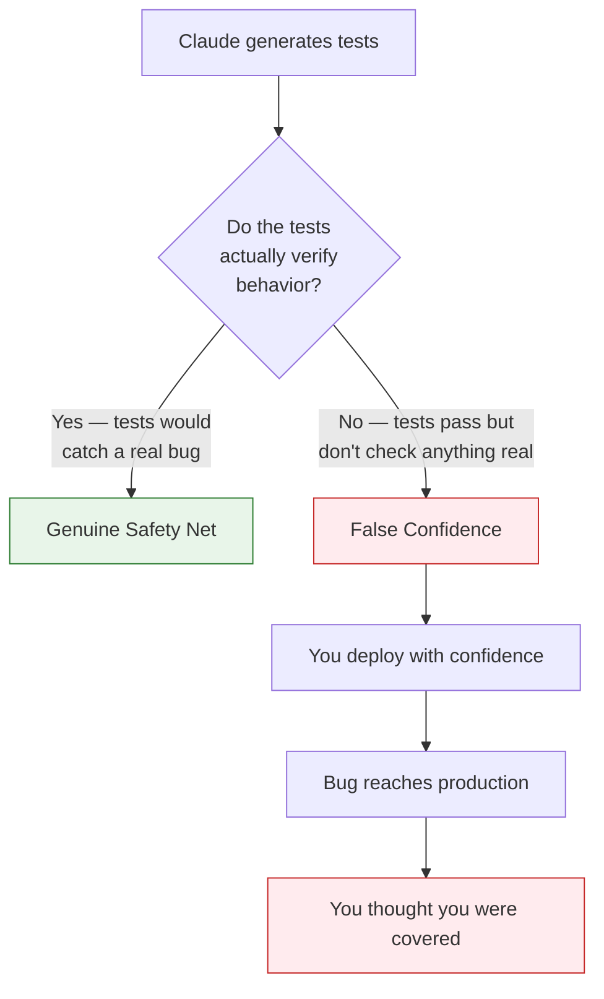
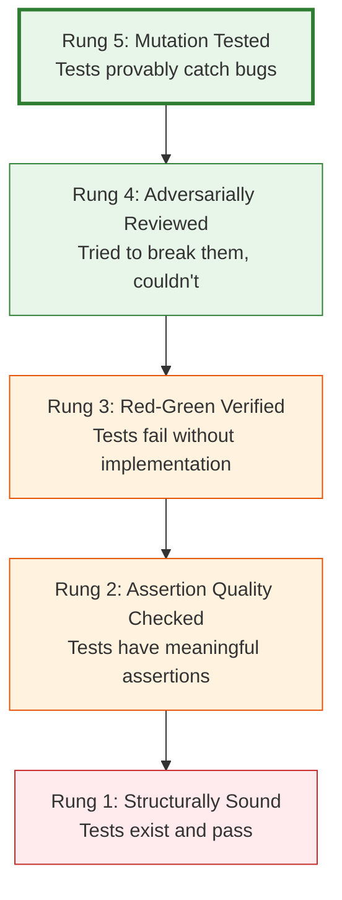
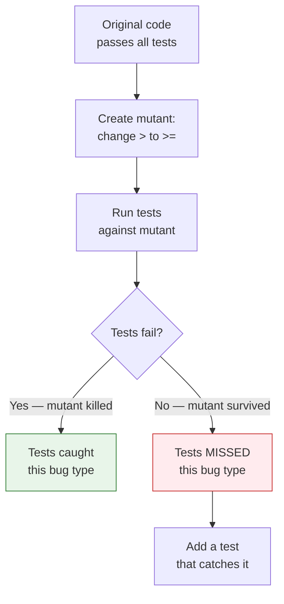
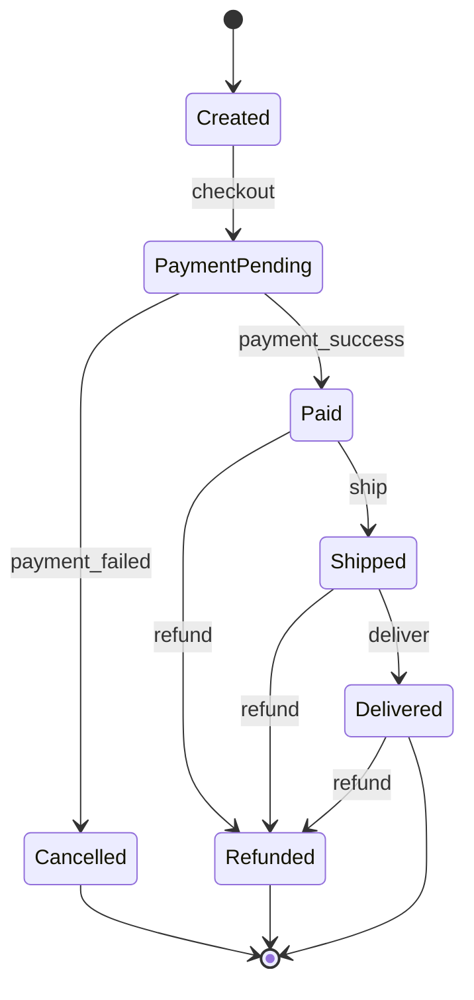

# 36 — Trusting Autogenerated Tests

Build confidence that AI-generated tests actually catch bugs — not just pass green.

---

## What You'll Learn

- Why AI-generated tests are uniquely dangerous when they're wrong
- The test trust ladder — from zero confidence to production-grade
- Mutation testing to prove your tests catch real bugs
- Coverage theater vs meaningful coverage
- Validating test quality in complex systems with many moving parts
- Patterns for reviewing AI-written tests quickly and effectively
- When to hand-write tests instead of generating them
- Building a test quality feedback loop

**Prerequisites**: [14 — Testing Strategies](14-testing-strategies.md), [31 — Validating AI-Generated Code](31-validating-ai-generated-code.md)

---

## Why AI-Generated Tests Are Dangerous

AI-generated tests have a unique failure mode: they look right, they pass, and they verify nothing.



The danger isn't that tests fail — it's that they pass when they shouldn't. A test that always passes is worse than no test, because it gives you confidence you haven't earned.

### The Three Failure Modes

| Failure Mode | What Happens | Example |
|-------------|-------------|---------|
| **Tautological tests** | Test asserts what the code does, not what it should do | `expect(result).toBe(result)` |
| **Weak assertions** | Test runs code but only checks it doesn't throw | `expect(fn()).toBeDefined()` |
| **Mocking away the behavior** | Test mocks so much that it only tests the mocks | Mocking the database, the API, and the validation — testing nothing real |

---

## The Test Trust Ladder

Build confidence incrementally. Each rung adds evidence that the tests actually work.



Most AI-generated tests sit at Rung 1. You need to push them to Rung 3 minimum, Rung 5 for critical code.

---

## Rung 1: Structurally Sound

The baseline — tests exist, they're organized correctly, and they pass.

```
Review the test structure:
1. Are tests in the right location following our conventions?
2. Do test names describe the behavior being tested?
3. Is the test organized with proper setup/act/assert phases?
4. Are there tests for the main scenarios?
```

This is necessary but nowhere near sufficient.

---

## Rung 2: Assertion Quality

This is where most AI-generated tests fail. The assertions need to verify actual behavior, not just check that code runs.

### The Assertion Audit

```
For every test Claude generated, audit the assertions:

1. What exactly is being asserted?
2. Is the expected value hardcoded and meaningful, or derived from the implementation?
3. Would a broken implementation still pass this assertion?
4. Does the assertion check the BEHAVIOR or just the SHAPE?

Flag any test where the assertion is:
- toBeDefined() / toBeTruthy() without a specific value check
- Checking only that no error was thrown
- Checking the type but not the value
- Using the implementation's own output as the expected value
```

### Before and After

```javascript
// BAD — Rung 1 only: runs the code, barely checks anything
test('should calculate order total', async () => {
  const order = await createOrder(items);
  expect(order).toBeDefined();
  expect(order.total).toBeTruthy();
});

// GOOD — Rung 2: meaningful assertions on concrete values
test('should calculate order total with tax and discount', async () => {
  const items = [
    { sku: 'WIDGET-A', price: 25.00, quantity: 2 },
    { sku: 'WIDGET-B', price: 15.00, quantity: 1 },
  ];
  const order = await createOrder(items, {
    discount: { type: 'percentage', value: 10 },
    taxRate: 0.08,
  });

  expect(order.subtotal).toBe(65.00);       // 25*2 + 15*1
  expect(order.discountAmount).toBe(6.50);   // 10% of 65
  expect(order.taxAmount).toBe(4.68);        // 8% of 58.50
  expect(order.total).toBe(63.18);           // 58.50 + 4.68
});
```

### The "Change the Code" Test

The most reliable way to verify assertion quality:

```
Take one of the generated tests. Now introduce a subtle
bug in the implementation — change a > to >=, swap an
argument order, remove a null check. Does the test catch it?

If not, the test's assertions are too weak. Strengthen them.
```

---

## Rung 3: Red-Green Verification

The gold standard for test validity — tests must fail when the implementation doesn't exist.

### The Process

```
Step 1: Write the tests BEFORE the implementation.
Step 2: Run them — they MUST fail (red).
Step 3: Implement the code.
Step 4: Run them — they MUST pass (green).

If step 2 passes, the tests are testing nothing.
```

### Applying Red-Green to AI Tests

When Claude writes tests for existing code, you can still verify with red-green:

```
You just wrote tests for the OrderService.calculateTotal() method.
Now temporarily break the implementation:
- Change the tax calculation to always return 0
- Run the tests
- Do they catch the bug?

Restore the implementation after verifying.
```

```
For each test you wrote, identify the specific line of
implementation code that would cause it to fail if changed.
If you can't identify one, the test isn't testing real behavior.
```

---

## Rung 4: Adversarial Review

Try to break the tests. If you can't, they're probably solid.

### The Adversarial Prompt

```
Now act as an adversary. Your goal is to write a WRONG
implementation that still passes all these tests.

For each test, find a way to satisfy the assertions
without implementing the correct behavior. If you can,
the test has a gap — add an assertion to close it.
```

### Common Adversarial Findings

| Gap | Adversary Exploit | Fix |
|-----|-------------------|-----|
| Only tests happy path | Return hardcoded valid response for any input | Add edge case and error tests |
| Doesn't check order of operations | Perform steps in wrong order but same final state | Assert intermediate states or side effects |
| Doesn't verify persistence | Return success but never save to database | Query the database in the assertion |
| Doesn't test concurrency | Works for single request, fails for concurrent | Add concurrent execution test |
| Doesn't check what WASN'T changed | Modify extra records, pass test | Assert that unrelated records are unchanged |

### The Side Effect Audit

In complex systems, the most important behaviors are often side effects:

```
For each test, check: what SIDE EFFECTS should this
operation produce?

- Database writes (created, updated, or deleted records)
- Events published to a queue
- Cache invalidation
- Emails or notifications sent
- Audit log entries
- Metric increments

Are these side effects verified in the tests?
If not, the tests only cover the return value — not the
actual system behavior.
```

---

## Rung 5: Mutation Testing

The ultimate proof that tests catch bugs. Mutation testing systematically introduces bugs and checks if tests catch them.

### How Mutation Testing Works



### Using Mutation Testing Tools

```
Set up mutation testing for our test suite:

For JavaScript/TypeScript: Stryker Mutator
For Python: mutmut
For Java: PITest

Run it on the code that Claude generated tests for.
What's the mutation score? What mutants survived?
For each surviving mutant, what test is missing?
```

### Manual Mutation Testing with Claude

If you don't have a mutation testing tool set up, Claude can do it manually:

```
Perform manual mutation testing on OrderService.calculateTotal():

1. List 10 realistic mutations (operator changes, boundary
   shifts, removed conditionals, swapped arguments)
2. For each mutation, predict which test catches it
3. If no test catches it, write one

Example mutations:
- Change subtotal calculation from + to -
- Remove the tax calculation
- Change discount from percentage to flat amount
- Remove the null check on items
- Change >= to > in minimum order check
```

### Mutation Score Targets

| Code Risk Level | Minimum Mutation Score | Notes |
|----------------|----------------------|-------|
| Low (utils, formatting) | 60% | Some mutations may be equivalent |
| Medium (business logic) | 80% | Most mutations should be caught |
| High (auth, payments) | 90%+ | Nearly every mutation must be caught |
| Critical (crypto, billing) | 95%+ | Consider formal verification too |

---

## Testing in Complex Systems

Complex systems have unique testing challenges that AI often handles poorly.

### The Integration Boundary Problem

Claude tends to mock away integrations, which means the most bug-prone areas — the boundaries between systems — go untested.

```
For our integration tests, do NOT mock these:
- Database queries (use a test database)
- Cache reads/writes (use a test Redis instance)
- Message queue publish/consume (use a test queue)

DO mock these:
- External third-party APIs (Stripe, SendGrid, etc.)
- Clock/time (for time-dependent logic)
- Random number generation (for deterministic tests)

The rule: mock things we don't control,
don't mock things we do control.
```

### Testing Distributed Workflows

For systems with multiple services, queues, and async processes:

```
We need tests for the order fulfillment workflow:
1. Order placed → event published to queue
2. Payment service processes payment → event published
3. Inventory service reserves items → event published
4. Shipping service creates shipment → email sent

Write tests that verify:
- The complete happy path (all steps succeed)
- Payment failure (order should be cancelled)
- Inventory shortage (order should be backordered)
- Partial failure and recovery
- Duplicate event handling (idempotency)

Don't test each service in isolation only — test the
workflow as an integration.
```

### State Machine Testing

Complex systems often have implicit state machines. Make them explicit and test all transitions:

```
Analyze the order lifecycle in our system. Map all possible
states and transitions:

- What states can an order be in?
- What events trigger transitions?
- What transitions are invalid?
- What side effects occur on each transition?

Generate tests for:
1. Every valid state transition
2. Every invalid state transition (should be rejected)
3. Concurrent transitions (race conditions)
```



### Testing Data Consistency

In complex systems, data consistency bugs are the hardest to catch:

```
Write tests that verify data consistency after each operation:

1. After creating an order:
   - Order record exists in orders table
   - Order items exist in order_items table
   - Inventory counts decreased
   - User's order history updated
   - Total matches sum of line items + tax - discount

2. After cancelling an order:
   - Order status is 'cancelled'
   - Inventory counts restored
   - Payment refund initiated
   - All related records consistent

3. After a partial failure (e.g., payment succeeds but inventory update fails):
   - System is in a consistent state (not half-updated)
   - Compensating transaction was triggered
```

---

## The Test Quality Review Checklist

Use this when reviewing AI-generated tests:

```markdown
## Test Quality Review

### Structure
- [ ] Tests are organized by behavior, not by method
- [ ] Test names describe the scenario and expected outcome
- [ ] Each test tests one thing (single assertion per behavior)
- [ ] Setup is clear and minimal (no unnecessary fixtures)

### Assertions
- [ ] Every test has at least one meaningful assertion
- [ ] Assertions check specific values, not just types or existence
- [ ] Expected values are independently calculated, not copied from implementation
- [ ] Side effects are verified (database, events, logs)

### Coverage
- [ ] Happy path is covered
- [ ] Error cases are covered (invalid input, failures, timeouts)
- [ ] Edge cases are covered (empty, null, boundary values, unicode)
- [ ] State transitions are covered (if applicable)

### Verification
- [ ] Red-green verified (tests fail without implementation)
- [ ] At least 3 manual mutations were tested and caught
- [ ] Integration boundaries are tested (not everything mocked)
- [ ] Concurrent access is tested (if applicable)

### Trust Level
- [ ] Rung 1: Structurally sound
- [ ] Rung 2: Assertion quality verified
- [ ] Rung 3: Red-green verified
- [ ] Rung 4: Adversarially reviewed
- [ ] Rung 5: Mutation tested (for high-risk code)
```

---

## When to Hand-Write Tests

AI-generated tests are great for boilerplate and coverage breadth. But some tests should be written by a human:

| Write By Hand | Why |
|---------------|-----|
| Core business logic invariants | Too important to risk weak assertions |
| Complex state machine transitions | AI tends to miss subtle invalid transitions |
| Security-sensitive behavior | Auth bypass tests need security expertise |
| Race condition tests | Timing-dependent tests are hard to generate correctly |
| Regression tests for production bugs | Need to encode the exact failure scenario |
| Performance benchmarks | Need stable baselines and realistic data |

For everything else — CRUD operations, validation rules, formatting functions, utility methods — AI-generated tests with proper verification are fine.

---

## Sample Conversation

> **You**: Claude wrote 40 tests for our order processing module. How do I know if they're any good?
>
> **Claude**: Let me audit them... *reads the test file*
>
> Here's what I found:
>
> **Good (22 tests):**
> - Specific assertions on calculated values
> - Cover both success and error paths
> - Test meaningful behavior, not just shapes
>
> **Concerning (12 tests):**
> - 8 tests only assert `.toBeDefined()` — they pass for any non-null return
> - 4 tests mock the database AND the business logic, so they only test the controller routes
>
> **Weak (6 tests):**
> - 3 tests have no assertions at all (just call the function)
> - 3 tests assert on the mock's return value (testing the mock, not the code)
>
> **Missing entirely:**
> - No tests for concurrent order modifications
> - No tests for partial payment failure
> - No tests verifying inventory is actually decremented (only checks return value)
>
> I'd recommend: fix the 12 concerning tests first (add real assertions), delete the 6 weak tests (they give false confidence), then add the missing scenario tests. Want me to do that?

---

## Key Takeaways

1. AI-generated tests that always pass are worse than no tests — they give false confidence
2. Climb the trust ladder: structure → assertions → red-green → adversarial → mutation testing
3. The "change the code" test is the fastest way to verify assertion quality — if a bug doesn't break the test, the test is weak
4. In complex systems, test the boundaries and side effects — not just return values
5. Mock external services you don't control, but test your own integrations with real dependencies
6. Mutation testing is the gold standard — it proves your tests catch actual bugs
7. Some tests should still be hand-written: security, race conditions, core business invariants
8. Delete weak tests rather than keeping them — false confidence is worse than known gaps

---

**Next**: [37 — Systems Integration Analysis](37-systems-integration-analysis.md) — Map, understand, and verify how components interact in complex distributed systems.
