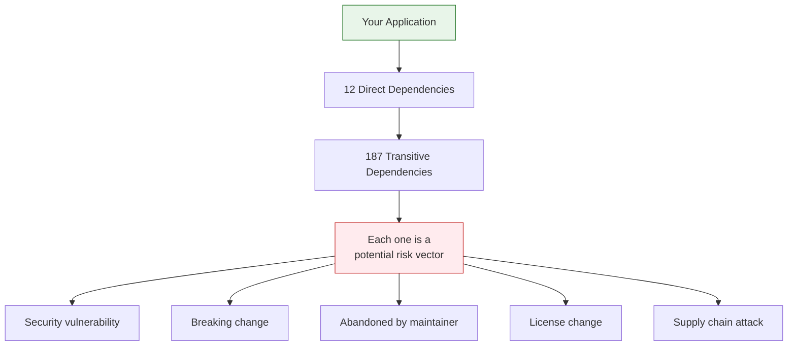
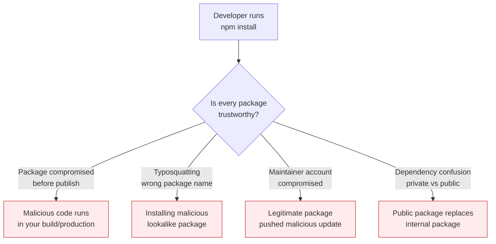

# 38 — Dependency & Risk Analysis

Identify, evaluate, and mitigate risks from external dependencies, vendor lock-in, and supply chain vulnerabilities.

---

## What You'll Learn

- Mapping your full dependency tree — direct, transitive, and runtime
- Evaluating dependency health (maintenance status, security track record, bus factor)
- Supply chain security — protecting against compromised packages
- Vendor lock-in analysis and abstraction strategies
- License compliance risks
- Building a dependency risk register
- Upgrade strategies for complex dependency graphs
- Using Claude to continuously monitor and assess dependency risk

**Prerequisites**: [04 — Architecture & Dependencies](04-architecture-and-dependencies.md), [15 — Security Analysis](15-security-analysis.md)

---

## Why Dependencies Are Risk

Every dependency is code you didn't write, don't fully understand, and can't directly control. Most applications have hundreds of transitive dependencies — any one of them could introduce a vulnerability, a breaking change, or simply stop being maintained.



---

## Step 1: Map the Full Dependency Tree

### Direct Dependencies

```
List all direct dependencies and their purpose:

For each dependency in package.json / requirements.txt / go.mod:
1. What does it do?
2. Is it a runtime dependency or dev-only?
3. What version are we pinned to?
4. When was it last updated in our project?
5. Is there a simpler alternative or could we write this ourselves?
```

### Transitive Dependencies

```
Analyze our transitive dependency tree:

1. How many total packages are installed (including transitive)?
2. Which direct dependencies pull in the most transitive deps?
3. Are there multiple versions of the same package?
4. Are there any deprecated packages in the tree?
5. What's the deepest dependency chain?

Flag any transitive dependency with known vulnerabilities.
```

### Runtime vs Build Dependencies

```
Classify our dependencies:

- Runtime (shipped to production): highest risk
- Build-time (used during build): medium risk
- Dev-only (tests, linting, formatting): lower risk
- Optional/peer: check if actually used

Runtime dependencies need the most scrutiny because
they run in production with our users' data.
```

---

## Step 2: Evaluate Dependency Health

### The Health Scorecard

For each critical dependency, evaluate:

```
Assess the health of our top 20 runtime dependencies:

For each package:
1. Last release date (stale if > 12 months)
2. Open issues / open PRs (measure of maintenance activity)
3. Number of maintainers (bus factor — 1 maintainer = high risk)
4. Download count trend (growing, stable, or declining?)
5. GitHub stars trend (is the community engaged?)
6. Security advisory history (how many CVEs? how fast were they fixed?)
7. Breaking change history (how often do major versions drop?)
8. Test coverage (does the project itself have good tests?)

Score each as: Healthy / Watch / At Risk / Critical
```

### The Bus Factor Problem

```
Identify single-maintainer dependencies in our project:

For each:
- Is there a fork or alternative we could switch to?
- How deeply integrated is it? (how hard to replace?)
- Is it a direct dependency or transitive?
- Could we vendor it (copy the source) as a last resort?

Single-maintainer packages are the #1 supply chain risk
for most projects.
```

### Abandonment Detection

```
Check for signs of dependency abandonment:

1. No commits in 12+ months
2. No releases in 12+ months
3. Growing issue count with no responses
4. Maintainer's GitHub activity has stopped
5. Deprecation notices in the README or npm
6. Competing packages gaining adoption

For each abandoned dependency: what's our migration plan?
```

---

## Step 3: Supply Chain Security

### The Attack Surface



### Lockfile Verification

```
Analyze our lockfile (package-lock.json / yarn.lock / pnpm-lock.yaml):

1. Is the lockfile checked into version control? (it must be)
2. Are there any integrity hash mismatches?
3. Are there any packages resolved from unexpected registries?
4. Has the lockfile changed unexpectedly in recent commits?
5. Are install scripts enabled for all packages? (which ones have postinstall?)
```

### Install Script Audit

```
List all packages that run install scripts (preinstall, install, postinstall):

For each:
1. What does the script do?
2. Is it necessary for the package to work?
3. Could it be a security risk? (downloading binaries, executing shell commands)
4. Can we disable it without breaking functionality?

Install scripts are the primary vector for supply chain attacks
in npm/yarn/pnpm ecosystems.
```

### Automated Security Scanning

```
Set up continuous dependency security scanning:

1. npm audit / pip audit / go vulnerability check in CI
2. Dependabot or Renovate for automated update PRs
3. Socket.dev or Snyk for supply chain analysis
4. SBOM generation (Software Bill of Materials) for compliance

Show me the CI configuration to add these checks.
```

---

## Step 4: Vendor Lock-In Analysis

### Identifying Lock-In

```
Analyze our codebase for vendor lock-in:

1. AWS services used directly (SDK calls, not abstractions)
2. Database-specific features (PostgreSQL extensions, MySQL-specific syntax)
3. Cloud-provider-specific infrastructure (Lambda, SQS, DynamoDB)
4. SaaS integrations with no standard protocol (proprietary APIs)
5. Framework-specific patterns that would be hard to migrate

For each, rate the lock-in level:
- Low: could switch in < 1 week
- Medium: could switch in 1-4 weeks
- High: would take months to switch
- Very High: would require a rewrite
```

### The Abstraction Decision

Not all lock-in needs an abstraction. Over-abstracting adds complexity without benefit:

```
For each vendor lock-in point, assess whether we need
an abstraction layer:

Consider:
- Likelihood of switching (are we actually going to leave AWS?)
- Cost of the abstraction (code complexity, performance overhead)
- Benefit of vendor-specific features we'd lose
- Whether a standard exists (S3 API is a de facto standard)

Usually: abstract database access (ORMs), don't abstract
cloud storage (S3 API is universal), abstract email
providers (they change often), don't abstract auth
providers if deeply integrated.
```

### Vendor Risk Assessment

```
For each critical vendor dependency:

1. What happens if they have a 4-hour outage?
2. What happens if they raise prices 3x?
3. What happens if they deprecate the API we use?
4. What happens if they get acquired and the product changes direction?
5. Do we have data portability? Can we export our data?
6. Are there viable alternatives?

Document the risk and our mitigation strategy for each.
```

---

## Step 5: License Compliance

### License Audit

```
Audit all dependency licenses:

1. List every license in our dependency tree
2. Flag any copyleft licenses (GPL, AGPL, LGPL) that might
   affect our proprietary code
3. Flag any "no license" packages (legally risky to use)
4. Flag any license changes in recent updates
5. Are we compliant with attribution requirements?

Group by risk:
- Permissive (MIT, Apache 2.0, BSD): generally safe
- Weak copyleft (LGPL, MPL): safe if used correctly
- Strong copyleft (GPL, AGPL): may require open-sourcing your code
- No license / custom: consult legal before using
```

### License Compatibility Matrix

| Your Project | MIT | Apache 2.0 | BSD | LGPL | GPL | AGPL |
|-------------|-----|-----------|-----|------|-----|------|
| **Proprietary** | OK | OK | OK | Careful | No | No |
| **MIT** | OK | OK | OK | Careful | No | No |
| **Apache 2.0** | OK | OK | OK | Careful | No | No |
| **GPL** | OK | OK | OK | OK | OK | No |

---

## Step 6: The Dependency Risk Register

### Building the Register

```
Create a dependency risk register for our project:

For each dependency, document:
| Package | Version | Risk Level | Health | Lock-In | License | Last Reviewed |
|---------|---------|------------|--------|---------|---------|---------------|

Risk Level: Critical / High / Medium / Low
Health: Healthy / Watch / At Risk / Abandoned
Lock-In: None / Low / Medium / High
License: Permissive / Copyleft / Unknown

Sort by risk level. Flag anything that needs immediate action.
```

### Review Cadence

| Activity | Frequency |
|----------|-----------|
| `npm audit` / vulnerability scan | Every CI run |
| Dependabot/Renovate PRs | Weekly review |
| Health scorecard for critical deps | Monthly |
| Full dependency audit | Quarterly |
| Vendor lock-in assessment | Semi-annually |
| License compliance check | Semi-annually |

---

## Step 7: Upgrade Strategies

### Safe Dependency Upgrades

```
I need to upgrade [package] from v2 to v4.

Before upgrading:
1. Read the changelog for v3 and v4 — what are the breaking changes?
2. Check our codebase for usage of deprecated APIs
3. Check if our other dependencies are compatible with v4
4. Are there migration guides or codemods available?

Plan the upgrade:
1. Update the package
2. Fix all breaking changes
3. Run the full test suite
4. Manually test critical paths
5. Deploy to staging before production
```

### The Strangler Upgrade

For deeply integrated dependencies:

```
We need to migrate from Moment.js to date-fns.
This is used in 47 files. Don't do it all at once.

Phase 1: Add date-fns as a dependency alongside Moment
Phase 2: Create adapter functions that wrap both libraries
Phase 3: Migrate files one at a time, starting with simplest
Phase 4: Run tests after each file migration
Phase 5: Remove Moment.js when all files are migrated

Start with Phase 1 and 2.
```

---

## Sample Conversation

> **You**: We keep getting Dependabot PRs and just ignoring them. How do we get on top of this?
>
> **Claude**: Let me audit the current state...
> *reads package.json, lockfile, Dependabot PRs*
>
> You have 34 pending Dependabot PRs. Here's the breakdown:
>
> **Critical (do now — security vulnerabilities):** 3 PRs
> - `express`: 4.18.2 → 4.19.2 (fixes CVE-2024-xxxx, request smuggling)
> - `jsonwebtoken`: 9.0.0 → 9.0.2 (fixes token validation bypass)
> - `mongoose`: 7.4.0 → 7.6.1 (fixes prototype pollution)
>
> **High (do this week — major versions behind):** 5 PRs
> - `typescript`: 5.2 → 5.5 (2 major versions behind)
> - `jest`: 29.6 → 29.7 (minor, safe to merge)
> - `@types/node`: 20.4 → 20.11 (type updates only)
> - 2 more minor bumps
>
> **Medium (batch monthly):** 16 PRs
> - Minor version bumps of healthy packages
>
> **Low (can ignore):** 10 PRs
> - Dev-only dependencies, formatting tools
>
> My recommendation:
> 1. Merge the 3 critical PRs today after running tests
> 2. Set up a weekly 30-min "dependency review" meeting
> 3. Configure Dependabot to group non-security PRs by type
> 4. Add `npm audit` to your CI pipeline so vulnerabilities block PRs
>
> Want me to review the 3 critical PRs and check if they're safe to merge?

---

## Key Takeaways

1. Every dependency is code you don't control — treat them as risk vectors, not free functionality
2. Transitive dependencies are the biggest blind spot — you may have hundreds you've never evaluated
3. Single-maintainer packages are the #1 supply chain risk — identify and monitor them
4. Lockfiles must be checked into git and changes should be reviewed like any other code change
5. Vendor lock-in isn't always bad — over-abstracting costs more than switching usually does
6. License compliance is a real legal risk — audit regularly, especially before acquisition or IPO
7. Don't ignore Dependabot — triage by risk level and batch low-risk updates
8. The dependency risk register turns ad-hoc concern into systematic management

---

**Next**: Back to the [main page](../README.md) to explore all guides by track.
