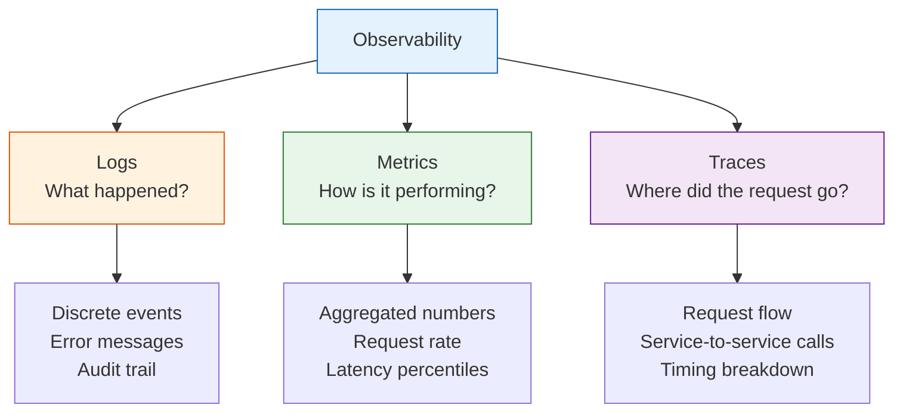
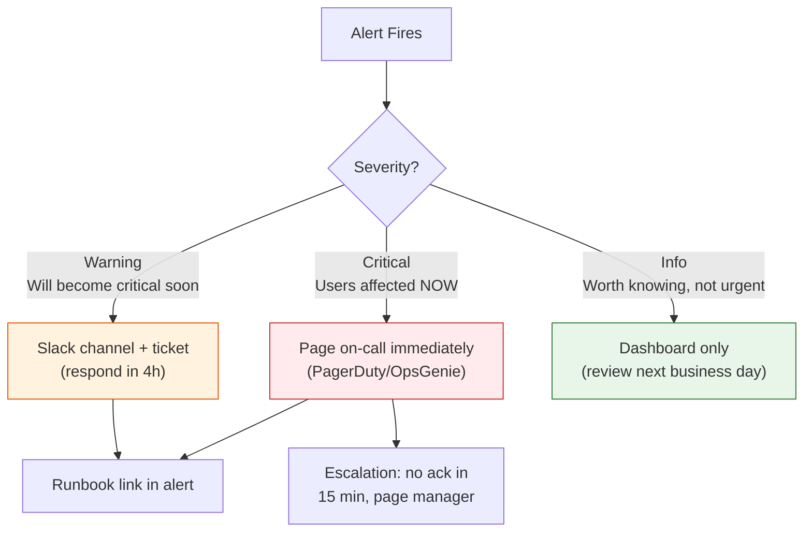

# 39 — Observability & Monitoring

Know what your system is doing in production — instrument, measure, alert, and debug with confidence.

---

## What You'll Learn

- The three pillars of observability: logs, metrics, and traces
- How to have Claude analyze your codebase and recommend what to instrument
- Structured logging with correlation IDs and proper log levels
- Metrics design — counters, gauges, histograms, and naming conventions
- Distributed tracing with OpenTelemetry
- Alerting strategies that reduce fatigue and catch real problems
- Dashboard design using USE, RED, and golden signals
- Using Claude to analyze log patterns and find anomalies
- SLIs, SLOs, and error budgets for deployment decisions
- Common observability anti-patterns and how to avoid them

**Prerequisites**: [12 — Debugging & Troubleshooting](12-debugging-and-troubleshooting.md), [22 — Incident Response](22-incident-response.md)

---

## The Three Pillars of Observability



| Pillar | Best For | Weakness |
|--------|----------|----------|
| **Logs** | Debugging specific failures, audit trails | High volume, expensive to store |
| **Metrics** | Alerting, dashboards, trend analysis | Low cardinality, no per-request detail |
| **Traces** | Understanding request flow, finding bottlenecks | Complex to set up, sampling loses data |

Use all three together. Metrics tell you something is wrong. Logs tell you what went wrong. Traces tell you where it went wrong.

---

## Setting Up Monitoring with Claude

```
Analyze our codebase for observability gaps:

1. What HTTP endpoints have no request/response logging?
2. Are there database queries without timing metrics?
3. Are external API calls instrumented with timeouts
   and error tracking?
4. Are background jobs logged with start/end times?
5. Is there a consistent correlation ID flowing through
   request handling?

For each gap, recommend what to instrument and why.
Prioritize by what gives the most visibility for the
least implementation effort.
```

---

## Structured Logging

Unstructured logs are nearly impossible to search at scale. Structure them from day one:

```typescript
// Bad — unstructured, no context
console.log("User login failed");

// Good — structured, searchable, correlated
logger.warn({
  event: "auth.login_failed",
  userId: user.id,
  reason: "invalid_password",
  attemptCount: 3,
  correlationId: req.headers["x-correlation-id"],
  timestamp: new Date().toISOString(),
});
```

Every request should carry a correlation ID that flows through all services. When a user reports a problem, search all services for that ID to reconstruct the full request flow.

| Level | When to Use | Example |
|-------|-------------|---------|
| **ERROR** | Something failed and needs attention | Database connection lost, payment failed |
| **WARN** | Something unexpected but handled | Retry succeeded, deprecated API used |
| **INFO** | Normal operations worth recording | Request completed, user signed up |
| **DEBUG** | Detailed troubleshooting info | Query parameters, cache hits |

**What NOT to log**: Never log secrets, tokens, or passwords. Mask PII (emails, phone numbers, SSNs) unless you have a documented legal basis. Skip health check endpoints -- they generate enormous volume with zero diagnostic value.

---

## Metrics Design

| Type | What It Measures | Example |
|------|-----------------|---------|
| **Counter** | Cumulative total (only goes up) | Total requests, total errors |
| **Gauge** | Current value (goes up and down) | Active connections, queue depth |
| **Histogram** | Distribution of values | Request latency, response size |

### Naming Conventions

```
# Format: <namespace>_<subsystem>_<name>_<unit>

# Counters — use _total suffix
http_requests_total
payment_processing_errors_total

# Gauges — describe current state
db_connections_active
queue_messages_pending

# Histograms — use _seconds, _bytes, etc.
http_request_duration_seconds
db_query_duration_seconds
```

### Custom Business Metrics

Technical metrics tell you the system is healthy. Business metrics tell you the product is working:

```typescript
// Technical
metrics.histogram("http_request_duration_seconds", elapsed, {
  method: req.method, route: req.route.path, status: res.statusCode,
});

// Business
metrics.counter("checkout_completed_total", 1, {
  paymentMethod: order.paymentMethod, plan: order.plan,
});
metrics.counter("checkout_abandoned_total", 1, {
  step: lastCompletedStep, reason: abandonReason,
});
```

For Prometheus, Datadog, or CloudWatch integration, ask Claude to generate the client library setup, HTTP metrics middleware, and export configuration using your existing framework.

---

## Distributed Tracing

### OpenTelemetry Setup

```typescript
import { NodeSDK } from "@opentelemetry/sdk-node";
import { getNodeAutoInstrumentations } from "@opentelemetry/auto-instrumentations-node";
import { OTLPTraceExporter } from "@opentelemetry/exporter-trace-otlp-http";

const sdk = new NodeSDK({
  traceExporter: new OTLPTraceExporter({
    url: process.env.OTEL_EXPORTER_OTLP_ENDPOINT,
  }),
  instrumentations: [getNodeAutoInstrumentations()],
});
sdk.start();
```

Auto-instrumentation covers HTTP and database calls. Add custom spans for business logic:

```typescript
const tracer = trace.getTracer("order-service");

async function processOrder(order: Order) {
  return tracer.startActiveSpan("processOrder", async (span) => {
    span.setAttribute("order.id", order.id);
    try {
      await tracer.startActiveSpan("validateInventory", async (child) => {
        await inventoryService.check(order.items);
        child.end();
      });
      await tracer.startActiveSpan("chargePayment", async (child) => {
        await paymentService.charge(order);
        child.end();
      });
      span.setStatus({ code: SpanStatusCode.OK });
    } catch (error) {
      span.recordException(error);
      throw error;
    } finally {
      span.end();
    }
  });
}
```

Every outbound HTTP call must propagate trace context. OpenTelemetry does this automatically for most HTTP clients. For custom transports, inject headers manually with `propagation.inject(context.active(), headers)`.

### Finding Bottlenecks with Traces

```
I have a slow API endpoint (p95 latency is 3.2 seconds).
Here's a sample trace:

[paste trace data or describe spans]

Help me identify:
1. Which span takes the most time?
2. Are there sequential calls that could be parallelized?
3. Are there redundant calls (same service called multiple
   times with same parameters)?
4. Is the database the bottleneck or an external service?
5. Are there N+1 query patterns visible in the spans?
```

---

## Alerting That Works

Alert on symptoms, not causes. "CPU above 80%" might be normal during batch processing. "Error rate exceeded 1% for 5 minutes" means users are affected.

| Symptom Alert (Preferred) | Cause Alert (Avoid) |
|--------------------------|-------------------|
| Error rate > 1% for 5 min | Any single error occurs |
| p95 latency > 2s for 5 min | CPU > 80% |
| Zero successful checkouts in 10 min | Database connections > 100 |

### Alert Severity Routing



### Reducing Alert Fatigue

Alert fatigue is the number one reason monitoring fails. If your team ignores alerts, you have no monitoring.

Rules for healthy alerting: every alert must have a runbook link. Every alert must be actionable -- if there is nothing to do, it is not an alert. Deduplicate so one incident produces one page, not twelve. Use evaluation windows (5 minutes, not instant) to avoid flapping. Review alert volume monthly and delete alerts that never fire or always fire.

```yaml
# PagerDuty/OpsGenie alert rule example
- name: "High Error Rate - Order Service"
  expr: |
    (sum(rate(http_requests_total{service="order",status=~"5.."}[5m]))
     / sum(rate(http_requests_total{service="order"}[5m]))) > 0.01
  for: 5m
  labels:
    severity: critical
    runbook: "https://wiki.internal/runbooks/order-5xx"
  annotations:
    summary: "Order service error rate above 1%"
```

---

## Dashboard Design

### The USE Method (Infrastructure)

For every resource (CPU, memory, disk, network): measure **Utilization** (how busy?), **Saturation** (how much is queued?), and **Errors** (any error events?).

### The RED Method (Services)

For every service: measure **Rate** (requests per second), **Errors** (how many are failing?), and **Duration** (how long do they take?).

### The Four Golden Signals

Google's SRE book defines four: **Latency**, **Traffic**, **Errors**, and **Saturation**. RED covers the first three; saturation is the fourth.

```
Help me design dashboards for our system:

Service Dashboard (one per service):
- Request rate, error rate, latency p50/p95/p99
- Active instances and recent deploy annotations

Infrastructure Dashboard:
- CPU, memory, disk utilization
- Database connection pool, queue depth, cache hit rate

Business Dashboard:
- Signups per hour, checkout success/failure, revenue

Keep each dashboard to 6-8 panels maximum.
```

---

## Using Claude for Log Analysis

```
Here are 500 lines of error logs from the last hour:
[paste logs]

1. Group errors by type — what are the distinct categories?
2. Which error is most frequent?
3. Is there a time-based pattern?
4. Are any errors correlated (A always followed by B)?
5. Which errors are new (not seen before today)?
```

For incident correlation across services:

```
I have logs from three services during an incident.
Help me build a timeline:

API Gateway logs: [paste]
Order Service logs: [paste]
Payment Service logs: [paste]

Correlate by timestamp and correlation ID.
What sequence of events led to the failure?
Where did the chain break?
```

---

## SLIs, SLOs, and Error Budgets

An **SLI** (Service Level Indicator) is a quantitative measure: availability, latency, correctness. An **SLO** (Service Level Objective) is a target for that SLI over a rolling window. The **error budget** is how much failure the SLO allows.

| Service | SLI | SLO | Error Budget (30 days) |
|---------|-----|-----|----------------------|
| API | Availability | 99.9% | 43.2 minutes of downtime |
| API | Latency (p95) | < 500ms | 0.1% of requests can be slow |
| Checkout | Success rate | 99.5% | 0.5% of checkouts can fail |

Use error budgets for deployment decisions:

- **Budget remaining**: deploy freely, experiment, push features
- **Budget low (< 25%)**: slow down, more testing, smaller deploys
- **Budget exhausted**: freeze feature deployments, focus on reliability

Never set SLOs at 100% -- that is impossible and prevents any deployment. Start with what you are already achieving, then tighten over time.

```
Check our SLO error budget status:

1. What's our current error budget consumption rate?
2. At the current burn rate, when will we exhaust it?
3. Which services are at risk of breaching this month?
4. Should we freeze deployments for any service?
```

---

## Anti-Patterns

1. **Alerting on every error** -- a single 500 is not an incident. Alert on error *rates* over time windows.
2. **Dashboards nobody looks at** -- put them on wall monitors, link them in standups, or delete them.
3. **Logging everything** -- costs money, drowns signals. Log what you need, sample the rest.
4. **No correlation IDs** -- ten times harder to retrofit than to build in from day one.
5. **Unbounded metric cardinality** -- labels like `userId` cause your metrics system to run out of memory. Use logs for high-cardinality data.
6. **No runbooks** -- an alert without a runbook is a puzzle for a sleep-deprived engineer at 3 AM.
7. **Observability as an afterthought** -- "how will I know this works in production?" belongs in every design review.

---

## Sample Conversation

> **You**: Our checkout API p95 went from 400ms to 1.8 seconds two days ago. No deploys happened. Help me figure out why.
>
> **Claude**: Let me look at the checkout flow instrumentation...
>
> *reads the checkout handler, middleware, and service files*
>
> The checkout flow calls four downstream services: inventory, pricing, payment, and notification. To narrow down the bottleneck, check your traces or individual service latency metrics:
> - `inventory_check_duration_seconds` -- still fast?
> - `pricing_calculation_duration_seconds` -- any change?
> - `payment_charge_duration_seconds` -- most likely culprit
> - `notification_send_duration_seconds` -- usually async
>
> No deploy happened, but something changed. Common non-deploy causes: database slow queries from table growth, external API latency, infrastructure contention, or new data patterns triggering slow code paths.
>
> **You**: Payment provider latency went from 200ms to 1.4 seconds two days ago.
>
> **Claude**: That explains it. Here are your options:
>
> 1. **Short term**: Check their status page, open a support ticket. Add a 3-second timeout so requests fail fast instead of hanging.
> 2. **Medium term**: Add a circuit breaker so slow payment calls trigger a "try again shortly" message instead of a spinner.
> 3. **Long term**: Add a dashboard panel tracking payment provider latency separately, with an alert if p95 exceeds 800ms.
>
> Want me to implement the timeout and circuit breaker?

---

## Key Takeaways

1. Use all three pillars together -- metrics for alerting, logs for debugging, traces for understanding request flow
2. Structure logs as JSON with correlation IDs from day one -- retrofitting is painful
3. Never log secrets, tokens, or PII -- review logging regularly for sensitive data leaks
4. Design metrics with bounded cardinality -- use labels like method, route, and status, not user IDs
5. Alert on symptoms (error rate, latency) not causes (CPU, memory) -- symptoms mean users are affected
6. Every alert must be actionable and link to a runbook
7. Use the RED method for services and USE method for infrastructure when designing dashboards
8. Define SLOs and track error budgets to turn reliability into a measurable decision framework
9. Review alert volume monthly -- delete or tune alerts that produce noise, not signal
10. Build observability into every feature from the start, not after the first outage

---

**Next**: [40 — Architecture Decision Records & Technical Writing](40-architecture-decision-records.md)
