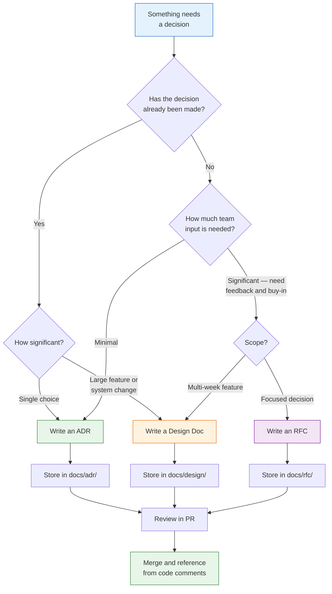

# 40 — Architecture Decision Records & Technical Writing

Turn your team's decisions into durable, searchable records that outlast any individual contributor.

---

## What You'll Learn

- Why written decisions matter more than you think
- The Architecture Decision Record (ADR) format and when to use it
- Using Claude to generate, review, and refine ADRs
- When to write an RFC vs. an ADR vs. a design doc
- Technical writing principles that make docs actually get read
- Documenting decisions retroactively from existing code
- Change proposals: how to propose replacing an existing pattern
- Ready-to-use templates for ADRs, RFCs, design docs, and change proposals

**Prerequisites**: [04 — Architecture & Dependencies](04-architecture-and-dependencies.md), [07 — Diagrams & Documentation](07-diagrams-and-documentation.md), [17 — Collaboration & Team Workflows](17-collaboration-and-team-workflows.md)

---

## Why Written Decisions Matter

Code tells you *what*. Docs tell you *why*. Without written records, decisions become tribal knowledge that walks out the door every time someone leaves the team.

Six months from now, someone will ask: Why did we use Postgres instead of DynamoDB? Why is authentication handled in middleware instead of at the gateway? If the answer lives only in someone's head -- or in a Slack thread from 2023 -- it's effectively lost.

- **Repeated debates**: The same discussion happens every 6 months because nobody remembers the outcome
- **Reversed decisions**: Someone new undoes a deliberate choice because they don't know why it was made
- **Slow onboarding**: New hires spend weeks piecing together context that could be read in an afternoon
- **Risk in departure**: When a senior engineer leaves, years of context disappear

---

## Architecture Decision Records (ADRs)

An ADR is a short document that captures a single architectural decision -- typically one to two pages in a standard format.

### The Standard ADR Format

1. **Title**: A short noun phrase. "Use PostgreSQL for the primary data store."
2. **Status**: Proposed, Accepted, Deprecated, or Superseded.
3. **Context**: The forces at play. What problem are you solving? What constraints exist?
4. **Decision**: What you decided. State it clearly and directly.
5. **Consequences**: What happens as a result -- both positive and negative.

### Where to Store ADRs

```
project-root/
  docs/
    adr/
      0001-use-postgresql-for-primary-data-store.md
      0002-adopt-event-driven-architecture.md
      0003-use-jwt-for-api-authentication.md
      template.md
```

Keep them in the repo, next to the code they describe. Version them, review them in PRs, and make them searchable.

### When to Write an ADR

Write one when you choose between multiple viable options, establish a pattern the team should follow, make a decision that's hard to reverse, or explicitly decide *not* to do something. Skip ADRs for trivial choices, temporary decisions, or implementation details affecting one file.

---

## Using Claude to Generate ADRs

### Analyze a Decision and Generate the ADR

```
We just decided to use Redis for session storage instead of PostgreSQL.
The main reasons were:
- Sub-millisecond reads for session lookups
- Sessions are ephemeral and don't need ACID guarantees
- We already run Redis for caching

Generate an ADR following the standard format (Title, Status, Context,
Decision, Consequences). Be specific about the trade-offs.
```

### Have Claude Explore Alternatives

```
We're considering GraphQL for our public API. Before I write the ADR,
help me think through alternatives:

1. What are the realistic alternatives? (REST, gRPC, tRPC, etc.)
2. For each, what are the strongest arguments for and against?
3. What questions should I answer before making this decision?
4. What are the most common regrets teams have after adopting GraphQL?
```

### Review a Draft ADR

```
Review this ADR for completeness and clarity:

[paste your draft ADR]

Check: Is the context thorough enough for someone unfamiliar with the
project? Does the decision follow logically from the context? Are the
consequences honest -- including downsides? Are there consequences I missed?
```

---

## Decision Documentation Workflow

Choose the right format based on where you are in the process:



---

## RFCs (Request for Comments)

An ADR records what you decided. An RFC asks the team what you *should* decide.

| Document | Scope | Audience | Timing |
|----------|-------|----------|--------|
| ADR | Single decision | Future readers | After the decision |
| RFC | Proposed change seeking feedback | Current team | Before the decision |

### The RFC Format

An RFC has five sections: **Problem** (what are we solving and why now), **Proposal** (specific enough to implement from), **Alternatives Considered** (what you evaluated and why you rejected it), **Risks** (what could go wrong), and **Open Questions** (what feedback you need).

### Using Claude to Draft an RFC

```
I want to propose migrating our monolith's auth module into a standalone
microservice. Draft an RFC covering:

- Problem: auth logic is duplicated across 3 services
- Proposal: extract into a shared auth service with JWT validation
- Risks: single point of failure, latency, migration complexity
- Open questions: should we use Auth0 instead?

Write for senior engineers who know the system but may disagree.
```

---

## Design Documents

For larger features that go beyond a single decision, write a design doc. The structure: **Problem Statement** (with data if available), **Goals**, **Non-Goals** (just as important), **Proposed Design** (overview, detailed design, data model changes, API changes), **Alternatives Considered**, and **Timeline** broken into phases.

Design docs differ from RFCs in scope. An RFC proposes one decision. A design doc covers a feature that involves many decisions, spans multiple weeks, and needs a detailed implementation plan.

---

## Technical Writing Principles

Good decisions documented badly are nearly as useless as undocumented decisions.

### Write for the Reader, Not Yourself

Write for a new team member joining in 6 months, a future you who has forgotten the details, and an engineer in another team who needs to understand your system.

### Lead with the Conclusion

Bad: "We evaluated PostgreSQL, MySQL, DynamoDB, and CockroachDB. After considering our access patterns, team experience, operational complexity, and cost..."

Good: "We chose PostgreSQL. It handles our access patterns well, the team already knows it, and it avoids the operational complexity of distributed databases. Here's how we evaluated the alternatives..."

### Use Concrete Examples

Abstract: "The service handles high-throughput scenarios efficiently."
Concrete: "The service processes 12,000 requests/second at p99 latency of 45ms on a single node."

### Keep It Scannable

Use headers for hierarchy, bullet points for lists, tables for comparisons, bold for key terms, and short paragraphs of 3-4 sentences maximum.

---

## Using Claude for Technical Writing

### The Draft, Review, Refine Workflow

**Step 1: Generate a draft**

```
Draft a design document for adding rate limiting to our public API.
- Abuse from scrapers hitting /search at 15,000 req/s (normal is 2,000)
- We run behind nginx with Redis available
- We want per-API-key limits with a generous free tier

Write the problem statement, proposed design, and alternatives sections.
```

**Step 2: Review critically**

```
Review this design doc draft. Be critical:

[paste the draft]

1. What assumptions should I validate?
2. What failure modes haven't I considered?
3. Is anything vague that should be specific?
4. What would a skeptical senior engineer push back on?
```

**Step 3: Refine for audience**

```
Rewrite the summary for two audiences:
1. Engineering team: focus on technical trade-offs
2. VP of Engineering: focus on business impact and timeline
Keep both under 200 words.
```

---

## Documenting Existing Decisions

The most valuable ADRs are often retroactive -- documenting decisions made months or years ago that were never written down.

### Have Claude Analyze the Codebase

```
Look at our auth implementation. We use JWT tokens with 15-min expiry
and refresh tokens in httpOnly cookies, with manual refresh token
rotation rather than a library.

Based on the code:
1. What decision was made here?
2. What alternatives existed?
3. What were the likely reasons for this choice?
4. What are the consequences (positive and negative)?

Generate a retroactive ADR capturing this decision.
```

### Mining Git History for Context

```
Look at the git history for src/auth/. Find commits where the auth
approach was established or significantly changed. For each:
1. What changed?
2. When?
3. Is there a PR description or commit message explaining why?

Draft an ADR capturing the evolution of our auth approach.
```

### The Retroactive ADR Prompt Pattern

```
Examine [specific module/pattern] in this codebase. I want a
retroactive ADR documenting why it works this way.

Analyze:
1. What pattern or technology choice was made?
2. What were the likely alternatives at the time?
3. What evidence in the code suggests why? (comments, commits, config)
4. What are the observable consequences -- benefits and costs?

Write the ADR with Status: Accepted, noting this is retroactive.
```

---

## Change Proposals

When you want to change an existing pattern or reverse a previous decision, use a change proposal -- an RFC that explicitly addresses the current state.

A change proposal covers: **Current State** (how it works today, linking to the existing ADR), **Problem with Current State** (metrics, incidents, developer pain points), **Proposed Change**, **Impact Analysis** (code changes, data migration, rollback plan, dependencies, timeline), and **Migration Plan** (phased, with each phase independently deployable).

### Using Claude for Impact Analysis

```
I want to replace our custom ORM wrapper with Prisma. Analyze:

1. Which files import or use the current ORM wrapper?
2. What patterns does it use that Prisma handles differently?
3. Any features our wrapper has that Prisma doesn't support?
4. Scope estimate: how many files change, how many tests break?
5. What's a reasonable phased migration plan?
```

---

## Templates

### ADR Template

```markdown
# ADR-[NUMBER]: [TITLE]

**Date**: [YYYY-MM-DD]
**Status**: [Proposed | Accepted | Deprecated | Superseded by ADR-XXX]

## Context

[What forces are at play? What problem are we solving?]

## Decision

[What we decided to do.]

## Consequences

**Positive**: [What becomes easier or better?]
**Negative**: [What becomes harder or worse?]
**Neutral**: [What follow-up work is required?]
```

### RFC Template

```markdown
# RFC: [TITLE]

**Author**: [name]  **Date**: [YYYY-MM-DD]
**Status**: [Draft | Under Review | Accepted | Rejected]

## Problem
[What are we solving? Why now?]

## Proposal
[Detailed enough to implement from.]

## Alternatives Considered
[For each: description, pros, cons, reason for rejection.]

## Risks
[Risk and mitigation for each.]

## Open Questions
[Specific questions you need input on.]
```

### Design Doc Template

```markdown
# Design: [FEATURE NAME]

**Author**: [name]  **Date**: [YYYY-MM-DD]
**Reviewers**: [names]  **Status**: [Draft | Approved | Implemented]

## Problem Statement
[Include metrics if available.]

## Goals
[What must be true for success.]

## Non-Goals
[Explicitly out of scope.]

## Proposed Design
[Overview, detailed design, data model changes, API changes.]

## Alternatives Considered
[For each: description, pros, cons, reason for rejection.]

## Timeline
| Phase | Scope | Estimate |
|-------|-------|----------|
| 1 | [description] | [time] |
```

### Change Proposal Template

```markdown
# Change Proposal: [WHAT YOU WANT TO CHANGE]

**Author**: [name]  **Date**: [YYYY-MM-DD]
**Supersedes**: [ADR-XXX, if applicable]

## Current State
[How it works today.]

## Problem with Current State
[Specific metrics or evidence.]

## Proposed Change
[What you want to change it to.]

## Impact Analysis
- **Code changes**: [scope]
- **Data migration**: [yes/no, details]
- **Rollback plan**: [how to undo]
- **Timeline**: [duration]

## Migration Plan
[Phase-by-phase, each independently deployable.]
```

---

## Sample Conversation

> **You**: We just debated server-side vs. client-side rendering for our new dashboard. We chose SSR with Next.js. Can you write an ADR?

> **Claude**: I'll draft that. A few questions first: What were the main arguments for CSR? What drove the decision toward SSR -- SEO, initial load performance, something else? Will any parts still use client-side rendering?

> **You**: SEO doesn't matter (it's behind auth). Main driver was initial load time -- users are on slow corporate networks. We'll use CSR for real-time widgets. The CSR argument was team familiarity with React SPA patterns.

> **Claude**: Here's the ADR:
>
> **ADR-0014: Use Server-Side Rendering with Next.js for Dashboard**
>
> **Date**: 2026-03-11 / **Status**: Accepted
>
> **Context**: We are building an internal dashboard for operations staff on slow corporate networks. The dashboard has static report views and real-time monitoring widgets. The team has strong React SPA experience but limited SSR experience. Initial load performance is critical because users access the dashboard during time-sensitive workflows.
>
> **Decision**: Use Next.js with server-side rendering. Static and data-heavy pages will be server-rendered for fast initial load. Real-time widgets will use client-side rendering with WebSocket connections.
>
> **Consequences**: Positive -- significantly faster initial load on slow networks. Negative -- team must learn SSR patterns, hydration, and getServerSideProps; deployment now requires a Node.js runtime; hydration mismatches are a new bug category. Neutral -- we need guidelines for which components are server-rendered vs. client-rendered.

---

## Key Takeaways

1. Decisions without records become tribal knowledge -- write them down or accept they'll be relitigated every few months
2. ADRs are lightweight and high-value: five sections, one to two pages, stored in the repo
3. Use the right document type: ADR for recording decisions, RFC for seeking feedback, design doc for complex features
4. Claude is most useful for exploring alternatives and stress-testing reasoning, not just generating text
5. Retroactive ADRs are some of the most valuable -- document existing decisions before the people who made them leave
6. Lead with the conclusion in all technical writing: state the decision first, then explain why
7. Write for the reader six months from now who has none of your current context
8. Change proposals should reference what they're replacing and include a phased migration plan
9. Templates reduce friction -- if writing an ADR requires figuring out the format each time, people won't write them
10. Store everything in the repo, review in PRs, and link from code comments so decisions stay discoverable

---

**Next**: [41 — Estimation & Scoping](41-estimation-and-scoping.md)
