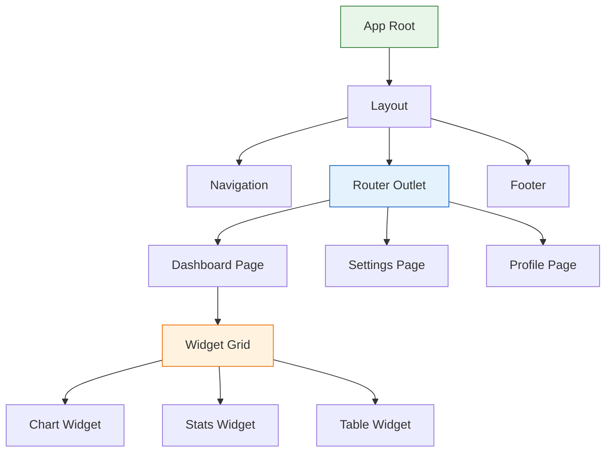
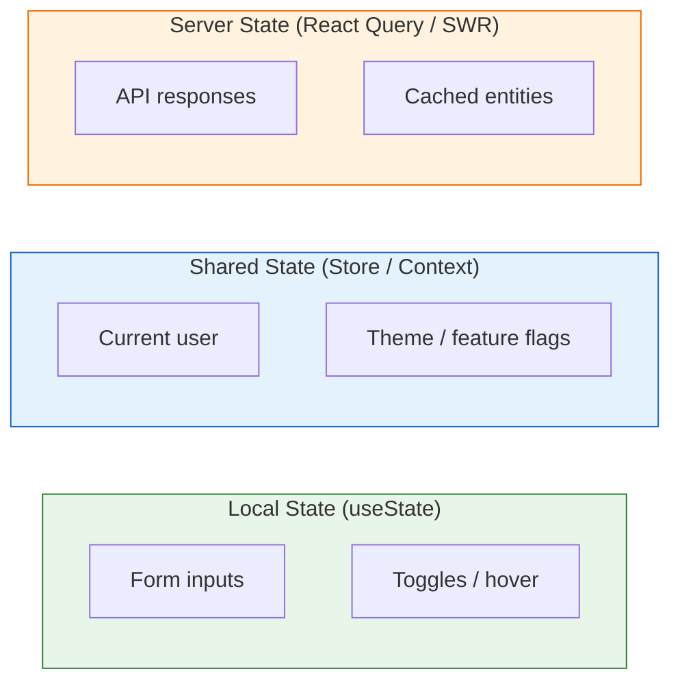

# 44 — Frontend Architecture

Understand, analyze, and improve frontend codebases — from component hierarchies and state management to build pipelines and accessibility.

---

## What You'll Learn

- Orienting yourself in an unfamiliar frontend codebase with Claude
- Analyzing and refactoring component architectures
- Auditing state management for prop drilling, over-fetching, and unnecessary complexity
- Integrating and maintaining a design system
- Frontend-specific testing strategies — components, hooks, async behavior, visual regression
- Finding and fixing performance issues with bundle analysis and Core Web Vitals
- Understanding and optimizing build pipelines (Webpack, Vite, esbuild)
- Auditing API integration layers — data fetching, caching, error handling
- Building accessibility into component architecture from the start
- Evaluating styling approaches and migrating between them
- Knowing when micro-frontends actually make sense (rarely)

**Prerequisites**: [03 — Codebase Orientation](03-codebase-orientation.md), [04 — Architecture & Dependencies](04-architecture-and-dependencies.md), [14 — Testing Strategies](14-testing-strategies.md)

---

## Frontend Codebase Orientation

Frontend codebases have a different shape than backend codebases. You are not looking for controllers and models — you are looking for components, routes, stores, and API layers. The entry point is usually not `main()` but a root component that mounts a tree.

### The First Five Prompts

When you open an unfamiliar frontend codebase, start here:

```
Walk me through this frontend codebase. I need to understand:

1. What framework is this? (React, Vue, Svelte, Angular, etc.)
2. Where is the entry point — the root component that mounts the app?
3. What is the routing setup — file-based, config-based, or something else?
4. Where does state management live — is it Redux, Zustand, Context, signals, or local state?
5. Where is the API integration layer — how does this app talk to the backend?

Give me the directory structure with annotations for each major directory.
```

### The Component Tree

Every frontend app is a tree. Understanding that tree is the first step.



### What Makes Frontend Orientation Different

Backend codebases flow from request to response. Frontend codebases flow from user interaction to render:

- **Backend**: HTTP request -> router -> controller -> service -> database -> response
- **Frontend**: User event -> state change -> re-render -> (maybe API call) -> state update -> re-render

This means when you trace a feature with Claude, you start from a button click, not from an endpoint.

```
Trace what happens when a user clicks "Add to Cart":

1. Which component handles the click?
2. What state changes?
3. Does it make an API call? Where?
4. How does the UI update — optimistic or wait-for-response?
5. What error handling exists if the API call fails?
6. Does it update any global state (cart count in the header)?
```

---

## Component Architecture

Most mature frontend codebases follow some variant of atomic design: atoms (Button, Input), molecules (SearchBar, FormField), organisms (Header, ProductCard), and pages. Understanding which layer a component belongs to tells you its reuse scope.

```
Analyze the component hierarchy in this codebase:

1. Which components are truly reusable (used in 3+ places)?
2. Are there duplicate components — two Button implementations?
3. Which components are too large and should be split?
4. Which components mix presentation and business logic?
5. Find components that both fetch data AND render complex UI —
   show me how to split each into a data-fetching wrapper
   and a presentational component.

Give me a refactoring plan ordered by impact.
```

---

## State Management Analysis

State management is where frontend complexity hides. Too much global state makes everything coupled. Too little makes everything prop-drilled.

### The State Audit



```
Audit the state management in this codebase:

1. What is stored in global state that should be local?
   (form values, UI toggles, component-specific flags)
2. What is prop-drilled through 3+ levels that should be in context or a store?
3. Is server state (API responses) being duplicated in a client store
   instead of using a cache layer like React Query?
4. Are there state updates that trigger unnecessary re-renders?
5. Are there derived values being stored in state instead of computed?

For each finding, explain the specific fix.
```

### Identifying Prop Drilling

```
Find all cases of prop drilling in this codebase.

A prop is "drilled" when it passes through a component that doesn't use it,
just to reach a child that does. Look for:

1. Props that pass through 3+ component levels unchanged
2. Components with props they never reference in their own rendering
3. "Spread" patterns like {...props} that obscure what's actually needed

For each case, suggest whether to use Context, a store, or composition
(children/render props) to fix it.
```

---

## Design System Integration

A design system is a contract between designers and developers. When it drifts, the UI becomes inconsistent and maintenance costs multiply.

```
Audit this codebase against its design system:

1. Components that should use a design system primitive but don't?
2. Design system components overridden with custom styles?
3. Hardcoded colors, spacing, or typography that should use tokens?
4. Custom components that should be promoted into the design system?

Show inconsistencies with file paths and line numbers.
```

### Generating New Components

```
Create a new AlertBanner matching our design system. Look at Toast,
Banner, and Card for prop patterns, theming, testing conventions,
and documentation style. Follow those conventions exactly.
```

---

## Frontend Testing Strategies

Frontend testing has unique challenges. The DOM is the interface, user interaction is asynchronous, and visual correctness matters alongside logical correctness.

Unit tests for pure logic, component tests (Testing Library) for rendering and interaction, renderHook for custom hooks, integration tests for user flows, E2E (Playwright/Cypress) for full journeys, and visual regression (Chromatic/Percy) for CSS regressions.

```
Review our frontend test suite:

1. Coverage by category? (unit / component / integration / E2E)
2. Testing user behavior or implementation details?
   (getByRole vs getByTestId — prefer the former)
3. Components with complex logic but no tests?
4. Async tests using waitFor or relying on fragile timing?
5. Are we testing loading, error, AND success states?
6. What are we mocking that we shouldn't be?

Prioritize: highest-risk untested paths.
```

---

## Performance Optimization

Frontend performance is user-facing. A slow backend endpoint affects one page — a bloated bundle affects every page.

### Bundle Analysis

```
Analyze the production bundle:

1. What is the total bundle size (gzipped)?
2. What are the largest dependencies by size?
3. Are there dependencies that are imported but barely used?
   (e.g., importing all of lodash for one function)
4. Is there effective code splitting — are routes lazy loaded?
5. Are there duplicate dependencies (different versions of the same package)?
6. What is the initial JS payload for the landing page?

Compare to performance budgets:
- Initial JS: < 200KB gzipped
- Largest chunk: < 100KB gzipped
- Total unique JS: < 500KB gzipped
```

### Core Web Vitals and Code Splitting

```
Audit for Core Web Vitals and code splitting:

LCP: Are hero images optimized (WebP/AVIF)? Is the LCP element
in initial HTML or dynamically rendered? Are fonts blocking render?

CLS: Do images have explicit dimensions? Does dynamic content
inject above the fold?

INP: Are click handlers doing expensive synchronous work?
Are list renders virtualized for large datasets?

Code splitting:
1. Which routes are lazy loaded? Which should be but aren't?
2. Are heavy components (charts, editors, maps) dynamically imported?
3. Are we preloading critical chunks?
4. Is there a proper Suspense boundary with a fallback?
```

---

## Build Pipeline Analysis

The build pipeline turns your source code into what ships to users. Understanding it is essential for optimization.

```
Analyze our build configuration:

1. What bundler are we using? (Webpack, Vite, esbuild, Turbopack)
2. Is tree shaking working? Check for side-effect-free markers
   in package.json files of dependencies.
3. What is our build time? What are the slowest steps?
4. Are source maps configured correctly for production
   debugging without exposing source?
5. Are environment variables handled safely — nothing secret
   leaking to the client bundle?
6. Is CSS being extracted and minified?
7. Are assets (images, fonts) optimized during the build?

Show me the actual config with annotations for what each section does.
```

### Build Optimization

```
Our build is slow and the output is too large. Help me optimize:

Build speed: Can we use SWC/esbuild instead of Babel?
Unnecessary plugins? Persistent caching? Needless node_modules
transpilation?

Bundle size: Dependencies with smaller alternatives? Dead code?
Unused locales? Runtime dependencies that could be build-time?
```

---

## API Integration Layer

How your frontend talks to your backend is a reliability and maintenance concern, not just a data-fetching concern.

```
Audit the API integration layer:

1. Is there a centralized API client or are fetch calls scattered
   throughout components?
2. How is authentication handled — are tokens refreshed automatically?
3. What is the error handling strategy?
   - Network errors vs 4xx vs 5xx — are they handled differently?
   - Is there a global error boundary?
   - Are errors shown to users in a useful way?
4. Is there request deduplication — if two components request
   the same data, does it make one call or two?
5. Is caching configured correctly — stale-while-revalidate,
   cache invalidation on mutations?
6. Are there optimistic updates? Are they rolling back on failure?
```

### Data Fetching Patterns

```
Review our data fetching approach:

1. Are we using React Query / SWR / Apollo, or raw useEffect + fetch?
2. If raw fetch: show me the bugs (race conditions, memory leaks)
3. If React Query/SWR: are query keys consistent?
   Are mutations invalidating the right queries?
4. Are we over-fetching — full objects when we need a few fields?
```

---

## Accessibility in Component Design

Accessibility is not a feature you add later. It is a quality of the component architecture itself.

```
Run an accessibility audit on our component library:

1. Do interactive elements have proper ARIA roles and labels?
2. Is keyboard navigation implemented for custom components?
   (dropdowns, modals, tabs, date pickers)
3. Is focus management correct?
   - Does opening a modal trap focus?
   - Does closing a modal return focus to the trigger?
   - Is there a visible focus indicator?
4. Are form errors associated with their inputs using aria-describedby?
5. Do images have meaningful alt text (not just "image")?
6. Are color contrast ratios meeting WCAG AA standards?
7. Can the entire app be used with a screen reader?

Group findings by severity: critical, major, minor.
```

### Building Accessible Components

```
Build an accessible Combobox following ARIA 1.2 patterns.
Look at our existing Modal and Dropdown for conventions.
Include keyboard navigation, screen reader announcements,
async loading support, and proper focus management.
```

---

## Styling Architecture

Styling approach affects developer experience, performance, and maintainability. There is no single right answer, but there are consistent wrong ones.

```
Audit our styling approach:

1. What system are we using? (CSS Modules, Tailwind, styled-components,
   CSS-in-JS, plain CSS, a mix?)
2. If a mix: which approach is dominant and which is legacy?
3. Are there design tokens (colors, spacing, typography, breakpoints)
   defined in one place?
4. Are styles scoped properly — can a component's styles leak to others?
5. Is there dead CSS — styles that no longer apply to any element?
6. Are media queries/breakpoints consistent?
7. Is dark mode implemented? Is it consistent or patchy?
8. What is the CSS weight in the production bundle?
```

### Migrating Styling Approaches

```
We want to migrate from styled-components to CSS Modules.
Analyze: How many components are affected? Are there dynamic
styles depending on props? Theme values to convert to CSS
variables? Estimate the effort and generate a phased migration
plan with the first 3 components converted as examples.
```

---

## Micro-Frontends

Micro-frontends are a solution to an organizational problem, not a technical one. They add significant complexity and should only be considered when the alternative — a monolithic frontend owned by many independent teams — is causing real delivery bottlenecks.

They make sense when: 5+ teams are blocked by each other on a shared frontend, teams need independent deployments, or teams use genuinely different frameworks (legacy Angular integrating new React).

They do not make sense when: you have one team and want "clean architecture," you want to "future-proof" against framework changes, or you read a blog post and it sounded cool.

```
We are considering micro-frontends. Analyze honestly:

1. How many teams contribute to this frontend?
2. How often are teams blocked by each other?
3. What is the operational overhead?
   (shared deps, routing, auth, deployment)
4. Could we achieve the same goals with CODEOWNERS,
   a monorepo with independent packages, or feature flags?

Do we need micro-frontends or better monolith practices?
```

---

## Sample Conversation

> **You**: I just joined this team and I'm looking at a React codebase with about 400 components. Where do I even start?
>
> **Claude**: Let me orient you.
> *reads package.json, src directory, routing config, store setup*
>
> **Framework**: React 18 + TypeScript, Vite bundler.
>
> **Routing**: React Router v6, file-based in `src/pages/`. 23 routes across 6 groups.
>
> **State management**: Mixed — Redux store with 12 slices, plus 3 newer Zustand stores and 8 Context providers. This is the first area I would investigate.
>
> **API layer**: React Query in `src/api/` with 47 query hooks. Well-structured base client handles auth and error normalization.
>
> **Component structure**: 34 design system primitives in `ui/`, 89 shared components, 143 page-specific, 134 feature-specific.
>
> **Immediate concerns**:
> 1. Redux slices duplicate React Query cache data — `userSlice` stores what `useUser()` already fetches
> 2. Two Button components — `ui/Button.tsx` and `legacy/Button.tsx` — 67 files import the legacy one
> 3. `DashboardPage` is 847 lines with 14 useState calls
>
> Want me to start with the state management audit, component cleanup, or legacy Button migration?

---

## Key Takeaways

1. Frontend orientation is about the component tree, routing, state, and API layer — trace from user interaction to render, not from request to response
2. Component architecture should separate data fetching from presentation — components that do both become hard to test and hard to reuse
3. State management problems are the most common source of frontend complexity — audit for prop drilling, duplicated server state, and unnecessary global state
4. A design system only works if it is actually used — audit for drift regularly and promote reusable patterns into the system
5. Frontend tests should test user behavior, not implementation details — prefer `getByRole` over `getByTestId`, prefer `waitFor` over `sleep`
6. Bundle size is a performance tax paid by every user on every visit — set budgets, automate checks, and treat size regressions like bugs
7. The build pipeline is not "set and forget" — review it quarterly for speed improvements and dead configuration
8. Your API integration layer is a reliability boundary — centralize it, handle errors consistently, and use a caching layer instead of raw fetch
9. Accessibility is a component architecture concern, not a separate workstream — build it in from the start or pay compound interest fixing it later
10. Micro-frontends solve team coordination problems, not code quality problems — exhaust simpler solutions first

---

**Next**: [45 — Data Engineering & Pipelines](45-data-engineering-and-pipelines.md)
