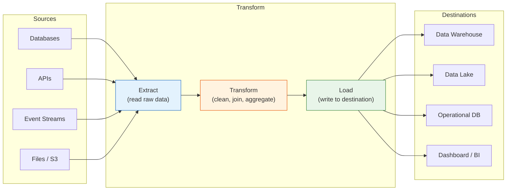
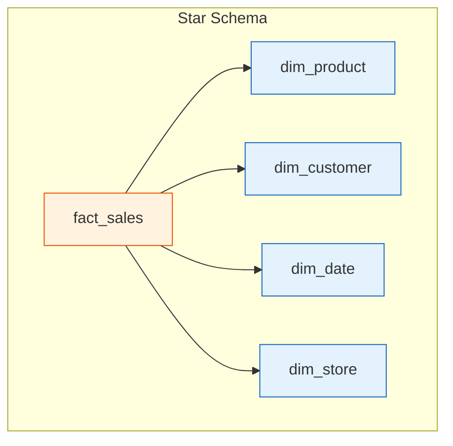
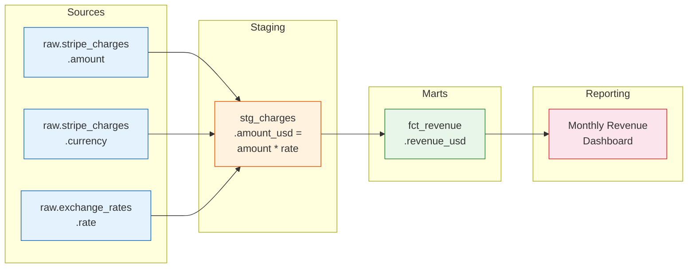

# 45 — Data Engineering & Pipelines

Analyzing, debugging, and improving data pipelines with Claude — from ETL jobs and warehouse schemas to streaming systems and data quality.

---

## What You'll Learn

- The anatomy of data pipelines: sources, transformations, and destinations
- Navigating unfamiliar data infrastructure with Claude
- Analyzing ETL/ELT jobs to understand data flow and transformation logic
- Building and enforcing data quality checks
- Analyzing and optimizing complex SQL queries
- Understanding pipeline orchestration tools (Airflow, Dagster, dbt)
- Managing schema evolution without breaking downstream consumers
- Working with streaming patterns (Kafka, Kinesis, Pub/Sub)
- Designing and analyzing data warehouse schemas
- Tracing data lineage and governance
- Testing data pipelines at every layer

**Prerequisites**: [04 — Architecture & Dependencies](04-architecture-and-dependencies.md), [19 — Data Modeling & Database Design](19-data-modeling-and-database-design.md)

---

## Data Pipeline Anatomy

Every data pipeline moves data from somewhere, transforms it, and puts it somewhere else. The variations are in the details.



### ETL vs ELT

| Approach | How It Works | When to Use |
|----------|-------------|-------------|
| **ETL** | Transform before loading into the warehouse | When compute is expensive in the warehouse, or data needs cleaning before landing |
| **ELT** | Load raw data first, transform inside the warehouse | Modern warehouses (Snowflake, BigQuery, Redshift) where compute is cheap and SQL is expressive |

Most modern data stacks use ELT. The warehouse does the heavy lifting, and tools like dbt manage the transformation layer.

### Batch vs Streaming vs Micro-Batch

| Pattern | Latency | Complexity | Use Case |
|---------|---------|-----------|----------|
| **Batch** | Minutes to hours | Low | Daily reports, nightly syncs, historical backfills |
| **Micro-batch** | Seconds to minutes | Medium | Near-real-time dashboards, Spark Structured Streaming |
| **Streaming** | Milliseconds to seconds | High | Fraud detection, live recommendations, event-driven systems |

### Orienting in an Existing Pipeline

```
This repository contains data pipeline code. Help me understand:

1. What data sources does this pipeline read from?
2. What transformations are applied and in what order?
3. Where does the output data land?
4. How is the pipeline triggered (schedule, event, manual)?
5. What error handling exists?
6. Are there any data quality checks?

Start with the entry point files and trace the flow.
```

---

## Understanding Data Infrastructure with Claude

Data codebases are often poorly documented. The SQL is sprawling, the Python glue code is scattered, and nobody remembers why that one CTE exists.

### Navigating a Data Warehouse

```
I'm new to this data warehouse. Walk me through:

1. The schema structure — what schemas exist and what
   do they represent?
2. The most important tables by size and query frequency
3. How data flows between schemas (raw -> staging ->
   marts pattern?)
4. Any naming conventions I should know about
5. Where the transformation logic lives (dbt models,
   stored procedures, Python scripts?)
```

### Tracing a Column Back to Its Source

```
The `revenue` column in the `analytics.monthly_summary`
table doesn't match what finance expects. Trace this
column back to its original source:

1. What tables feed into monthly_summary?
2. What transformations are applied to calculate revenue?
3. Are there any filters, joins, or aggregations that
   could cause discrepancies?
4. Is currency conversion applied? At what exchange rate?
```

### Understanding Schema Relationships

```
Map out the relationships between these tables:

- orders
- order_items
- products
- customers
- payments
- refunds

Show me the join keys, any soft-delete patterns, and
flag any referential integrity issues you see.
```

---

## ETL/ELT Analysis

The hardest part of working with pipelines is understanding what they already do. Most are undocumented.

### Analyzing an Existing ETL Job

```
This Airflow DAG runs nightly. For each task:

1. What data does it read and from where?
2. What transformations does it apply?
3. Where does it write the results?
4. What happens if it fails mid-way? Is it idempotent?
5. How long does each task typically take?
6. Are there any implicit dependencies not captured
   in the DAG structure?
```

### Documenting an Undocumented Pipeline

```
This pipeline has no documentation. Generate a technical
document covering:

1. Pipeline overview (purpose, schedule, SLA)
2. Data flow diagram (sources -> transforms -> sinks)
3. Table/schema descriptions for all inputs and outputs
4. Transformation logic in plain English
5. Error handling and retry behavior
6. Known issues or technical debt
7. Runbook: how to monitor, debug, and restart
```

### Identifying Pipeline Bottlenecks

```
This pipeline takes 4 hours to run nightly and we need
it under 1 hour. Analyze the code and identify:

1. The slowest stages and why
2. Unnecessary full-table scans
3. Transformations that could be pushed to SQL
4. Stages that could run in parallel instead of serial
5. Data that's recomputed but could be incremental
```

---

## Data Quality

Bad data is worse than no data. It gets into dashboards, drives wrong decisions, and erodes trust.

### Common Data Quality Dimensions

| Dimension | What It Checks | Example |
|-----------|---------------|---------|
| **Completeness** | No unexpected NULLs | `email IS NOT NULL` for active users |
| **Uniqueness** | No duplicates | One row per `(user_id, date)` in daily metrics |
| **Freshness** | Data is recent enough | Last record within 24 hours |
| **Validity** | Values are in expected range | `age BETWEEN 0 AND 150` |
| **Consistency** | Cross-table agreement | `SUM(order_items.total) = orders.total` |
| **Accuracy** | Matches real-world truth | Revenue matches payment processor reports |

### Generating Data Quality Tests

```
Write data quality tests for the `orders` table:

Schema:
- id (BIGINT, PK)
- customer_id (BIGINT, FK -> customers)
- status (VARCHAR: pending, confirmed, shipped, delivered, cancelled)
- total_amount (DECIMAL 10,2)
- currency (VARCHAR 3)
- created_at (TIMESTAMP)
- updated_at (TIMESTAMP)

Generate tests for:
1. Null checks on required fields
2. Referential integrity (customer_id exists)
3. Valid status values only
4. total_amount > 0 for non-cancelled orders
5. updated_at >= created_at always
6. No duplicate order IDs
7. Freshness: orders created within last 24 hours
```

### dbt Tests Example

Claude can generate dbt-style YAML tests directly:

```yaml
# models/marts/orders.yml
version: 2

models:
  - name: orders
    description: "Cleaned and validated order records"
    columns:
      - name: id
        tests:
          - unique
          - not_null
      - name: customer_id
        tests:
          - not_null
          - relationships:
              to: ref('customers')
              field: id
      - name: status
        tests:
          - not_null
          - accepted_values:
              values: ['pending', 'confirmed', 'shipped',
                       'delivered', 'cancelled']
      - name: total_amount
        tests:
          - not_null
          - dbt_utils.expression_is_true:
              expression: ">= 0"
```

### Great Expectations Example

```python
import great_expectations as gx

context = gx.get_context()

validator = context.sources.pandas_default.read_csv(
    "orders.csv"
)

validator.expect_column_values_to_not_be_null("id")
validator.expect_column_values_to_be_unique("id")
validator.expect_column_values_to_be_in_set(
    "status",
    ["pending", "confirmed", "shipped",
     "delivered", "cancelled"]
)
validator.expect_column_values_to_be_between(
    "total_amount", min_value=0
)
validator.expect_column_pair_values_a_to_be_greater_than_b(
    "updated_at", "created_at", or_equal=True
)
```

---

## SQL Analysis and Optimization

Data engineering is 80% SQL. Claude can break down complex queries that nobody on the team understands anymore.

### Explaining Complex SQL

```
Explain what this query does in plain English, then
break down each CTE and join:

WITH daily_revenue AS (
    SELECT
        DATE_TRUNC('day', o.created_at) AS day,
        p.category_id,
        SUM(oi.quantity * oi.unit_price) AS revenue,
        COUNT(DISTINCT o.customer_id) AS unique_customers
    FROM orders o
    JOIN order_items oi ON o.id = oi.order_id
    JOIN products p ON oi.product_id = p.id
    WHERE o.status NOT IN ('cancelled', 'refunded')
      AND o.created_at >= CURRENT_DATE - INTERVAL '90 days'
    GROUP BY 1, 2
),
category_trends AS (
    SELECT
        category_id,
        day,
        revenue,
        LAG(revenue, 7) OVER (
            PARTITION BY category_id ORDER BY day
        ) AS revenue_7d_ago,
        AVG(revenue) OVER (
            PARTITION BY category_id
            ORDER BY day
            ROWS BETWEEN 6 PRECEDING AND CURRENT ROW
        ) AS revenue_7d_avg
    FROM daily_revenue
)
SELECT
    c.name AS category,
    ct.day,
    ct.revenue,
    ct.revenue_7d_avg,
    ROUND(
        (ct.revenue - ct.revenue_7d_ago) / NULLIF(ct.revenue_7d_ago, 0) * 100,
        1
    ) AS wow_growth_pct
FROM category_trends ct
JOIN categories c ON ct.category_id = c.id
WHERE ct.day >= CURRENT_DATE - INTERVAL '30 days'
ORDER BY ct.day DESC, ct.revenue DESC;
```

### Optimizing Slow Queries

```
This query takes 45 seconds on a table with 200M rows.
Optimize it:

1. Analyze the execution plan (I'll provide EXPLAIN output)
2. Identify missing indexes
3. Suggest query rewrites (subquery -> join, etc.)
4. Recommend partitioning if applicable
5. Flag any anti-patterns (SELECT *, implicit casts,
   functions on indexed columns)
```

### Refactoring Spaghetti SQL

```
This 300-line SQL query is a single SELECT with nested
subqueries. Refactor it into readable CTEs:

1. Identify logical steps in the query
2. Extract each step into a named CTE
3. Use meaningful names that describe what each CTE produces
4. Add comments explaining business logic
5. Verify the refactored query produces identical results
```

---

## Pipeline Orchestration

### Understanding DAGs

Most orchestrators represent pipelines as directed acyclic graphs (DAGs). Each node is a task, each edge is a dependency.

```
Analyze this Airflow DAG and explain:

1. The execution order of all tasks
2. Which tasks can run in parallel
3. Critical path (longest sequential chain)
4. Retry and failure handling configuration
5. Are there any circular dependencies or dead tasks?
6. What sensors/triggers gate execution?
```

### Orchestrator Comparison

| Feature | Airflow | Dagster | Prefect | dbt |
|---------|---------|---------|---------|-----|
| **Paradigm** | Task-based DAGs | Asset-based | Flow-based | SQL model DAGs |
| **Best for** | General orchestration | Data assets and lineage | Dynamic workflows | SQL transformations |
| **Testing** | Limited built-in | First-class support | Good | Built-in data tests |
| **Backfills** | Manual or CLI | Native partition support | Re-run flows | `dbt build --select` |
| **Learning curve** | Medium | Medium-high | Low | Low (SQL-focused) |

### Debugging a Failed DAG Run

```
This Airflow DAG failed at the `transform_orders` task.
Here are the logs:

[paste logs]

Help me:
1. Identify the root cause of the failure
2. Determine if upstream data issues caused it
3. Check if it's safe to retry or if manual intervention
   is needed
4. Suggest a fix and any guards to prevent recurrence
```

---

## Schema Evolution

Schema changes break pipelines. The question is how to make them without breaking downstream consumers.

### Backward and Forward Compatibility

| Change Type | Backward Compatible? | Forward Compatible? | Safe Strategy |
|------------|---------------------|--------------------|----|
| Add nullable column | Yes | Yes | Just add it |
| Add required column | No | Yes | Add nullable first, backfill, then add NOT NULL |
| Remove column | Yes | No | Stop writing, stop reading, then drop |
| Rename column | No | No | Add new, copy, migrate readers, drop old |
| Change column type | No | No | Add new column with new type, migrate |

### Migration Strategy

```
We need to split the `address` string column into
structured fields (street, city, state, zip, country)
on a table with 50M rows and 12 downstream consumers.

Design a migration plan that:
1. Doesn't break any existing consumers
2. Can be rolled back at any stage
3. Handles the backfill without locking the table
4. Includes validation that old and new formats agree
5. Has a timeline for deprecating the old column
```

### Avro/Protobuf Schema Evolution

For event-driven systems, schema registries enforce compatibility:

```
Review this Avro schema change for backward compatibility:

Before:
{
  "type": "record",
  "name": "OrderEvent",
  "fields": [
    {"name": "order_id", "type": "string"},
    {"name": "amount", "type": "double"},
    {"name": "currency", "type": "string"}
  ]
}

After (proposed):
{
  "type": "record",
  "name": "OrderEvent",
  "fields": [
    {"name": "order_id", "type": "string"},
    {"name": "amount", "type": "double"},
    {"name": "currency", "type": "string"},
    {"name": "region", "type": ["null", "string"],
     "default": null}
  ]
}

Is this safe to deploy? What about consumers still
using the old schema?
```

---

## Streaming Patterns

Streaming adds a different set of challenges: ordering, exactly-once processing, late data, and backpressure.

### Producer/Consumer Analysis

```
Analyze this Kafka consumer application:

1. What topics does it consume from?
2. What consumer group is it part of?
3. How does it handle deserialization errors?
4. Is offset commit manual or automatic?
5. What happens if processing fails — does it retry,
   dead-letter, or skip?
6. Is processing idempotent?
```

### Exactly-Once Processing

The three delivery guarantees:

| Guarantee | How | Trade-off |
|-----------|-----|-----------|
| **At-most-once** | Commit offset before processing | Fast, but may lose data |
| **At-least-once** | Commit offset after processing | Safe, but may duplicate |
| **Exactly-once** | Transactional processing + offset commit | Correct, but slower and more complex |

Most systems aim for at-least-once with idempotent consumers. True exactly-once requires transactional support across the entire pipeline.

### Windowing and Late Data

```
Our streaming pipeline aggregates click events into
5-minute windows. We're seeing incorrect counts because
events arrive late (up to 30 minutes after the window
closes). Design a strategy for:

1. Allowed lateness configuration
2. Watermark progression
3. How to update already-emitted results
4. When to give up on late data entirely
5. How to monitor and alert on late data volume
```

---

## Data Warehouse Design

### Star Schema vs Snowflake Schema



| Aspect | Star Schema | Snowflake Schema |
|--------|------------|-----------------|
| **Structure** | Fact table surrounded by denormalized dimensions | Dimensions normalized into sub-dimensions |
| **Query simplicity** | Simple joins (fact to dimension) | More joins (dimension to sub-dimension) |
| **Storage** | More redundancy | Less redundancy |
| **Query performance** | Faster (fewer joins) | Slower (more joins) |
| **Best for** | BI and analytics queries | When storage matters or dimensions are very large |

### Slowly Changing Dimensions

```
Our `dim_customer` table needs to track historical
changes (address changes, plan upgrades). Recommend
an SCD strategy:

1. SCD Type 1 (overwrite) - for which columns?
2. SCD Type 2 (add new row with date range) - for which?
3. SCD Type 3 (add previous value column) - for which?

Consider query patterns: most reports need current state,
but finance needs point-in-time accuracy for revenue
attribution.
```

### Fact Table Design

```
Design a fact table for our e-commerce transactions:

Business questions it must answer:
- Revenue by product, category, region, and time period
- Average order value trends
- Customer lifetime value
- Conversion rates from cart to purchase
- Return and refund rates

Specify:
1. Grain (what does one row represent?)
2. Dimensions (foreign keys to dimension tables)
3. Measures (additive, semi-additive, non-additive)
4. Degenerate dimensions (order_number, invoice_id)
5. Suggested partitioning and clustering
```

---

## Data Governance and Lineage

### Column-Level Lineage

Understanding where each column comes from is critical for debugging and compliance.



### Tracing Data Flows

```
The CEO says the revenue number on the dashboard doesn't
match the finance team's spreadsheet. Trace the data
flow for the "monthly_revenue" metric:

1. What is the source of truth?
2. Every transformation applied (joins, filters,
   aggregations, currency conversions)
3. Every place this number is calculated or cached
4. Where the dashboard reads from
5. Where the finance spreadsheet reads from
6. Identify where the two paths diverge
```

### PII and Compliance

```
Audit our data pipeline for PII handling:

1. Which tables contain PII (names, emails, addresses,
   phone numbers, SSNs, payment info)?
2. Is PII masked or encrypted at rest?
3. Does PII flow into any tables where it shouldn't
   (analytics tables, logs, exports)?
4. Are there retention policies? Is old PII deleted?
5. Can we trace which downstream systems have access
   to PII?
6. Are there any GDPR "right to deletion" gaps?
```

---

## Testing Data Pipelines

### The Testing Pyramid for Data

| Layer | What to Test | Tools |
|-------|-------------|-------|
| **Unit** | Individual transformation functions | pytest, unittest |
| **Component** | Single pipeline step with mock inputs | pytest + fixtures |
| **Integration** | Full pipeline with test data | Docker + test databases |
| **Data validation** | Output data quality | dbt tests, Great Expectations |
| **Regression** | Output matches known-good results | Snapshot testing |

### Unit Testing Transformations

```python
# test_transforms.py
import pytest
from transforms import normalize_currency, deduplicate_orders

def test_normalize_currency_usd():
    row = {"amount": 100.0, "currency": "USD"}
    result = normalize_currency(row, target="USD")
    assert result["amount_usd"] == 100.0

def test_normalize_currency_eur_to_usd():
    row = {"amount": 100.0, "currency": "EUR"}
    rates = {"EUR": 1.08}
    result = normalize_currency(row, target="USD", rates=rates)
    assert result["amount_usd"] == pytest.approx(108.0)

def test_normalize_currency_missing_rate():
    row = {"amount": 100.0, "currency": "XYZ"}
    with pytest.raises(ValueError, match="Unknown currency"):
        normalize_currency(row, target="USD")

def test_deduplicate_orders_keeps_latest():
    orders = [
        {"id": 1, "status": "pending", "updated_at": "2025-01-01"},
        {"id": 1, "status": "shipped", "updated_at": "2025-01-02"},
    ]
    result = deduplicate_orders(orders)
    assert len(result) == 1
    assert result[0]["status"] == "shipped"
```

### Generating Test Data

```
Generate realistic test data for our pipeline integration
tests. I need:

1. 100 orders across 20 customers and 50 products
2. Realistic distributions (most customers have 1-3
   orders, a few have 20+)
3. Edge cases mixed in:
   - Orders with NULL shipping address (digital products)
   - Cancelled orders with refund records
   - Orders in multiple currencies
   - An order placed exactly at midnight UTC
   - A customer with special characters in their name
4. Output as SQL INSERT statements or CSV files
```

### dbt Test Patterns

```
Review our dbt project and suggest additional tests:

1. Are all primary keys tested for uniqueness and not_null?
2. Are all foreign keys tested with relationships tests?
3. Are there accepted_values tests for status/type columns?
4. Are there freshness tests on source tables?
5. What custom data tests would catch our most common
   data issues?
6. Are there any models with zero tests?
```

---

## Sample Conversation

> **You**: Our nightly pipeline has been failing intermittently for the past week. It runs in Airflow and loads data from Postgres into our Snowflake warehouse. Here's the DAG code and the error logs from the last three failures.
>
> **Claude**: Looking at the logs and DAG code, I can see the pattern. All three failures happen at the `load_orders_to_snowflake` task, but the root cause is upstream.
>
> The failure sequence:
>
> 1. The `extract_orders` task runs a query against your Postgres replica: `SELECT * FROM orders WHERE updated_at > '{{ ds }}'`
> 2. This query is returning 2.3M rows on the failing nights (vs ~50K on normal nights) because a batch job is updating `updated_at` on historical records
> 3. The extract writes to a temp file on the Airflow worker, which runs out of disk space at ~1.8M rows
> 4. The file write fails silently (the exception is caught but not re-raised on line 47), so the task reports success with a partial file
> 5. The `load_orders_to_snowflake` task then fails because the CSV is truncated mid-row
>
> Three fixes needed:
>
> 1. **Immediate**: The exception handler on line 47 swallows the error. Change `except Exception: pass` to `except Exception: raise`
> 2. **Short-term**: Add a row count validation between extract and load. Compare extracted rows against a `SELECT COUNT(*)` from the source
> 3. **Long-term**: Switch from full extract to incremental using a proper watermark column (like a monotonically increasing `id` or a separate `etl_updated_at` that your batch job doesn't touch)
>
> Want me to write the fix for each of these?

---

## Key Takeaways

1. Start by understanding the existing pipeline before changing anything — use Claude to map data flows, trace lineage, and document what is undocumented
2. ETL vs ELT is a tooling decision, not a religious one — most modern stacks use ELT because warehouse compute is cheap and SQL is expressive
3. Data quality must be tested explicitly at every stage — nulls, duplicates, freshness, and cross-table consistency do not check themselves
4. Complex SQL is a communication problem — break it into named CTEs, add comments for business logic, and make each step testable
5. Schema changes must be backward compatible by default — add nullable columns, deprecate before removing, and never rename in place
6. Streaming adds ordering, exactly-once, and late data challenges on top of everything batch already requires
7. Star schemas optimize for query simplicity and performance — denormalize dimensions unless you have a strong reason not to
8. Column-level lineage is how you debug "the number is wrong" — trace every metric back to its source of truth
9. Test data pipelines the same way you test application code — unit test transformations, integration test the full flow, and validate output data quality

---

**Next**: [46 — Cross-Functional Collaboration](46-cross-functional-collaboration.md)
